# AlphaTrade AI


**Human-in-the-loop AI trading copilot** for crypto markets — structured analysis, deterministic risk, explicit approvals, and **paper-only** execution.

> **Safety:** Paper trading only. Real exchange execution is **disabled by default** and **not wired** in this release. No broker connectivity. No live Stripe charges unless billing is explicitly enabled with keys.

## At a glance

| | |
|---|---|
| **Release** | `v0.1.0-paper-mvp` — Slices 1–46 (notification preferences, Telegram/webhook delivery) |
| **Execution** | `EXECUTION_MODE=paper`, `ENABLE_REAL_TRADING=false` |
| **Providers** | Mock by default; optional OpenAI, Qdrant, Binance public (read-only) |
| **Stack** | FastAPI · LangGraph · PostgreSQL · Redis · Qdrant · Next.js 15 |

## Key features

- **Trader-first dashboard** — workflow stepper (Idea → Structure → Backtest → Paper Validate → Review Lessons → Improve), "what to do next" guidance, Today's discipline card with backend daily snapshot, and strategy readiness badges (developer diagnostics collapsed) (Slice 43–44)
- **AI Trading Workspace** — LangGraph agent with guardrails, RAG context, and schema-validated responses
- **Deterministic risk engine** — 15 rules; `BLOCK` is final authority over proposals and paper execution
- **Human approval workflow** — proposals require explicit approve / reject / modify before paper orders
- **Paper execution** — simulated fills and positions; no exchange API keys for trading
- **Read-only market data** — Binance public REST or mock fallback with provenance labels (`is_live`, `fallback_used`)
- **RAG knowledge base** — playbooks, policies, and journal lessons (not trading signals)
- **Journal → RAG loop** — trade reviews auto-sync to knowledge for future agent retrieval
- **Trading analytics** — setup performance, trade review, deterministic discipline score, risk behavior (`/analytics/*`)
- **Dashboard summary** — paper-only aggregated snapshot with daily discipline, discipline score, risk settings source, strategy readiness, open paper trades (both flows), alerts/lessons, and next recommended action (`GET /dashboard/summary`, Slice 44–45)
- **Risk settings** — tenant-scoped paper discipline limits (`GET/PATCH /risk/settings`, reset defaults, Slice 45)
- **Strategy library & pre-trade** — strategy cards, structured rules, manual levels, pre-trade analysis, sizing, loss acceptance, **backtest engine v1**, **paper validation runtime** (scan/tick bot, scheduler foundation, alerts, optional signed webhook/Telegram delivery with user preferences, market watcher + paper scan bridge), lesson → version flow, agent routing (Slice 33–46; paper only)
- **Notification preferences** — in-app alerts by default; Telegram and webhook external delivery **disabled by default**; email/push stubs; no secrets in DB (Slice 46)
- **Observability** — audit events, usage metering, organization quotas, provider status dashboard
- **Auth & tenancy** — JWT sessions, RBAC (OWNER / TRADER / VIEWER), optional httpOnly refresh cookies
- **Billing scaffold** — Stripe placeholder + usage export (`BILLING_ENABLED=false` by default)

## Architecture

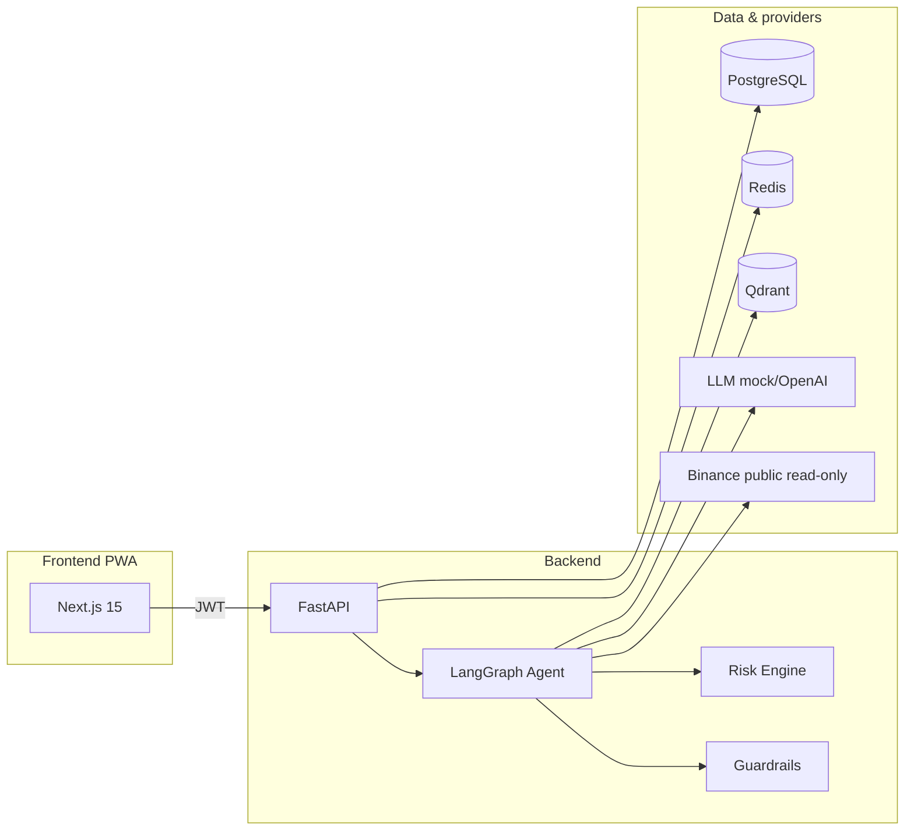

Detailed docs: [architecture](docs/architecture.md) · [agent workflow](docs/agent_workflow.md) · [RAG](docs/rag_system.md) · [security](docs/security.md)

## Screenshots

Paper MVP demo captures (local E2E stack, mock providers, **paper-only** execution):

| Dashboard | AI Workspace | Market Monitor |
|-----------|--------------|----------------|
| 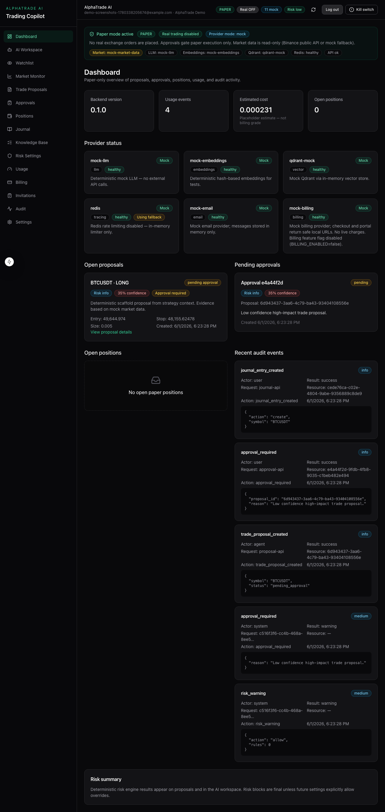 | 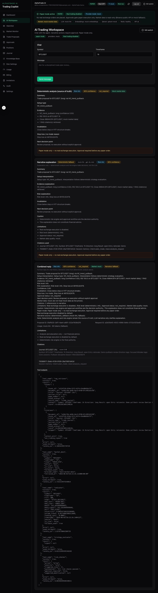 | 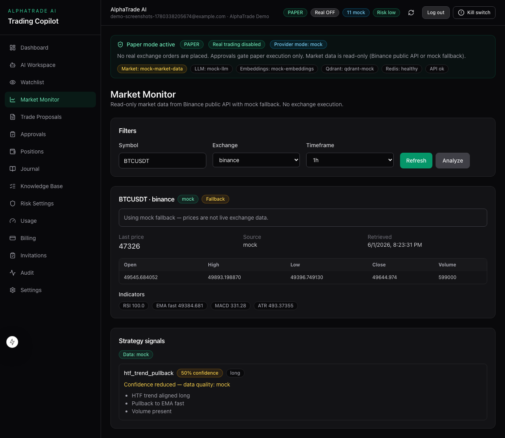 |

| Proposal detail | Approval workflow | Paper position |
|-----------------|-------------------|----------------|
| 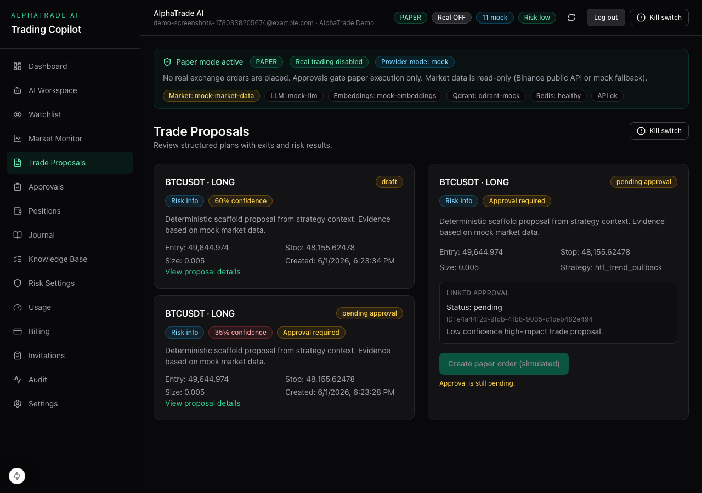 | 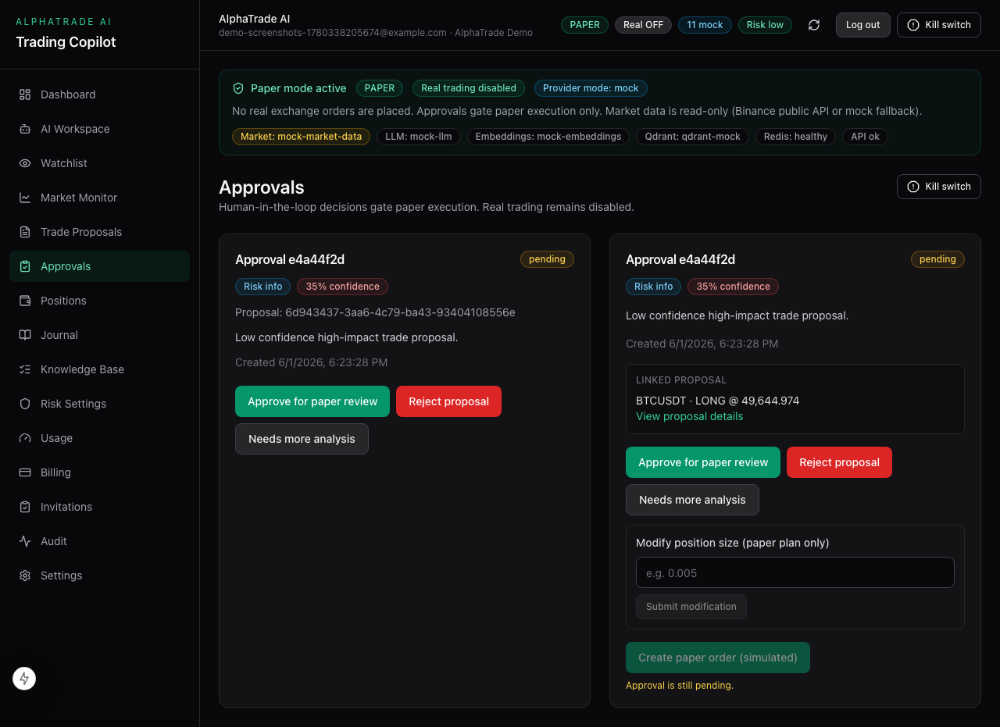 | 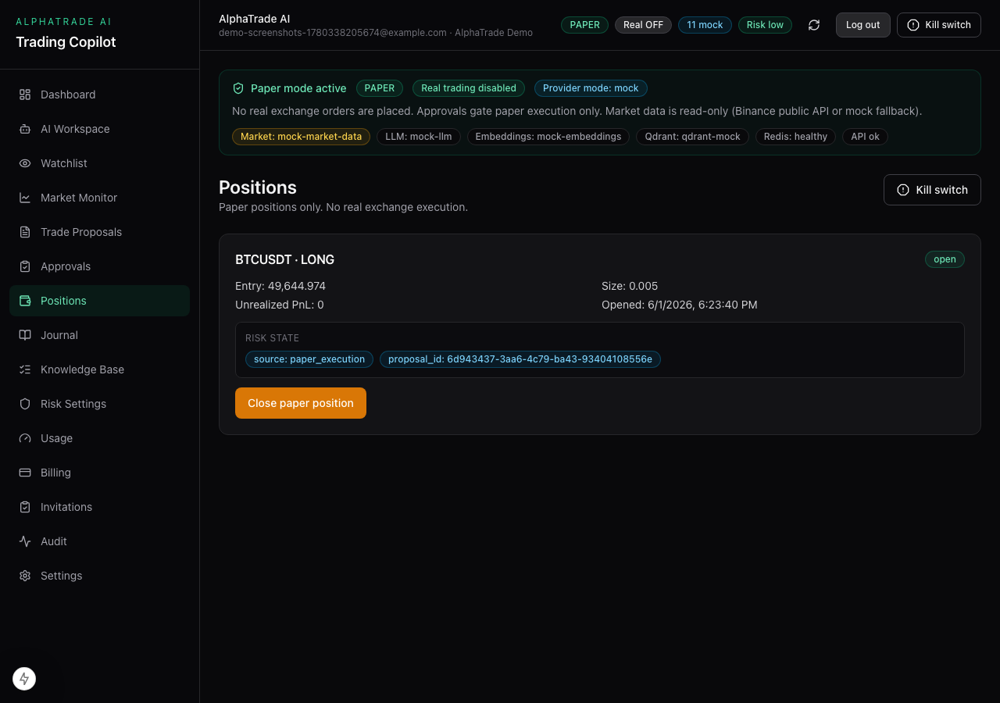 |

| Journal | Knowledge search | Usage & quota |
|---------|------------------|---------------|
| 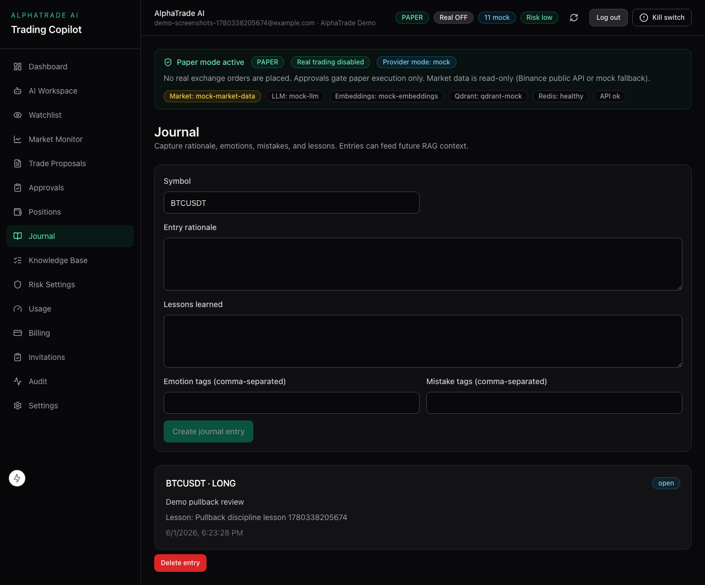 | 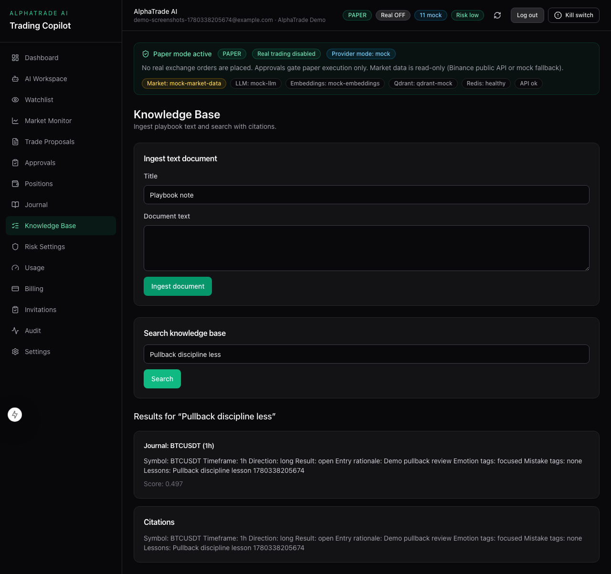 | 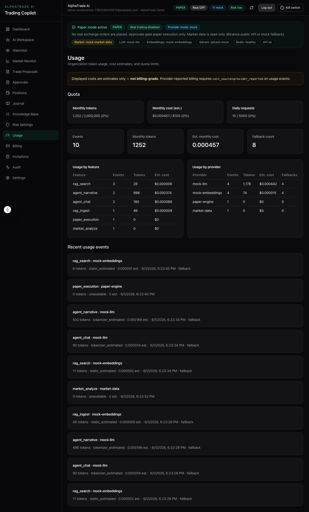 |

| Audit events | Provider status | Settings |
|--------------|-----------------|----------|
| 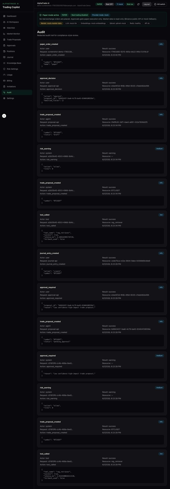 | 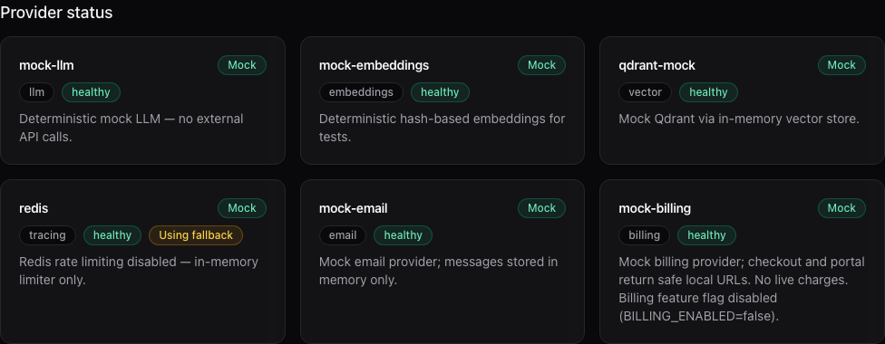 | 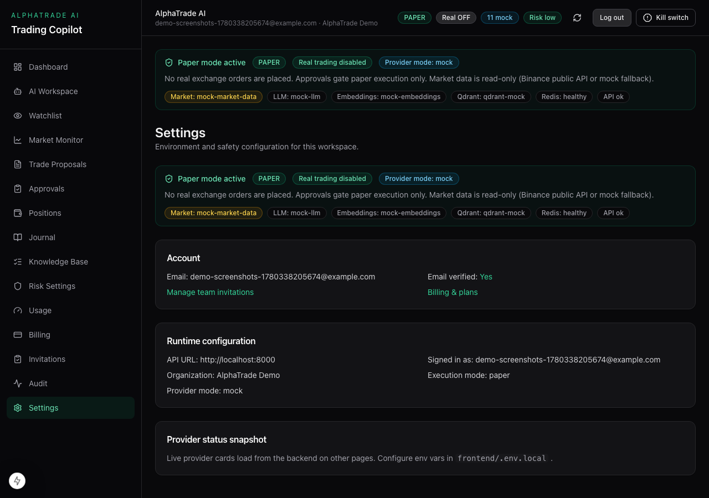 |

Capture locally with `npm run capture:screenshots` (from `frontend/`) or follow [docs/screenshots_checklist.md](docs/screenshots_checklist.md).

## Tech stack

- **Backend:** Python 3.12, FastAPI, Pydantic v2, SQLAlchemy 2.0, Alembic, LangGraph, structlog, uv, Ruff, pytest
- **Frontend:** Next.js 15, TypeScript, Tailwind CSS, Vitest, Playwright
- **Data:** PostgreSQL, Redis, Qdrant
- **CI:** GitHub Actions — lint, tests, build, evaluation harness, optional E2E smoke

## Prerequisites

- [uv](https://docs.astral.sh/uv/) (Python 3.12)
- [Node.js](https://nodejs.org/) 20+ and npm
- [Docker](https://docs.docker.com/get-docker/) — **recommended** for full stack (Postgres, Redis, Qdrant)
- PostgreSQL 16 — only if running backend locally without Docker

## Local setup

### 1. Clone and configure

```bash
git clone https://github.com/Fejjii/AlphaTrade-AI.git
cd AlphaTrade-AI
cp .env.example .env
cp frontend/.env.example frontend/.env.local
```

Safe defaults: `EXECUTION_MODE=paper`, `ENABLE_REAL_TRADING=false`, `PROVIDER_MODE=mock`.

### 2. Backend

```bash
cd backend
uv sync --extra dev
chmod +x scripts/run_dev_server.sh
./scripts/run_dev_server.sh
```

Verify:

```bash
curl http://localhost:8000/health
curl http://localhost:8000/providers/status
```

API docs: http://localhost:8000/docs

> **Note:** `./scripts/run_dev_server.sh` sets `PYTHONPATH=src` so `app` imports resolve after `uv sync`. The default `DATABASE_URL` points at local Postgres — use **Docker Compose** (below) if you do not have Postgres running.

### 3. Frontend

```bash
cd frontend
npm ci
npm run dev
```

Open http://localhost:3000 — register at `/register`, then sign in. Local dev uses bearer tokens in `sessionStorage`.

## Docker setup (recommended demo path)

Full stack with Postgres, Redis, Qdrant, backend migrations, and cookie-based auth:

```bash
docker compose up --build
```

Open http://localhost:3000. Smoke checks:

```bash
chmod +x scripts/docker-validate.sh scripts/e2e-smoke.sh scripts/strategy-smoke.sh scripts/market-watcher-smoke.sh
./scripts/docker-validate.sh
./scripts/e2e-smoke.sh
./scripts/strategy-smoke.sh   # optional — Slice 38 strategy + lesson workflows
./scripts/paper-validation-smoke.sh  # optional — Slice 39–40 scan/tick/scheduler/alerts
./scripts/market-watcher-smoke.sh  # optional — Slice 42 read-only watcher + paper scan bridge
```

Stop: `docker compose down`

## Test commands

**Backend** (from `backend/`):

```bash
uv run ruff check .
uv run ruff format --check .
uv run pytest
```

**Frontend** (from `frontend/`):

```bash
npm run lint
npm run typecheck
npm run test
npm run build
npm run test:e2e    # Playwright; starts SQLite backend automatically
```

**Evaluation harness** (from `backend/`):

```bash
uv run python ../evaluation/evaluate_agent.py
uv run python ../evaluation/evaluate_rag.py
uv run python ../evaluation/evaluate_guardrails.py
```

## Demo workflow

15-minute walkthrough for portfolio or stakeholder demos:

1. **Dashboard** — paper-only status, workflow stepper, "what to do next", today's discipline
2. **Market Monitor** — read-only ticker/OHLCV with live/mock labels
3. **AI Workspace** — chat: *"Analyze BTC pullback on 4h"*
4. **Proposals** — structured plan, risk result, exit levels
5. **Approvals** — approve for paper / reject / modify
6. **Paper execution** — simulated order on approved proposal
7. **Positions** — paper position lifecycle
8. **Journal** — lessons and tags → RAG sync
9. **Knowledge** — search ingested journal/playbook content
10. **Usage** — token/cost estimates and quotas
11. **Audit** — proposal, approval, execution events

Full script: [docs/demo_script.md](docs/demo_script.md)

## Portfolio and Interview Resources

Packaging for CV, GitHub, LinkedIn, and technical interviews (no product features):

| Document | Purpose |
|----------|---------|
| [interview_package.md](docs/interview_package.md) | Full system overview — architecture, AI, risk, safety, roadmap |
| [interview_pitch.md](docs/interview_pitch.md) | 30s / 60s / 2m pitches, demo script, expected Q&A |
| [cv_project_entry.md](docs/cv_project_entry.md) | Resume bullets, stack line, role keywords |
| [linkedin_project_post.md](docs/linkedin_project_post.md) | Short, medium, and technical LinkedIn posts |
| [technical_qa.md](docs/technical_qa.md) | Stack and design decisions (FastAPI, LangGraph, RAG, etc.) |

Live demo: [docs/demo_script.md](docs/demo_script.md) · Screenshots: [docs/screenshots_checklist.md](docs/screenshots_checklist.md)

## Environment variables

| Variable | Default | Purpose |
|----------|---------|---------|
| `EXECUTION_MODE` | `paper` | Trading mode (`paper` only in MVP) |
| `ENABLE_REAL_TRADING` | `false` | Hard kill switch for live orders |
| `PROVIDER_MODE` | `mock` | `mock` \| `fallback` \| `live` (trading still disabled) |
| `DATABASE_URL` | local Postgres | Workflow persistence |
| `JWT_SECRET` | dev placeholder | Set 32+ bytes for staging/production |
| `OPENAI_API_KEY` | empty | Optional LLM/embeddings |
| `BILLING_ENABLED` | `false` | Stripe scaffold off by default |
| `JOURNAL_RAG_SYNC_ENABLED` | `true` | Journal → knowledge auto-ingest |

Templates: `.env.example`, `.env.docker.example`, `.env.staging.example`, `frontend/.env.example`

## Known limitations

- No real exchange or broker execution
- No automated **live** trading without human approval; paper validation `auto_paper` may open **simulated** trades without proposal approval (paper only)
- Stripe billing is scaffold-only — no live charges by default
- LLM narrative is optional; deterministic analysis + risk engine remain authoritative
- Binance public API may rate-limit; mock fallback is automatic

Full list: [docs/limitations_roadmap.md](docs/limitations_roadmap.md)

## Roadmap

| Slice | Focus |
|-------|--------|
| **27B+** | Production Stripe wiring (Checkout, Portal, entitlements) |
| **28** | Exchange adapter (still approval-gated; compliance review required) |
| **29** | LangSmith traces + scaled LLM evaluation |

## Staging Deployment

Managed path: **Vercel** (frontend) + **Render** (API) + **Render Postgres** + **Upstash Redis** + optional **Qdrant Cloud**. Paper-only; real trading off.

| Service | Staging URL (Slice 49) |
|---------|------------------------|
| Backend API | https://alphatrade-api-staging.onrender.com |
| Frontend (production) | https://alpha-trade-ai-eight.vercel.app — Vercel Root Directory = `frontend` |
| Frontend (do not use) | https://alpha-trade-ai.vercel.app — blocked/wrong placeholder |

| Doc | Purpose |
|-----|---------|
| [staging_deployment.md](docs/staging_deployment.md) | Live URLs, smoke results, demo flow, known gaps |
| [pre_deployment_checklist.md](docs/pre_deployment_checklist.md) | Local prep before cloud accounts |
| [deployment_command_pack.md](docs/deployment_command_pack.md) | Copy-paste validation & smoke commands |
| [staging_deployment_worksheet.template.md](docs/staging_deployment_worksheet.template.md) | URL/secret placeholders (copy to `.local.md`) |
| [staging_execution_checklist.md](docs/staging_execution_checklist.md) | One-page manual click order |
| [staging_live_deployment_notes.md](docs/staging_live_deployment_notes.md) | Live URLs, env tables, smoke commands |
| [staging_deployment_runbook.md](docs/staging_deployment_runbook.md) | Full runbook + troubleshooting |
| [staging_deployment_checklist.md](docs/staging_deployment_checklist.md) | Env sign-off checklist |
| [deployment.md](docs/deployment.md) | Architecture, monitoring, rollback |

```bash
ENV_FILE=.env.staging ./scripts/check-env.sh
BASE_URL=https://alphatrade-api-staging.onrender.com ./scripts/verify-safety.sh
FRONTEND_URL=https://alpha-trade-ai-eight.vercel.app COOKIE_MODE=true ALLOW_DEGRADED_READY=true \
  BASE_URL=https://alphatrade-api-staging.onrender.com ./scripts/staging-smoke.sh
FRONTEND_URL=https://alpha-trade-ai-eight.vercel.app \
  BACKEND_URL=https://alphatrade-api-staging.onrender.com ./scripts/staging-live-smoke.sh
```

After deploy, add your public URLs to the README table above or pin them in release notes.

## Deployment

Full reference: [docs/deployment.md](docs/deployment.md) · Security: [docs/security_checklist.md](docs/security_checklist.md)

## Development status

Built in vertical slices (1–40 complete). See [docs/limitations_roadmap.md](docs/limitations_roadmap.md) for scope boundaries.

**Not financial advice.** Paper simulation and backtests do not guarantee real-world results.

## Source of truth

Product and architecture references: [docs/source/](docs/source/)
