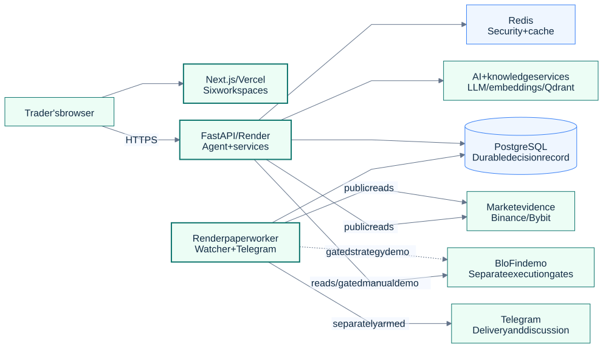

# AlphaTrade AI

**A personal AI trading workspace that connects market evidence, strategy rules, paper trades and lessons in one traceable workflow.**

AlphaTrade helps discretionary crypto traders answer three questions: *Why is this a setup? Can I act within my rules? What should I learn from the result?* It brings together context that otherwise sits across charts, AI chats, exchange screens and scattered notes.

The vision is a **personal AI trading operating system**: an assistant that understands the trader's playbooks and history, helps prepare decisions, and carries the reasoning into review. Today's product provides a paper-first foundation for that vision, with six connected workspaces and explicit control over supported actions.

[Five-minute demo](docs/demo_script.md) · [Presentation](docs/reviewer_presentation.md) · [Offline slide deck](docs/reviewer_presentation.html) · [Architecture](docs/architecture.md) · [Local setup](docs/local_setup.md)

## One workspace, from preparation to review

| Workspace | What it helps the trader do |
| --- | --- |
| **Dashboard** | See the paper account, daily review, monitoring state and items needing attention. |
| **Agent** | Discuss stored rules and trades, inspect supporting evidence, and review structured action drafts. |
| **Journal** | Follow planned entries, stops and targets alongside recorded fills, outcomes, observations and lessons. |
| **Strategies** | Inspect strategy versions, rules, detected setups, research and approval state. |
| **Knowledge** | Organize playbooks and notes, search sources, and preview supported files before saving them. |
| **Settings** | Manage risk, watchlists, notification preferences and account context, with advanced operational tools kept together. |

## How the system connects

The browser presents the six workspaces. The API handles authenticated actions; an independent worker monitors approved strategies and runs separately authorized paper workflows. PostgreSQL preserves the decision record across both processes. The Agent explains scoped facts and sources, while deterministic services decide eligibility, risk and execution authority.

[Detailed architecture and four workflow diagrams](docs/architecture.md) · [Editable overview diagram](docs/diagrams/system-overview.mmd)

## A governed trading workflow

1. **Observe:** read public perpetual-market evidence from Binance, with Bybit as a configured secondary source. Preserve source, freshness and candle-finalization information.
2. **Detect:** evaluate supported compiled strategies. A confirmed setup can become a persisted **Candidate**, a reviewable opportunity with evidence attached.
3. **Authorize:** bind the exact entry, quantity, stop and targets to an immutable plan. Supported user commands require explicit confirmation; an armed worker operates within its approved strategy and configured authority.
4. **Check and execute:** recheck eligibility, deterministic risk, freshness, account state and the kill switch. Internal paper execution records a simulated fill. BloFin demo execution has its own gates and venue evidence requirements.
5. **Review:** connect the plan and fill to the Journal, then use analytics, observations and learning proposals to inform the next decision. Strategy changes retain validation and human-promotion gates.

A conversational answer can explain or propose an action. Confirmation and application services determine what actually happens. New entry authority requires at least **1R of allocation-weighted gross planned reward/risk**; fees and execution effects mean this is not a guaranteed net return. Real-money trading is disabled and refused by the current source.

## Technology at a glance

| Layer | Technology and purpose |
| --- | --- |
| Web application | Next.js 15, React 19, TypeScript, Tailwind CSS and Recharts; hosted on Vercel. |
| API and worker | Python 3.12, FastAPI and Pydantic; Render API plus an independent paper worker. |
| Durable records | PostgreSQL, SQLAlchemy and Alembic migrations. |
| Security and cache | Redis for applicable token revocation, rate limiting and market-data caching. |
| AI and knowledge | Configured OpenAI-compatible LLM/embedding providers; Qdrant knowledge indexing/search; bounded SQL lexical retrieval in the default Agent route. |
| Integrations | Binance/Bybit market evidence, Telegram delivery, BloFin account context and separately governed demo execution. |
| Verification | Pytest, Ruff, mypy, Vitest, TypeScript and Playwright; focused development CI and a separate full acceptance gate. |

See [architecture](docs/architecture.md) for manifest versions, component boundaries and source links.

## Five-minute demonstration

| Time | Route | Show |
| --- | --- | --- |
| 0:00–0:45 | Dashboard | The paper account, monitoring state and evidence availability. |
| 0:45–1:30 | Strategies | An existing strategy version and its recorded setup/approval context. |
| 1:30–2:30 | Journal | The historical Nested BTC short: planned terms, internal paper fill and linked evidence. |
| 2:30–3:45 | Agent | Ask it to explain that recorded trade and compare its historical plan with today's entry policy. |
| 3:45–4:30 | Knowledge | A playbook/source reference and the file-preview-before-save boundary. |
| 4:30–5:00 | Settings | Risk controls, notification preferences and account/demo boundaries. |

Use existing records when there is no fresh setup. The [complete script](docs/demo_script.md) includes speaker wording, a recorded-evidence fallback and preparation steps. The [12-slide presentation](docs/reviewer_presentation.md) supports a longer interview.

## Current evidence and limits

**Source baseline: main [`b58beda`](https://github.com/Fejjii/AlphaTrade-AI/commit/b58bedae1baad82b36fd32b04d056372cac3c733), October 7, 2026.**

| Evidence | What is established |
| --- | --- |
| Repository and GitHub | PR220 is merged; Vercel reports successful deployment for `b58beda`. Full backend acceptance [CI #783](https://github.com/Fejjii/AlphaTrade-AI/actions/runs/37622005520) was **in progress** at this documentation check. |
| Supplied operational verification | Render API and paper worker were directly verified on `b58beda`; database migration `a6manualdemo001` was verified applied. These observations were supplied by the supervising release session. |
| Supplied product evidence | A Watcher-generated Telegram notification was received; a historical Nested BTC short has an internal paper fill and Journal; BloFin demo account sync succeeded. |

**Native BloFin order execution acceptance remains undemonstrated**; account sync and internal simulation do not prove it. PR220 adds a separately gated, owner-confirmed **BTC market demo test** with one full target. It does not add limit entries, unrestricted Agent trading, automatic SFP execution, manual exchange exits or complete exit/PnL/funding reconciliation. Fresh SFP recovery and the existing Journal target repair still require their own acceptance evidence.

The stored screenshots show historical synthetic fixtures and are unsuitable as current product proof. This entry point uses source-verified diagrams; [exact capture instructions](docs/screenshots_checklist.md) describe the authentic images needed for the presentation. No unavailable-service screenshot is used as the showcase.

[Dated status and evidence](docs/current_status.md) · [Reviewer evidence checklist](docs/reviewer_evidence.md) · [Limitations](docs/limitations_roadmap.md)

## Focused roadmap

- **Finish acceptance:** close the exact-release CI gate, verify fresh SFP recovery and Journal target repair, and conduct the separately supervised native demo test.
- **Complete the demo lifecycle:** establish supported exchange exit, outcome and funding reconciliation before expanding execution scope.
- **Strengthen assistance:** evaluate grounded responses, improve cross-workspace context and verify real-device voice behavior.
- **Grow validated strategies and learning:** add strategy families and promotion evidence while retaining deterministic risk and human control.

## Run it locally or read deeper

Start with [local setup](docs/local_setup.md) for the disposable Docker Compose or host-development path. Local mock/replay mode needs no exchange or Telegram credentials. Configuration templates: [backend/local](.env.example), [frontend](frontend/.env.example), [staging](.env.staging.example). Hosted operations use the [deployment guide](docs/deployment.md).

| Topic | Guide |
| --- | --- |
| Agent, grounding and memory | [Agent workflow](docs/agent_workflow.md) · [Retrieval](docs/rag_system.md) |
| Risk, security and execution | [Risk management](docs/risk_management.md) · [Security](docs/security.md) · [Manual BloFin demo acceptance](docs/manual_blofin_demo_acceptance.md) |
| Operations and engineering evidence | [Deployment](docs/deployment.md) · [Observability](docs/observability.md) · [Evaluation](docs/evaluation.md) |
| Interview preparation | [Presentation](docs/reviewer_presentation.md) · [Technical walkthrough](docs/interview_package.md) · [Technical Q&A](docs/technical_qa.md) |

Documentation and image links are repository-relative so the package can be copied with its `docs/`, `frontend/` and `backend/` directories into the Turing College repository. GitHub release/evidence links intentionally identify the original project. Assignment files and dated historical evidence remain preserved.

Paper, backtest and exchange-demo results do not establish profitability or real-money readiness.
