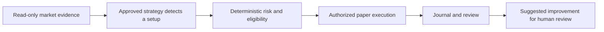
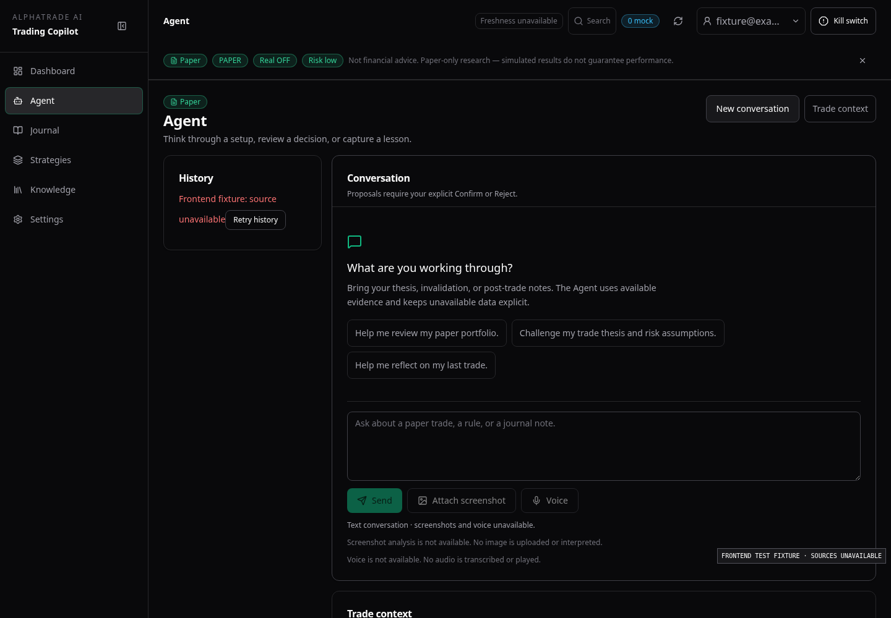

# AlphaTrade AI

**A paper trading workspace that connects market evidence, trading rules, risk decisions and review — with an AI assistant to explain the record.**

## The problem and the user

Crypto traders often split charts, AI chats and notes. The original rationale, risk limits and lessons can get lost between idea and trade.

AlphaTrade connects an approved strategy, setup evidence, risk checks, paper execution and Journal review. The Agent explains records and drafts changes; application services control what can be saved or executed.

The vision is a personal trading assistant with useful memory and decision support. Current foundations do not establish profitability or complete MVP acceptance.

## What the current workflow does

```mermaid
flowchart LR
  Evidence["Read-only market evidence"] --> Setup["Approved strategy detects a setup"]
  Setup --> Risk["Deterministic risk and eligibility"]
  Risk --> Paper["Authorized paper execution"]
  Paper --> Journal["Journal and review"]
  Journal --> Proposal["Suggested improvement for human review"]
```

Risk can block an action. A strategy draft is not an approved strategy, and a model reply is not confirmation. Paper execution can follow an explicit user action or an explicitly armed worker for an approved strategy. Real-money execution is permanently refused by the inspected source. A separately gated BloFin **demo** integration exists; its live acceptance is pending.

## Six workspaces

| Workspace | What the trader does |
| --- | --- |
| **Dashboard** | Reviews the paper account, daily state, monitoring and next review. |
| **Agent** | Discusses recorded facts and reviews drafts before confirming supported actions. |
| **Journal** | Follows trades, outcomes, observations and lessons. |
| **Strategies** | Inspects strategy versions, rules, setup evidence and validation. |
| **Knowledge** | Finds playbooks and notes; previews files before saving them. |
| **Settings** | Manages risk, watchlists, notifications and advanced tools. |

## A three-minute guided demo

1. **Dashboard:** establish paper mode and market evidence availability.
2. **Strategies → Journal:** follow an existing setup through risk, paper execution and outcome; explain missing records honestly.
3. **Agent:** ask “What evidence is missing?” Show separate draft Confirm/Reject controls.
4. **Knowledge → Settings:** show a source citation, file preview and risk limits.

[Demo preparation and longer walkthrough](docs/demo_script.md) · [Local setup](docs/local_setup.md)

## What is verified, and what remains open?

Current source baseline: main `e75e8bf` (merged PR215), **October 6, 2026**. Implemented paths and operational acceptance are separate.

The supervisor reports PR208/PR209 deployed on API/worker and a real Nested event through Candidate, risk, internal paper fill, Journal and received Telegram alert. These reports were **not independently reverified here**. Fresh SFP recovery, existing Journal target repair and BloFin demo execution acceptance remain pending. One event does not prove profitability or complete acceptance.

The supervisor also reports PR215 deployed. Its conversation continuity and Agent document-import entry are implemented; live acceptance is still required. The prospective 1R policy and linked assessment retrieval are in [PR216](https://github.com/Fejjii/AlphaTrade-AI/pull/216), not this deployed baseline.

[Dated submission/status addendum](docs/college_submission_handoff.md) · [Earlier component evidence](docs/current_status.md) · [Limitations and roadmap](docs/limitations_roadmap.md)

## Read further

| Need | Guide |
| --- | --- |
| Understand the system and component versions | [Architecture](docs/architecture.md) |
| Understand the Agent, models, tools and memory | [Agent workflow](docs/agent_workflow.md) · [Retrieval](docs/rag_system.md) |
| Assess security and trading boundaries | [Security](docs/security.md) |
| Run or operate it | [Setup](docs/local_setup.md) · [Deployment](docs/deployment.md) · [Monitoring](docs/observability.md) · [Testing and evaluation](docs/evaluation.md) |
| Prepare an interview | [Product positioning](docs/portfolio_positioning.md) · [Technical walkthrough and glossary](docs/interview_package.md) · [Pitch](docs/interview_pitch.md) · [Q&A](docs/technical_qa.md) |
| Review authentic UI captures | [Screenshot provenance and reproduction](docs/screenshots_checklist.md) |

Earlier six-workspace navigation capture: synthetic session, unavailable data sources. The Agent's voice controls have since changed; this image is a layout reference, not a current runtime result.

Historical release notes, acceptance records and branch handoffs remain in `docs/`. Their dates, exact bases and test results apply to those snapshots; use the guides above for the current overview. The [referenced design artifacts](docs/source/README.md) are absent from this checkout; when supplied, they describe intent rather than implementation proof.

Paper simulation, backtests and demo exchange results do not guarantee real-world performance. Not financial advice.
