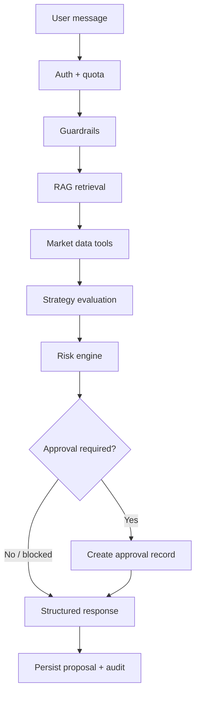

# Agent workflow

LangGraph orchestrates the AI trading workspace. Business logic lives in services; the graph routes state through deterministic nodes.

## Flow

## Key nodes (`backend/src/app/agents/nodes.py`)

| Stage | Purpose |
|-------|---------|
| Guardrails | Injection, moderation, trading policy |
| RAG | Rules, playbook, **journal lessons** — never direct signals |
| Market data | Read-only ticker/OHLCV via provider abstraction |
| Strategies | Seven deterministic MVP setups |
| Risk gate | 15 rules; `BLOCK` stops paper execution |
| Approval decision | Low confidence, execute intent, risk flags |
| Response builder | Deterministic structured output (source of truth) |
| Narrative enhancement | Optional LLM polish — schema-validated; falls back on failure |

## Persistence (Slice 13–20)

When a trade-related intent produces a proposal:

1. `ProposalService.create_from_agent` persists the plan
2. `ApprovalService.create_for_proposal` when approval required
3. Audit + usage events emitted
4. Frontend loads `/proposals/{id}/workflow` and `/approvals/{id}/workflow`

## Paper execution path

1. User approves in UI or API
2. `ExecutionService.place_paper_order` validates:
   - Real trading disabled
   - Approval status `approved`
   - Risk not `BLOCK`
   - Idempotency key
3. Paper order + position created
4. Audit event `paper_order_created`

**Rejected**, **needs_more_analysis**, and **modified** approvals cannot execute.

## Journal → RAG loop

When `JOURNAL_RAG_SYNC_ENABLED=true` (default):

1. Journal create/update triggers `JournalRagSyncService`
2. Entry text ingested as `trade_journal` with symbol/timeframe/tags metadata
3. Agent `retrieve_for_agent` includes `TRADE_JOURNAL` source type

See [rag_system.md](rag_system.md).

## API endpoints

- `POST /chat/message` — run agent
- `GET /proposals/{id}/workflow` — proposal + linked approval + eligibility
- `GET /approvals/{id}/workflow` — approval + linked proposal + eligibility
- `POST /execution/paper` — paper order (trader role)

## Narrative layer (Slice 21)

After `final_response` builds `TradingAnalysisDetail`, `narrative_enhancement`:

1. Builds sanitized JSON context (analysis, approval, market data quality, citations)
2. Loads external prompt (`backend/prompts/*.txt`)
3. Calls LLM via provider abstraction (mock without API key)
4. Validates narrative against deterministic facts and trading language policy
5. On failure → deterministic fallback narrative + audit warning
6. Formats combined reply for `output_validation`

The UI shows **Deterministic analysis** and **Narrative explanation** separately so users see that the LLM did not make the trade decision.

Portfolio demo path: [demo_script.md](demo_script.md) · [screenshots_checklist.md](screenshots_checklist.md)

## Safety invariants

- Agent never calls exchange execution directly
- LLM output validated; never bypasses risk or approval
- LLM narrative cannot change risk level, approval status, or execution state
- Real trading requires explicit config not enabled in MVP
