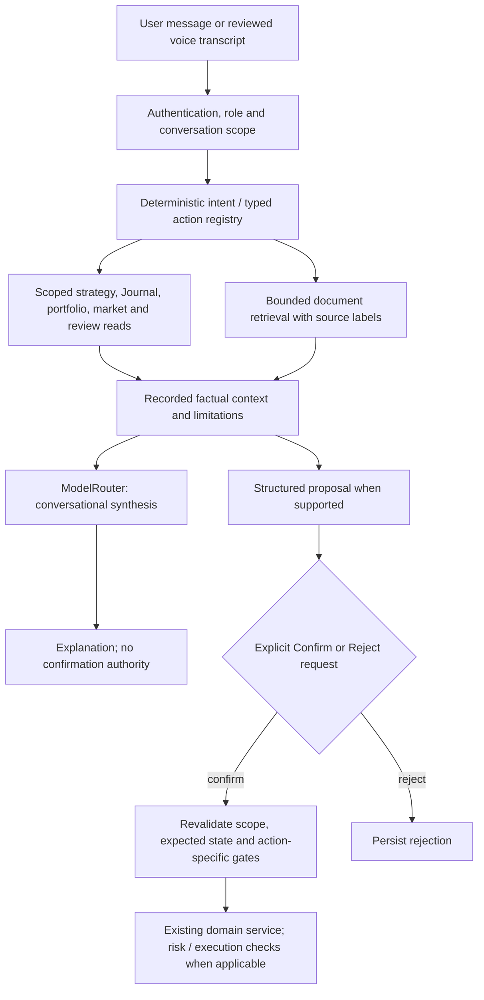

# Agent workflow, models and authority

The primary Agent workspace is `/agent`. It reads recorded application facts, retrieves relevant knowledge, produces conversational explanations and drafts supported actions. **Sending a message persists a conversation turn; it does not confirm the proposed domain action.**

Baseline: main `ff90d0c`, October 6, 2026. Runtime model selection and operational success are UNKNOWN without a fresh observation; see [current status](current_status.md).

## One turn and a separate decision

```mermaid
flowchart TD
  User["User message or reviewed voice transcript"] --> Scope["Authentication, role and conversation scope"]
  Scope --> Route["Deterministic intent / typed action registry"]
  Route --> Reads["Scoped strategy, Journal, portfolio, market and review reads"]
  Route --> Knowledge["Bounded document retrieval with source labels"]
  Reads --> Facts["Recorded factual context and limitations"]
  Knowledge --> Facts
  Facts --> Model["ModelRouter: conversational synthesis"]
  Facts --> Draft["Structured proposal when supported"]
  Model --> Reply["Explanation; no confirmation authority"]
  Draft --> Decision{"Explicit Confirm or Reject request"}
  Decision -->|confirm| Validate["Revalidate scope, expected state and action-specific gates"]
  Validate --> Service["Existing domain service; risk / execution checks when applicable"]
  Decision -->|reject| Rejected["Persist rejection"]
```

The model explains supplied facts. Application code controls the proposal lifecycle. Confirming a knowledge or Journal draft is not permission to trade, and strategy conversation confirmation is not canonical strategy approval. A paper execution command has its own immutable plan, hash, risk, freshness and idempotency boundaries.

## Models: declared defaults, not observed deployment

| Setting or route | Inspected default/behavior |
| --- | --- |
| `LLM_MODEL` | `gpt-4o-mini`, used by the base provider. |
| `LLM_TIER_A_MODEL` | `gpt-4o`, used for higher-tier purposes permitted by policy. |
| `LLM_TIER_B_MODEL` | `gpt-4o-mini`, used for eligible lower-tier purposes. |
| `MODEL_ROUTER_POLICY_VERSION` | `model-router/v1`. Callers request typed purposes, not arbitrary authority or model elevation. |
| Current conversational turn | `ModelConversationalResponder` requests `GENERAL_AGENT_SYNTHESIS`, a Tier A purpose (default `gpt-4o`), from the existing ModelRouter. |
| Embeddings | `EMBEDDINGS_MODEL=text-embedding-3-small`; dimensions resolve separately from the conversational model. |
| Deterministic authority (Tier C) | Not dispatched to an LLM: risk, permissions, freshness, kill switch and execution authority remain code. |

Sources: [Settings](../backend/src/app/core/config.py), [model routing contracts](../backend/src/app/schemas/model_routing.py), [router](../backend/src/app/services/model_router.py), [conversational responder](../backend/src/app/interactive_agent/conversation.py). `LLM_MODEL` alone does not establish the model actually selected by a routed turn. Environment overrides and provider responses must be observed to report a resolved deployed model.

Local `PROVIDER_MODE=mock` forces mock LLM/embeddings even with a key present. Current staging/production policy requires configured OpenAI and authoritative Qdrant and prohibits silent mock substitutions. A failed conversational call can report “Conversational model reply is unavailable” while preserving factual context; that is not a successful model reply. [Retrieval/provider details](rag_system.md).

## Tools and supported boundaries

[The action registry](../backend/src/app/interactive_agent/action_registry.py) is the implemented catalog; [the capability endpoint](../backend/src/app/api/routes/interactive_agent.py) exposes `GET /agent/capabilities`.

| Area | Current behavior | Authority boundary |
| --- | --- | --- |
| Context, market, portfolio, strategy | Scoped reads of stored rules/state and canonical market facts. | Missing/stale facts stay unavailable; no invented current price. |
| Journal and knowledge | Draft entries/notes or ingestion proposals; supported confirmation calls existing services. | A proposal or document does not become a verified fact or an approved trading rule. |
| Strategy drafting/refinement | Creates discussion proposals and links selected evidence. | Validation, compilation and canonical approval/promotion remain separate. |
| Watchlist changes | Supported structured proposals with explicit confirmation and tenant/role checks. | A watchlist change does not arm a worker. |
| Paper execution preparation/explanation | Dedicated prepare/confirm command path and durable execution reads. | Exact approved canonical plan plus risk/freshness/permissions; no LLM or Telegram order authority. |
| Strategy analytics, learning status, Daily Review | Read-through deterministic services with source/sample limitations. | No promotion/rollback mutation tool in the learning-status read. |

Relevant contracts: [action application](agent_action_application_v3.md), [paper command](agent_paper_execution_v4.md), [analytics](agent_strategy_analytics_001.md), [Daily Review](agent_daily_review_001.md). These specialist documents record their original implementation evidence; they are not proof of today's deployed acceptance.

## Retrieval, context and memory

The current default Agent searches tenant/user-scoped PostgreSQL documents and chunks lexically: at most 200 scanned chunks, five hits by default. A vector retriever is optional and must be injected; Qdrant is not queried automatically by every Agent turn. Vector hits are reloaded from scoped SQL records before presentation. Playbook passages retain titles, source labels and chunk references.

Conversation rows preserve selected context and messages. Journal, strategy versions, Daily Review and learning attribution provide durable context. This is **stored application memory**, not model fine-tuning or continuous behavioral learning. The conversational responder receives bounded factual context; it is not evidence that unlimited past conversations are included in every model request.

Stored document passages are reference data, never instructions or execution authority. Explicit user observations, system inference, research suggestions and canonical facts have different provenance. [Retrieval guide](rag_system.md) · [presentation grounding](agent_presentation_grounding.md).

## Voice and screenshot limits

Browser Web Speech dictation/transcript review and optional reply playback are implemented in [frontend voice code](../frontend/src/lib/voice/). Reviewed voice text uses the same `/agent/turns` and Confirm/Reject flow. Browser speech may send audio to the browser vendor's service; no server model credential is put in the browser.

The backend voice I/O and screenshot-analysis routes remain unimplemented contracts; they do not accept audio/image bytes for analysis. Rich continuous conversational voice, chart-image understanding and broader orchestration are future scope where unimplemented. Historical [voice fixture checks](voice_agent_v1_handoff.md) do not verify actual microphone hardware, current speech-service behavior, Safari or physical iOS.

## Compatibility LangGraph workspace

`POST /chat/message`, [LangGraph nodes](../backend/src/app/agents/nodes.py) and the legacy workflow screens remain in source. That graph orchestrates guardrails, retrieval, tools, deterministic structured analysis and optional narrative. Earlier slice documents describe proposal/approval flows from that workspace; do not treat them as canonical execution permission or substitute them for the current `/agent/turns` contract.

The Agent cannot enable real trading. See [permanent paper safety](../backend/src/app/interactive_agent/safety.py), [security](security.md), [architecture](architecture.md) and [limitations](limitations_roadmap.md).
