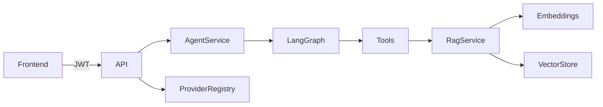

# Architecture

AlphaTrade AI is a modular human-in-the-loop trading copilot. The backend is the
composition root; the frontend is a typed PWA client.

## Provider layer (Slice 18–19)

External capabilities are wrapped behind provider abstractions in
`backend/src/app/providers/`:

| Provider | Default (no credentials) | With credentials / public API |
|----------|--------------------------|-------------------------------|
| LLM | `mock-llm` (deterministic) | `openai-llm` with mock fallback |
| Embeddings | `mock-embeddings` (hash vectors) | `openai-embeddings` with mock fallback |
| Vector store | in-memory | Qdrant when `PROVIDER_MODE=fallback` and URL reachable |
| Market data | `mock-market-data` | `binance-public` (read-only REST, **no API key**) |
| Redis | in-memory rate limits | Redis when `REDIS_URL` reachable |
| Exchange | `mock-exchange` (paper only) | **Never real execution in MVP** |

### Market data (Slice 19)

- **Provider:** Binance public REST endpoints (spot ticker, klines, futures funding/OI).
- **No API key** required — read-only public data only.
- **Fallback:** When Binance is unreachable or `PROVIDER_MODE=mock`, deterministic mock prices are used.
- **Labeling:** Every response includes `is_live`, `fallback_used`, `is_stale`, and `provider_name`.
- **Caching:** Short TTL for ticker (15s); timeframe-scaled TTL for OHLCV (Redis or in-memory).
- **Indicators:** EMA, RSI, MACD, ATR, VWAP, volume trend — computed in Python, never by LLM.
- **Execution:** Market data is read-only; real exchange order placement remains disabled.

### Fallback rules

1. Missing `OPENAI_API_KEY` → mock LLM and mock embeddings.
2. OpenAI unreachable at runtime → automatic fallback to mocks; usage events record `fallback_used=true`.
3. Qdrant unreachable → in-memory vector store; RAG continues with mock embeddings if needed.
4. Redis unreachable → in-memory rate limiter when `RATE_LIMIT_ALLOW_IN_MEMORY_FALLBACK=true`.
5. Binance unreachable or `PROVIDER_MODE=mock` → mock market data; never labeled as live.

### Safety boundaries

- Agent nodes call **services and tools**, never raw providers (except LLM usage metering).
- LLM output is validated and never bypasses guardrails, risk engine, or approval workflow.
- Structured trading responses are built **deterministically** from agent state; the LLM is optional for metering only in this slice.

## Agent workflow

LangGraph nodes in `backend/src/app/agents/nodes.py` orchestrate:

1. Auth and quota checks
2. Guardrails (injection, moderation, trading policy)
3. RAG retrieval (rules and journal context only)
4. Market data tools fetch **live Binance public data** when `PROVIDER_MODE=fallback|live`; mock fallback otherwise.
5. Strategy modules (deterministic signals)
6. Risk engine (final authority)
7. Approval decision
8. Paper execution stub (never real exchange)
9. Structured final response + output validation

## API surface

- `GET /providers/status` — provider health and fallback transparency
- `POST /chat/message` — agent workspace (structured `analysis` field in response)
- `GET /market/ticker`, `/market/ohlcv`, `/market/snapshots` — read-only market data with provenance metadata
- `POST /market/analyze` — market data + indicators + strategy signals
- Protected domain routes require JWT + tenant context (see `docs/security.md`)
- Auth modes: bearer tokens (local dev) or httpOnly refresh cookie + short-lived access JWT (Docker/production demo)
- Access token denylist (Redis) revokes sessions on logout; refresh rotation detects reuse
- `GET /proposals/{id}/workflow` — proposal + linked approval + paper eligibility (Slice 20)
- `GET /approvals/{id}/workflow` — approval + linked proposal + paper eligibility
- `POST /execution/paper` — paper-only; requires approved approval

## MVP workflow (Slice 20)

Human-in-the-loop path:

1. Agent or API creates trade proposal
2. Approval record when required
3. User approves / rejects / modifies / requests analysis
4. Approved proposals → paper order → paper position
5. Audit + usage events throughout
6. Journal entries optionally sync to RAG (`trade_journal`)

## Account lifecycle (Slice 25)

- `AccountService` handles verification, password reset, and invitations.
- `providers/email/` — mock (default), SMTP/Resend/SendGrid placeholders; status on `/providers/status`.
- Routes: `/auth/verify-email/*`, `/auth/password-reset/*`, `/organizations/invitations/*`.
- Frontend account pages: verify, forgot/reset password, settings status, invitations (OWNER).

See [account_management.md](account_management.md).

## Usage and quotas (Slice 24)

Metered features persist `usage_events` with token counts, `cost_source`, and optional
`provider_reported_cost`. Organization quotas enforce soft warnings and hard blocks on
chat, RAG ingest, market analyze, narrative, and paper execution. See
[usage_and_billing.md](usage_and_billing.md).

## Billing scaffold (Slice 26)

- `providers/billing/` — mock (default), Stripe placeholder when `BILLING_ENABLED=true` and keys set.
- Data: `billing_customers`, `subscriptions`, `billing_events`, `usage_export_batches`, `webhook_events`.
- Plans (`free`, `pro`, `team`) map to `organization_quotas` via `BillingService.apply_plan`.
- Routes: `/billing/*` (OWNER for customer, checkout, portal, usage export); webhook signature verification in Stripe mode.
- Frontend `/billing` page; no live charges unless billing enabled and provider confirms live mode.

See [agent_workflow.md](agent_workflow.md) and [demo_script.md](demo_script.md).

## Data flow

See also: [RAG system](rag_system.md), [Agent workflow](agent_workflow.md), [Demo script](demo_script.md), [Deployment](deployment.md), [Limitations](limitations_roadmap.md).
