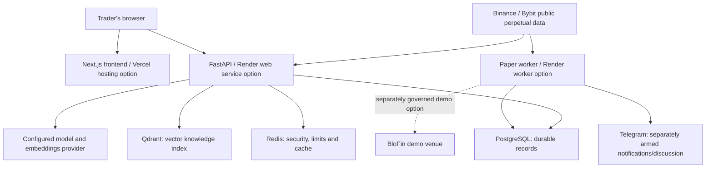
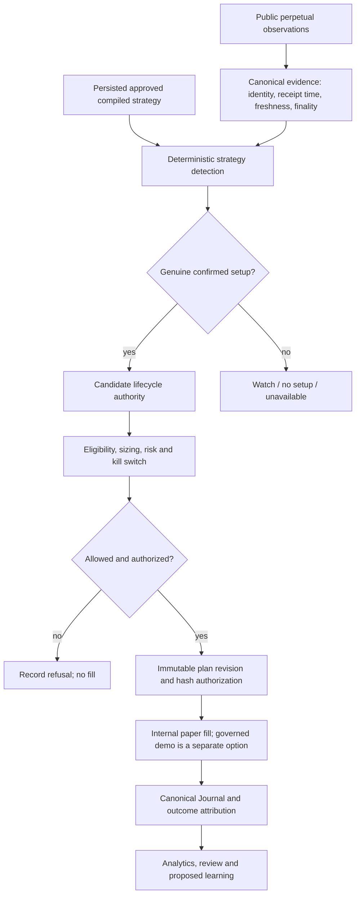

# Architecture

AlphaTrade is a modular application: one web client, a Python API, a separately running paper worker, and shared data services. The application separates market facts, strategy detection, risk, execution authorization and AI explanation so that a fluent answer cannot change trading authority.

**Source baseline:** main `ff90d0c`, October 6, 2026. [Status and evidence limits](current_status.md) distinguish source inspection from supplied runtime reports.

## System and hosting

```mermaid
flowchart TB
  Browser["Trader's browser"] --> Web["Next.js frontend / Vercel hosting option"]
  Browser --> API["FastAPI / Render web service option"]
  Worker["Paper worker / Render worker option"] --> PG["PostgreSQL: durable records"]
  API --> PG
  API --> Redis["Redis: security, limits and cache"]
  API --> Qdrant["Qdrant: vector knowledge index"]
  API --> Model["Configured model and embeddings provider"]
  Market["Binance / Bybit public perpetual data"] --> API
  Market --> Worker
  Worker --> Telegram["Telegram: separately armed notifications/discussion"]
  Worker -. "separately governed demo option" .-> BloFin["BloFin demo venue"]
```

The browser loads the frontend and calls the API over HTTPS with authenticated requests. API and worker share durable records; the worker does not run inside a frontend request. Market connectors read public data. Telegram and BloFin demo have separate activation and authority checks. These hosting labels reflect the committed deployment design, not a fresh inventory of active services. See [deployment](deployment.md).

## Components and declared versions

A dependency requirement is not an installed or deployed version. Exact lock values below are repository snapshots; live process and hosted-server versions are UNKNOWN here.

| Component | Purpose | Manifest/template declaration | Locked snapshot where available |
| --- | --- | --- | --- |
| Frontend | Six workspaces, charts, explicit action review; browser speech controls. | [package.json](../frontend/package.json): Next.js `15.5.18`, React `^19.0.0`, TypeScript `^5`, Tailwind CSS `^3.4.1`; Docker uses Node `20-alpine`. | [package-lock.json](../frontend/package-lock.json): React `19.2.6`, TypeScript `5.9.3`, Tailwind `3.4.19`. |
| API | Authentication, scoped services, Agent turns and authority gates. | [pyproject.toml](../backend/pyproject.toml): Python `>=3.12`, FastAPI `>=0.115.0`, Pydantic `>=2.10.0`, SQLAlchemy `>=2.0.36`, LangGraph `>=0.2.0`; backend Docker uses Python `3.12`. | [uv.lock](../backend/uv.lock): FastAPI `0.136.3`, Pydantic `2.13.4`, SQLAlchemy `2.0.50`, LangGraph `1.2.2`. |
| Paper worker | Supervises Watcher and Telegram components with separate health/failure state. | Same backend package (`0.1.0`); `python -m app.workers.paper_worker` in [render.yaml](../render.yaml). | Same Python lock; no separate worker package/version. |
| PostgreSQL | Users, strategy/version lifecycle, evidence receipts, plans, fills, Journal, audit. | Local [Compose](../docker-compose.yml): `postgres:16-alpine`. | Managed-server version not pinned by the backend lock. |
| Redis | Rate limiting, token denylist and market cache; not the trade ledger. | Local Compose: `redis:7-alpine`; Python client requirement `redis>=5.2.0`. | Python client `8.0.0`; this is **not** the Redis server version. |
| Qdrant | Semantic vector search for the knowledge service. | Local Compose: `qdrant/qdrant:v1.13.2`; Python client `qdrant-client>=1.12.0`. | Python client `1.18.0`; hosted server version UNKNOWN. Optional for a local mock demo; required by current hosted provider policy. |
| Model/embeddings | Conversation, explanation and context indexing. | OpenAI-compatible HTTP provider; Settings names and routing in [Agent guide](agent_workflow.md). | Model names are runtime configuration, not dependency versions. |

## From evidence to a paper outcome

```mermaid
flowchart TD
  Public["Public perpetual observations"] --> Evidence["Canonical evidence: identity, receipt time, freshness, finality"]
  Policy["Persisted approved compiled strategy"] --> Detect["Deterministic strategy detection"]
  Evidence --> Detect
  Detect --> Confirmed{"Genuine confirmed setup?"}
  Confirmed -->|yes| Candidate["Candidate lifecycle authority"]
  Confirmed -->|no| Observe["Watch / no setup / unavailable"]
  Candidate --> Risk["Eligibility, sizing, risk and kill switch"]
  Risk --> Allowed{"Allowed and authorized?"}
  Allowed -->|no| Blocked["Record refusal; no fill"]
  Allowed -->|yes| Plan["Immutable plan revision and hash authorization"]
  Plan --> Fill["Internal paper fill; governed demo is a separate option"]
  Fill --> Journal["Canonical Journal and outcome attribution"]
  Journal --> Review["Analytics, review and proposed learning"]
```

A **Candidate** is a persisted confirmed opportunity, not an order. A **TradePlanRevision** fixes the exact approved plan. Eligibility and deterministic risk remain separate from strategy research labels. Explicit operator arming can authorize the worker's continuation for an approved strategy; other supported paths require a specific confirmation. None of those gates grants real trading.

[Canonical runtime](../backend/src/app/runtime/canonical.py) composes the durable adapters. [Watcher](../backend/src/app/workers/watcher_paper.py) uses leases and fencing to exclude stale workers. [Candidate lifecycle](../backend/src/app/signal_fusion/lifecycle.py) owns Candidate publication. Strategy support differs: current SFP structural research does not provide an authorized SFP execution plan; the canonical paper continuation described here applies only to supported eligible strategies. Existing proposal/approval screens and `/chat/message` are compatibility surfaces; they do not replace canonical authority. The legacy `/execution/paper` path is refused by the permanent-paper policy.

## Evidence is more than a price

Current quote freshness, trade-stream freshness, candle completion, historical validity and setup lifetime are different checks. Canonical evidence defaults to replay locally; replay is never a live mark. Live options use Binance USD-M or Bybit USDT perpetual data and preserve source identity. Whole-source failover does not splice venue observations together or substitute spot prices.

PR209 versions the live Binance acquisition policy as v2: guarded/confirmed REST candles create new policy identities while existing v1 receipts remain immutable. It is an application finalization policy, not a provider guarantee. Fresh SFP recovery is still pending in supplied runtime evidence. See [source contracts](market_source_contracts.md), [finalization/history boundary](sfp_candle_finalization_recovery.md) and [Nested/SFP specialist guides](nested_timeframes_sfp_surface.md).

## AI, knowledge and learning

The current `/agent` workspace uses a conversational model plus deterministic read/proposal tools. The earlier LangGraph workspace remains in the repository; it is not the sole description of the current Agent. Knowledge indexing/search and the Agent's bounded lexical document retrieval are distinct. Persistent conversations, Journal facts and scoped knowledge are memory sources, not online model training.

Governed strategy learning captures a hypothesis, compares exact baseline/candidate evidence, requires paper validation and binds human promotion to immutable identities. It does not let Agent prose activate a strategy. See [Agent](agent_workflow.md), [retrieval](rag_system.md), [governed learning](governed_learning_promotion_001_handoff.md) and [limitations](limitations_roadmap.md).

## Tradeoffs

- A modular Python application makes authority and transactions inspectable, but synchronous database/provider work and a large API surface need workload-specific performance review.
- PostgreSQL is the durable source; Redis and Qdrant serve different purposes. External vector operations and SQL commits are not a distributed transaction.
- Strict evidence and identity checks can refuse an otherwise plausible setup. This preserves auditability; availability does not justify fabricating data or rewriting old evidence.
- Backtests and paper fills simplify venue behavior. A functioning loop is engineering evidence, not evidence of a profitable strategy or real-money readiness.

[Security](security.md) · [Deployment](deployment.md) · [Technical interview](interview_package.md)
