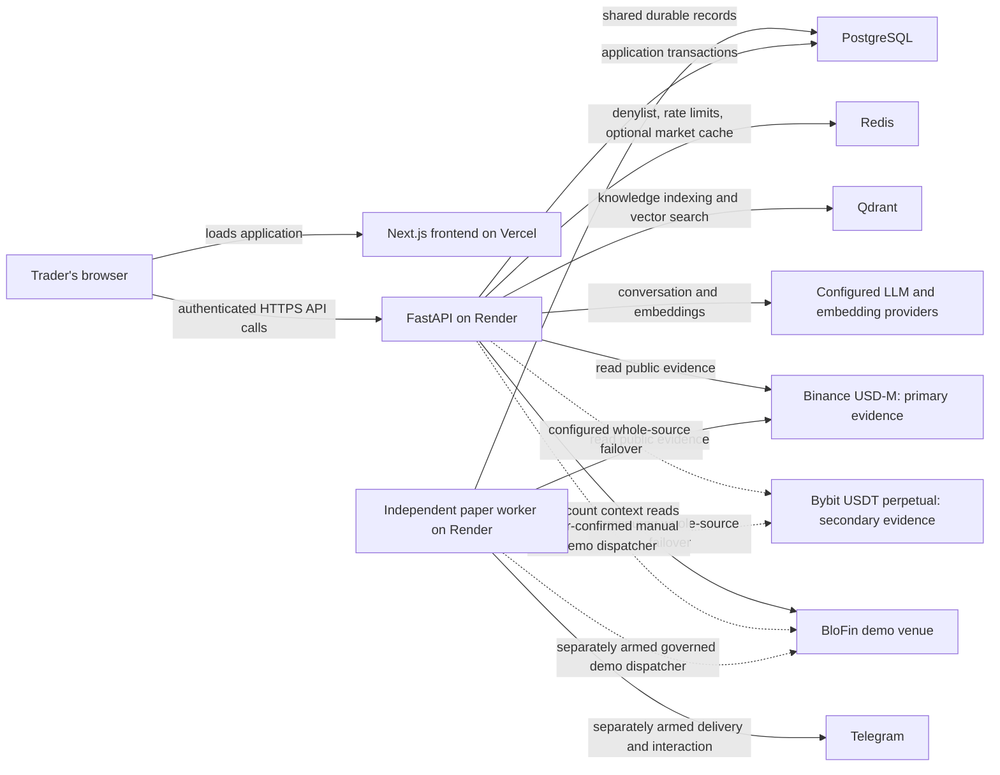
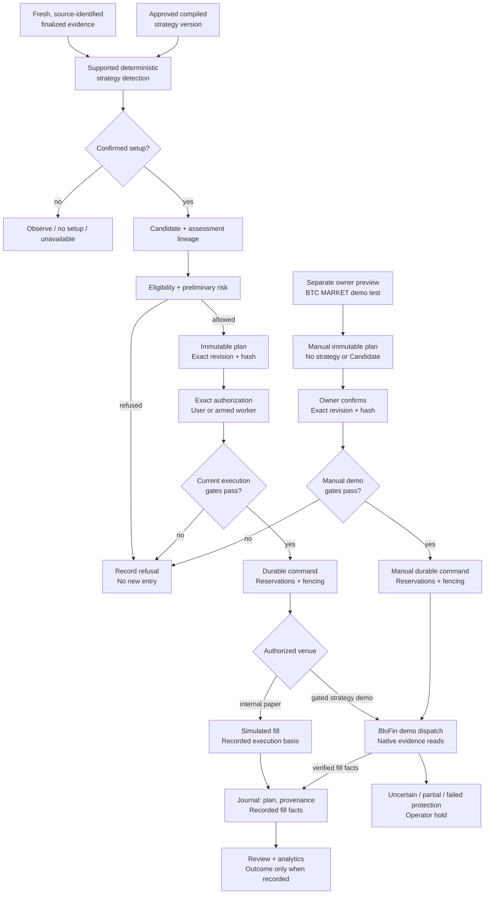
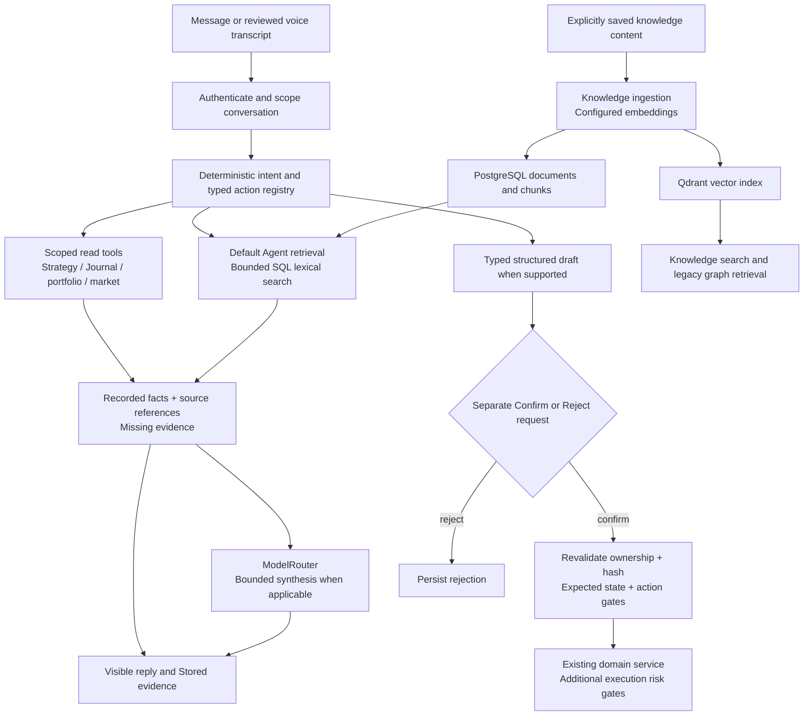
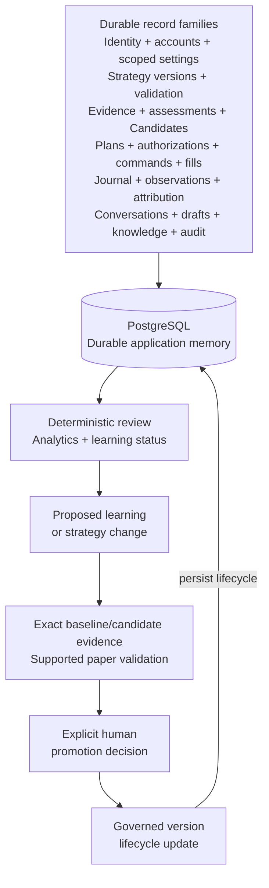

# AlphaTrade architecture

AlphaTrade connects preparation, governed paper execution and review in a modular application. The web interface and Agent make the workflow understandable; application services preserve the facts and control actions.

**Source inspected:** main `b58bedae1baad82b36fd32b04d056372cac3c733`, October 7, 2026. [Current status](current_status.md) separates implemented paths, supplied deployment observations and demonstrated behavior.

## System architecture and external dependencies

Mermaid source

```mermaid
flowchart LR
  Browser["Trader's browser"] -->|loads application| Web["Next.js frontend on Vercel"]
  Browser -->|authenticated HTTPS API calls| API["FastAPI on Render"]
  Worker["Independent paper worker on Render"] -->|shared durable records| PG["PostgreSQL"]
  API -->|application transactions| PG
  API -->|denylist, rate limits, optional market cache| Redis["Redis"]
  API -->|knowledge indexing and vector search| Qdrant["Qdrant"]
  API -->|conversation and embeddings| AI["Configured LLM and embedding providers"]
  API -->|read public evidence| Binance["Binance USD-M: primary evidence"]
  Worker -->|read public evidence| Binance
  API -.->|configured whole-source failover| Bybit["Bybit USDT perpetual: secondary evidence"]
  Worker -.->|configured whole-source failover| Bybit
  Worker -->|separately armed delivery and interaction| Telegram["Telegram"]
  API -->|account context reads| BloFin["BloFin demo venue"]
  API -.->|owner-confirmed manual demo dispatcher| BloFin
  Worker -.->|separately armed governed demo dispatcher| BloFin
```

Arrows describe requests and dependencies, not a claim that every provider is currently healthy. The browser calls the API directly through its configured public API origin. The Next.js server serves the interface; it is not the trading engine or a required proxy for every API call. Server rendering may also use the configured backend origin.

[render.yaml](../render.yaml) defines the FastAPI web service and one independent paper worker, both using the backend image. The worker runs `python -m app.workers.paper_worker`; it supervises Watcher and Telegram with independent authority and health state. It does not run inside a Next.js request. API and worker coordinate through PostgreSQL records, leases and fences. The Blueprint supplies connection settings for data services rather than provisioning their whole inventory.

Redis supports applicable security and caching functions; it is not the trade ledger. Qdrant serves knowledge indexing/search. The current Agent's default retrieval reads SQL chunks lexically; the Qdrant edge belongs to the knowledge service, not every conversational turn. No worker-to-LLM or worker-to-Qdrant dependency is asserted merely because provider settings exist in its template.

BloFin account sync is a read path. Manual demo submission belongs to the API's owner-confirmed capability; strategy-driven governed demo continuation belongs to a separately armed worker path. Telegram notification receipt is independent of either execution venue. [Hosting and operational detail](deployment.md).

## Setup detection to authorization, execution and Journal

Mermaid source

```mermaid
flowchart TD
  Evidence["Fresh, source-identified<br/>finalized evidence"] --> Detect["Supported deterministic<br/>strategy detection"]
  Strategy["Approved compiled<br/>strategy version"] --> Detect
  Detect --> Setup{"Confirmed setup?"}
  Setup -->|no| Observe["Observe / no setup / unavailable"]
  Setup -->|yes| Candidate["Candidate + assessment lineage"]
  Candidate --> Eligibility["Eligibility + preliminary risk"]
  Eligibility -->|allowed| Plan["Immutable plan<br/>Exact revision + hash"]
  Eligibility -->|refused| Refused["Record refusal<br/>No new entry"]
  Plan --> Authority["Exact authorization<br/>User or armed worker"]
  Authority --> Gates{"Current execution<br/>gates pass?"}
  Gates -->|no| Refused
  Gates -->|yes| Command["Durable command<br/>Reservations + fencing"]
  Command --> Venue{"Authorized venue"}
  Venue -->|internal paper| Sim["Simulated fill<br/>Recorded execution basis"]
  Venue -->|gated strategy demo| Native["BloFin demo dispatch<br/>Native evidence reads"]
  Manual["Separate owner preview<br/>BTC MARKET demo test"] --> ManualPlan["Manual immutable plan<br/>No strategy or Candidate"]
  ManualPlan --> Owner["Owner confirms<br/>Exact revision + hash"]
  Owner --> ManualGates{"Manual demo<br/>gates pass?"}
  ManualGates -->|no| Refused
  ManualGates -->|yes| ManualCommand["Manual durable command<br/>Reservations + fencing"]
  ManualCommand --> Native
  Sim --> Journal["Journal: plan, provenance<br/>Recorded fill facts"]
  Native -->|verified fill facts| Journal
  Native --> Hold["Uncertain / partial / failed protection<br/>Operator hold"]
  Journal --> Review["Review + analytics<br/>Outcome only when recorded"]
```

A **Candidate** is an opportunity with evidence, not an order. Eligibility can refuse before a plan is created. The plan fixes semantic terms, and authorization binds its revision/hash. Execution rechecks current conditions; earlier eligibility or approval cannot override the kill switch or grant fresh authority to a stale plan. The prospective **gross allocation-weighted 1R floor** is implemented in [planned reward/risk](../backend/src/app/services/planned_reward_risk.py). Historical plans remain readable without being rewritten to meet today's policy.

The diagram combines supported entry paths while retaining their origins. In [AutomatedPaperLoop](../backend/src/app/services/automated_paper_loop.py), an explicitly armed worker continues an eligible confirmed setup through plan creation, exact authorization, deterministic execution and an internal fill. The worker can instead select the separately governed demo loop. Current SFP structural detection/research does **not** supply an authorized SFP execution plan; a detected SFP is not automatically tradable.

The [manual demo service](../backend/src/app/services/manual_demo_service.py) is a different origin: a staging-only, default-off owner capability for BTCUSDT MARKET, one 100% target, existing cross/NET/1x posture and bounded confirmation. It creates no fictional setup or Candidate. Its exposure counts for risk, while its Journal provenance is excluded from strategy validation and learning attribution.

Internal fills are simulation facts. Native demo order acknowledgment is insufficient: the venue path must read identity-linked fills and verify stop/target protection. Durable client identity, atomic reservations and fencing reduce duplicate/stale dispatch risks. Uncertain entry/cancellation POSTs are not blindly retried. Manual demo exit/PnL/funding reconciliation and repeat-entry release are incomplete; an OPEN Journal row or absent protection order cannot prove a close. [Manual acceptance](manual_blofin_demo_acceptance.md) · [Demo lifecycle](governed_demo_lifecycle.md).

### Source map for execution arrows

| Connection | Implementation |
| --- | --- |
| Evidence and detection | [Canonical evidence service](../backend/src/app/evidence_pipeline/service.py), [Strategy Brain](../backend/src/app/strategy_brain/), [Watcher](../backend/src/app/workers/watcher_paper.py). |
| Candidate publication | [Lifecycle](../backend/src/app/signal_fusion/lifecycle.py). |
| Immutable plan and authorization | [Canonical plan service](../backend/src/app/services/canonical_trade_plan.py), [ApprovalService](../backend/src/app/services/approval_service.py). |
| Risk, reservation and execution | [ExecutionService](../backend/src/app/services/execution_service.py), [risk engine](../backend/src/app/services/risk/engine.py), [venue dispatcher](../backend/src/app/services/venue_submit_dispatcher.py). |
| Paper/Journal continuation | [AutomatedPaperLoop](../backend/src/app/services/automated_paper_loop.py), [canonical runtime](../backend/src/app/runtime/canonical.py). |
| Governed native demo | [Demo loop](../backend/src/app/services/governed_blofin_demo.py), [native provider](../backend/src/app/providers/exchange/governed_blofin.py). |

## Agent conversation, grounding and human confirmation

Mermaid source

```mermaid
flowchart TD
  User["Message or reviewed voice transcript"] --> Scope["Authenticate and scope conversation"]
  Scope --> Route["Deterministic intent and typed action registry"]
  Route --> Reads["Scoped read tools<br/>Strategy / Journal / portfolio / market"]
  Route --> Lexical["Default Agent retrieval<br/>Bounded SQL lexical search"]
  Docs["PostgreSQL documents and chunks"] --> Lexical
  Reads --> Facts["Recorded facts + source references<br/>Missing evidence"]
  Lexical --> Facts
  Facts --> Model["ModelRouter<br/>Bounded synthesis when applicable"]
  Facts --> Reply["Visible reply and Stored evidence"]
  Model --> Reply
  Route --> Draft["Typed structured draft when supported"]
  Draft --> Decision{"Separate Confirm or Reject request"}
  Decision -->|confirm| Validate["Revalidate ownership + hash<br/>Expected state + action gates"]
  Validate --> Domain["Existing domain service<br/>Additional execution risk gates"]
  Decision -->|reject| Rejected["Persist rejection"]
  Import["Explicitly saved knowledge content"] --> Index["Knowledge ingestion<br/>Configured embeddings"]
  Index --> Docs
  Index --> Qdrant["Qdrant vector index"]
  Qdrant --> Search["Knowledge search and legacy graph retrieval"]
```

[The `/agent/turns` composition root](../backend/src/app/api/routes/interactive_agent.py) injects the canonical market reader and conversational responder, but no vector retriever. [Default retrieval](../backend/src/app/interactive_agent/retrieval.py) scans at most 200 scoped SQL chunks and returns five hits by default. An optional injected vector adapter exists; returned hits must be reloaded from scoped SQL before presentation. This is distinct from [RagService](../backend/src/app/services/rag_service.py), which embeds and indexes saved knowledge and supports vector search/legacy graph retrieval.

The Agent reads exact recorded trade/assessment lineage for historical questions rather than substituting a current forming setup. It distinguishes planned targets, Journal projections, actual fills and verified protection. Current policy comparisons come from deterministic application policy, not a retrieved playbook. Analytics, Daily Review, learning-status reads and execution explanation can use deterministic replies rather than model prose. Missing facts remain explicit. [Agent workflow](agent_workflow.md) · [Retrieval](rag_system.md).

The conversational responder requests `GENERAL_AGENT_SYNTHESIS` through ModelRouter, whose Tier A default is `gpt-4o`. Base/Tier B default to `gpt-4o-mini`; embedding default is `text-embedding-3-small`. These are configuration defaults, not observed deployed model identities. Local mock providers and hosted fail-closed providers have different policies. The earlier LangGraph `/chat/message` path remains a compatibility surface.

Sending a turn stores conversation records and supported drafts; it does not apply the proposed domain mutation. Confirm/Reject are separate requests. Confirmation revalidates ownership, exact content and action-specific state, then calls the supported domain service. A knowledge-save confirmation does not authorize trading; strategy drafting does not confer canonical lifecycle approval. Browser dictation/playback uses the same text flow; backend voice/image-analysis contracts remain unimplemented.

## Persistent data and proposed learning

Mermaid source

```mermaid
flowchart TD
  Records["Durable record families<br/>Identity + accounts + scoped settings<br/>Strategy versions + validation<br/>Evidence + assessments + Candidates<br/>Plans + authorizations + commands + fills<br/>Journal + observations + attribution<br/>Conversations + drafts + knowledge + audit"] --> SQL[("PostgreSQL<br/>Durable application memory")]
  SQL --> Review["Deterministic review<br/>Analytics + learning status"]
  Review --> Proposal["Proposed learning<br/>or strategy change"]
  Proposal --> Validate["Exact baseline/candidate evidence<br/>Supported paper validation"]
  Validate --> Human["Explicit human<br/>promotion decision"]
  Human --> Version["Governed version<br/>lifecycle update"]
  Version -->|persist lifecycle| SQL
```

This is application memory: persisted conversations and scoped documents, strategy history, evidence, execution facts and Journal observations. It is not online model training. The learning branch describes implemented governed proposal/validation/promotion services, not a claim that every Journal event automatically produces a lesson or improves performance.

[StrategyPromotionService](../backend/src/app/services/strategy_promotion.py) binds promotion to exact baseline/candidate evidence, paper validation and a human decision. Manual demo tests provide execution/risk facts but no strategy-learning lineage. Legacy [JournalRagSyncService](../backend/src/app/services/journal_rag_sync_service.py) can index legacy Journal entries; it does not establish automatic embedding of every canonical trade or learning event. [Governed learning detail](governed_learning_promotion_001_handoff.md).

## Technology and deployment contracts

Manifest/lock versions identify the inspected repository, not running managed-server versions.

| Component | Declared or locked source baseline | Responsibility |
| --- | --- | --- |
| Frontend | [package.json](../frontend/package.json): Next.js `15.5.18`, React `^19.0.0`, TypeScript `^5`, Tailwind `^3.4.1`; [lock](../frontend/package-lock.json): React `19.2.6`, TypeScript `5.9.3`, Tailwind `3.4.19`. | Six workspaces, charts, action review and browser speech controls. |
| Backend | [pyproject.toml](../backend/pyproject.toml): Python `>=3.12`; [uv.lock](../backend/uv.lock): FastAPI `0.136.3`, Pydantic `2.13.4`, SQLAlchemy `2.0.50`, LangGraph `1.2.2`. | Authenticated API, Agent, scoped services and deterministic authority. |
| Worker | Same backend package/image; Render runs `app.workers.paper_worker`. | Watcher/Telegram supervision, leases and separately authorized continuation. |
| PostgreSQL | Local [Compose](../docker-compose.yml): `postgres:16-alpine`; Alembic release head `a6manualdemo001`. | Durable ledger and application records. Managed-server version is not established here. |
| Redis | Local Compose: `redis:7-alpine`; locked Python client `8.0.0`. | Applicable denylist, rate limiting and optional market cache. Client version is not server version. |
| Qdrant | Local Compose: `qdrant/qdrant:v1.13.2`; locked Python client `1.18.0`. | Knowledge vector index. Hosted policy requires authoritative Qdrant. |
| Providers | [Factory](../backend/src/app/providers/factory.py), [policy](../backend/src/app/core/provider_policy.py), [model router](../backend/src/app/services/model_router.py). | LLM and embeddings; resolved runtime models require observation. |

## Engineering tradeoffs and limits

- **Traceability over silent substitution:** source identity, receipt age, candle completion and setup lifetime are separate checks. Whole-source failover preserves venue provenance; replay is never a live quote. [Market contracts](market_source_contracts.md).
- **SQL and vector consistency:** ingestion crosses two stores without a distributed transaction. Vector failure rolls back SQL ingestion; a later SQL commit failure can leave orphan vectors. Scoped SQL reloading prevents orphan hits from being presented as accessible documents.
- **Independent worker authority:** leases/fencing and durable command identity protect shared execution. Worker/Telegram failure states remain separate; liveness alone does not establish every dependency or workflow is ready.
- **Bounded venue support:** internal paper simulation simplifies execution. Native demo protocol tests are engineering evidence; venue compatibility, protection and outcomes need supervised acceptance. Real-money execution is permanently refused by [paper safety](../backend/src/app/core/paper_safety.py).

[Current evidence](current_status.md) · [Security](security.md) · [Deployment](deployment.md) · [Reviewer presentation](reviewer_presentation.md)
