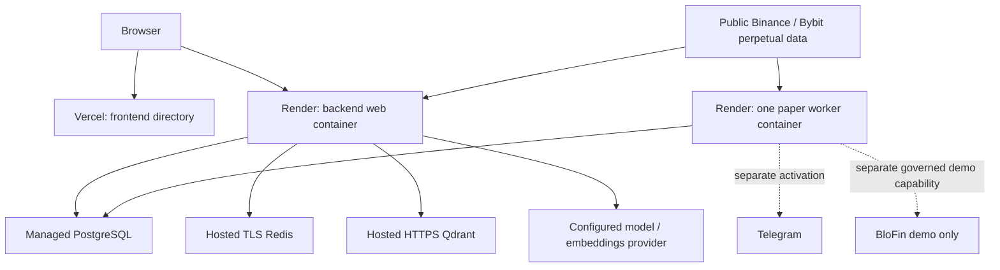

# Deployment and operational boundaries

This is the current entry point for hosting, release verification and rollback. It describes committed options in main `ff90d0c`, inspected October 6, 2026. It does not deploy or arm anything. [Current status](current_status.md) records supervisor-reported deployment separately from independently verified facts.

## Hosting design and current uncertainty

[render.yaml](../render.yaml) declares a Render web service and a single `alphatrade-paper-worker-staging` service in Frankfurt. The worker command is `python -m app.workers.paper_worker`, using the same backend image. The frontend hosting procedure uses Vercel with root directory `frontend`. PostgreSQL, Redis and Qdrant connection settings are supplied separately; this Blueprint does not provision their complete inventory.

This is a hosting design, not evidence that every box is active. Exact current URLs, active database/Redis/Qdrant hosts, deployed versions and release health were not rechecked here. Earlier Render/Vercel URLs in [staging history](staging_deployment.md) are historical locators and need current verification before use. [Railway notes](railway_deployment.md) describe an alternative, not a verified active deployment. No new Railway/Neon/Vercel resource was created.

## Defaults versus controlled activation

| Axis | Local Settings/Compose | Committed Render option | What deployment alone proves |
| --- | --- | --- | --- |
| Execution | Paper / internal; real trading false. | Paper / internal; real trading false. | No real-trading authority; it does not prove a working fill. |
| AI providers | Mock local option. | `PROVIDER_MODE=fallback`, configured OpenAI/Qdrant required by hosted policy. | The label `fallback` does not permit hosted silent mock substitution. |
| Canonical evidence | Settings replay default. | Binance USD-M with optional Bybit whole-source failover. | Configured source is not healthy/fresh acquired evidence. |
| Watcher/Telegram | Off. | Off/disarmed in committed worker template. | A supervisor may separately arm controlled staging; source defaults do not report current runtime flags. |
| BloFin demo | Off; internal paper default. | Separate explicit governed capability. | Internal paper/Telegram acceptance does not establish demo order acceptance. |
| Billing/metrics | Off by default. | Off by default. | Keys or optional flags are not evidence of live charging/scraping. |

The October 6 supervising session reports PR208/PR209 on API and worker and a real Nested/internal-paper/Telegram event. Fresh SFP recovery, existing Journal target repair and BloFin demo acceptance remain pending. Do not describe the whole MVP as accepted.

## Prepare a reviewable release

1. Pin API, worker and frontend to the intended reviewed commit. Inspect changes, dependency locks, database revision and safety requirements. Record the exact SHA; a main branch name is insufficient.
2. Use an isolated staging tenant and separately managed secrets. Verify hosted provider policy, strong JWT secret, TLS services, Redis denylist/rate limiting and exact CORS/cookie origins. Never copy a historical env table as observed truth.
3. Rehearse the current Alembic chain on disposable PostgreSQL. Read the migrations in the selected source; old release documents' head values are not the current head. Do not stamp over a mismatch or delete evidence to make migration/acceptance succeed.
4. Complete the checks appropriate to the release. Ordinary PR CI runs focused backend development checks; the full suite is an explicit `workflow_dispatch` with `full_backend=true`. Run complete acceptance on the intended SHA when required by the release plan. A docs-only PR does not need a backend suite.
5. Review rollback and any existing demo exposure before activation. Deployment, shared migrations and worker/external-channel arming are separate operational actions.

[Backend Dockerfile](../backend/Dockerfile) uses a frozen backend lock. The [entrypoint](../backend/docker/entrypoint.sh) applies migrations when starting the default API; supplied commands are executed directly, so the worker command does not also start Uvicorn or migrate. Render additionally declares `preDeployCommand: alembic upgrade head`. Check and coordinate those migration owners during an actual release rather than assuming the worker upgrades schema.

## Verify an authorized deployment

Record evidence date, exact service SHA/version, migration head and posture. Distinguish:

- `/health`: process liveness/build/safety metadata.
- `/health/ready` and `/providers/status`: dependency readiness and provider observations; liveness alone is insufficient.
- Authenticated `/watcher/paper-runtime/status` and `/watcher/watchlist/status`: runtime/slot evidence, not just configured flags.
- A genuine setup's canonical assessment/Candidate, risk/plan authorization, fill facts and Journal lineage.
- Telegram transport receipt when notifications are in scope; a queued row or preview is not delivery.
- Venue/protection/fill reconciliation when governed BloFin demo is in scope; acknowledgment alone is not a fill.

Use [monitoring](observability.md), [MVP readiness pack](mvp_release_readiness_001.md) and the specialist procedures below. Preserve bounded public evidence and redact sensitive identities/content. This documentation task ran no runtime probes.

## Specialist procedures and historical evidence

| Topic | Existing guide | How to use it |
| --- | --- | --- |
| Public perpetual evidence | [Live market activation](live_market_staging_activation.md) · [source contracts](market_source_contracts.md) | Check against the selected release; public reads do not arm execution. |
| Controlled Watcher/Telegram | [Controlled paper activation](controlled_paper_activation.md) · [Watcher](watcher_paper_activation.md) · [Telegram](telegram_paper_activation.md) | Explicitly gated operational procedures; not demo setup or current runtime facts. |
| SFP immutable recovery | [REST candle finalization/recovery](sfp_candle_finalization_recovery.md) | Preserve old receipts, verify new policy/clock and bounded fresh evaluation; acceptance remains pending. |
| Journal targets | [Plan target projection](journal_plan_target_repair.md) | New projection behavior and existing-row repair are different; old-row acceptance pending. |
| Demo exchange | [Governed BloFin demo](governed_blofin_demo_execution.md) | Separate read/trade permission, protection, ambiguous-dispatch and exposure rules. |
| Backups/rollback | [Backup inventory](backup_inventory.md) · [restore runbook](backup_restore_runbook.md) · [deployment rollback](deploy_rollback_runbook.md) | Earlier drill results apply to their date/base; do not assert current RPO/RTO without evidence. |

Historical staging worksheets, command packs and release acceptance records remain preserved. Verify their commit-specific values before executing commands. Never perform a database repair, migration, seed, channel activation or order as a side effect of a documentation/demo review.

## Rollback constraints

Pin a reviewed prior application version and verify schema compatibility before rolling back. Retain immutable evidence, source identities, plans and Journal facts. Disable new risk through the relevant authority; do not infer that disabling a worker closes existing demo positions. Ambiguous demo dispatch is reconciled by durable client identity, never blindly resent. Existing demo exposure may require separately authorized supervision at the demo venue.

[Setup](local_setup.md) · [Security](security.md) · [Evaluation](evaluation.md) · [Limitations](limitations_roadmap.md)
