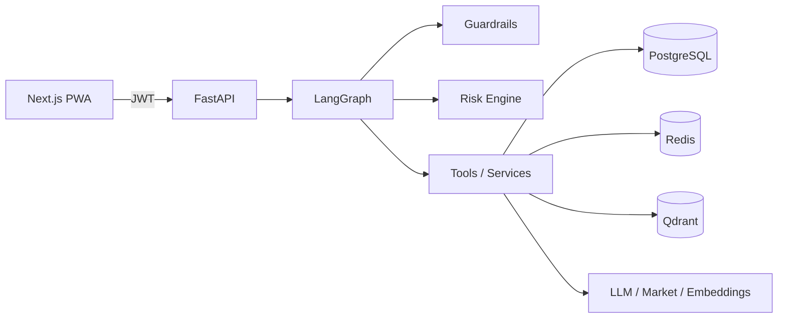

# AlphaTrade AI — Interview Package

Reference document for CVs, GitHub, LinkedIn, and technical interviews. Describes the system as built (paper MVP, Slices 1–28); not a marketing claim sheet.

---

## 1. One sentence product summary

AlphaTrade AI is a human-in-the-loop AI trading copilot for crypto markets that combines deterministic analysis, a rule-based risk engine, explicit approvals, and paper-only execution—never autonomous live trading.

---

## 2. Problem statement

Retail and semi-professional crypto traders often use fragmented tools: charts in one app, notes in another, and ad-hoc LLM chats that lack guardrails, audit trails, or enforceable risk policy. LLM outputs are persuasive but unreliable for sizing, stops, and execution. AlphaTrade addresses the gap between “AI chat about trading” and a **governed decision workflow**: structured proposals, mandatory risk checks, human approval, and simulated execution with full observability.

---

## 3. Target user

- **Primary:** Individual or small-team crypto traders who want decision support, not a black-box bot.
- **Secondary:** Technical evaluators (recruiters, hiring managers) assessing AI platform engineering, safety design, and full-stack delivery.
- **Not targeted in MVP:** Institutions requiring licensed brokerage, HFT, or unattended auto-trading.

---

## 4. Why this project matters

The project demonstrates production-minded AI engineering: orchestrated agents with deterministic authority layers, tenant isolation, auditability, quota metering, and safe defaults (paper-only, real trading off). It shows how to **separate narrative from decisions**—a pattern applicable to finance, healthcare, and other regulated-adjacent domains where LLMs assist but must not be the source of truth for high-impact actions.

---

## 5. Main features

| Area | Capability |
|------|------------|
| AI Workspace | LangGraph agent: guardrails → RAG → market data → strategies → risk → approval decision → structured response |
| Risk engine | 15 deterministic rules; `BLOCK` is final over proposals and paper execution |
| Human approval | Approve / reject / modify / needs more analysis before paper orders |
| Paper execution | Simulated fills and positions; idempotency and audit events |
| Market data | Read-only Binance public REST or mock; provenance labels (`is_live`, `fallback_used`) |
| RAG knowledge | Playbooks, policies, journal lessons—not trading signals |
| Journal → RAG | Trade reviews auto-sync to knowledge when enabled |
| Auth & tenancy | JWT, refresh rotation, RBAC (OWNER / TRADER / VIEWER), org scoping |
| Usage & quotas | Per-org metering, soft warnings, hard blocks |
| Billing scaffold | Stripe placeholder; disabled by default; no live charges in MVP |
| Observability | Structured logs, request IDs, audit API, provider status dashboard |
| Frontend PWA | Next.js 15: dashboard, workspace, market, proposals, approvals, journal, knowledge, usage, audit |

---

## 6. Architecture overview

Modular monolith: **FastAPI** composition root, **LangGraph** for agent orchestration, **PostgreSQL** for workflow and auth persistence, **Redis** for rate limits and token denylist, **Qdrant** (optional) for vectors, **Next.js** PWA client.

Provider abstractions (`backend/src/app/providers/`) isolate external dependencies with mock-first defaults and runtime fallbacks. Agent nodes call **services**, not raw exchange APIs.

Deep dive: [architecture.md](architecture.md)

---

## 7. AI architecture

| Layer | Role |
|-------|------|
| **Orchestration** | LangGraph state machine in `agents/nodes.py` |
| **Deterministic core** | Strategy modules, risk engine, structured `TradingAnalysisDetail` |
| **Optional LLM** | Narrative polish only; schema-validated; cannot change risk or approval |
| **RAG** | Context retrieval for rules and journal lessons via `RagService` |
| **Guardrails** | Injection, moderation, trading language policy before and after LLM |
| **Validation** | Pydantic schemas; output validation node; fallback narrative on failure |

Design principle: **LLM explains; code decides.**

---

## 8. LangGraph workflow

Typical path for a trade-related chat:

1. Auth and quota checks  
2. Guardrails (input policy)  
3. RAG retrieval (filtered, tenant-scoped)  
4. Market data tools (read-only provider)  
5. Strategy evaluation (seven MVP setups, Python)  
6. Risk engine (aggregate rules → allow / warn / block)  
7. Approval decision (create approval record when required)  
8. Structured response builder (source of truth)  
9. Optional narrative enhancement (LLM, validated)  
10. Persist proposal, audit, usage events  

Paper execution is **outside** the graph hot path: user approves, then `POST /execution/paper` via `ExecutionService`.

Details: [agent_workflow.md](agent_workflow.md)

---

## 9. RAG design

- **Purpose:** Rules, playbooks, risk policy text, and **journal lessons**—never order instructions or live signals.  
- **Ingestion:** Chunk → embed → Postgres metadata + vector upsert.  
- **Embeddings:** Mock (deterministic 384-d) or OpenAI when configured.  
- **Vector store:** In-memory (tests/dev) or Qdrant collection `alphatrade_knowledge`.  
- **Retrieval:** Metadata filters (org, source type, symbol, timeframe, tags); citations in chat and `analysis.evidence`.  
- **Journal loop:** `JournalRagSyncService` ingests on create/update with sanitized text and stable URI `journal://{id}`.  
- **Agent entry:** Single tool path—`rag_retriever`—no direct vector DB access from the graph.

Details: [rag_system.md](rag_system.md)

---

## 10. Risk engine design

- **Implementation:** Pure functions in `services/risk/rules.py`; orchestrated by `RiskEngine`.  
- **Rule count:** 15 rules with stable `RiskRuleId` enums (kill switch, no stop-loss, leverage caps, daily loss, weekend trading, overtrading, etc.).  
- **Actions:** `ALLOW`, `WARN`, `BLOCK`—`BLOCK` stops paper execution even if a proposal exists.  
- **Context:** `RiskEvaluationContext` supplies runtime flags (kill switch, PnL today, trade count).  
- **Authority:** Risk runs **after** strategies and **before** approval/execution; LLM cannot override.  
- **Persistence:** Risk events auditable; results attached to proposals.

---

## 11. Human approval workflow

1. Agent or API creates a **trade proposal** with entry, stops, targets, and risk result.  
2. When policy requires it, an **approval** record is created (low confidence, execute intent, risk flags).  
3. TRADER+ users: approve for paper, reject, request more analysis, or modify.  
4. Only **approved** approvals unlock `POST /execution/paper`.  
5. Rejected, needs_more_analysis, or modified states block execution until re-approved.  
6. Workflow APIs: `GET /proposals/{id}/workflow`, `GET /approvals/{id}/workflow` for UI transparency.

---

## 12. Guardrails and safety

| Control | Behavior |
|---------|----------|
| `EXECUTION_MODE=paper` | Only simulated execution |
| `ENABLE_REAL_TRADING=false` | Hard kill switch; startup validation in staging/prod |
| Guardrail nodes | Block injection, unsafe trading language, execution claims |
| Narrative validator | LLM text cannot alter risk level, approval status, or execution state |
| Market data labeling | Mock never presented as live |
| RBAC | VIEWER cannot approve or place paper orders |
| Rate limiting | Redis or in-memory fallback |
| Secrets | Redaction in logs and audit metadata |

Details: [security.md](security.md)

---

## 13. Paper execution model

- **Provider:** `mock-exchange` only in MVP; no Binance order API.  
- **Gate:** `ExecutionService.place_paper_order` checks real-trading flag, approval status, risk not `BLOCK`, idempotency key.  
- **Artifacts:** Paper order + paper position in Postgres; audit `paper_order_created`.  
- **UI:** Clear “simulated” messaging; dashboard paper banner.  
- **Real trading:** Requires explicit config not enabled in this release; exchange adapter (Slice 28) remains approval-gated and off by default.

---

## 14. Observability and audit

- **Logs:** structlog; optional JSON; `request_id` / `trace_id` context; token redaction.  
- **Health:** `/health` exposes execution mode; `/health/ready` checks providers.  
- **Audit API:** `GET /audit/events`—auth, guardrails, approvals, paper orders, quota blocks, refresh reuse.  
- **Usage API:** `GET /usage/summary`, events with `cost_source` labeling.  
- **Provider transparency:** `GET /providers/status` for mock/fallback/live posture.  
- **Evaluation harness:** Offline scripts for agent, RAG, guardrails regression.

Details: [observability.md](observability.md) · [evaluation.md](evaluation.md)

---

## 15. Usage and quota system

- **Metering:** `usage_events` per organization—tokens, latency, provider, `fallback_used`, `cost_source`.  
- **Features metered:** `agent_chat`, `agent_narrative`, `rag_ingest`, `market_analyze`, paper execution, etc.  
- **Quotas:** Monthly tokens/cost, daily requests, per-feature caps; soft warning (~80%) vs hard block (429).  
- **Plans:** `free` / `pro` / `team` map to quotas via billing scaffold (Slice 26).  
- **Billing-grade costs:** Only `provider_reported`—estimates labeled otherwise.

Details: [usage_and_billing.md](usage_and_billing.md)

---

## 16. Frontend overview

- **Stack:** Next.js 15, TypeScript, Tailwind, Vitest, Playwright.  
- **Auth:** Bearer (local) or httpOnly refresh cookie + short access JWT (Docker/staging).  
- **Key routes:** `/`, `/workspace`, `/market`, `/proposals`, `/approvals`, `/positions`, `/journal`, `/knowledge`, `/usage`, `/audit`, `/billing`, account flows.  
- **UX patterns:** Separate “Deterministic analysis” vs “Narrative explanation”; provider status cards; paper mode banners.  
- **Testing:** Unit tests + E2E API workflow in CI; optional full browser tour locally.

---

## 17. Deployment readiness

- **Docker Compose:** Full local demo (Postgres, Redis, Qdrant, migrations, cookie auth).  
- **Cloud path:** Vercel (frontend) + Render (backend) + managed Postgres/Redis + Qdrant Cloud—documented in [deployment.md](deployment.md).  
- **Staging validation:** Startup checks for JWT length, HTTPS cookies, paper-only trading.  
- **CI:** GitHub Actions—lint, pytest, frontend build, evaluation harness, optional E2E smoke.  
- **Checklists:** [staging_deployment_checklist.md](staging_deployment_checklist.md) · [security_checklist.md](security_checklist.md)

Slice 28 (staging/deployment hardening) is complete; production Stripe and live exchange remain future work.

---

## 18. Key technical tradeoffs

| Choice | Tradeoff |
|--------|----------|
| Deterministic risk vs LLM risk | Predictable, auditable rules; less “flexible” than pure LLM |
| LangGraph vs single prompt | More boilerplate; explicit stages and test hooks |
| Mock-first providers | Fast CI and offline dev; must label live vs mock clearly |
| Paper-only MVP | Safe portfolio demo; not a trading performance proof |
| Separate narrative layer | Extra latency/cost; protects decision integrity |
| Monolith API | Simpler ops for solo/small team; not microservices |
| 384-d mock embeddings | Easy tests; re-index when switching to OpenAI embeddings |

---

## 19. What is intentionally out of scope

- Live exchange or broker order placement (disabled and not wired for MVP demos)  
- Unattended auto-trading without human approval  
- Live Stripe charges by default (`BILLING_ENABLED=false`)  
- LLM-generated trading signals or position sizing as authority  
- LangSmith / full OpenTelemetry production APM (placeholders documented)  
- Native mobile apps (responsive PWA only)  
- Institutional compliance certification  

---

## 20. Future roadmap

| Priority | Slice | Focus |
|----------|-------|--------|
| 1 | 27B | Production Stripe (Checkout, Portal, entitlements) |
| 2 | Exchange adapter (post-MVP) | Optional integration; still approval-gated; compliance review |
| 3 | 29B+ | LangSmith traces, scaled LLM-judge evaluation |
| 4 | Ops | OpenTelemetry, alerting, multi-region |

Current slice **29A** adds portfolio and interview packaging only—no product features.

Full limitations: [limitations_roadmap.md](limitations_roadmap.md)

---

## Related interview assets

- [interview_pitch.md](interview_pitch.md) — timed pitches and demo script  
- [cv_project_entry.md](cv_project_entry.md) — CV and LinkedIn bullets  
- [linkedin_project_post.md](linkedin_project_post.md) — social posts  
- [technical_qa.md](technical_qa.md) — stack and design Q&A  
- [demo_script.md](demo_script.md) — 15-minute live demo  
