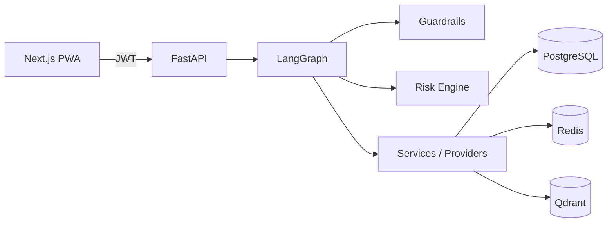

# AlphaTrade AI — Portfolio Positioning

Short reference for reviewers, recruiters, and technical interviews. Describes the system as built (paper MVP through Slice 55).

---

## Problem

Crypto traders often split workflow across charts, notes, and unconstrained LLM chats. LLM outputs are persuasive but unreliable for sizing, stops, and execution. There is no enforced path from idea → risk check → human approval → auditable outcome.

---

## Solution

AlphaTrade AI is a **human-in-the-loop trading copilot** that combines:

- Structured strategy cards and deterministic setup detection
- A 15-rule risk engine where `BLOCK` is final authority
- Explicit approve / reject / modify workflow before paper simulation
- LangGraph agent with guardrails, RAG context, and schema-validated responses
- Full audit trail, tenant isolation, and usage quotas

Real exchange execution is **disabled and not wired** in this release.

---

## Architecture

Modular monolith: **FastAPI** API, **LangGraph** agent, **PostgreSQL** persistence, **Redis** rate limits, **Qdrant** (optional) vectors, **Next.js 15** PWA.

Live staging: Vercel frontend + Render API + Render Postgres + Upstash Redis.

Details: [architecture.md](architecture.md)

---

## AI engineering patterns

| Pattern | Implementation |
|---------|----------------|
| **LLM explains; code decides** | Deterministic analysis and risk run before optional narrative |
| **Guardrails** | Input/output policy; injection and unsafe trading language blocked |
| **Structured outputs** | Pydantic schemas; narrative cannot alter risk or approval state |
| **RAG for policy, not signals** | Playbooks, policies, journal lessons — never order instructions |
| **Tool-gated mutations** | Settings changes require explicit user confirmation in chat |
| **Evaluation harness** | Offline agent, RAG, and guardrail regression scripts |

Details: [agent_workflow.md](agent_workflow.md) · [rag_system.md](rag_system.md)

---

## Safety and guardrails

- `EXECUTION_MODE=paper`, `ENABLE_REAL_TRADING=false` — enforced at startup on staging/production
- No broker or exchange order APIs in MVP
- External notifications (Telegram, webhook) **disabled by default**
- Demo seed endpoint owner-only; blocked in production
- RBAC: VIEWER cannot approve or place paper orders
- Provider status and health endpoints do not expose connection secrets (Redis URL sanitized)

Details: [security.md](security.md)

---

## Trading discipline focus

The product optimizes for **process over prediction**:

- Daily discipline snapshot (trades today, paper PnL, loss/green-day states)
- Configurable risk settings per tenant
- Paper validation runtime with conservative eligibility gates
- Lesson review workflow — pending vs accepted before RAG promotion
- Deterministic discipline score (not LLM-generated)

Details: [risk_management.md](risk_management.md) · [paper_validation.md](paper_validation.md)

---

## What I would improve next

| Priority | Focus |
|----------|--------|
| 1 | **Qdrant Cloud on staging** — restore persistent vector store; remove in-memory RAG fallback |
| 2 | **Production Stripe** — Checkout, Portal, entitlements (scaffold exists) |
| 3 | **LangSmith / OTel** — trace agent runs and provider latency in production |
| 4 | **Scaled LLM evaluation** — expand harness with LLM-judge and regression suites |
| 5 | **Exchange adapter (post-MVP)** — optional integration, still approval-gated and compliance-reviewed |

Current staging limitations: [staging_deployment.md](staging_deployment.md) · [limitations_roadmap.md](limitations_roadmap.md)

---

## Live demo

| | |
|---|---|
| App | https://alpha-trade-ai-eight.vercel.app |
| Demo user | `demo@alphatrade.ai` |
| Walkthrough | [demo_script.md](demo_script.md) |
| Screenshots | [screenshots_checklist.md](screenshots_checklist.md) |
