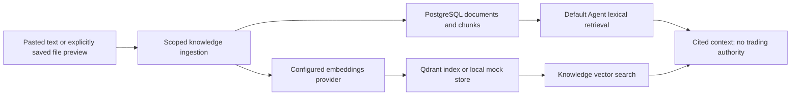

# Knowledge retrieval, memory and learning

Retrieval brings recorded playbooks, policies and lessons into a conversation with source references. It does not turn a document into market truth or an execution instruction. This guide reflects main `ff90d0c`, inspected October 6, 2026; [current status](current_status.md) records runtime unknowns.

## Two implemented retrieval paths

| Path | How it works | Important limit |
| --- | --- | --- |
| Knowledge service / legacy graph RAG | [RagService](../backend/src/app/services/rag_service.py) chunks and embeds content, stores SQL document/chunk rows and indexes/searches vector points with scoped metadata. | Provider/indexing observation and citation are not proof that the content is correct. |
| Current `/agent/turns` | [Interactive retrieval](../backend/src/app/interactive_agent/retrieval.py) searches existing SQL documents/chunks lexically, scanning at most 200 chunks and returning five hits by default. | Qdrant is not queried unless a vector retriever is injected. A configured Qdrant service does not imply vector retrieval on every Agent turn. |

Optional vector hits are reloaded from organization/user-scoped SQL chunks/documents before presentation. Organization-shared and user-owned content have different visibility. The [knowledge context builder](../backend/src/app/interactive_agent/knowledge_context.py) carries titles, source labels, chunk references and limitations into bounded model context. Stored guidance remains reference data; current strategy approval/risk settings need canonical application evidence.

## Storage and provider options

| Option | Inspected default/policy |
| --- | --- |
| Local mock embeddings | Deterministic hash vectors; auto dimensions 384. Suitable for development, not evidence of semantic model quality. |
| Configured OpenAI embeddings | `text-embedding-3-small` by default; auto native dimensions 1536. `EMBEDDINGS_DIMENSIONS` can explicitly set supported dimensions. |
| Vector collection | `alphatrade_knowledge`; dimensions must match the selected embedding contract. |
| Local vector store | Process-memory option; content/index persistence and replica consistency differ from Qdrant. |
| Hosted policy | Staging/production require authoritative Qdrant and configured OpenAI; silent mock/in-memory substitutes are prohibited. |

Sources: [dimension resolution](../backend/src/app/providers/embedding_dimensions.py), [provider factory](../backend/src/app/providers/factory.py), [provider policy](../backend/src/app/core/provider_policy.py), [Qdrant adapter](../backend/src/app/providers/qdrant.py). Model/collection choices in configuration are not fresh deployed observations. A mismatch or outage must be reported as unavailable under hosted policy, not hidden as healthy retrieval.

Ingestion records SQL chunk count, vector backend, upsert acknowledgment, fallback flag and observation time. That is the last recorded indexing result, not a continuous health guarantee. Vector failure rolls back SQL ingestion; a subsequent SQL commit failure can leave orphan vector points because the two stores are not a distributed transaction. Retrieval will not expose those points without matching scoped SQL records. Changing embedding dimensions requires an explicitly reviewed reindex/restore plan; do not delete a shared collection as demo preparation.

## File import and source provenance

[Knowledge file preview/import](knowledge_file_import.md) supports UTF-8 (optional BOM) or BOM-marked UTF-16 text, Markdown, DOCX body/table text and selectable-text PDF. Preview saves/indexes nothing. Explicit save validates the exact preview receipt and parses within resource bounds. The stored result contains extracted text, chunks and file provenance; raw binaries and preview receipts are not persisted. Scanned images have no OCR support.

Source type, filename, document/chunk IDs and provenance help a reader locate evidence. A search similarity score is a retrieval ranking, not a truth/confidence score or trading signal.

## Journal and learning memory

[JournalRagSyncService](../backend/src/app/services/journal_rag_sync_service.py) can sync legacy Journal entries as `trade_journal`, using stable references and sanitization. `JOURNAL_RAG_SYNC_ENABLED` defaults true. This does not mean every canonical Journal trade, analytics summary or learning event is automatically embedded; each integration has its own authority and wiring.

Canonical Journal and learning attribution preserve trade/strategy/version lineage and separate planned quality, execution, risk adherence, behavior and outcome. [Learning persistence](phase8_learning_persistence.md) and [governed promotion](governed_learning_promotion_001_handoff.md) describe those boundaries on their stated implementation bases. Facts, user observations, inference and suggestions remain distinguishable. Narrative is not a fact hash.

The current Agent can read recorded learning status and draft supported changes. Promotion requires exact baseline/candidate validation, recorded paper evidence and explicit human approval; conversation confirmation cannot bypass those gates. This is stored context and governed adaptation, not online model training, autonomous self-improvement or proven behavior change.

## Verify a retrieval claim

For a separately authorized test/demo, use disposable content with a distinctive phrase. Establish its SQL record and ownership, recorded index observation and retrieved citation, then test wrong-tenant/user exclusion. Check the route's actual retrieval mode and provider status. Do not infer retrieval success from “Qdrant configured,” from a document count, or from a generic model reply.

The [evaluation guide](evaluation.md) distinguishes mock regressions, integration checks and runtime acceptance. No document import, collection recreation or live provider call was performed for this documentation change.
