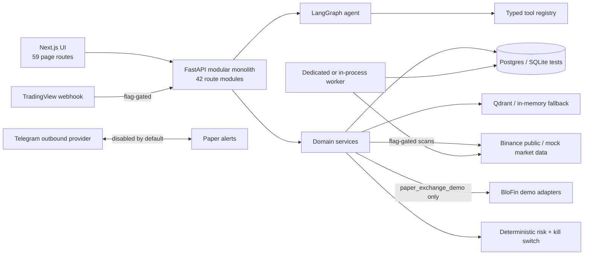

# AlphaTrade Agentic Redesign — Phase 0 Current-State Audit

**Audit base:** `main@c0bd1d4d9c49948c44e7e23dc2a2572ea68a4a20`
**Final alignment base:** `main@549e42a42fb16765ec0947ef3ba08550459dd1f5`
**Audit scope:** repository evidence only; architecture/documentation only
**Safety boundary:** paper/internal simulation or BloFin demo only; real-money execution remains
disabled
**Final review inputs:** PR #66 at `4c4a66b`; PR #67 at `a13c60c`; PR #69 at
`25d4f8d9ae3dd00261a7eaafed9904a67c9b7a5f`; PR #68 at
`e050d743837c75694044a1fd6808315b7aca605f`; PR #72 at
`c743f886b6219896cafa1a892931ce06d7744fac`
**Canonical correction status:** all final and re-review HIGH findings are represented and
resolved in the target contract; no runtime implementation is claimed

## 1. Executive assessment

AlphaTrade is not an empty scaffold and should not be rewritten. It already has a broad,
well-tested paper-trading platform: typed FastAPI APIs, many tenant-scoped domain repositories,
a LangGraph agent, public Binance market data with provenance, deterministic analysis and risk,
strategy cards and versions, paper-validation workflows, alerts, approval records, internal
paper execution, a guarded BloFin demo adapter, canonical journal trades, analytics, RAG, a
worker, and a large Next.js UI. Persistence is not uniformly tenant-safe: current paper-order
replay is globally keyed and can resolve before tenant validation, as detailed in sections 17,
18 and 21.

The present system is nevertheless page- and workflow-oriented rather than agent-first. Its
capabilities are split across 59 Next.js page routes and 42 FastAPI route modules. The
background and external-integration paths are implemented behind flags but disabled in the
checked-in staging blueprint. There is no common evidence contract or deterministic
multi-source fusion lifecycle. CVD is missing; true order-flow evidence is missing; Telegram is
outbound-only; and BloFin synchronization is a read-only snapshot rather than authoritative
order/position/PnL reconciliation.

The current agent has a concrete routing defect for the target product. Keyword classification
maps words such as `analyze`, `setup`, and `entry` to `PLAN_TRADE`; that route traverses
`trade_proposal_generation`, whose own guard permits `PLAN_TRADE` and `EXECUTE`. Thus analytical
phrasing containing those terms can create an in-memory proposal and enter risk/approval
handling. This is not universal to every message classified `ANALYSIS_REQUEST`: for example,
the `btc`/`eth` message-class keywords alone do not force `PLAN_TRADE`. The persistence service
also restricts stored proposals to `PLAN_TRADE` and `EXECUTE`, but that does not repair the
semantic error because common analysis phrasing is itself classified as planning. Evidence:

- `backend/src/app/agents/nodes.py` (`message_classification`, `intent_classification`)
- `backend/src/app/agents/routing.py` (`route_after_intent`)
- `backend/src/app/agents/graph.py` (unconditional
  `strategy_module_execution -> trade_proposal_generation`)
- `backend/src/app/services/proposal_service.py` (`create_from_agent`)

### Verdict and reuse estimate

| Area | Assessment |
|---|---|
| Current architecture | Capable modular monolith with extensive paper workflow, but fragmented UX and no unified evidence/fusion/event lifecycle |
| Backend reuse | **Approximately 78%** capability-weighted for the target vertical slice |
| Frontend reuse | **Approximately 60%** component/API-client reuse; route-level information architecture needs substantial consolidation |
| Rewrite recommendation | **No rewrite.** Reuse, wrap, extend, merge, and hide |
| Safety | Strong defense-in-depth for paper-only operation; preserve existing authorities rather than recreating them |
| Principal gaps | Explicit intent/operation policy, normalized evidence, fusion lifecycle, CVD, true order flow, conversational watcher subscriptions, inbound Telegram actions, reliable execution/reconciliation state machine |

The estimates are architecture estimates, not measured code coverage. Backend reuse counts
existing domain responsibilities that can remain authoritative, even when adapters must be
added. Frontend reuse counts components and API clients, not retention of all 59 routes as
primary destinations.

## 2. Current-state architecture

The composition root in `backend/src/app/main.py` builds provider, strategy, and tool
registries, mounts all routers, and optionally starts an in-process worker. `AgentRuntime` in
`backend/src/app/agents/runtime.py` exposes services and tools rather than raw database access.
SQLAlchemy models are centralized in `backend/src/app/db/models.py`; repositories provide
domain-specific persistence. External boundaries use provider protocols under
`backend/src/app/providers/`.

The main architectural duplication is workflow representation. Similar concepts appear as
watcher candidates, setup detections, TradingView signals, paper-validation drafts/candidates,
paper signals, orchestration decisions, strategy signals, trade proposals, and alerts. Each is
useful in its context, but there is no shared evidence identity, lineage, freshness, or fusion
state.

## 3. Current frontend route inventory

“Current usage” means reachability in the checked-in application, not production traffic.
Primary/secondary navigation is defined by
`frontend/src/components/layout/navigation-config.ts`. Dynamic detail routes are reached from
their parent lists. Some compatibility routes re-export a page; others redirect through
`frontend/next.config.ts` and `frontend/src/lib/navigation/phase-b-redirects.ts`. Backend
dependencies are the route families used through `frontend/src/lib/api/index.ts`.

| Route | Purpose and important components | Backend dependencies | Current usage | Target disposition |
|---|---|---|---|---|
| `/` | Dashboard, discipline, attention queue; `TodaysDisciplineCard`, workflow adapters | `/dashboard`, `/risk`, workflow summaries | Primary nav | MERGE INTO AGENT |
| `/workspace` | Agent/plan workspace; `TradingAnalysisPanel`, `NarrativePanel`, plan summary, large message/symbol/timeframe form | `/chat`, `/proposals`, `/approvals`, `/risk` | Primary “Plan” nav | KEEP PRIMARY |
| `/tradingview-signals` | TradingView inbox and candidate action; `SignalsInbox` | `/tradingview`, `/paper-signal-orchestration` | Primary “Signals” nav | MERGE INTO LIVE WATCHER |
| `/paper-validation` | Validation hub/pipeline and attention queue | `/paper-validation` families | Primary “Validate” nav | KEEP SECONDARY |
| `/journal` | Journal hub, quick entry, needs-journaling queue | `/journal`, `/positions` | Primary “Journal” nav | KEEP PRIMARY |
| `/analytics` | Combined performance/setup/discipline/validation charts | `/analytics`, `/performance`, `/journal`, `/learning-analytics` | Primary “Analytics” nav | MERGE INTO TRADES & JOURNAL |
| `/portfolio` | Paper account, open/closed positions, exposure/history | `/performance`, `/positions`, `/journal`, `/dashboard` | Primary “Portfolio” nav | MERGE INTO TRADES & JOURNAL |
| `/settings` | Paper banner, safety disclaimers, notification preferences | `/providers`, `/notifications`, auth account state | Primary “Settings” nav | KEEP PRIMARY |
| `/proposals` | Proposal list/detail and kill switch | `/proposals`, `/risk` | Plan secondary nav | MERGE INTO AGENT |
| `/approvals` | Approval decisions/detail and kill switch | `/approvals`, `/proposals`, `/risk` | Plan secondary nav | MERGE INTO AGENT |
| `/pre-trade` | Large manual pre-trade and sizing form; `LossAcceptancePanel` | `/pretrade`, `/risk/size`, `/risk/loss-acceptance` | Plan secondary nav | MERGE INTO AGENT |
| `/manual-levels` | CRUD form for chart levels | `/manual-levels` | Plan secondary nav | MERGE INTO AGENT |
| `/strategy-lab` | Strategy library list | `/strategies` | Plan secondary nav | KEEP SECONDARY |
| `/strategy-lab/new` | Large `StrategyCardForm` | `/strategies` | Linked from strategy list | MERGE INTO AGENT |
| `/strategy-lab/[id]` | Strategy versions, structured rules, backtests, paper validation | `/strategies`, `/backtests`, `/paper-validation` | Dynamic detail | KEEP SECONDARY |
| `/strategy-lab/[id]/edit` | Large `StrategyCardForm` | `/strategies` | Dynamic edit | MERGE INTO AGENT |
| `/alerts` | In-app alerts, routing, Telegram test/manual delivery and auto-delivery preview | `/alerts`, `/notifications` | Signals secondary nav | MERGE INTO LIVE WATCHER |
| `/alerts/review` | Review scanner alerts and create drafts | `/alerts/setup-review`, `/paper-validation/drafts` | Signals secondary nav | MERGE INTO LIVE WATCHER |
| `/watcher` | Manual scanner and recent scans; `MarketWatcherScannerCard` | `/market-watcher/scan`, `/market-watcher/scans/recent` | Signals secondary nav | MERGE INTO LIVE WATCHER |
| `/market-watcher` | Legacy watcher status/history/bridge controls | `/market-watcher` | Signals secondary nav | MERGE INTO LIVE WATCHER |
| `/market` | Manual ticker/OHLCV/analyze form | `/market` | Signals secondary nav | MERGE INTO LIVE WATCHER |
| `/watchlist` | Watchlist CRUD form and kill switch | `/market/watchlist`, `/risk` | Signals secondary nav | MERGE INTO LIVE WATCHER |
| `/paper-signal-orchestration` | Advanced decisions and explicit paper-proposal action | `/paper-signal-orchestration` | Advanced signals nav | HIDE |
| `/paper-validation/drafts` | Validation draft list | `/paper-validation/drafts` | Validate secondary nav | KEEP SECONDARY |
| `/paper-validation/drafts/[draftId]` | Draft prep/checklist form | `/paper-validation/drafts/{id}` | Dynamic detail | MERGE INTO AGENT |
| `/paper-validation/candidates` | Candidate queue | `/paper-validation/candidates`, run plans | Validate secondary nav | KEEP SECONDARY |
| `/paper-validation/candidates/[candidateId]` | Candidate detail/status/plan action | `/paper-validation/candidates/{id}` | Dynamic detail | KEEP SECONDARY |
| `/paper-validation/run-plans` | Run-plan list | `/paper-validation/run-plans` | Validate secondary nav | KEEP SECONDARY |
| `/paper-validation/run-plans/[planId]` | Run-plan edit/start form | `/paper-validation/run-plans/{id}` | Dynamic detail | KEEP SECONDARY |
| `/paper-validation/run-sessions` | Manual validation sessions | `/paper-validation/run-sessions` | Validate secondary nav | KEEP SECONDARY |
| `/paper-validation/run-sessions/[sessionId]` | Observation and outcome recording | `/paper-validation/run-sessions/{id}` | Dynamic detail | KEEP SECONDARY |
| `/validation-priority` | Ranked validation work queue | `/validation-priority` | Validate secondary nav | KEEP SECONDARY |
| `/research-validation` | Evidence promotion workflow | `/research-validation`, `/backtests` | Advanced validate nav | HIDE |
| `/backtests/[id]` | Backtest result, verification, journal comparison/promotion | `/backtests`, `/research-validation`, `/journal` | Dynamic from strategy | KEEP SECONDARY |
| `/journal/import` | Large bulk import mapping/preview form | `/journal/trades/import`, `/journal/imports` | Journal secondary nav | KEEP SECONDARY |
| `/journal/statistics` | Journal aggregates and filters | `/journal/statistics` | Analytics secondary nav | MERGE INTO TRADES & JOURNAL |
| `/journal/comparison` | Human-versus-system comparison form | `/journal/comparison`, `/human-vs-system` | Analytics secondary nav | MERGE INTO TRADES & JOURNAL |
| `/lessons` | Lesson review/accept/reject and proposed rules | `/lessons` | Journal secondary nav | MERGE INTO TRADES & JOURNAL |
| `/knowledge` | RAG documents/chunks/search | `/knowledge` | Journal secondary nav | KEEP SECONDARY |
| `/learning-analytics` | Outcome, behavior, confidence and setup analytics | `/learning-analytics` | Analytics secondary nav | MERGE INTO TRADES & JOURNAL |
| `/coaching` | Coaching prompts/explanations | `/coaching` | Analytics secondary nav | MERGE INTO AGENT |
| `/strategy-quality` | Detector quality summaries/explanations | `/strategy-quality` | Analytics secondary nav | KEEP SECONDARY |
| `/positions` | Position list, stop/TP edit, paper close | `/positions`, `/risk` | Portfolio secondary nav | MERGE INTO TRADES & JOURNAL |
| `/risk` | Risk-setting form and kill switch | `/risk` | Portfolio secondary nav | MERGE INTO SAFETY & SETTINGS |
| `/settings/billing` | Combined billing and usage views | `/billing`, `/usage` | Settings secondary nav | KEEP SECONDARY |
| `/settings/team` | Alias for team/invitation view | `/organizations/invitations` | Settings secondary nav | KEEP SECONDARY |
| `/settings/audit` | Alias for audit view | `/audit/events` | Advanced settings nav | MERGE INTO SAFETY & SETTINGS |
| `/settings/exchange` | Alias for exchange diagnostics | `/exchange` | Advanced settings nav | MERGE INTO SAFETY & SETTINGS |
| `/settings/usage` | Client redirect shim to billing/usage | `/usage` | Compatibility route | DEPRECATE |
| `/billing` | Redirect shim to `/settings/billing` | `/billing` | Compatibility route, not main nav | DEPRECATE |
| `/usage` | Redirect shim to `/settings/billing` | `/usage` | Compatibility route, not main nav | DEPRECATE |
| `/audit` | Standalone audit list | `/audit/events` | Compatibility route | DEPRECATE |
| `/exchange` | Standalone BloFin sync/diagnostics | `/exchange` | Compatibility route | DEPRECATE |
| `/invitations` | Invitation management form | `/organizations/invitations` | Compatibility/deep link | DEPRECATE |
| `/login` | Authentication login | `/auth/login`, `/auth/me` through auth provider | Public route | KEEP SECONDARY |
| `/register` | Account registration | `/auth/register` | Public route | KEEP SECONDARY |
| `/forgot-password` | Password-reset request | `/auth/password-reset/request` | Public route | KEEP SECONDARY |
| `/reset-password` | Password-reset confirmation | `/auth/password-reset/confirm` | Public route | KEEP SECONDARY |
| `/verify-email` | Email verification | `/auth/verify-email/confirm` | Public/deep-link route | KEEP SECONDARY |

No route should be deleted in Phase 0. The strongest form-to-agent conversion candidates are
`/pre-trade`, `/manual-levels`, strategy create/edit, draft prep, run-plan edit,
`/journal/import`, `/journal/comparison`, `/risk`, `/market`, and `/watchlist`. The target agent
must call the same typed APIs/tools and show a reviewable structured preview; conversational UX
must not bypass validation or confirmation.

## 4. Current backend service inventory

### API surface

All route modules are mounted in `backend/src/app/main.py`.

| Route modules | Responsibility | Disposition |
|---|---|---|
| `api/routes/auth.py`, `organizations.py` | Auth, account, organization invitations | KEEP |
| `chat.py`, `tools.py` | Agent entry point and tool inspection/execution | MODIFY |
| `market.py`, `market_watcher.py`, `tradingview.py` | Market reads/history/watchlist, watcher, TradingView intake | MODIFY |
| `paper_signal_orchestration.py`, `paper_validation.py`, `research_validation.py`, `validation_priority.py` | Candidate and validation workflows | MERGE behind evidence/candidate lifecycle; keep APIs during migration |
| `strategy_library.py`, `strategy_modules.py`, `strategy_quality.py`, `backtests.py`, `manual_levels.py`, `pretrade.py` | Strategy versions, deterministic modules, tests and planning | MODIFY |
| `proposals.py`, `approvals.py`, `execution.py`, `positions.py`, `exchange.py` | Human-approved paper execution and position/exchange state | MODIFY |
| `risk.py` | Risk settings, sizing, kill switch and checks | KEEP |
| `alerts.py`, `notifications.py` | In-app/external alert lifecycle and preferences | MODIFY |
| `journal.py`, `human_vs_system.py`, `lessons.py`, `analytics.py`, `learning_analytics.py`, `coaching.py`, `performance.py`, `knowledge.py` | Journal, analytics, lessons and RAG | MODIFY/MERGE at orchestration and UI, not domain authority |
| `providers.py`, `health.py`, `metrics.py`, `worker.py`, `audit.py`, `usage.py` | Operations, telemetry and audit | KEEP |
| `billing.py`, `demo.py`, `dashboard.py` | Billing scaffold, demo seed, page summary | KEEP SECONDARY |

### Domain component families

| Major component | Exact repository paths | Current state | Disposition |
|---|---|---|---|
| Agent graph/state/routing | `backend/src/app/agents/graph.py`, `nodes.py`, `routing.py`, `runtime.py`; `schemas/agent.py` | Operational request graph, but intent semantics conflate analysis and planning | MODIFY |
| Tool boundary | `backend/src/app/tools/base.py`, `tools/registry.py` | Operational registry; some tools are stubs and mutation metadata is inconsistent | MODIFY |
| Provider abstraction | `backend/src/app/providers/base.py`, `factory.py`, `registry.py` | Operational and reusable | KEEP |
| Market providers/cache/history | `backend/src/app/providers/market_data.py`, `backend/src/app/services/market_data_service.py`, `backend/src/app/services/market_cache.py`, `backend/src/app/services/historical_candle_service.py`; `backend/src/app/repositories/historical_candles.py` | Binance public/mock data and stored candles with provenance/freshness | KEEP/MODIFY |
| Deterministic analysis | `backend/src/app/analysis/engine.py`, `indicators.py`, `structure.py`, `setups.py`, `confidence.py`, `filters.py` | Operational OHLCV analysis | KEEP |
| Watcher and bridge | `backend/src/app/services/market_watcher_service.py`, `backend/src/app/services/market_watcher_scanner.py`, `backend/src/app/services/market_watcher_setup_detectors.py`, `backend/src/app/services/market_watcher_bridge_service.py`; watcher repositories/schemas | Manual read-only scanner works; automation flag-gated and narrow | MODIFY |
| Worker | `backend/src/app/workers/entrypoint.py`, `runner.py`, `service.py`, `scanner.py`, `lock.py`, `repository.py`, `notifier.py` | Implemented; deployed definition exists; disabled in staging | MODIFY |
| TradingView | `backend/src/app/services/tradingview_signal_service.py`, `backend/src/app/security/tradingview_webhook.py`, `backend/src/app/repositories/tradingview_signal.py`, `backend/src/app/schemas/tradingview_signal.py` | Secure, idempotent intake implemented; disabled in staging | MODIFY |
| Paper orchestration | `backend/src/app/services/paper_signal_orchestration_service.py`; associated repository/schema | Deterministic TradingView-to-candidate/proposal path; disabled; no order placement | MERGE into common fusion/candidate lifecycle |
| Strategy system | `backend/src/app/services/strategy_library_service.py`, `backend/src/app/services/structured_rules_service.py`, `backend/src/app/services/strategy_rule_adapter.py`, `backend/src/app/services/structured_rule_resolver.py`, `backend/src/app/services/strategy_testability_service.py`; `backend/src/app/strategies/`; strategy schemas/repositories | Versioned cards, structured rules, deterministic built-ins | KEEP/MODIFY |
| Backtest/research/paper validation | `backend/src/app/services/backtest_*`, `backend/src/app/services/research_validation_service.py`, `backend/src/app/services/paper_validation_*`, `backend/src/app/services/paper_bot_engine.py`, `backend/src/app/services/paper_scheduler_service.py` | Extensive deterministic paper evidence lifecycle; scheduler disabled | KEEP/MODIFY |
| Planning/sizing | `backend/src/app/services/pretrade_analysis_service.py`, `backend/src/app/services/position_sizing_service.py`, `backend/src/app/services/loss_acceptance_service.py`, `backend/src/app/services/proposal_service.py` | Operational but pre-trade derivation uses simplistic constants/placeholders | MODIFY |
| Approval/execution | `backend/src/app/services/approval_service.py`, `backend/src/app/services/execution_service.py`, `backend/src/app/services/paper_execution_risk_gate.py`, `backend/src/app/services/execution_eligibility.py`, `backend/src/app/services/paper_order_idempotency.py` | Strong internal paper path; demo mirror best-effort | KEEP/MODIFY |
| Risk | `backend/src/app/services/risk/engine.py`, `backend/src/app/services/risk/rules.py`, `backend/src/app/services/risk/limits.py`, `backend/src/app/services/risk/kill_switch.py`, `backend/src/app/services/risk/daily_risk_accounting.py`, `backend/src/app/services/risk/settings_service.py`; `backend/src/app/services/risk_service.py` | Deterministic authority with execution-time recheck | KEEP |
| BloFin demo | `backend/src/app/providers/exchange/blofin_client.py`, `backend/src/app/providers/exchange/blofin_account.py`, `backend/src/app/providers/exchange/blofin_market_data.py`, `backend/src/app/providers/exchange/blofin_execution.py`, `backend/src/app/providers/exchange/factory.py`; `backend/src/app/services/blofin_sync_service.py` | Implemented and tested adapters; not configured/enabled in staging | MODIFY |
| Alerts/Telegram | `backend/src/app/services/paper_alert_service.py`, `backend/src/app/services/alert_delivery_service.py`, `backend/src/app/services/delivery_routing_service.py`, `backend/src/app/services/telegram_*`; `backend/src/app/providers/alert_delivery/telegram.py` | Outbound delivery and preferences implemented; inbound actions missing; disabled | MODIFY |
| Positions/portfolio/performance | `backend/src/app/services/position_service.py`, `backend/src/app/services/paper_portfolio_service.py`, `backend/src/app/services/performance/`, `backend/src/app/services/performance_service.py`; repositories | Internal paper lifecycle and analytics | KEEP/MODIFY |
| Journal/learning | `backend/src/app/services/journal_trade_service.py`, `backend/src/app/services/journal_service.py`, `backend/src/app/services/journal_excursion_*`, `backend/src/app/services/journal_statistics_service.py`, `backend/src/app/services/human_vs_system_service.py`, discipline analyzers, `backend/src/app/services/lesson_candidate_service.py`, `backend/src/app/services/journal_rag_sync_service.py`; repositories/schemas | Rich record/analysis layer; complete automatic lifecycle linkage is partial | KEEP/MODIFY |
| Audit/usage/observability | `backend/src/app/services/audit_service.py`, `backend/src/app/services/usage_service.py`, `backend/src/app/services/usage_cost.py`; `backend/src/app/observability/`; paper observability services | Operational structured records and cost metadata | KEEP |

No major backend family is a removal candidate during migration. Stubs in
`tools/registry.py` (`funding`, `scenario_simulator`, `journal_writer`, `position_reader`,
`paper_execution`) should be replaced by adapters to existing real services or deprecated
after callers move. The present `paper_execution` registration is specifically unsafe:
`_stub_execute` returns success without calling `ExecutionService`. It must fail closed in the
first safety phase and cannot remain an agent execution path. Every future agent, API, or
Telegram execution request must delegate the same typed command to `ExecutionService`, which
remains the sole execution authority.

## 5. Agent and intent-routing audit

### Current graph

`backend/src/app/agents/graph.py` implements:

`receive -> auth -> quota -> rate -> injection -> moderation -> message class -> intent ->
context -> branch -> analysis/strategy/general -> policy -> risk -> approval -> tools -> memory
-> usage -> response -> narrative -> output validation`.

Strengths:

- typed `AgentState` with correlation, market context, proposal/risk, approval, citations,
  narrative, usage and audit fields (`backend/src/app/schemas/agent.py`);
- explicit prompt-injection, moderation, trading-policy, deterministic-risk and output guards;
- service/tool boundaries in `AgentRuntime`;
- deterministic final facts with an optional validated narrative;
- confirmation checks for several mutation tools
  (`backend/src/app/agents/mutation_policy.py`, `tools/registry.py`).

Defects relevant to redesign:

1. `message_classification` is keyword-based and treats `analyze`, `setup`, `plan`, `trade`,
   `btc`, or `eth` as `ANALYSIS_REQUEST`.
2. `intent_classification` maps `analyze`, `plan`, `setup`, `pullback`, or `entry` to
   `PLAN_TRADE`.
3. `route_after_intent` sends `MONITOR`, `PLAN_TRADE`, `EXECUTE`, or any
   `ANALYSIS_REQUEST`/`COMMAND` into `trading_analysis`. `COMMAND` is referenced here but is not
   currently assigned by `message_classification`.
4. The trading-analysis branch has no edge separating read-only analysis from plan
   construction; it always visits `trade_proposal_generation`. That node is a no-op unless the
   intent is `PLAN_TRADE` or `EXECUTE`, which is why the keyword-to-`PLAN_TRADE` mapping is the
   decisive defect.
5. `AgentState` has no explicit operation class, requested side effects, immutable approval
   token, fusion candidate, evidence bundle, position-management command, or clarification
   state.
6. `APPROVAL_RESPONSE` message class does not provide first-class `APPROVE`, `REJECT`, or
   `SKIP` intents. Existing approval mutations mostly live in HTTP APIs.
7. Several strategy-workflow intents can mutate through tools, but mutation policy is
   distributed rather than enforced by one operation-policy gate.
8. `risk_settings_tool` and `notification_preferences_tool` are registered in
   `backend/src/app/tools/registry.py`, but no agent node dispatches them. Documentation or a
   registry entry alone is therefore not evidence of conversational configuration support.
9. The persistence boundary does not independently reject a proposal produced under a
   read-only operation class because no authoritative operation class exists today.
10. Question-shaped strategy, backtest, paper-validation, scan and scheduler requests can
    reach mutating tool actions without one central preview/confirmation policy.

The existing taxonomy is much broader than the target table below:
`backend/src/app/schemas/agent.py` defines strategy, backtest, lesson, paper-validation,
scheduler, alert and watcher sub-intents. `backend/src/app/agents/strategy_intent.py` routes
many of them to `strategy_workflow_tools`. This is reusable coverage, but it remains
keyword-driven and lacks a uniform operation-class policy.

### Required-intent support today

| Required intent | Current support | Classification |
|---|---|---|
| `MARKET_ANALYSIS` | No distinct intent; becomes `PLAN_TRADE` or `MONITOR` | MISSING/unsafe mapping |
| `SETUP_ANALYSIS` | No distinct intent; “setup” becomes `PLAN_TRADE` | MISSING/unsafe mapping |
| `PLAN_TRADE` | Present | PARTIALLY IMPLEMENTED |
| `REVIEW_TRADE` | Generic `REVIEW` plus analytics/strategy sub-intents | PARTIALLY IMPLEMENTED |
| `MANAGE_POSITION` | Position HTTP APIs exist, but no first-class agent intent/tool | MISSING in agent |
| `JOURNAL` | Message class and many lesson/review intents exist; no single intent contract | PARTIALLY IMPLEMENTED |
| `EXPLAIN` | Present | EXISTS AND OPERATIONAL |
| `CONFIGURE` | Risk/notification tools exist, but no general intent | PARTIALLY IMPLEMENTED |
| `APPROVE` | Message class only; no first-class intent | MISSING in agent |
| `REJECT` | Message class only; lesson reject sub-intent exists | PARTIALLY IMPLEMENTED |
| `SKIP` | No first-class intent | MISSING |
| `EXECUTE_PAPER_PLAN` | Generic `EXECUTE` can reach a successful no-op tool; real API path uses `ExecutionService` | MISSING/unsafe mapping |

## 6. LLM/model audit

The current provider protocol and OpenAI implementation are reusable:
`backend/src/app/providers/llm.py`. `OpenAILLMProvider` supports chat completions and routes
GPT-5.x/o-series models to the Responses API. It retries bounded transient failures, sanitizes
errors, records model/provider/token/latency/fallback metadata, and can fall back to
`MockLLMProvider` when policy allows. `backend/src/app/providers/factory.py` forces mock locally
when configured and fails closed for required providers outside local through provider policy
and deployment validation.

Current checked-in model configuration is one global `LLM_MODEL`, default and staging value
`gpt-4o-mini` (`backend/src/app/core/config.py`, `render.yaml`). There is no task-aware model
router.

Observed generation calls:

- `backend/src/app/services/narrative_service.py`: structured JSON narrative for trading
  analysis, risk explanation, or journal review; sanitized context; validated output; safe
  deterministic fallback.
- `backend/src/app/agents/nodes.py` usage-tracking path: calls `llm.complete()` on each
  successful graph completion to obtain usage metadata. It performs no decision reasoning and
  can add a second model call and avoidable cost/latency when narrative enhancement also runs.
  Its recorded cost is explicitly a static placeholder estimate.
- `backend/src/app/services/structure_from_text_service.py` is currently keyword-assisted,
  despite an older “LLM-assisted” schema description; it does not call an LLM.

Active narrative prompts are `backend/prompts/trading_analysis_narrative.txt`,
`backend/prompts/risk_explanation.txt`, and `backend/prompts/journal_review_coach.txt`.
`backend/src/app/agents/prompts/system.md` is a placeholder and is not loaded by the graph.
Core intent classification, strategy execution, proposal calculations, risk and output checks
remain deterministic.

Cost handling exists in `services/usage_cost.py` and `cost_estimator.py`. Provider-reported
cost can be stored; otherwise deterministic placeholder rates are explicitly non-billing-grade.
The placeholder rate table only has named entries for `gpt-4o-mini` and `gpt-4o`; other models
use a generic default.

Classification: provider/failure/telemetry **operational**; narrative reasoning
**operational but narrow**; model routing **missing**; high-impact candidate synthesis
**missing**; cost visibility **partially implemented**.

## 7. Market-data and intelligence-source audit

### Provider and source inventory

| Source required by target | Repository evidence | Current classification |
|---|---|---|
| Price structure | Swing points, support/resistance, market structure, Fibonacci and five setup detectors in `backend/src/app/analysis/`; Binance OHLCV | EXISTS AND OPERATIONAL for request/manual scans |
| Market regime | Deterministic structure trend and simple pre-trade labels in `analysis/structure.py` and `pretrade_analysis_service.py` | PARTIALLY IMPLEMENTED |
| Volume | OHLCV volume, volume average/ratio/trend and VWAP in `analysis/indicators.py`, `indicator_service.py`, watcher high-volume condition | EXISTS AND OPERATIONAL, basic bar-volume only |
| CVD | No code or schema found for cumulative volume delta, aggressor-side trades, or divergence | MISSING |
| Order flow | Provider supports a point-in-time L2 order-book snapshot in `providers/market_data.py`; not normalized, persisted, fused, or used by detectors | PARTIALLY IMPLEMENTED |
| TradingView | Signed/idempotent intake and persistence in `tradingview_signal_service.py` | EXISTS BUT DISABLED in staging |
| Custom patterns | Versioned strategy cards/structured rules plus fixed detectors | PARTIALLY IMPLEMENTED |
| Current positions | Internal positions and optional BloFin sync snapshots | EXISTS AND OPERATIONAL internally; demo sync disabled |
| Portfolio exposure | Daily accounting, portfolio/performance services | EXISTS AND OPERATIONAL for paper records |
| Daily PnL | `risk/daily_risk_accounting.py`, dashboard discipline | EXISTS AND OPERATIONAL for paper sources |
| Risk settings | Persisted settings plus defaults | EXISTS AND OPERATIONAL |
| Cooldown state | Paper-signal loss cooldown/conflict windows in orchestration settings/service | PARTIALLY IMPLEMENTED and disabled with orchestration |
| Strategy evidence/statistics | Backtest, research evidence, paper windows, strategy quality and journal statistics | EXISTS AND OPERATIONAL as separate workflows |
| Journal history/recent behavior | Canonical and legacy journal, discipline analytics, RAG | EXISTS AND OPERATIONAL |
| User-approved rules | Accepted lessons and explicit strategy versions | PARTIALLY IMPLEMENTED |
| Current evaluation phase | Strategy/backtest/paper-validation statuses and version records | EXISTS AND OPERATIONAL |

`backend/src/app/providers/market_data.py` exposes ticker, OHLCV, funding, open interest, and
order book through typed envelopes containing source, timestamp, live/stale status, provider
and fallback. Binance failures fall back to deterministic mock data and mark that fact. This is
good for UI continuity but must be ineligible for candidate confirmation/execution.

The current market contract is not sufficient for the target evidence model. Historical public
market facts are correctly shareable rather than tenant-owned, but there is no global typed
observation envelope carrying venue, market type, instrument, event/receive time, interval
finality, sequence/cursor state, adapter version and content hash. Private setup/action state
must therefore not be folded into, or used to duplicate, those public observations.

Historical candles are persisted and bounded through
`backend/src/app/services/historical_candle_service.py` and
`repositories/historical_candles.py`. Watcher scans currently support only BTC/ETH/SOL and
15m/1h (`services/market_watcher_scanner.py`), despite the wider general `Timeframe` enum.

“Order block” in `analysis/setups.py` is a price-action candle pattern; it is not proof that
trade-level order-flow ingestion exists. The available order-book snapshot is also not enough
to compute CVD because it contains resting liquidity, not buyer/seller initiated executions.

## 8. Watcher/worker audit

The worker has a standalone Render-compatible entry point, fixed-interval loop, heartbeat,
pause/resume API, scan-run history, dead-letter behavior, bounded backtest draining, and a
token-fenced Redis lock with TTL. Paths:

- `backend/src/app/workers/entrypoint.py`
- `backend/src/app/workers/runner.py`
- `backend/src/app/workers/service.py`
- `backend/src/app/workers/scanner.py`
- `backend/src/app/workers/lock.py`
- `backend/src/app/workers/repository.py`

The worker scanner uses `market_watcher_default_symbols`, a fixed 1h timeframe, the
deterministic analysis engine, and persists fired `SetupDetectionRecord` rows. It does not call
the richer `MarketWatcherService.scan`, does not use user watchlists, and does not run signal
fusion. Its notifier sends aggregate outbound setup counts, not actionable candidates.

`MarketWatcherService` supports confirmed manual dry runs and in-app alert creation, persists
per-pair observations and scan summaries, captures provider degradation, emits audit and paper
observability events, and deduplicates alerts. `MarketWatcherBridgeService` can match fresh
observations to active paper-validation runs and trigger scans, but both bridge flags are
disabled. The bridge keeps latest tick state in process memory while decision history is
persisted.

Technical debt:

- worker and manual watcher use different scan pipelines;
- `WatchlistItem` already carries exchange, symbol, typed timeframes and strategy IDs; it lacks
  an immutable policy version binding an exact strategy version, fusion policy, threshold,
  delivery policy and enabled state;
- supported symbols/timeframes are hard-coded in the scanner;
- Redis lock construction falls back to a process-local lock when
  `rate_limit_use_redis=false` or when Redis cannot be reached, even outside local; this
  weakens cross-instance exclusion and should fail closed for an always-on deployment;
- watcher freshness currently derives from staleness alone, so fallback bars marked
  `is_stale=False` and a currently forming candle can reach detection/alert code;
- no durable event/outbox connects evidence, alerts, approval, execution and journal;
- scan freshness is present, but candidate-level expiry and source-specific freshness are not
  unified.

## 9. Detector audit

Fixed setup detectors are pure and deterministic in `backend/src/app/analysis/setups.py`, run
by `analysis/engine.py`, and are adapted to watcher candidates by
`services/market_watcher_setup_detectors.py`.

| Detector | Rule | Main limitation |
|---|---|---|
| `liquidity_sweep` v1.0.0 | Wick exceeds prior swing by at least 0.25 ATR and closes back inside | Single-bar/prior-swing heuristic; no volume, CVD, flow, regime or multi-timeframe confirmation |
| `sfp` v1.0.0 | New extreme beyond prior swing, directional candle closes back inside | Single-bar heuristic; no threshold for excursion quality or evidence fusion |
| `trend_pullback` v1.0.0 | Structure trend, EMA12/26 alignment and close crosses/touches fast EMA | Loose touch rule; no sequence, depth, volume or invalidation quality |
| `order_block` v1.0.0 | Opposite candle before a 1.5 ATR move over three bars | Retrospective price proxy, not order-flow evidence; no mitigation/freshness logic |
| `breakout_retest` v1.0.0 | Close broke a support/resistance in five bars and latest close is within 0.25 ATR | Close-only retest approximation; no volume/flow acceptance or false-break lifecycle |

The watcher also has five generic conditions in `market_watcher_scanner.py`: `strong_move`,
`pullback_near_support`, `range_breakout_watch`, `high_volume_move`, and
`risk_volatility_warning`. Thresholds are module constants. Candidates are flat events, not
versioned pattern progression.

## 10. Telegram audit

| Capability | Evidence | State |
|---|---|---|
| Outbound provider | `providers/alert_delivery/telegram.py` | Implemented/tested, disabled in staging |
| Preferences/routing | `services/notifications/preferences_service.py`, `delivery_routing_service.py` | Implemented |
| Formatting | Provider builds fixed plain-text paper disclaimer | Implemented but basic |
| Manual delivery | `telegram_alert_delivery_service.py`; exact confirmation, owner API dependency, audit, duplicate check | Implemented/tested |
| Automatic delivery | `telegram_automatic_delivery_service.py` | Read-only preview/readiness only; actual automatic sender missing |
| Generic retries | `alert_delivery_service.py` | Implemented for routed delivery |
| Worker integration | `workers/notifier.py` | Outbound aggregate alerts; flags disabled |
| Incoming commands | No Telegram webhook/update consumer | MISSING |
| Interactive buttons/callbacks | No inline keyboard/callback-query model | MISSING |
| Approval support | No Telegram-bound proposal approval token/action | MISSING |
| Status feedback | Outbound delivery status exists; no conversational action receipts | PARTIALLY IMPLEMENTED |

Existing duplicate protection recognizes delivered Telegram alerts and stores a manual delivery
marker/id. Generic payloads use stable `alert-deliver:{alert_id}` keys, but Telegram itself is
not an idempotent API; durable claimed/sending/delivered state is needed before automatic
delivery. No target action (`APPROVE`, `REJECT`, `SKIP`, `REDUCE RISK`, `EXPLAIN`,
`SHOW CHART`, `CLOSE`, `STATUS`) is currently supported inbound.

## 11. BloFin demo audit

| Concern | Current evidence | Assessment |
|---|---|---|
| Client/signing/retries/rate limit | `providers/exchange/blofin_client.py` | Implemented and tested |
| Demo host safety | `core/exchange_safety.py`; client calls `assert_demo_host` | Strong allowlist and production-host denial |
| Account/permissions/mode/leverage | `blofin_account.py`, startup readiness | Implemented; rejects confirmed withdrawal/transfer scopes |
| Market data | `blofin_market_data.py` implements market provider contract | Implemented |
| Market/limit placement | `blofin_execution.py` maps typed order request | Implemented |
| Cancellation/get order | `blofin_execution.py` | Implemented |
| Fills/partial fills | Result parser supports accumulated size, average price and fill list | Parsing implemented; no durable polling lifecycle |
| Position mode | Account mode plus `position_side.py` mapping | Implemented |
| Duplicate-order protection | deterministic venue client ID from internal idempotency key; unique internal key | Implemented foundation |
| Account/position sync | `blofin_sync_service.py` bounded read-only snapshots | Implemented, disabled |
| Internal position reconciliation | No durable match of venue positions/fills to internal position lifecycle | MISSING |
| PnL/fee/funding reconciliation | Snapshot fields exist, but no authoritative reconciliation to orders/journal | MISSING |
| Close workflow | Internal `PositionService.close_paper`; provider supports reduce-only request, but no integrated demo close state machine | MISSING |

Tests include `backend/tests/test_blofin_provider.py`,
`test_blofin_execution.py`, `test_exchange_safety.py`, `test_exchange_blackbox.py`,
`test_exchange_status.py`, `test_exchange_diagnostics.py`, and
`test_at037_tradingview_blofin.py`.

The checked-in deployment is not configured or enabled for BloFin demo:
`render.yaml` sets `EXCHANGE_MODE=paper_internal` and does not declare BloFin credentials or
demo URLs. Therefore the capability is **implemented and tested**, has configuration fields,
has deployment-safe code, but is **not configured or currently enabled in staging**.

`ExecutionService` first creates an internal filled paper order/position and then
best-effort-mirrors it to demo; venue failure is swallowed and audited. That is acceptable for
an optional mirror but insufficient for a target loop claiming reconciled demo execution. The
target must expose `SUBMITTING`, `ACKNOWLEDGED`, `PARTIALLY_FILLED`, `FILLED`,
`CANCEL_PENDING`, `CANCEL_RECONCILIATION_REQUIRED`, `CANCELLED`,
`PARTIALLY_FILLED_CANCELLED`, `POSITION_OPEN`, `CLOSE_PENDING`,
`BLOCKED_BEFORE_DISPATCH`, `RECONCILIATION_REQUIRED`, `ABSENCE_PENDING`, `ABSENCE_PROVEN`,
`RESUBMIT_AUTHORIZED`, `OPERATOR_HOLD`, `CLOSED` and applicable blocked/rejected/expired
states explicitly. No transmission event may fabricate a fill or terminal state.

## 12. Risk and safety audit

Existing authorities to preserve:

| Invariant | Existing enforcement |
|---|---|
| Paper-only defaults | `Settings.execution_mode=PAPER`, `enable_real_trading=False`; `render.yaml` repeats them |
| Real trading disabled | `core/config.py`, `core/deployment_safety.py`, `core/exchange_safety.py`; `AgentRuntime.real_trading_allowed=False` |
| No production BloFin host | `core/exchange_safety.py`, `blofin_client.py` |
| Global/tenant kill switch | `global_kill_switch_active`; `services/risk/kill_switch.py`; checks before and immediately before fill in `execution_service.py` |
| Deterministic risk | `services/risk/engine.py`, rules/limits; fresh server-side recheck in `paper_execution_risk_gate.py` |
| Daily loss/trade count/exposure | `risk/daily_risk_accounting.py`, execution-time context |
| Cooldown/conflict | `paper_signal_orchestration_service.py` and settings |
| Overtrading/green-day guard | persisted risk settings and execution-time risk context |
| Request/proposal binding | symbol, side, size and price checks in `paper_execution_risk_gate.py` |
| Human approval | persisted approval must match proposal and be approved in `execution_service.py` |
| Loss acceptance | proposal fields/service; eligibility gate |
| Freshness/fallback | provider envelopes; execution refuses stale/fallback data when provider and market-provider modes are not `mock` |
| Order idempotency | unique idempotency key and concurrent convergence in `paper_order_idempotency.py` |
| Alert dedupe | `PaperAlertService` dedup keys; Telegram delivered markers |
| Audit | audit service plus proposal, approval, risk, order, watcher, alert, sync events |
| Failure recovery | worker dead-letter records, alert retry metadata, idempotent order replay; exchange reconciliation remains incomplete |

Important caveats:

- the paper-validation `AUTO_PAPER` simulator can open simulated paper trades without the
  proposal/approval API because it is a validation simulator, not `ExecutionService`; it must
  remain clearly separated from BloFin demo execution;
- `backend/src/app/services/pretrade_analysis_service.py` and proposal-related paths in
  `backend/src/app/agents/nodes.py` can substitute a `60000` placeholder when market context
  is unavailable. This is acceptable only for visibly limited analysis and must never reach
  execution;
- fallback market data is deliberately available. Candidate confirmation and demo execution
  must reject it, not merely label it;
- current demo mirroring is best-effort and needs explicit reconciliation states before it is
  used as the primary demo-execution path.

## 13. Journal, analytics and learning audit

The canonical journal model is a strong reuse anchor. `JournalTrade` and related models in
`backend/src/app/db/models.py`, with schemas in `schemas/journal_trades.py`, represent plans,
execution, PnL, fees/funding/slippage, links to position/paper trade/proposal/order/backtest/run,
strategy/version, evidence, rule checks, observations, and deterministic excursions.

The current implementation is nevertheless a dual journal stack:

| Store | Current authoritative uses | Important gap |
|---|---|---|
| Canonical `JournalTrade` / `journal_trades` | Trade CRUD/import/backfill, statistics and cohort comparison, MFE/MAE replay, position/paper-trade auto-journal hooks | Main journal hub has no canonical trade browser/detail/editor; canonical trades are not synced to RAG |
| Legacy `TradeJournal` / `journals` | Main `/journal` entry UI, per-trade discipline/human-versus-system resolution, `JournalRagSyncService` | Does not carry the canonical trade/evidence/excursion model and must not remain the learning source of truth |

Implemented:

- canonical journal CRUD/import/backfill and legacy journal entries;
- links to position, paper-validation trade, proposal, order, backtest trade and strategy;
- MFE/MAE, available profit, capture percentage and historical-candle replay with source,
  staleness, gaps and completeness (`journal_excursion_calculator.py`,
  `journal_excursion_replay_service.py`);
- setup statistics, performance, discipline, risk behavior, human-vs-system comparison;
- runner missed-profit and stop-refusal analyzers;
- lesson candidates that require accept/reject review;
- optional Journal-to-RAG sync;
- explicit strategy version creation from accepted lessons;
- opt-in auto-journal hooks after position close and paper-validation trade close.

Partial/missing:

- both auto-journal flags default off and are absent from `render.yaml`;
- `HumanVsSystemService` resolves legacy journal/proposal IDs, not canonical `JournalTrade`
  IDs; the main journal UI and journal-to-RAG path also remain legacy-first;
- no canonical `JournalTrade` detail/edit/attachment workflow is exposed by the frontend API
  client, despite the backend trade and attachment APIs;
- one durable lifecycle record does not yet start at detection and carry the same lineage
  through candidate, approval, demo order, reconciliation, close and journal;
- internal position close can auto-journal, but BloFin fill/fee/funding/PnL reconciliation is
  absent;
- MFE/MAE replay is post-trade and depends on stored candle completeness;
- lesson review exists, but no orchestrated historical validation -> paper validation ->
  promotion workflow enforces all target gates as one state machine;
- current structured-rule patching and one accepted-lesson attachment path can modify the latest
  strategy version in place. Controlled learning requires every semantic rule change to create
  a new reviewable version;
- no automatic self-modification exists, which is correct and must remain so.

## 14. Deployment and feature-flag audit

Repository configuration:

- backend API and worker: `render.yaml`;
- frontend: `frontend/vercel.json`;
- staged CORS URLs in `render.yaml`:
  `https://alpha-trade-ai-eight.vercel.app`,
  `https://alpha-trade-ai-alphatrade-ai.vercel.app`, and
  `https://alpha-trade-ai-git-main-alphatrade-ai.vercel.app`;
- deployment safety: `backend/src/app/core/deployment_safety.py`;
- exchange safety: `backend/src/app/core/exchange_safety.py`.

This audit did not query live Render/Vercel control planes. “Staging” below means checked-in
blueprint intent, not proof of the currently running service state.

| Capability/flag | API staging blueprint | Worker staging blueprint | Classification |
|---|---|---|---|
| `EXECUTION_MODE` | `paper` | `paper` | Enabled safe posture |
| `ENABLE_REAL_TRADING` | `false` | `false` | Enforced disabled |
| `PROVIDER_MODE` | `fallback` | `fallback` | Configured; non-local policy requires OpenAI/Qdrant |
| `EXCHANGE_MODE` | `paper_internal` | `paper_internal` | BloFin demo disabled |
| `MARKET_DATA_ENABLED` | `true` | `true` | Configured |
| `WORKER_ENABLED` | not set/default false | `false` | Deployed definition, disabled |
| `MARKET_WATCHER_ENABLED` | `false` | not set/default false | Implemented, disabled |
| `MARKET_WATCHER_BRIDGE_ENABLED` | `false` | not set/default false | Implemented, disabled |
| `ENABLE_PAPER_SCHEDULER` | absent/default false | absent/default false | Implemented, disabled |
| `TRADINGVIEW_WEBHOOK_ENABLED` | absent/default false | n/a | Implemented, disabled |
| `PAPER_SIGNAL_ORCHESTRATION_ENABLED` | absent/default false | n/a | Implemented, disabled |
| `ALERT_DELIVERY_ENABLED` | `false` | absent/default false | Implemented, disabled |
| `TELEGRAM_ALERTS_ENABLED` | `false` | absent/default false | Implemented, disabled |
| `AUTOMATIC_TELEGRAM_DELIVERY_ENABLED` | absent/default false | absent/default false | Preview only, disabled |
| `WORKER_ALERTS_ENABLED` | absent/default false | absent/default false | Implemented, disabled |
| BloFin demo fields | absent; `paper_internal` | absent | Not configured |
| Journal auto hooks | absent/default false | absent/default false | Implemented, disabled |
| `ALERT_WEBHOOK_ENABLED` | `false` | absent/default false | Implemented, disabled |
| `BILLING_ENABLED` | `false` | absent/default false | Billing scaffold disabled |
| `EMAIL_PROVIDER` | `mock` | absent/default `mock` | Mock delivery posture |
| `DEMO_SEED_ENABLED` | `true` | absent/default false | API staging-only demo seed |
| Refresh-cookie/denylist/rate-limit safety | Explicit secure cookie, Redis denylist and no rate-limit fallback | Partial shared settings | Enabled API safety posture |

`frontend/vercel.json` only defines Next.js install/build/output behavior. Frontend API URL
configuration is environment-driven elsewhere; no live deployment status is inferable from the
repository.

The worker shares the same `Settings` deployment validator as the API. The checked-in worker
block declares database, Redis, JWT, OpenAI and `QDRANT_URL` settings, but not
`CORS_ORIGINS`, which `backend/src/app/core/deployment_safety.py` requires in staging even
though a worker does not directly use browser CORS. Unless that value is supplied separately in
the Render dashboard, enabling the worker would fail settings validation. This deployment
contract should be simplified or made role-aware before activation.

## 15. Test and evaluation audit

Static inventory at the audit base found 112 backend test files, 184 frontend Vitest
unit/component files under `frontend/src`, and 20 Playwright spec files under `frontend/e2e`
(204 frontend test/spec files total). These are file counts, not test case counts or a claim
that they passed in this audit.

| Area | Evidence |
|---|---|
| Backend unit/integration | `backend/tests/` |
| Frontend/Vitest | colocated `*.test.ts[x]` under `frontend/src/` |
| Playwright | `frontend/playwright.config.ts`, `frontend/e2e/` |
| Agent graph | `backend/tests/test_agent_graph.py` |
| RAG | `backend/tests/test_rag.py`, `evaluation/evaluate_rag.py` |
| Guardrails | `backend/tests/test_guardrails.py`, `evaluation/evaluate_guardrails.py` |
| Agent evaluation | `evaluation/evaluate_agent.py`, `evaluation/datasets/agent_cases.json` |
| Deployment safety | `backend/tests/test_deployment_safety.py`, `test_deployment_scripts.py` |
| Exchange/BloFin | exchange and BloFin test files listed in section 11 |
| Watcher | four `test_market_watcher_scanner_slice_*.py` files plus `test_market_watcher_scan_staging_script.py` |
| Worker | `backend/tests/test_worker.py`, `test_worker_notifier.py` |
| Telegram | `test_telegram_alert_delivery.py`, `test_telegram_automatic_delivery.py`, `test_telegram_test_alert.py` plus frontend panel tests |
| Risk | `test_risk_engine.py`, `test_at012_paper_risk_at_execution.py`, `test_risk_settings_slice_45.py` |
| Journal | AT-030–033 journal tests plus statistics/auto-journal tests |

The evaluation scripts are deterministic and require 100% according to `docs/evaluation.md`;
they cover retrieval metadata, unsafe narrative phrases, mock disclosure, invalidation and
paper-mode claims. They do not evaluate CVD/order flow, fusion transitions, Telegram inbound
authorization, model-tier routing, or end-to-end BloFin demo reconciliation.

## 16. Consolidated disposition matrix

| Capability | KEEP | MODIFY | MERGE | HIDE/DEPRECATE | REMOVE |
|---|---:|---:|---:|---:|---:|
| Provider protocols/factory | ✓ |  |  |  |  |
| Binance/mock market data and provenance | ✓ | ✓ freshness eligibility |  |  |  |
| Deterministic analysis/indicators | ✓ | extend evidence adapters |  |  |  |
| Risk, kill switch, execution-time gate | ✓ |  |  |  |  |
| Strategy cards/versions/structured rules | ✓ | extend to Pattern Cards |  |  |  |
| Watcher, worker, watchlist |  | ✓ | one surveillance pipeline | legacy controls later hidden |  |
| TradingView/watcher/paper signal schemas |  | adapters | normalized evidence/fusion | old workflow screens |  |
| Agent graph/intent/routing |  | ✓ |  |  |  |
| Proposal/approval/internal execution | ✓ | lifecycle integration |  |  |  |
| BloFin demo adapters | ✓ | reconciliation/close |  |  |  |
| Alert/Telegram outbound | ✓ | inbound/actions/outbox |  |  |  |
| Journal/performance/lessons/RAG | ✓ | lifecycle automation | UI merge |  |  |
| Frontend primary navigation |  |  | four surfaces | compatibility routes |  |
| Stub registry tools |  | replace with adapters | existing services | then deprecate | only after no callers |

No product component is recommended for immediate removal. A future removal decision requires
usage telemetry, compatibility redirects, migrated links/tests, and an independent safety
review.

## 17. Missing capabilities

1. Explicit intent plus operation-class contract separating read, plan, mutation, approval,
   execution, configuration and journal actions.
2. Immutable normalized evidence with source lineage, source-specific freshness and quality.
3. Deterministic signal-fusion state machine and transition explanations.
4. Trade-level market feed and CVD computation/divergence evidence.
5. True order-flow feature extraction: aggressive-flow imbalance, plus separately defined
   absorption, deceleration or exhaustion predicates where required; existing order-book
   snapshots are insufficient.
6. Versioned Pattern Card fields and deterministic sequence evaluator.
7. Conversational watcher subscriptions containing symbols, timeframes, patterns and evidence
   expressions.
8. One durable surveillance pipeline shared by worker and manual API.
9. Inbound Telegram webhook, user/chat binding, callbacks, expiring action tokens and
   idempotent action receipts.
10. Durable event/outbox handoff across candidate, delivery, approval, execution and journal.
11. BloFin demo order/fill/position/PnL reconciliation and integrated reduce-only close.
12. Task-aware model router and per-tier budgets/fallback policy.
13. Full lifecycle correlation ID from detection through learning/promotion.
14. Immutable `TradePlanRevision` and one-time `ApprovalAuthorization` contracts.
15. Principal- and payload-bound order idempotency; current lookup is global by key.
16. Separate objective `SetupAssessment` and tenant/account `ActionEligibility` states.

## 18. Technical debt relevant to redesign

- Keyword intent and message classification create unsafe semantic coupling.
- `AgentState` is typed but graph storage is `StateGraph(dict)`, limiting compile-time state
  guarantees.
- Similar workflow records lack a common evidence/lineage contract.
- Worker and watcher scan different pipelines.
- In-memory fallback for worker lock is inappropriate for multi-instance staging.
- Watcher symbol/timeframe constraints are hard-coded.
- Pre-trade planning uses fixed percentages and a placeholder price on missing data.
- Some registered agent tools are successful no-op stubs and can misrepresent capability.
- Generic tool risk metadata does not centrally enforce every mutation confirmation.
- Paper-order replay is globally keyed, looked up before tenant validation, and not bound to a
  canonical command payload.
- Automatic Telegram service is a preview despite naming that can suggest delivery.
- Demo execution mirror treats venue failure as best-effort after internal fill.
- Exchange credentials and permission readiness are global rather than bound to an explicit
  tenant/account principal; permission-probe uncertainty can fail open.
- Model cost rates are placeholders and do not cover routed tiers.
- A usage-metering node invokes the LLM without adding reasoning value and can duplicate the
  narrative call.
- Legacy and canonical journal stores split the UI, RAG, human-versus-system analysis and
  statistics; strategy rule mutation is not uniformly version-immutable.
- Historical documentation can lag behavior; target work must keep operational claims tied to
  configuration and runtime health.

## 19. Reuse-percentage rationale

For the first vertical slice, 23 backend responsibility blocks were considered. Existing code
can remain the authority or a direct adapter for market data/history, price/volume analysis,
worker loop, lock/heartbeat, watcher persistence, strategy/versioning, paper validation,
candidate/proposal, alerts, outbound Telegram, approvals, risk, sizing, audit, idempotency,
BloFin client/account/execution, positions, journal, analytics, RAG and tests. Materially new
responsibilities are CVD, trade-flow/order-flow features, normalized evidence, fusion,
Telegram inbound actions, durable orchestration/outbox, and demo reconciliation. Accounting
for required modifications yields approximately **78% backend reuse**.

For frontend, auth, shell primitives, cards/tables/charts, safety indicators, API client/types,
agent panels, watcher panels, journal/portfolio components and settings controls are reusable.
Navigation, information architecture, combined surface containers and conversational action
previews need redesign. The estimate is approximately **60% frontend reuse**, while fewer than
half of current routes should remain prominent.

## 20. Risks and blockers

| Risk/blocker | Consequence | Required resolution before relevant implementation |
|---|---|---|
| No CVD/trade-flow source selected | Vertical slice cannot truthfully claim CVD/order flow | Select a read-only public/demo data source; define timestamp, sequence-gap and aggressor classification semantics |
| BloFin demo host/API behavior needs runtime verification | Repository tests do not prove current venue contract | Independently verify current official demo API documentation and sandbox behavior without enabling live connectivity |
| Inbound Telegram identity design absent | Remote mutations could be spoofed or replayed | Threat model bot webhook, secret header, chat/user allowlist, action nonce, expiry and replay store |
| Best-effort demo mirror diverges from target semantics | Internal “filled” can disagree with venue | Add explicit submission/reconciliation state machine and operator-visible recovery |
| Multiple candidate workflows | Duplicate alerts/proposals and confusing lineage | Normalize evidence and use adapters before enabling automation |
| Feature flags all disabled in staging | No always-on behavior is presently proven | Enable only after vertical-slice tests, deployment review and explicit human approval |
| Provider fallback can look usable | Mock/degraded evidence could contaminate decisions | Fusion and execution eligibility must reject fallback, stale and sequence-gapped evidence |
| Documentation-only evidence cannot prove deployment runtime | Enabled/configured claims could be wrong | Treat repository blueprint as intent; verify runtime in a separate deployment task |

There is no blocker to completing Phase 0 architecture. These are implementation gates. No
live-trading capability is required or proposed.

## 21. Independent Review Resolution Matrix

Every CRITICAL and HIGH finding from PR #65 is accepted. “Accepted” means the revised target
architecture adopts the correction; it does not claim product implementation. Phase numbers
refer to the dependency-corrected migration in the target architecture.

| Finding ID | Severity | Accepted / rejected | Architectural correction | Target component | Migration phase | Validation requirement |
|---|---|---|---|---|---|---|
| CRITICAL-01 | CRITICAL | Accepted | Authoritative typed intent/operation policy; read-only graph has no mutation edge; persistence rechecks policy | Agent graph and workflow persistence | 1 | Graph-path proof plus zero proposal/approval/execution/configuration/strategy/backtest/validation/watcher writes for read-only cases |
| CRITICAL-02 | CRITICAL | Accepted | Immutable `TradePlanRevision` requires fresh complete provenance; missing/degraded data returns analysis-only and no executable plan | Planning and execution eligibility | 1 | Missing, stale, fallback, incomplete, wrong-market and gapped fixtures create no executable plan |
| CRITICAL-03 | CRITICAL | Accepted | `APPROVE` creates one exact one-time authorization; separate `EXECUTE_PAPER_PLAN` atomically consumes it | Approval and execution | 1 | Wrong revision/hash/principal, expiry and replay fail; approval alone creates no order |
| CRITICAL-04 | CRITICAL | Accepted | Successful no-op execution/mutation tools fail closed; all channels delegate to `ExecutionService` | Tool facade and execution | 1 | No tool can report execution without an `ExecutionService` receipt |
| CRITICAL-05 | CRITICAL | Accepted | Idempotency is organization/principal/payload/revision bound using a persisted canonical command hash | Execution idempotency | 1 | Same payload returns original result; key collision across principal or payload rejects and audits |
| CRITICAL-06 | CRITICAL | Accepted | Add perpetual `TradeEvent`, `TradeStreamCursor`, and `CvdWindow` contracts before pattern implementation | Market source adapters | 5 | Contract/replay tests cover aggressor semantics, continuity, gaps, wrong market, stale/fallback and warm-up |
| CRITICAL-07 | CRITICAL | Accepted | Watcher rejects fallback, non-live, stale, forming, wrong-market, incomplete and sequence-gapped evidence | Surveillance pipeline | 7 | Negative watcher fixtures create no confirmed setup/candidate/alert/plan |
| HIGH-01 | HIGH | Accepted | Preserve `WatchlistItem`; add only a minimal immutable watcher policy association/version | Watcher policy | 7 | Migration proves no duplicate symbol ownership and exact policy-version lineage |
| HIGH-02 | HIGH | Accepted | Map `UserStrategy` -> `UserStrategyVersion` -> one tenant-owned `CompiledSetupDefinition`; legacy global rows remain `GlobalSetupTemplate` compatibility identities; no independent pattern ID | Strategy/setup identity | 3 | One-to-one strategy-version/compiled-definition constraint, alias and lineage tests |
| HIGH-03 | HIGH | Accepted | Every semantic card/rule change creates a new immutable strategy version | Strategy versioning | 3 | Existing version content hashes remain stable across edit/lesson workflows |
| HIGH-04 | HIGH | Accepted | Global discriminated `PublicMarketObservation`; tenant `TenantExternalAssertion`/`SetupAssessment`; tenant/account `ActionEligibility` | Observation and assessment data | 6 | Public facts dedupe globally while TradingView/proprietary assertions and private facts remain tenant-isolated |
| HIGH-05 | HIGH | Accepted | Objective setup truth is independent from action risk/eligibility | Pattern assessment and risk | 6 | Same market evidence reproduces setup state across different account states |
| HIGH-06 | HIGH | Accepted | Generalize current orchestration transition shape and adapt existing candidate flows; no third independent lifecycle | Assessment/candidate adapters | 6 | Compatibility tests show one canonical transition lineage |
| HIGH-07 | HIGH | Accepted | Database-enforced candidate uniqueness and transactional retry-safe transitions; delivery dedupe remains separate | Candidate and outbox | 7 | Concurrent source/worker replay yields one candidate and bounded delivery attempts |
| HIGH-08 | HIGH | Accepted | One tenant-aware evaluation service serves worker and manual dry runs with honest scan counts | Surveillance application service | 7 | Same fixture produces the same assessment; partial/all failures are reported accurately |
| HIGH-09 | HIGH | Accepted | Non-local distributed lock, lease renewal and fencing token are mandatory; failure blocks scans | Worker coordination | 7 | Lock loss/expiry/restart tests prevent stale holder writes and mark heartbeat unhealthy |
| HIGH-10 | HIGH | Accepted | Verified private-chat Telegram enrollment binds org/user/Telegram user/chat/bot and resource ownership | Telegram gateway | 8 | Enrollment spoof, group chat, wrong user/tenant and revoked binding all fail |
| HIGH-11 | HIGH | Accepted | Promise at-least-once delivery with idempotent internal effects, durable claims and replay receipts—not exactly-once external delivery | Outbox and remote actions | 8 | Crash/retry fixtures may redeliver but never duplicate internal mutation |
| HIGH-12 | HIGH | Accepted | No blind mutation POST retry; uncertain submit enters reconciliation and lookup accepts client or venue order ID | BloFin provider/coordinator | 9 | Lost-response drill resolves by client order ID before any resubmit |
| HIGH-13 | HIGH | Accepted | Venue/account-scoped client/order ID uniqueness, fill uniqueness, optimistic state version and append-only transitions | Exchange persistence | 9 | Reconciliation replay cannot duplicate order or fill |
| HIGH-14 | HIGH | Accepted | Cancel routes through `ExecutionService`, ingests late fills and resolves final remaining quantity | Execution lifecycle | 9 | Partial-fill/cancel race converges to reconciled order and position state |
| HIGH-15 | HIGH | Accepted | First slice is NET MODE ONLY; unknown/hedge mode is rejected without side reinterpretation | Position-mode policy | 9 | Approval/execution negative tests reject non-net mode before submit |
| HIGH-16 | HIGH | Accepted | Reconcile order details, fills, positions, fees, funding and realized PnL with explicit sign/currency semantics | Reconciliation and journal | 9–10 | Unresolved differences remain visible and block final journal state |
| HIGH-17 | HIGH | Accepted | Question semantics default read-only; central and service-boundary operation policy covers every tool action | Agent/tool policy | 1 | Adversarial question corpus produces previews/clarification and zero writes |
| HIGH-18 | HIGH | Accepted | Demo credentials, permissions, account, organization and user are non-null bound; probe uncertainty fails closed | Exchange account authorization | 9 | Missing/stale/failed permission attestation and cross-tenant account use reject |
| HIGH-19 | HIGH | Accepted | Introduce allowlisted typed predicate/sequence AST; unsupported existing rules reject rather than approximate | Strategy compiler | 3 | Golden compiler fixtures and unsupported-construct negative tests |
| HIGH-20 | HIGH | Accepted | Typed behavioral journal backfill preserves emotions, mistakes, tags, attachments, links and RAG lineage | Canonical journal migration | 4 | Dry-run/idempotency plus row, link, discipline, coaching and RAG parity fixtures |

## 22. Final-review current-state corrections

The independent PR #66 and PR #67 reviews, the PR #68/#69 exact-head re-reviews and the PR #72
close-protocol gate were read in full. They found that the previous target architecture was not
implementation-ready even though the checked-in runtime remained disabled and paper-oriented.
The final gates found copyable earlier-schema contradictions, a claim-to-dispatch kill-switch
gap, a cross-channel close/fill race, a self-invalidating working-order-hash ambiguity and
contradictory close terminal/residual transitions. These are target-contract defects, not
evidence that a live order was placed.

### Execution and approval

The current repository and the superseded target description did not provide a complete
account-specific consent chain:

- the prior `TradePlanRevision` omitted material executable fields and distinct evidence versus
  execution instrument identities;
- the prior authorization omitted internal/exchange account binding;
- the prior command independently supplied order fields;
- the prior canonical command hash included retry-variant command/correlation/time fields;
- first-writer, authorization-consumption, risk-reservation, durable-effect and network commit
  boundaries were not fully ordered;
- single-use authorization did not enforce one execution claim per plan/account;
- mutable receipt state and immutable receipt hash semantics conflicted.

The final target now makes the immutable account-specific plan the sole executable source,
defines `CanonicalExecutionPayloadV1`, commits one first-writer transaction before network I/O,
reserves risk serializably, enforces one entry claim per revision/account, and separates stable
receipt identity from append-only transitions and the current projection. It also commits a
stable blocked receipt for an evaluated claim-time block, checks the safety epoch at effect
lease and an atomic immediate pre-POST dispatch linearization point, and preserves
reservation/quarantine after possibly sent requests.

Every web, agent and Telegram close now delegates to one channel-neutral service and
database-unique claim for the exact position projection/version. The service reconciles the
position and venue working orders, computes
`ClosePreClaimWorkingOrderSnapshotV1` before creating the claim/effect, and atomically
transitions to `CLOSE_PENDING`. The command binds the canonical venue-order entries/hash; its
own local close effect is excluded when the same semantics are recomputed immediately before
POST, so an ordinary no-race close cannot invalidate itself. TP/SL fills, cancellation,
remaining-order changes and new competing venue orders do change the snapshot and enter
reconciliation without POST.

The §11 state diagram is the one authoritative close state machine. A safety-policy block
before any possible venue send may use
`CLOSE_PENDING -> BLOCKED_BEFORE_DISPATCH -> POSITION_OPEN` only after authoritative proof
that no close was sent and the original exposure remains. Position or venue-order change, and
every possibly-sent request, uses `CLOSE_PENDING -> RECONCILIATION_REQUIRED`. Reconciled
nonzero exposure returns to `POSITION_OPEN`, reconciled zero exposure becomes `CLOSED`, and
unresolved truth becomes `OPERATOR_HOLD`. Reduce-only execution may not reverse exposure; any
residual close is a new authorized action.

### Current configuration is not the final permanent invariant

The earlier “freeze existing paper-only behavior” wording was inaccurate for the requested
permanent contract. Current defaults and staging blueprint are safe, but repository review
found that local `Settings` can accept `execution_mode=trade` with real trading enabled and
that `ExecutionService` does not require exact paper mode; a `read_only` configuration can
therefore fail to block internal paper mutation by mode alone. This task does not change that
runtime code.

The target explicitly requires Phase 1 to replace those legacy semantics: settings,
execution-capable services and provider construction must accept only exact `PAPER`, must
always reject `ENABLE_REAL_TRADING=true`, must keep `trade_live` tombstoned, and must reject
execution from `READ_ONLY`.

### Data, identity and ownership

Review confirmed additional current/target migration facts:

- current `SetupDefinition` rows are global legacy built-in identities and cannot be silently
  repurposed as tenant-owned compiled artifacts;
- current tenant-owned TradingView signals may carry private strategy/link metadata and cannot
  enter a globally deduplicated public observation store;
- current mutable manual chart levels cannot serve as immutable historical resistance evidence
  without revisions;
- current candidate families require a full direction/setup/fusion/evidence-window identity
  and an explicit downstream role for `PaperValidationCandidate`;
- current global exchange credential construction must be replaced by exact tenant
  `ExchangeAccount` resolution before demo execution;
- current journal update/delete APIs expose venue-derived fields to ordinary mutation, so the
  target must separate reflective user fields from projector-owned execution truth.

The aligned target also makes journal timing unambiguous: candidate confirmation, `REJECT` and
`SKIP` append lifecycle/audit events only. A `JournalTrade` begins at the approved-plan/
execution-claim or first-authoritative-fill policy boundary and is unique for that execution
lifecycle.

### Operational persistence and automation

`READ_ONLY` cannot literally mean “no database writes” while audit, quota, usage/model-call
telemetry and optional non-domain conversation memory remain operational. The final target
therefore adopts an exhaustive allowlist for those non-domain records and denies every other
write. Worker fencing, scan-attempt lineage, Telegram identity/action receipts and journal
projection retries are now explicit target contracts, but all corresponding automation remains
disabled.

## 23. Final canonical correction inventory

The normative corrections are in
`docs/redesign/agentic_redesign_target_architecture.md` §§21–30, and earlier copyable schemas,
tables and diagrams now state the same contract. The exhaustive
`FINAL REVIEW RESOLUTION MATRIX` in §31 represents:

- PR #66: 1 BLOCKER, 12 HIGH, 9 MEDIUM and 1 LOW finding;
- PR #67: 6 BLOCKER, 20 HIGH and 7 MEDIUM findings.
- PR #68 re-review residuals: HIGH-14 and HIGH-16;
- PR #69 re-review residuals: 1 HIGH, 4 MEDIUM and 2 LOW findings.
- PR #72 close-protocol gate: HIGH-01 and HIGH-02.

Overlapping findings are resolved through shared contracts rather than duplicate mechanisms:

| Shared correction group | Canonical result |
|---|---|
| Approved order and account | Complete hashed `TradePlanRevision` plus exact account/mode/permission authorization |
| Retry, concurrency and crash safety | Semantic payload hash, first-writer transaction, durable effect lease/fence and no blind retry |
| Deterministic risk | Atomic charged reservation through ambiguity plus safety-epoch precedence |
| Dispatch safety | Claim, effect-lease, immediate pre-POST and ambiguous-send epoch barriers with an exact linearization point |
| One plan/one execution | Unique approval issuance and unique revision/account entry claim |
| Execution truth | Stable receipt, append-only transitions, versioned projection and immediate partial-fill exposure |
| Position close | Canonical pre-claim venue-order snapshot excludes the current local close effect; one close state machine separates proven-unsent safety block from changed/possibly-sent reconciliation and resolves nonzero/zero/ambiguous exposure to `POSITION_OPEN`/`CLOSED`/`OPERATOR_HOLD` |
| Evidence truth | Public observations versus tenant assertions, typed payloads, consumer-time freshness and deterministic replay |
| Strategy occurrence identity | Explicit legacy setup migration, immutable AST/lifecycle, canonical evidence window and candidate key |
| Remote/account safety | Bot/action/domain idempotency, account-scoped demo credentials and immediate NET-mode probe |
| Journal truth | Candidate/reject/skip audit only; unique execution-lifecycle aggregate, projector-owned venue facts and append-only corrections |
| First-slice AST and labels | Typed Decimal Wilder ATR feature; distinct CVD-divergence and aggressive-sell-imbalance names |

No blocker or HIGH finding is deferred. PR #72 HIGH-01/HIGH-02 and the PR #69 medium/low
residuals are accepted with explicit target contracts and deterministic tests.

## 24. Phase 0 scope and safety verification

This correction remains architecture/documentation only:

- product code: unchanged;
- autogenerated or ordinary migrations: unchanged;
- deployment descriptors: unchanged;
- feature flags and environment defaults: unchanged;
- worker: disabled and unchanged;
- watcher automation: disabled and unchanged;
- TradingView/paper-signal automation: disabled and unchanged;
- Telegram automation: disabled and unchanged;
- BloFin demo external execution: disabled and unchanged;
- live trading: not enabled; target makes it permanently impossible.

Repository blueprint statements remain configuration intent, not a claim about an unqueried
live control plane. The next step is a focused parallel final re-review against the new exact
canonical head. Phase 1 coding begins only after that review confirms the corrected contracts;
no review result itself enables automation or external execution.
