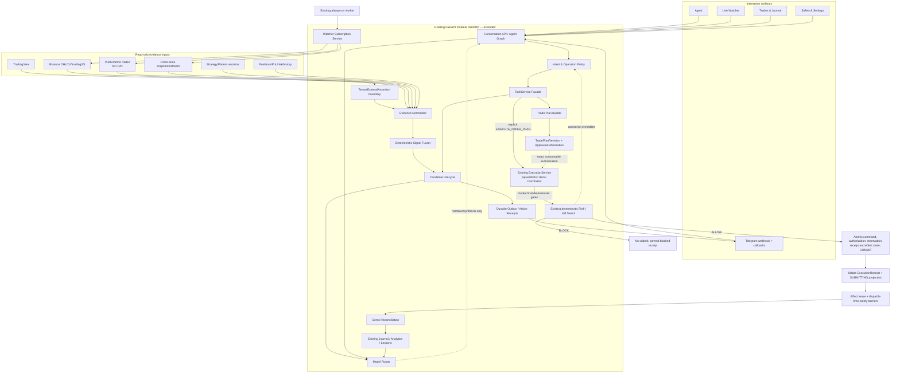
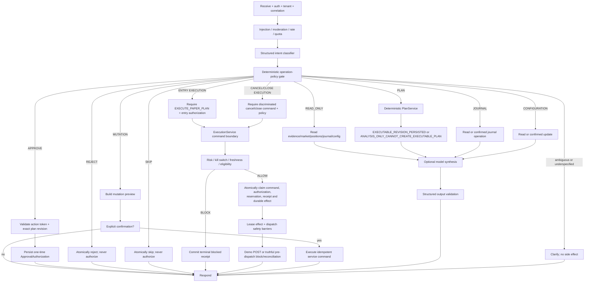
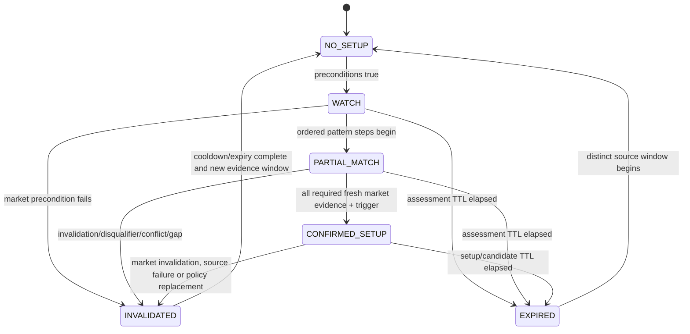
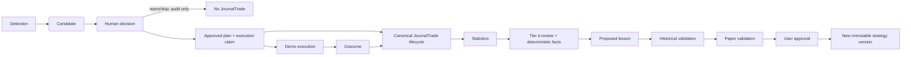

# AlphaTrade Agentic Redesign — Target Architecture

**Design basis:** `main@c0bd1d4d9c49948c44e7e23dc2a2572ea68a4a20`
**Revision basis:** independent architecture review PR #65 at `3a1a80f`
**Final review basis:** architecture consistency PR #66 at `4c4a66b`; safety/data/execution
PR #67 at `a13c60c`
**Final re-review basis:** PR #69 at `25d4f8d9ae3dd00261a7eaafed9904a67c9b7a5f`;
PR #68 at `e050d743837c75694044a1fd6808315b7aca605f`; close-protocol safety gate
PR #72 at `c743f886b6219896cafa1a892931ce06d7744fac`
**Status:** final corrected proposed architecture; no product implementation or capability
enablement
**Non-negotiable boundary:** paper/internal simulation and BloFin demo only. No production
exchange host, real-money order, withdrawal, transfer, or live-trading enablement is part of
this architecture.

This document describes **TARGET** behavior unless a paragraph is explicitly labelled
**CURRENT**. Verified current state and dispositions are in
`docs/redesign/agentic_redesign_phase0_audit.md`. In particular, the checked-in staging
blueprint currently disables the worker, watcher, TradingView intake, paper-signal
orchestration, external alerts and Telegram, and uses `EXCHANGE_MODE=paper_internal`.

## Design principles

1. Keep AlphaTrade as a modular monolith plus one existing worker until measured load or
   isolation needs justify another deployable.
2. Preserve deterministic services as authorities. Models interpret, synthesize and explain;
   they do not decide risk, freshness, fusion thresholds, permissions or execution eligibility.
3. A read-only request cannot cross into planning or mutation without a new explicit user
   intent.
4. Carry immutable evidence and one correlation lineage from observation to lesson.
5. Reuse existing strategy, proposal, approval, risk, demo-exchange, journal and audit models;
   extend them rather than create parallel systems.
6. Enable one narrow vertical slice only after deterministic tests and an explicit deployment
   review.

## 1. Target component architecture



### Component ownership and reuse

| Responsibility | Owner | Reuse/new decision |
|---|---|---|
| HTTP/auth/tenant boundary | Existing FastAPI/auth dependencies | Reuse |
| Conversation orchestration | Existing LangGraph graph and `AgentRuntime` | Modify graph/state |
| Intent/operation authorization | Agent policy module adjacent to `agents/routing.py` | New component because current keyword intent has no operation-class authority |
| Tools/service facade | Existing `AgentRuntime` and `ToolRegistry` in `backend/src/app/agents/runtime.py` and `backend/src/app/tools/registry.py` | Modify; wrap existing services and remove successful no-op behavior after migration |
| Surveillance scheduling/health/lock | Existing worker | Reuse and modify |
| Watcher subscriptions | Preserve `WatchlistItem`; associate a minimal immutable policy version | Existing watchlist already has exchange/symbol/timeframes/strategy IDs; add exact strategy/setup/fusion/delivery versioning without duplicating curation |
| Evidence normalization | Global typed market observations plus tenant assessments | New typed discriminated contracts because no current record carries every required venue/finality/cursor field without losing lineage |
| Signal fusion | Deterministic service/repository | New because current orchestration is TradingView-specific and watcher candidates are flat |
| Pattern definitions | Existing `UserStrategy`/`UserStrategyVersion`, `StructuredRules` and legacy `SetupDefinition` rows | One identity chain; immutable authored version plus tenant-owned `CompiledSetupDefinition`; legacy rows remain `GlobalSetupTemplate` compatibility identities |
| Candidate lifecycle | Adapt `paper_signal_orchestration_service.py`, `repositories/paper_validation_candidate.py`, watcher and TradingView records | Merge via adapters, preserve old APIs during migration |
| Planning | Existing `pretrade_analysis_service.py`, `position_sizing_service.py`, `loss_acceptance_service.py` and `proposal_service.py` | Extend the existing planning stack; do not create a parallel builder |
| Approval/risk/execution | Existing approval, risk, kill switch and `ExecutionService` | Reuse; approval creates an authorization only; `ExecutionService` receives the explicit command, runs final gates and consumes entry authorization in claim-transaction step 5 on final `ALLOW` |
| Telegram delivery | Existing `PaperAlertService`, `PaperValidationAlert`, delivery services and provider | Reuse outbound routing/delivery; actual automatic sender is missing; add inbound adapter/action gateway |
| Journaling/analytics/learning | Existing canonical journal, analytics, lesson and strategy-version services | Reuse and orchestrate |
| Model routing | Wrapper over existing `LLMProvider` | New router, reuse provider implementation |
| Reliable side effects | Transactional outbox/action receipt | New because direct cross-domain calls cannot guarantee delivery/replay recovery |

No new independently deployed microservice is proposed. “New service” above means a cohesive
module inside the current backend. It can become a deployable only after profiling and an
architecture review.

### One loop, two authority domains

“Agent-first” describes interaction and planning, not LLM control of surveillance. The
always-on half is deterministic: dedicated worker -> evidence -> pattern/fusion -> durable
candidate/outbox. The interactive half begins at Agent/Telegram: discussion -> explicit plan
or decision -> exact revision approval -> separate explicit execution command -> Tier C risk ->
demo execution -> journal/learning. Approval by itself stops before execution. The model never
runs scan scheduling or changes setup/fusion state.

**CURRENT:** `backend/src/app/workers/scanner.py` writes fixed-timeframe setup detections and
does not use subscriptions or fusion; `render.yaml` has `WORKER_ENABLED=false`.
**TARGET:** use the existing dedicated process entrypoint
`backend/src/app/workers/entrypoint.py` as the only staging/production watcher driver.
`backend/src/app/main.py` may retain in-process mode for local development, but it must not be
enabled alongside the dedicated worker.

## 2. Target data flow

```mermaid
sequenceDiagram
    participant W as Worker/Watcher
    participant E as Evidence Store
    participant F as Fusion
    participant A as Agent/Candidate
    participant T as Telegram
    participant U as User
    participant S as ExecutionService
    participant R as Risk Gate
    participant X as BloFin Demo
    participant J as Journal/Analytics

    W->>E: append normalized evidence (immutable)
    E->>F: evidence-ready event
    F->>F: freshness, quality, alignment, invalidation
    F->>A: confirmed candidate + transition reasons
    A->>T: durable alert outbox
    T->>U: candidate + STATUS/EXPLAIN/REJECT/SKIP
    U->>T: authenticated idempotent action
    T->>A: action receipt
    A-->>U: authoritative action result; no implicit planning
    U->>A: new explicit PLAN_TRADE request
    A->>A: explicit PLAN_TRADE preview
    U->>A: APPROVE exact immutable plan revision
    A-->>U: approval authorization recorded; no order submitted
    U->>A: explicit EXECUTE_PAPER_PLAN for that revision
    A->>S: typed command + exact authorization
    S->>R: validate authorization + recheck current facts
    R-->>S: BLOCK commits terminal receipt; ALLOW continues
    S->>S: claim command/authorization/reservation/receipt/effect; commit
    S->>S: lease effect; recheck safety epoch
    S->>S: atomically authorize dispatch against current safety epoch
    S->>X: submit demo-only order immediately after dispatch authorization
    X-->>S: acknowledgement/fills
    S->>X: reconcile orders/positions/PnL
    S->>J: approved-plan/execution lifecycle events; never candidate-only trade creation
    J->>J: excursions, statistics, lesson candidate
    J-->>U: review; no automatic rule promotion
```

Every private or action step has:

- `correlation_id` for the lifecycle;
- immutable source/event IDs;
- organization, user/account principal and actor scope;
- `occurred_at`, `observed_at`, and `recorded_at`;
- idempotency key;
- actor and operation class;
- explicit current state and append-only transition reason;
- source/provenance/freshness/fallback metadata.

Global public market observations omit tenant ownership and are referenced by tenant-scoped
assessments. The outbox is required for side effects that cross a transaction/failure boundary,
including Telegram delivery, demo venue calls and asynchronous journal projection. Pure
in-process deterministic calculations remain direct calls. External delivery is at least once;
internal effects are idempotent.

## 3. Target agent graph



Graph rules:

- `READ_ONLY` branches have no graph path to proposal creation, approval creation, execution,
  strategy mutation, backtest mutation, paper-validation mutation, watcher mutation,
  configuration changes or any other domain write. The exhaustive operational persistence
  allowlist and the deny-by-default repository contract are defined in §21.
- `PLAN_TRADE` may create an immutable `TradePlanRevision` only when every executable input is
  complete, fresh, non-fallback, sequence-complete and market-correct. Otherwise it returns
  `ANALYSIS ONLY / CANNOT CREATE EXECUTABLE PLAN` and creates no executable-shaped resource.
- `APPROVE` applies only to one exact plan revision, complete account-bound order and content
  hash. It records an
  `ApprovalAuthorization`; it does not submit an order.
- `REJECT` and `SKIP` dispatch by exact action to their own transitions. Neither can call
  authorization issuance. In the same transaction, both revoke applicable `AVAILABLE`
  descendant grants and apply the §27 descendant-action matrix.
- `EXECUTE_PAPER_PLAN` is the sole explicit **entry** execution intent. It routes
  `SubmitEntryCommand` to `ExecutionService`; exact `CANCEL_ORDER` and `CLOSE_POSITION`
  intents route their discriminated §23 commands to the same service under their own
  no-increase authorization policies. Entry authorization is consumed only at claim-transaction
  step 5 after the final `ALLOW` predicate (§24).
- `EXECUTION` is never inferred from analysis, “looks good”, emoji, approval, or a generic
  button label.
- Tool registration metadata is advisory; the operation-policy gate and domain service both
  enforce authorization/confirmation.
- Every persistence/service mutation entry point accepts the authoritative decision/command,
  checks the allowed operation class and principal again, and fails closed on mismatch.
- Successful no-op mutation/execution tools are not valid fallbacks. Until wired to the same
  authoritative service as the API, they return an explicit unavailable/error result and no
  success claim.
- Tier A/B model failure returns deterministic data or a clear unavailable response. It never
  relaxes Tier C.

This graph is a target simplification, not a removal list. Preserve the existing
`context_retrieval`/RAG, `strategy_workflow_tools`, `trading_analytics_retrieval`,
`memory_update`, quota/usage tracking, `narrative_enhancement`, and `output_validation` nodes
from `backend/src/app/agents/graph.py`; place them inside the appropriate branch above.
The new operation-policy gate centralizes and supersedes only the scattered operation decision,
while reusing lower-level confirmation helpers in
`backend/src/app/agents/mutation_policy.py` as defense in depth.

## 4. Target intent model

### Structured contract

```text
IntentDecision
  intent: Intent
  operation_class: READ_ONLY | PLAN | MUTATION | APPROVAL | EXECUTION | CONFIGURATION | JOURNAL
  organization_id: UUID
  principal: typed user/account principal
  channel: WEB | API | TELEGRAM | WORKER
  target_type: optional resource type
  target_id: optional UUID
  target_revision_id: optional UUID
  target_content_hash: optional SHA-256
  requested_action: optional action
  extracted_parameters: bounded typed object
  explicit_confirmation: bool
  confidence: 0..1
  ambiguity_reasons: list[str]
  requires_clarification: bool
  classifier_source: deterministic | tier_b | deterministic_fallback
```

`IntentDecision` is immutable for one request and is the only input to graph routing. If
deterministic parsing, a model classifier, role policy, channel policy or resource state
disagree, the effective class is the most restrictive result and
`requires_clarification=true`. Ambiguity defaults to `READ_ONLY`. Each tool declares allowed
intent/class pairs, but the graph policy and the service/persistence boundary independently
enforce them. `operation_class=APPROVAL` with a missing or non-`APPROVE`/`REJECT`/`SKIP`
`requested_action` always clarifies or rejects and can never mint an authorization.

### Required intents and operation classes

| Intent | Default class | Permitted result without another intent |
|---|---|---|
| `MARKET_ANALYSIS` | READ_ONLY | Market/evidence summary only |
| `SETUP_ANALYSIS` | READ_ONLY | Pattern progress, evidence, invalidation; no proposal |
| `PLAN_TRADE` | PLAN | Create an immutable, inspectable plan revision only from complete eligible inputs; never approve or execute |
| `REVIEW_TRADE` | READ_ONLY or JOURNAL | Comparison/review; journal write needs confirmation |
| `MANAGE_POSITION` | MUTATION | Preview first; exact confirmed non-execution update only; confirmed cancel/close dispatches its exact execution intent below |
| `JOURNAL` | JOURNAL | Read by default; explicit confirmed write |
| `EXPLAIN` | READ_ONLY | Explanation of existing facts/decisions |
| `CONFIGURE` | CONFIGURATION | Read current config or preview confirmed change |
| `APPROVE` | APPROVAL | Create authorization for one exact immutable `TradePlanRevision` and content hash only; this is the only grant-issuing action |
| `REJECT` | APPROVAL | Reject exact object; never mint authorization or execute |
| `SKIP` | APPROVAL | Record dismissal/skip; never mint authorization or execute |
| `EXECUTE_PAPER_PLAN` | EXECUTION | Consume one valid authorization and ask `ExecutionService` to execute that exact revision |
| `CANCEL_ORDER` | EXECUTION | Submit exact-order cancellation under the §27 cancel policy; never infer an order |
| `CLOSE_POSITION` | EXECUTION | Submit the exact §23 position-bound reduce-only close command through the snapshot-bound unique close claim and §11 state machine |

Sub-intents can remain for strategy/backtest/lesson workflows, but every sub-intent declares one
operation class. If deterministic rules and Tier B disagree, choose the more restrictive class
and ask for clarification.

### Migration of current intent groups

| Current intent group in `backend/src/app/schemas/agent.py` | Target mapping |
|---|---|
| `MONITOR` | Rename/map to `MARKET_ANALYSIS/READ_ONLY` or watcher `CONFIGURE`; never proposal generation |
| `PLAN_TRADE`, `PRE_TRADE`, `POSITION_SIZE`, `INVALIDATION_QUERY`, `LOSS_ACCEPTANCE` | `PLAN` except purely explanatory queries, which are `READ_ONLY` |
| `EXECUTE` | Replace with explicit `EXECUTE_PAPER_PLAN/EXECUTION`; valid only with a consumable authorization and never classifier-inferred from analysis or approval |
| `REVIEW`, `HUMAN_VS_SYSTEM`, early-exit/stop queries | `REVIEW_TRADE/READ_ONLY` |
| strategy card/status/testability/structure intents | read by default; create/update is `MUTATION` with exact preview/confirmation |
| backtest and paper-validation query intents | `READ_ONLY`; start/run/tick actions are `MUTATION` |
| lesson query/suggest intents | `JOURNAL` read; accept/reject/create-version actions are confirmed `MUTATION` |
| scheduler, watcher, bridge and alert query intents | `READ_ONLY`; configuration/tick/delivery actions are confirmed `CONFIGURATION` or `MUTATION` |
| risk and notification settings actions | read as `CONFIGURATION`; update/test delivery requires preview and confirmation |

Examples:

- “Analyze BTC 15m” -> `MARKET_ANALYSIS/READ_ONLY`.
- “Does this match my CVD-divergence pattern?” -> `SETUP_ANALYSIS/READ_ONLY`.
- “Build a paper plan” -> `PLAN_TRADE/PLAN`.
- “Approve plan 123 revision 4” -> `APPROVE/APPROVAL`; create authorization only.
- “Execute approved paper plan 123 revision 4” ->
  `EXECUTE_PAPER_PLAN/EXECUTION`; consume authorization and call `ExecutionService`.
- Telegram callback `approve:<nonce>` -> validated `APPROVE`, bound to exact plan revision,
  content hash, organization and user.
- “Close it” without one unambiguous position -> clarification, no mutation.

## 5. Market observation and assessment architecture

Public market facts are global typed observations. They are stored once and referenced by
tenant-scoped setup assessments; they are never copied merely because two organizations use the
same public event. Private strategy, portfolio, risk, journal and account facts remain
tenant-scoped and cannot enter the global observation store.

### Global typed market observations

`PublicMarketObservation` is an immutable envelope over a discriminated typed payload:

```text
PublicMarketObservation
  schema_version: "1.0"
  observation_id: UUID
  observation_type: OHLCV | TRADE | CVD | ORDER_BOOK | VOLUME | STRUCTURE |
                    PUBLIC_EXTERNAL_MARKET_SIGNAL
  venue: VenueId
  market_type: SPOT | PERPETUAL | FUTURE
  instrument_id: canonical instrument identity
  symbol: provider symbol
  timeframe_or_window: typed interval/window
  event_time: datetime
  receive_time: datetime
  source_clock: provider event-clock identity and precision
  interval_start: datetime?
  interval_end: datetime?
  source: source family
  provider: provider identity
  source_event_id: string
  sequence_or_cursor: typed sequence/cursor reference?
  ingestion_freshness: FRESH | AGING | STALE | GAP | UNKNOWN
  finality: FINAL | FORMING | CORRECTED | UNKNOWN
  finality_policy_version: immutable policy version
  post_close_grace_seconds: non-negative integer?
  fallback_used: bool
  is_live: bool
  supersedes_observation_id: UUID?
  adapter_version: immutable version
  payload: OHLCVPayload | TradeEvent | CvdWindow | OrderBookPayload |
           VolumePayload | StructurePayload | PublicExternalMarketSignalPayload
  content_hash: SHA-256 over canonical envelope and payload
  recorded_at: datetime
```

The natural uniqueness key is source-specific and venue-scoped and excludes adapter version:
`(source, venue, market_type, instrument_id, observation_type, source_event_id)`.
Adapter changes append/select normalization revisions under that natural event; they do not
duplicate the venue fact.
Corrections append a new observation and reference `supersedes_observation_id`; they do not
rewrite evidence already bound to an assessment. Decimal values, units, contract size and quote
currency are explicit. Generic untyped metrics are not an executable evidence contract.

`PUBLIC_EXTERNAL_MARKET_SIGNAL` is legal only after the explicit source/privacy policy in §25
proves the full payload and all links public. TradingView alerts, proprietary signals and
user/manual assertions always enter through tenant-owned `TenantExternalAssertion`; they
never enter this global envelope or its indexes.

Every executable use requires `is_live=true`, `fallback_used=false`, a fresh consumer-time
evaluation against an immutable `FreshnessPolicy`, known correct venue/market/instrument
identity, required finality, complete history and complete sequence state. Persisted
`ingestion_freshness` is evidence, not permanent truth. Degraded or expired observations may
be displayed with limitations but cannot confirm a setup, create a candidate, create an
executable plan, authorize or support execution.

### Perpetual trade-flow contracts

```text
TradeEvent
  trade_event_id: UUID
  venue: VenueId
  market_type: PERPETUAL
  instrument_id: canonical perpetual instrument
  symbol: provider symbol
  venue_trade_id: string
  sequence: integer|string?
  price: Decimal
  quantity: Decimal in explicit base/contract units
  quote_quantity: Decimal
  aggressor_side: BUY | SELL
  aggressor_convention: immutable provider semantic/version
  event_timestamp: datetime
  receive_timestamp: datetime
  source_connection_id: UUID
  adapter_version: immutable version
  content_hash: SHA-256

TradeStreamCursor
  cursor_id: UUID
  venue: VenueId
  market_type: PERPETUAL
  instrument_id: canonical perpetual instrument
  connection_identity: UUID
  last_event_id: string?
  last_sequence: integer|string?
  connected_at: datetime
  last_event_at: datetime?
  reconnect_count: non-negative integer
  reconnect_state: INITIAL | CONTINUOUS | RECONNECTING | RECOVERED
  gap_state: NONE | SUSPECTED | CONFIRMED | UNRECOVERABLE
  gap_start: string|integer?
  gap_end: string|integer?
  warm_up_status: EMPTY | BACKFILLING | COMPLETE | FAILED
  updated_at: datetime
  content_hash: SHA-256

CvdWindow
  cvd_window_id: UUID
  venue: VenueId
  market_type: PERPETUAL
  instrument_id: canonical perpetual instrument
  window_start: datetime
  window_end: datetime
  baseline: Decimal
  signed_quote_delta: Decimal
  total_quote_volume: Decimal
  event_count: non-negative integer
  data_completeness: COMPLETE | PARTIAL | UNKNOWN
  gap_status: NONE | SUSPECTED | CONFIRMED
  warm_up_complete: bool
  source_connection_id: UUID
  start_cursor_id: UUID
  end_cursor_id: UUID
  aggressor_convention: immutable provider semantic/version
  source_identity: provider/adapter version
  event_time_max: datetime
  receive_time_max: datetime
  content_hash: SHA-256
  created_at: datetime
```

Buyer aggressor contributes positive quote quantity and seller aggressor contributes negative
quote quantity only when the provider's semantics are known and versioned. Unknown aggressor
semantics, wrong market, spot/perpetual substitution, stale or fallback feed, any unresolved
gap, or incomplete warm-up yields an unusable window and fails closed. A spot feed must never
silently satisfy perpetual evidence.

### Tenant-scoped assessments and action state

```text
SetupAssessment
  assessment_id; organization_id; strategy_version_id; setup_definition_id
  observation_ids; assessment_window; state; rule_results; reason_codes
  previous_assessment_id; policy_version; content_hash
  assessed_at; valid_until; correlation_id

ActionEligibility
  eligibility_id; organization_id; user_id; account_id; candidate_id
  assessment_id; resource_revision; risk_snapshot_id; venue_state_id
  state: ELIGIBLE | BLOCKED | EXPIRED
  reason_codes; checked_at; valid_until; content_hash; correlation_id

Candidate
  candidate_id; organization_id; strategy_version_id; setup_definition_id
  fusion_policy_version; direction; assessment_id; evidence_window_hash
  evidence_venue; evidence_market; evidence_instrument; timeframe
  state; created_at; valid_until; transition_version
  idempotency_key; content_hash; correlation_id
```

In these target contracts, `setup_definition_id` is the tenant-owned
`CompiledSetupDefinition` for the exact strategy version. A legacy global
`GlobalSetupTemplate` ID is a compatibility reference only and cannot occupy this executable
field.

`SetupAssessment` answers only “is this setup present?” from market observations and the exact
immutable pattern policy. `ActionEligibility` answers “may this user/account act now?” from
risk, kill switch, daily PnL, cooldown, existing exposure, portfolio conflicts, candidate TTL,
account state, current data quality and execution venue state. Account state can suppress an
alert or block an action but can never rewrite objective setup truth.

The candidate database key is
`(organization_id, strategy_version_id, setup_definition_id, fusion_policy_version,
direction, evidence_venue, evidence_market, evidence_instrument, timeframe,
evidence_window_hash)`.
`evidence_window_hash` is the `CanonicalEvidenceWindowV1` hash over the complete §26 preimage,
including compiled-setup hash, trigger revision, manual-level revision and correction policy.
It canonically represents the semantic setup window across all contributing sources, so
equivalent watcher, TradingView or detector evidence converges on one candidate rather than
creating one candidate per source or venue. Evidence venue identities remain on the candidate
and referenced observations for lineage.
Creation uses transactional insert/upsert; transitions use optimistic versions and idempotency
keys. Alert-delivery deduplication remains a separate concern. Existing
`PaperSignalOrchestrationDecision`, watcher, TradingView and
`PaperValidationCandidate` records are compatibility adapters into this one assessment and
candidate lineage, not parallel authorities.

## 6. Signal-fusion lifecycle

The source-agnostic assessment service is deterministic. A versioned `FusionPolicy` references
one exact `UserStrategyVersion`/`CompiledSetupDefinition` pair and declares
required/optional/disqualifying market observations, windows, thresholds and freshness. It
generalizes the useful transition/reason-code shape already present in paper-signal
orchestration. It emits an immutable `SetupAssessment`; it does not evaluate account risk.



Exact transition rules:

| From -> to | Required deterministic reason |
|---|---|
| `NO_SETUP -> WATCH` | Pattern universe matches symbol/timeframe/regime and all hard preconditions pass |
| `WATCH -> PARTIAL_MATCH` | At least one required sequence step has passed in order; no disqualifier; evidence remains fresh |
| `PARTIAL_MATCH -> CONFIRMED_SETUP` | Every mandatory sequence step and trigger passed; required price, volume, CVD and trade-flow evidence are final where required, fresh, non-fallback, sequence-complete, market-correct and directionally aligned; weighted score >= setup threshold |
| `* -> INVALIDATED` | Pattern invalidation crossed, explicit market disqualifier, required source stale/gapped/fallback, wrong venue/market, directional market-evidence conflict or exact strategy/setup policy is replaced |
| `WATCH/PARTIAL_MATCH/CONFIRMED_SETUP -> EXPIRED` | The immutable assessment/setup/candidate validity interval elapses without a qualifying new observation |
| `INVALIDATED -> NO_SETUP` | Previous evidence window expires/cooldown ends and a distinct source window/content hash begins |
| `EXPIRED -> NO_SETUP` | A distinct source window/content hash begins and all current preconditions are reevaluated |

Each assessment records: policy/version, evidence IDs, per-rule pass/fail, weights, threshold,
state, previous state, reason codes, human-readable deterministic explanation, and expiry.
Tier A may explain conflicts but cannot change the state. After `CONFIRMED_SETUP`, candidate
creation is idempotent and a separate `ActionEligibility` check can produce `ELIGIBLE` or
`BLOCKED`. Kill switch, daily loss, cooldown, existing exposure, portfolio conflict, account
state, execution-venue state and cross-venue basis affect only action eligibility.

## 7. Pattern Card design

Pattern Cards extend the existing strategy system:

- `UserStrategy` is the only stable user-owned strategy/pattern identity;
- `UserStrategyVersion` is the immutable authored Pattern Card version containing narrative
  fields, `StructuredRules`, sequence and evidence requirements;
- `CompiledSetupDefinition` is the tenant-owned immutable compiled detector artifact for exactly one
  `UserStrategyVersion`;
- “Pattern Card” is the agent/user-facing structured representation of that same strategy
  version, not a fourth identity;
- backtest and paper statistics are immutable evaluation records referenced by ID.

```text
StrategyPatternSpec (embedded in one immutable UserStrategyVersion)
  name
  coins: list[Symbol]
  timeframes: list[Timeframe]
  regimes: list[MarketRegime]
  preconditions: list[PredicateAst]
  sequence: ordered list[PatternStep]
  trigger: PredicateAst + typed trigger-level expression
  invalidation: list[PredicateAst] + typed invalidation-level expression
  supporting_evidence: list[EvidenceRequirement]
  disqualifying_conditions: list[PredicateAst]
  confidence_factors: list[WeightedFactor]
  examples: list[EvidenceReference]
  counterexamples: list[EvidenceReference]
  alert_threshold: 0..1
  historical_statistics: immutable snapshot reference
  paper_statistics: immutable snapshot reference
```

Every authoring `PatternStep` must compile to the §26 fields
`step_id`, `predicate`, `min_offset`, `max_offset`, `finality_requirement`, `reset_on`,
`invalidate_on` and `overlap_policy`; omitted sequence semantics are a compile error.

Promotion and activation are not Pattern Card content. Append-only `StrategyLifecycleEvent`
records carry `DRAFT | STRUCTURED | HISTORICALLY_VALIDATED | PAPER_VALIDATING |
REVIEW_REQUIRED | APPROVED | ACTIVE | RETIRED`, actor, reason, effective time and prior event.

`CompiledSetupDefinition(strategy_version_id, compiler_version, compiled_ast, content_hash,
created_at)` has a one-to-one uniqueness constraint on `strategy_version_id`. The allowlisted AST supports
only typed, deterministic operands, units, comparisons, boolean composition, bounded windows,
cross-series alignment, and ordered sequence steps. The compiler rejects unknown fields,
ambiguous units, unsupported constructs and approximate semantic mappings.

Current `StructuredRules` are authored input, not proof of executable parity:
`StructuredRuleResolver` ignores or approximates some semantics. Existing rules migrate only
when compiler fixtures prove exact meaning; otherwise the version remains non-executable and
requires human restructuring.

Screenshots, RAG results, lessons and model outputs are evidence or draft inputs, never
executable rules. The agent can use Tier A to draft a Pattern Card from screenshots and
descriptions, but:

1. schema validation must pass;
2. every executable expression must compile to the allowlisted deterministic AST;
3. the user reviews the exact draft;
4. historical and paper-validation evidence is linked;
5. promotion requires explicit user approval and creates a new immutable strategy version.

Every semantic card, rule, sequence, threshold or evidence-requirement change creates a new
`UserStrategyVersion` with parent version, actor, source lesson/draft, exact diff, validation
lineage and content hash. Existing versions are never patched in place. Rollback selects a
previous approved version; it does not rewrite history.

Reuse mappings:

| Pattern Card need | Existing owner |
|---|---|
| Name, asset universe, timeframes, entries, invalidation, TP/runner/no-trade rules | `StrategyCard` |
| Authored machine-testable input | `StructuredRules`, structured rule validation |
| Executable detector artifact | one tenant-owned `CompiledSetupDefinition` compiled from one strategy version |
| Versioning/promotion status | `UserStrategyVersion`, strategy promotion/quality services |
| Examples/counterexamples | Journal evidence/attachments and RAG documents |
| Historical statistics | Backtest datasets/runs/trades and setup evidence service |
| Paper statistics | Paper-validation runs, sample windows and metrics |
| Manual levels | Existing manual-level service/repository |

The only necessary authored extension is the pattern-specific sequence/evidence specification
inside `UserStrategyVersion`; creating an independent `pattern_id` or strategy library would
duplicate identity, versioning, testing and promotion.

## 8. Model-routing architecture

**CURRENT:** one global `LLM_MODEL` serves the graph. Active narrative prompts live in
`backend/prompts/trading_analysis_narrative.txt`, `risk_explanation.txt`, and
`journal_review_coach.txt`; `backend/src/app/agents/prompts/system.md` is an unused placeholder.
The `usage_tracking` node in `backend/src/app/agents/nodes.py` makes a completion solely to
collect estimated usage, so a narratively enhanced request can incur two model calls without
two reasoning tasks.

**TARGET:** add `ModelRouter` above the current `LLMProvider` in migration Phase 2, before any
new Tier A/B consumer. Routing uses a typed task, impact, data classification, organization/user
scope and prompt-policy version; callers never supply free-form model names.

| Tier | Work | Policy |
|---|---|---|
| Tier A — frontier reasoning | Explanation of frozen multi-source conflicts, strategy/pattern draft assistance, post-trade root cause, weekly review and promotion recommendation | Explicit task allowlist; structured output; bounded context/cost/timeout; no candidate transition or direct mutation; fail closed to deterministic facts or human review |
| Tier B — fast/cheap | Intent classification, routine summaries, journal extraction, alert wording, simple Q&A, metadata and retrieval synthesis | Structured output; deterministic fallback where possible; low token budget |
| Tier C — deterministic code | Risk, sizing, daily loss, kill switch, cooldowns, fusion thresholds, freshness, eligibility, pattern math, permissions/idempotency | Existing/new typed services; no LLM call and no override path |

Suggested contract:

```text
ModelTaskRequest(
  task_type, impact, data_classification,
  organization_id, user_id, correlation_id,
  prompt_policy_version, prompt_template_version,
  allowed_providers, retention_policy,
  redacted_messages_or_context, output_schema,
  max_attempts, max_latency_ms, max_cost, fallback_policy
)
ModelCallAttempt(
  attempt_id, task_request_id, tier, provider, model,
  started_at, completed_at, input_tokens, output_tokens,
  latency_ms, provider_cost, estimated_cost, fallback_reason,
  validation_result, error_category
)
ModelTaskResult(
  task_request_id, parsed_output, tier, provider, model,
  attempts, total_tokens, total_latency_ms, total_cost,
  fallback_used, validation_result, completed_at
)
```

Reuse `OpenAILLMProvider`, `MockLLMProvider`, request/result types, provider factory, usage
service, narrative guardrail and prompt files. Add:

- task-to-tier/model policy;
- separate configuration per Tier A/B;
- circuit/budget policy and task telemetry;
- schema-specific validators;
- versioned prompts for intent, synthesis, pattern drafting and review;
- provider-result accounting for actual calls only. Usage and cost are the sum of persisted
  `ModelCallAttempt` records. If no model ran, model-call usage is zero; a separately labelled
  deterministic token estimate may support capacity analysis but is not provider usage or
  billing evidence. No completion may be made merely to meter a request.

Tier A explanation consumes an already-determined frozen setup assessment and can recommend
“ask user” or “insufficient context”; it cannot create, promote, invalidate or reprioritize a
candidate, alter thresholds, or mark stale data fresh. If Tier A/B and Tier C disagree, Tier C
wins and the disagreement is audited. Provider failure degrades to deterministic facts or
human review and never relaxes safety.

### Dynamic trade planning

**CURRENT:** `backend/src/app/services/pretrade_analysis_service.py` already emits an entry
zone, stop, TP levels, runner logic, size, leverage, risk/reward and confidence through
`backend/src/app/schemas/pretrade.py`. `position_sizing_service.py` performs deterministic
sizing and `proposal_service.py` persists the reviewed plan. However, current pre-trade logic
uses fixed percentage offsets and can substitute a `60000` placeholder when price is missing;
agent proposal paths in `backend/src/app/agents/nodes.py` also contain placeholder defaults.
Those values must never become executable.

**TARGET:** extend this stack into an inspectable, versioned plan derivation:

| Field | Deterministic derivation |
|---|---|
| Entry zone | Pattern trigger expression intersected with fresh support/resistance/manual level and allowed slippage/tick size |
| Stop | Pattern invalidation plus direction-aware ATR/tick buffer; never moved farther merely to fit size |
| TP1 | Nearest valid structure target meeting policy minimum R, or explicit Pattern target |
| TP2 | Next valid structure target/Pattern target, preserving monotonic target order |
| Runner | Pattern exit predicate, activation after configured partial fill, remaining size fraction and trailing rule |
| Position size | `effective_risk_budget / abs(entry-stop)`, rounded down to demo instrument lot size |
| Effective risk | stop distance * rounded size + conservative fees and slippage |
| Reward/risk | per-target net expected reward divided by effective risk; no model-generated arithmetic |
| Permitted leverage | minimum needed for notional within margin, capped by user/risk/instrument policy; leverage never increases risk budget |
| Maximum expected loss | stop loss + fee/slippage allowance, checked against per-trade and daily remaining limits |
| Confidence | transparent weighted fusion factors, sample quality and penalties; Tier A interpretation is a separate labelled field |
| Reasons | evidence IDs, rule pass/fail, derivation formula, inputs, rounding and limitations |

The existing proposal/draft stack is extended with this authoritative immutable resource; it is
not a separate planning authority:

```text
TradePlanRevision
  plan_id: stable UUID
  revision_id: immutable UUID
  schema_version: immutable version
  organization_id: UUID
  user_id: UUID
  account_id: non-null internal execution account
  exchange_account_id: demo exchange account when applicable
  operation: SUBMIT_ENTRY
  candidate_id: UUID
  strategy_version_id: UUID
  setup_definition_id: exact CompiledSetupDefinition artifact
  evidence_ids: non-empty ordered list[UUID]
  evidence_venue; evidence_market; evidence_instrument: typed identity
  execution_venue; execution_market; execution_instrument: typed identity
  instrument_mapping_version: immutable version
  timeframe: Timeframe
  expected_account_mode: NET
  permission_attestation_id: UUID
  permission_attestation_version: immutable version
  side: BUY | SELL
  entry_zone: typed lower/upper Decimal with units
  entry_zone_derivation: immutable formula/version
  stop: Decimal with units
  targets: ordered non-empty typed targets
  runner_logic: compiled deterministic exit/size rule
  order_type; time_in_force
  limit_price + price_unit OR explicit null + MARKET marker
  quantity; quantity_unit; reduce_only=false
  slippage_policy; margin_mode; position_mode=NET
  contract_multiplier; linear_or_inverse; base/quote/settlement currencies
  tick_size; lot_size; minimum_quantity; minimum_notional; instrument_rule_version
  basis_policy; evidence_price; execution_price; basis_formula
  basis_timestamp; basis_tolerance; basis_freshness
  risk_budget; maximum_loss; fees/funding/slippage allowance; R values
  leverage/margin assumptions
  valid_from: datetime
  valid_until: datetime
  calculation_inputs: every canonical Decimal input, formula/version, result, unit conversion,
                      precision, rounding mode and conservative remainder
  content_hash: CanonicalTradePlanContentV1 SHA-256 over every field above except itself
  correlation_id: UUID
  created_at: datetime
```

`TradePlanRevision` is immutable after creation. Any `REDUCE_RISK`, changed level, refreshed
evidence, size, venue basis, instrument rule or partial-fill adjustment creates a new revision
and invalidates prior authorizations. Only `strategy_version_id` is persisted;
`pattern_version_id` may exist solely as a validated API compatibility alias and must equal it.

No executable placeholder is legal. Missing, stale, fallback, incomplete, wrong-market,
wrong-venue or sequence-gapped input returns exactly
`ANALYSIS ONLY / CANNOT CREATE EXECUTABLE PLAN`; it persists no executable-shaped plan or
proposal. Display-only examples must use a separate non-executable schema that cannot be passed
to approval or execution.

### Approval authorization

```text
ApprovalAuthorization
  authorization_id: UUID
  organization_id: UUID
  user_id: UUID
  account_id: UUID
  exchange_account_id: UUID?
  operation: SUBMIT_ENTRY
  plan_id: UUID
  revision_id: UUID
  plan_content_hash: SHA-256
  execution_venue: VenueId
  execution_instrument: ExecutionInstrumentIdentity
  verified_account_mode: NET
  permission_attestation_id: UUID
  permission_attestation_version: immutable version
  expires_at: datetime
  state: AVAILABLE | CONSUMED | EXPIRED | REVOKED
  consumed_by_execution_command_id: UUID?
  channel: WEB | API | TELEGRAM
  actor: typed authenticated principal
  correlation_id: UUID
  created_at: datetime
  consumed_at: datetime?
  content_hash: SHA-256
```

`APPROVE` creates this authorization and stops. It never invokes risk submission or execution.
Only a separate explicit `EXECUTE_PAPER_PLAN` command may consume it. Consumption is an atomic
`AVAILABLE -> CONSUMED` compare-and-set in the same authoritative execution transaction that
claims the command. There is no durable `CONSUMING` authorization state.
Replayed, expired, revoked, wrong-principal, wrong-tenant, wrong-resource-state,
wrong-revision or wrong-hash authorization fails and is audited.

### Execution command and idempotency

The following is a transport envelope, not an independently editable order. The complete
normative semantic payload and command union are in §§22–24.

```text
ExecutionCommand
  execution_command_id: UUID
  idempotency_key: opaque caller key
  organization_id: UUID
  principal: user/account principal
  intent: EXECUTE_PAPER_PLAN
  operation: SUBMIT_ENTRY
  command_type: SubmitEntryCommand
  plan_id: UUID
  immutable_resource_revision: revision_id
  authorization_id: UUID
  plan_content_hash: SHA-256
  canonical_payload_hash: SHA-256 of CanonicalExecutionPayloadV1
  correlation_id: UUID
  created_at: datetime
```

The canonical payload hash excludes the opaque key and all transport/server metadata. A unique
idempotency record binds `(organization, principal/account, operation namespace, opaque key)`
to the command hash. A key-only lookup can expose only that
binding decision; it cannot return an order. The service first locks the record and validates
organization, principal and hash, then resolves the receipt/order through tenant-scoped
queries. Replay behavior is exact:

- same organization + same principal/account + same idempotency key + same canonical payload
  returns the original `ExecutionReceipt`;
- the same idempotency key with a different organization, principal/account, revision, venue,
  instrument, side, order type, quantity, price or plan/content hash rejects and audits a
  conflict;
- no lookup returns an order before tenant/principal/hash validation;
- concurrent identical commands converge transactionally.

Agent, API and Telegram facades can construct this same command, but only `ExecutionService`
can consume the authorization, run final deterministic gates, submit an order or create an
`ExecutionReceipt`.

## 9. Continuous watcher architecture

### Subscription model

Preserve mutable `WatchlistItem` as the existing per-user symbol/exchange curation record. Add a
minimal stable policy identity plus immutable versions; do not duplicate symbol identity,
ownership or market validation:

```text
WatcherSubscription
  subscription_id; organization_id; user_id; watchlist_item_id; created_at

WatcherSubscriptionVersion
  subscription_id; version; watchlist_market_id; timeframe
  strategy_version_id; setup_definition_id; fusion_policy_version
  alert_threshold; delivery_policy_id; enabled
  created_by; confirmed_by; created_at; content_hash
```

“Add SOL to the 15m watcher and alert only when bearish CVD divergence and trigger-bar
aggressive sell imbalance agree” becomes:

1. `CONFIGURE` intent;
2. Tier B extracts a proposed typed subscription;
3. deterministic validation rejects unknown symbols/timeframes/evidence types;
4. agent displays a diff;
5. explicit confirmation persists a new subscription version and audit event.

### Runtime

1. Outside local/test, acquire a distributed lock with renewable lease and monotonically
   increasing fencing token. Lock unavailability or renewal loss blocks the cycle, rejects
   stale-holder writes and records an unhealthy heartbeat; process-local fallback is forbidden.
2. Create the scan-attempt lineage record before work. Load active subscription versions and
   batch shared public fetches by exact venue/market/instrument/timeframe.
3. Fetch closed-candle OHLCV and perpetual trades with sequence tracking. A candle is `FINAL`
   only after provider finality and its versioned post-close grace interval; persist the
   applied finality policy/grace with the observation. Optional order book evidence is usable
   only after snapshot/stream sequence integrity is proven.
4. Reject fallback/non-live/stale data, forming or unknown-finality candles, insufficient
   history, wrong venue/market/instrument, trade gaps and incomplete CVD warm-up.
5. Persist immutable global observations, then evaluate each tenant's exact strategy/setup and
   fusion policy through the same organization-aware application service.
6. Upsert setup assessment and candidate with database uniqueness, optimistic transition
   version, candidate TTL and retry-safe idempotency.
7. Create at most one candidate and separate outbox delivery for the canonical candidate key
   in §5, whose `evidence_window_hash` is `CanonicalEvidenceWindowV1`.
8. Persist attempted/succeeded/failed source and subscription counts, per-source
   latency/freshness/gaps, fencing token, outcome and errors. Partial and all-source failures
   are honestly `DEGRADED`/`FAILED`, never successful configured-symbol counts.

Manual API scans call this same evaluation pipeline with `dry_run=true`; only scheduling and
persistence policy differ, never detector semantics. Existing `MarketWatcherService`, scanner
detectors, observations, scan records, worker health/lock, bridge decisions and alert dedupe
are reused through adapters. The bridge is retired only after its paper-validation links are
represented by the common lifecycle. Watcher automation remains disabled until a separate
deployment review.

## 10. Telegram interaction architecture

### Outbound

**CURRENT:** `backend/src/app/services/telegram_automatic_delivery_service.py` only computes a
read-only preview/readiness; it is not an automatic sender. Manual and generic outbound
delivery are implemented but disabled in staging.

Reuse the persisted `PaperValidationAlert` model through
`backend/src/app/services/paper_alert_service.py`, notification preferences, delivery routing,
`TelegramAlertDeliveryProvider` in
`backend/src/app/providers/alert_delivery/telegram.py`, manual service/retries and delivery
audit. Add the missing automatic outbox consumer, with a durable claim before calling Telegram,
and a richer formatter:

- symbol/timeframe/pattern/version;
- fusion state and deterministic reason summary;
- freshness/provider/fallback disclosure;
- entry zone/invalidation only if a plan exists;
- candidate expiration;
- paper/demo-only label;
- inline actions allowed for the current state.

### Inbound

Add one Telegram webhook adapter in the FastAPI application and one channel-neutral
`RemoteActionGateway`. It is new because outbound delivery services must not parse or authorize
mutations. The gateway delegates domain actions to the existing proposal/approval/position
services and APIs; it is not a second mutation stack.

Security and idempotency:

- HTTPS webhook with Telegram secret-token header;
- enforce bounded request-body size, per-source/enrollment-aware rate limits and an explicit
  allowlist of accepted Telegram update types before parsing actions;
- authenticated enrollment challenge begins in AlphaTrade web, expires, and is completed by the
  same Telegram user in a private chat with the configured bot;
- verified enrollment binds organization, AlphaTrade user, Telegram user, Telegram private
  chat, chat type and bot identity, with `verified_at`, `revoked_at` and allowed actions;
- group/channel chats are rejected by default; user-entered chat ID alone is never enrollment;
- no credentials in messages/callback data;
- callback contains only an opaque, random nonce;
- nonce record binds organization, AlphaTrade user, Telegram user/chat/bot, resource ID,
  immutable revision/content hash, exactly one allowed action, expiry and single-use state;
- durable unique receipts exist for `update_id`, `callback_query_id` and resulting action
  execution;
- compare-and-set action state (`RECEIVED -> CLAIMED -> APPLIED/REJECTED`);
- trusted organization/user/role, resource ownership, object state, expiration and current risk
  are rechecked server-side for every action;
- every receive/replay/reject/apply/result is audited;
- repeated delivery returns the original outcome.

Delivery is at least once because Telegram cannot join the database transaction. Durable claim
leases and unique receipts make internal effects idempotent; the architecture does not claim
exactly-once external delivery.

### Action rollout order

| Action | Intent/behavior |
|---|---|
| 1. `STATUS` | Read-only candidate/order/position/reconciliation state |
| 2. `EXPLAIN` | Read-only Tier A/B explanation over frozen evidence |
| 3. `SHOW_CHART` | Read-only chart artifact/reference |
| 4. `REJECT` | Reject exact candidate/plan; never execute |
| 5. `SKIP` | Dismiss exact candidate/evidence window; never execute |
| 6. `APPROVE` | Create authorization for the exact immutable `TradePlanRevision`; never submit |
| 7. `REDUCE_RISK` | Generate a non-persistent lower-risk preview; authorization is unchanged until confirmed `REDUCE_RISK`, when the §27 matrix applies |
| 8. `CLOSE` | Create a position-bound reduce-only preview; requires a second short-lived confirmation nonce |

`CLOSE` is unavailable until the preview is bound to the exact reconciled position/account,
projection version, side, quantity, execution venue/instrument, basis/freshness version,
close-policy version and the §23 `ClosePreClaimWorkingOrderSnapshotV1` version, venue-order
entries and hash. On second confirmation the gateway delegates to the same channel-neutral
close service used by web and agent callers. That service serializes by account/instrument,
reconciles position and venue working orders, computes the snapshot before it creates any
claim/effect, and atomically claims the exact position projection/version as `CLOSE_PENDING`
before network I/O. A competing channel resolves the existing close claim/receipt rather than
creating another semantic close. It never silently interprets position side. Every response
reports whether state changed and includes the authoritative current state. Telegram execution
of a newly approved plan is not part of this rollout; a future explicit
`EXECUTE_PAPER_PLAN` remote action requires separate review.

## 11. BloFin demo execution architecture

Keep `ExecutionService`, `PaperExecutionRiskGate`, kill switch, approval records, internal
idempotency and BloFin providers. Modify demo routing from best-effort mirroring into an
explicit coordinator when `EXCHANGE_MODE=paper_exchange_demo`.

**CURRENT:** `backend/src/app/services/execution_service.py` records an internal fill first and
best-effort mirrors to BloFin demo. `backend/src/app/db/models.py` and
`backend/src/app/repositories/exchange_orders.py` already persist exchange orders/fills, while
`backend/src/app/services/blofin_sync_service.py` persists read-only account/position
snapshots. These are the reconciliation foundation, not proof of reconciled execution.

This is the one authoritative execution and close state machine. Later schemas, diagrams,
tables and prose refine its guards but may not define another close transition path.

```mermaid
stateDiagram-v2
    [*] --> AUTHORIZATION_AVAILABLE
    AUTHORIZATION_AVAILABLE --> RISK_CHECKING: explicit EXECUTE_PAPER_PLAN
    RISK_CHECKING --> BLOCKED: Tier C block
    RISK_CHECKING --> SUBMITTING: atomic claim commit + Tier C allow
    SUBMITTING --> BLOCKED_BEFORE_DISPATCH: newer blocking safety epoch wins
    SUBMITTING --> ACKNOWLEDGED: demo venue order id
    SUBMITTING --> RECONCILIATION_REQUIRED: timeout/unknown result
    ACKNOWLEDGED --> PARTIALLY_FILLED
    ACKNOWLEDGED --> FILLED
    PARTIALLY_FILLED --> FILLED
    ACKNOWLEDGED --> CANCEL_PENDING
    PARTIALLY_FILLED --> CANCEL_PENDING
    CANCEL_PENDING --> CANCEL_RECONCILIATION_REQUIRED: ambiguous cancel
    CANCEL_PENDING --> CANCELLED: authoritative zero-fill cancellation
    CANCEL_PENDING --> PARTIALLY_FILLED_CANCELLED: filled quantity + cancelled remainder
    CANCEL_RECONCILIATION_REQUIRED --> CANCELLED: authoritative zero-fill cancellation
    CANCEL_RECONCILIATION_REQUIRED --> PARTIALLY_FILLED_CANCELLED: fills + cancelled remainder
    PARTIALLY_FILLED --> POSITION_OPEN: filled exposure exists
    PARTIALLY_FILLED_CANCELLED --> POSITION_OPEN: filled exposure remains
    FILLED --> POSITION_OPEN
    POSITION_OPEN --> CLOSE_PENDING: unique authorized reduce-only close claim
    CLOSE_PENDING --> BLOCKED_BEFORE_DISPATCH: blocking safety epoch wins before dispatch authorization; no possible send
    BLOCKED_BEFORE_DISPATCH --> POSITION_OPEN: reconciliation proves no close sent and original exposure remains
    CLOSE_PENDING --> RECONCILIATION_REQUIRED: position/order snapshot changed before POST or request may have been sent
    RECONCILIATION_REQUIRED --> ACKNOWLEDGED: venue query resolves
    RECONCILIATION_REQUIRED --> PARTIALLY_FILLED: partial fills resolve
    RECONCILIATION_REQUIRED --> FILLED: fills/position resolve
    RECONCILIATION_REQUIRED --> ABSENCE_PENDING: no order found; finality not proven
    ABSENCE_PENDING --> ABSENCE_PROVEN: bounded repeated absence proof
    ABSENCE_PROVEN --> RESUBMIT_AUTHORIZED: versioned recovery decision
    RESUBMIT_AUTHORIZED --> SUBMITTING: same command/effect/client ID
    RECONCILIATION_REQUIRED --> POSITION_OPEN: authoritative remaining exposure is nonzero
    RECONCILIATION_REQUIRED --> OPERATOR_HOLD: unresolved conflict
    RECONCILIATION_REQUIRED --> CLOSED: authoritative reconciled zero position
```



Rules:

- every credential is bound to a non-null `ExchangeAccount`, organization, user/account
  principal and demo-only host. Every command, snapshot, order and fill carries those IDs;
- startup and each execution retain the demo-host allowlist, production-host deny,
  `EXECUTION_MODE=paper`, `ENABLE_REAL_TRADING=false` and `trade_live` tombstone;
- a recent successful read+trade/no-withdraw/no-transfer permission attestation is mandatory.
  Probe failure, unknown scope, stale attestation or credential/key change fails closed;
- venue client order ID derives from the tenant/principal-bound immutable execution command and
  is unique within `(exchange_account_id, venue)`;
- the effect lease transaction and the final dispatch-authorization transaction both lock and
  recheck the same account safety epoch. The final transaction atomically records
  `DISPATCH_AUTHORIZED(epoch, attempt, authorized_at)` and is the send linearization point.
  A newer blocking epoch committed before that point produces `BLOCKED_BEFORE_DISPATCH`, no
  POST, and an append-only reason transition. The consumed authorization, stable receipt,
  semantic command and effect identity remain truthful; no replacement authorization or
  semantic execution identity is created;
- for a close, `BLOCKED_BEFORE_DISPATCH` is exclusively the safety-policy branch in which a
  blocking epoch wins before `DISPATCH_AUTHORIZED` and durable dispatch evidence proves that no
  venue send was possible. Authoritative reconciliation must also confirm that the original
  exposure remains before `BLOCKED_BEFORE_DISPATCH -> POSITION_OPEN`. A position,
  `ClosePreClaimWorkingOrderSnapshotV1` or other market-state change never uses that branch;
- a pre-POST position-version or pre-claim working-order hash mismatch, including TP/SL fill,
  late fill, cancellation or a new competing venue order, transitions
  `CLOSE_PENDING -> RECONCILIATION_REQUIRED` without POST. A request that may have been sent
  also transitions to `RECONCILIATION_REQUIRED`, never directly to
  `BLOCKED_BEFORE_DISPATCH`;
- close reconciliation has exactly three position outcomes: nonzero authoritative exposure
  gives `RECONCILIATION_REQUIRED -> POSITION_OPEN`, authoritative zero exposure gives
  `RECONCILIATION_REQUIRED -> CLOSED`, and unresolved or ambiguous truth gives
  `RECONCILIATION_REQUIRED -> OPERATOR_HOLD`. Partial/concurrent fills determine the
  authoritative remaining exposure; no transition fabricates closure or reverses exposure.
  Any residual close is a new properly authorized action under a new position projection;
  V1 defines no reuse of the original authorization for a residual operation;
- immediately after an ambiguous or possibly sent request, reconciliation rechecks the safety
  epoch. A newly active kill switch cannot erase a possible venue action: the reservation and
  account/instrument quarantine remain until authoritative reconciliation, after which only
  exact cancellation or a newly authorized reconciled reduce-only recovery may proceed;
- mutating POST requests receive no transparent transport retry after an ambiguous send;
- an ambiguous timeout persists `SUBMITTING`, transitions to `RECONCILIATION_REQUIRED`, and
  queries order detail by exactly one of venue order ID or deterministic client order ID before
  any resubmit. Resubmit is allowed only through
  `ABSENCE_PENDING -> ABSENCE_PROVEN -> RESUBMIT_AUTHORIZED`; one negative lookup never
  suffices;
- venue order IDs are unique per exchange account/venue; non-null fill IDs are unique per
  exchange order; transitions are append-only and state writes use optimistic versions;
- internal state reflects venue acknowledgement/fills rather than preemptively claiming a
  fill in demo mode;
- partial/late fills update weighted average, fees and remaining size idempotently;
- cancel routes through `ExecutionService`, persists `CANCEL_PENDING`, queries final order
  detail, ingests late fills and then resolves cancelled/partially-cancelled state;
- reconciliation reads order detail, fills/trade history, positions and account
  bills/funding. Decimal sign, settlement currency, contract size and precedence rules are
  versioned; discrepancies remain visible;
- first-slice position policy is **NET MODE ONLY**. Startup and pre-approval checks require
  verified `net_mode`; hedge/long-short/unknown mode is rejected and never reinterpreted;
- close is reduce-only and bound to exact current reconciled account, instrument, net position
  side, size, position projection version, the §23
  `ClosePreClaimWorkingOrderSnapshotV1` version/entries/hash and one unique channel-neutral
  close claim. Web, agent and Telegram use that same claim and receipt;
- immediately before a close POST, revalidate the reconciled remaining position projection and
  recompute the same venue-only pre-claim snapshot semantics. A changed position or snapshot
  suppresses POST and enters `RECONCILIATION_REQUIRED`; the close-policy version cannot waive
  this V1 stale-state rule. The current local close command/claim/effect is excluded and
  therefore cannot self-invalidate an ordinary no-race close. A fill in the send window remains
  authoritative; reduce-only must prevent a side flip, reconciliation determines the final
  residual, and any additional exact recovery is a new authorized recovery action;
- an entry POST is entry-only under §23. Stops, targets, runner and slippage policy remain
  plan/risk/management facts until a separate authorized action; no attached TP/SL/OCO is
  silently created;
- realized PnL, fees and funding must reconcile before final journal completion; unresolved
  totals remain `RECONCILIATION_REQUIRED` and cannot be fabricated;
- cancellation and close have independent idempotency keys;
- the production host denylist and demo allowlist remain unchanged;
- `trade_live` remains a startup tombstone.

`BloFinSyncService` becomes a reconciliation input, not a separate source of execution truth.
If demo mode is disabled, existing internal paper execution remains available and clearly
labelled as the global fallback; it is excluded from the first vertical slice in §17.

`ExecutionReceipt` is a stable identity and command relationship. Immutable
`ExecutionTransition` events hold submitted/acknowledged/fill/cancel/close/reconciliation
facts, and a versioned `ExecutionProjection` holds current state and aggregates. Replay returns
the same receipt identity with the latest authorized projection and event watermark. It never
says `FILLED` unless demo venue order/fill evidence confirms it. `ReconciliationState` records
source snapshots/cursors, compared facts, differences, last successful check, next action and
`CONSISTENT | PENDING | REQUIRED | FAILED`; uncertainty is an explicit operational state, not
an exception that can be swallowed.

The `AUTO_PAPER` paper-validation simulator in
`backend/src/app/services/paper_validation_runtime_service.py` and
`backend/src/app/services/paper_bot_engine.py` remains a backtest/paper-validation subsystem.
It must never route to BloFin, mint a remote approval, or be relabelled demo execution. Only
an explicit authorization-consuming `ExecutionService` command may reach the BloFin demo
provider.

## 12. Automatic journal architecture

**CURRENT:** `JournalTrade` is the canonical trade-intelligence record used by import,
statistics/comparison, excursions and auto-journal hooks, while legacy `TradeJournal` still
owns the main journal-entry UI, per-trade human-versus-system resolution and journal-to-RAG
sync. Both auto-journal hooks are implemented but disabled by default. This is a migration
split, not two target sources of truth.

**TARGET:** create no second journal. Candidate, `REJECT` and `SKIP` write lifecycle/audit events
only and never create `JournalTrade`. The executed-trade lifecycle begins only at the canonical
approved-plan/execution boundary: an approved plan may create the aggregate only after it has a
non-null execution-lifecycle/claim identity, while a policy that starts on first authoritative
fill creates it there. Both policies resolve the same database-unique lifecycle aggregate.
Lifecycle events then update it idempotently:

| Event | Journal projection |
|---|---|
| Candidate confirmed | Lifecycle/audit event only; no `JournalTrade` |
| User skipped/rejected | Lifecycle/audit event only; no `JournalTrade` |
| Approved plan with execution claim identity | Begin/link one planned execution lifecycle; thesis, trigger, entry zone, stop, targets, runner, planned risk |
| Demo order submitted/fills | Order link, actual entry, size, leverage, fees/slippage |
| Position monitoring | Append position/risk/management observations, not mutable prose |
| Close/reconciliation | Append close/reconciliation facts; project final exit/PnL/status only from authoritative `POSITION_OPEN` or `CLOSED`, never from unresolved `RECONCILIATION_REQUIRED`/`OPERATOR_HOLD` |
| Historical replay | MFE/MAE, available profit, completeness/freshness |
| Analytics | Rule checks, plan adherence, runner/stop discipline |
| Lesson detection | Reviewable `LessonCandidate`, never a strategy mutation |

Projection uniqueness is
`(source_system, account_or_aggregate, event_type, source_event_id, source_event_version,
supersession)`. Every projector transaction resolves the database-unique
`(organization_id, execution_lifecycle_id)` `JournalTrade` before appending one fact.
Critical execution/close commits enqueue journal projection through the outbox; journal failure
does not roll back a confirmed venue action but is visible and retryable. This is stricter than
silently swallowing all auto-journal errors.

The user can edit reflective notes, but reconciled prices/fills/PnL retain provenance and
cannot be silently overwritten. Corrections are append-only with actor/reason.

Move the journal hub, canonical trade detail/attachments, `HumanVsSystemService`, discipline
analysis and RAG sync onto `JournalTrade` through compatibility adapters and the existing
backfill path. Keep legacy entry reads during migration; deprecate them only after linkage,
count and behavior-parity tests pass. Accepted lessons—not raw unresolved observations—remain
the strategy-learning input.

This canonical-read migration is Phase 4, before market automation or automatic lifecycle
journaling. Legacy backfill is dry-run first, typed, idempotent and behaviorally equivalent.
It maps emotions, mistakes, behavioral tags, discipline facts and improvement rules to typed
canonical observations with category, actor and provenance; lessons/rules remain pending
advisory observations, never executable logic. Validation compares row counts, proposal/order/
position/strategy links, emotions, mistakes, screenshots/attachments, discipline outputs,
human-versus-system behavior, coaching/lesson candidates and RAG lineage—not only note text.
Automatic learning may propose a new draft strategy version but cannot mutate active strategy
logic.

## 13. Learning and versioning architecture



Gates:

1. Detection/candidate preserves evidence IDs and Pattern version.
2. Journal facts are deterministic; model-generated interpretation is labelled.
3. Lesson starts `PENDING_REVIEW`.
4. Accepting a lesson does not change an active strategy.
5. A proposed rule compiles to structured rules and creates a draft version.
6. Historical validation uses immutable dataset hash, assumptions and out-of-sample evidence.
7. Paper validation uses bounded sample windows and minimum criteria.
8. Promotion recommendation is advisory.
9. User explicitly approves the exact version diff.
10. New strategy version activates only through existing promotion/enablement policy.

**CURRENT caveat:** `StructuredRulesService` patching and one accepted-lesson attach path can
modify the latest strategy version in place. Before the target learning loop is enabled, every
semantic card/rule change must instead create a new immutable draft version with actor, source
lesson, diff and approval lineage.

No model writes executable rule code, changes thresholds, or promotes itself. Rollback means
selecting a previous immutable approved version, not rewriting history.

## 14. Four-surface frontend architecture

### 1. Agent

- conversational timeline;
- structured intent and “no action taken” indicator;
- evidence/candidate cards;
- plan diff and calculation inspector;
- approval and mutation previews;
- explanations, coaching and strategy drafting;
- links to secondary expert screens.

Reuse `frontend/src/app/(app)/workspace/page.tsx`, narrative/analysis/risk/proposal/approval
cards, workflow adapters and API client. Merge the dashboard components from
`frontend/src/app/(app)/page.tsx`, proposals, approvals, pre-trade, manual-level forms,
coaching and strategy create/edit flows. Keep expert strategy/backtest/validation screens
secondary.

### 2. Live Watcher

- worker health and data-source freshness;
- conversational subscriptions;
- selected symbols/timeframes/patterns;
- evidence timelines and fusion states;
- candidates, invalidations and alert delivery status;
- TradingView as one source, not a separate top-level product.

Reuse watcher scanner/status/history, signals inbox, alert review, watchlist and market panels.
Hide low-level orchestration controls by default.

### 3. Trades & Journal

- open/reconciling/closed paper and demo positions;
- proposal/approval/execution lineage;
- close/status actions;
- automatic journal and reflective notes;
- PnL/performance/setup/discipline/learning analytics;
- lessons awaiting review.

Reuse portfolio, positions, journal, analytics, comparison, learning and lesson components.

### 4. Safety & Settings

- global and tenant kill-switch state;
- risk/daily-loss/overtrading/cooldown settings;
- provider and freshness posture;
- watcher and Telegram status/preferences;
- BloFin demo-only diagnostics/reconciliation;
- audit and usage;
- explicit permanent “real trading disabled” posture.

Reuse settings, risk, notification, exchange diagnostics, audit, usage, billing and team
components. Advanced/debug screens remain deep links.

Route hiding is navigation-only initially. Compatibility URLs stay functional until telemetry
and migration criteria support deprecation. The consolidation authority is
`frontend/src/components/layout/navigation-config.ts`. `/knowledge`,
`/paper-validation/*`, `/strategy-lab/*` and backtest detail routes remain reachable
secondary expert workflows even when absent from primary navigation.

## 15. Migration plan

### Phase 0 — completed by these documents

- inventory and architecture only;
- no product, migration, flag or deployment changes.

### Phase 1 — SAFETY FOUNDATION

Nothing involving CVD, watcher automation, Telegram mutation or BloFin automation may precede
this phase:

1. Replace legacy configuration semantics with the permanent exact-paper-mode invariant.
2. Enforce the exhaustive `READ_ONLY` non-interference contract.
3. Remove or fail closed every fake successful mutation/execution tool.
4. Implement the complete account-specific `TradePlanRevision` order binding.
5. Implement account/order-bound, unique `ApprovalAuthorization`.
6. Implement `CanonicalExecutionPayloadV1` and its versioned serializer.
7. Implement tenant/account-scoped idempotency and the unique plan execution claim.
8. Implement serializable `RiskReservation`, claim-time safety ordering and dispatch-time
   safety-epoch barriers.
9. Implement append-only `ExecutionReceipt`/`ExecutionTransition` and versioned projection.
10. Pass PostgreSQL concurrency and crash-injection tests before any later phase.

### Phase 2 — model routing

Add the data-classified Tier A/B router, prompt-policy versions, provider/retention policy,
per-attempt telemetry, actual-call usage accounting, validation and deterministic/human-review
fallback before any new model-dependent feature.

### Phase 3 — strategy and setup immutability

Prohibit in-place semantic version edits; define the allowlisted predicate/sequence AST and
compiler; map `UserStrategy` -> immutable `UserStrategyVersion` -> one tenant-owned
`CompiledSetupDefinition`.

### Phase 4 — canonical journal adapters

Move main reads, detail/attachments, human-versus-system, behavioral tags/discipline and RAG to
canonical `JournalTrade` IDs. Run dry-run-first typed, idempotent legacy backfill only after
row/link/behavior/RAG parity fixtures pass.

### Phase 5 — market source contracts

Select and contract-test the read-only perpetual OHLCV/trade source and optional depth source.
Freeze venue/market/instrument, aggressor, cursor, gap, reconnect, finality, timestamp,
freshness, warm-up and regional-reachability semantics.

### Phase 6 — observations, pattern assessment and candidates

Implement global typed `PublicMarketObservation` adapters, perpetual `TradeEvent`/
`TradeStreamCursor`/`CvdWindow`, deterministic pattern evaluation, separate
`SetupAssessment`/`ActionEligibility`, compatibility adapters and database candidate
uniqueness.

### Phase 7 — watcher

Associate minimal immutable watcher policies with `WatchlistItem`; unify manual/worker
evaluation; add finality/fallback/gap rejection, scan lineage, candidate TTL, retry-safe
transitions, honest health and non-local fenced distributed locking. Flags remain off.

### Phase 8 — Telegram

Add transactional outbox and at-least-once outbound claims, verified private-chat enrollment,
durable receipts, then actions in the required order: `STATUS`, `EXPLAIN`, `SHOW_CHART`,
`REJECT`, `SKIP`, `APPROVE`, `REDUCE_RISK`. `CLOSE` remains unavailable until Phase 9
NET-mode reconciliation, command and partial-fill/cancel tests pass. Flags remain off.

### Phase 9 — BloFin demo reconciliation

Bind demo accounts/permissions to tenant principals and extend `ExecutionService` with
no-blind-retry submission, client-order lookup, venue/fill uniqueness, partial-fill/cancel,
NET-mode-only reduce-only close, the §23 pre-claim venue-order snapshot, a channel-neutral
unique close claim, the one §11 close state machine, close/fill race handling and
order/position/fee/funding/PnL reconciliation. Flags remain off.

### Phase 10 — automatic journal projection

Add idempotent `JournalProjectionEvent` handling for approved plan, fill, position and close
facts only after canonical consumers and reconciliation are ready.

### Phase 11 — analytics and controlled learning

Compute excursions/analytics and review-only lessons. Historical validation, paper validation
and exact immutable version approval are mandatory; no automatic strategy mutation.

### Phase 12 — frontend consolidation

Assemble focused surfaces from existing components, hide primary links only after compatibility
tests, and reserve deletion for a separately approved task with usage evidence.

## 16. Testing strategy

### Deterministic contract tests

- intent table: every required intent, ambiguity and adversarial phrase;
- graph and database property: `READ_ONLY` cannot create proposals, approvals or orders, or
  mutate strategy, backtest, paper-validation, watcher, configuration or journal state;
- characterization in `backend/tests/test_agent_graph.py` first captures the current
  analyze-to-plan defect; the Phase 1 acceptance assertion then requires “analyze BTC” to
  produce no persisted or in-memory proposal;
- operation-policy matrix by intent, role, object state, confirmation and channel;
- evidence schema validation, decimal canonicalization, dedupe and redaction;
- source-specific freshness/sequence-gap boundaries;
- fusion state transition table and reason codes;
- Pattern predicate and ordered-sequence golden fixtures;
- CVD calculation from signed trades and reset/window semantics;
- CVD-divergence and aggressive-flow-imbalance fixtures with gaps and reordering;
- sizing/risk calculations with exact Decimal expected values;
- kill switch/daily loss/overtrading/cooldown remain final;
- dispatch barriers for kill switch before/during claim, after claim before effect lease, after
  lease before POST, during/after uncertain send, after acknowledgement and after partial fill;
- `ClosePreClaimWorkingOrderSnapshotV1` no-race/own-effect equality, canonical metadata
  invariance and TP/SL/fill/cancel/new-competing-order invalidation;
- close races for TP/SL fill before claim, after claim before POST and while POST is in flight,
  duplicate web/Telegram/agent closes, partial close, close after late entry fill and close
  while cancel is pending; assert the §11 safety-block/reconciliation/residual transitions.

### Integration tests

- worker lock/heartbeat/recovery and no local-lock fallback outside local;
- watcher -> evidence -> fusion -> one outbox alert;
- duplicate evidence/worker retry creates no duplicate candidate;
- Telegram webhook secret, user/chat binding, nonce expiry, replay and idempotent receipt;
- approval bound to exact plan revision/hash; approval alone creates no order; explicit
  execution consumes authorization once;
- tenant/principal/payload idempotency replay and cross-principal/key-conflict rejection;
- demo timeout -> reconciliation query, never blind resubmit;
- account/instrument-serialized, pre-claim-snapshot-bound channel-neutral close claim and atomic
  `POSITION_OPEN(version) -> CLOSE_PENDING`; local close effect leaves the venue hash unchanged;
- partial fill/cancel/reduce-only close and NET/hedge/unknown position-mode handling, including
  TP/SL/late-fill races and `RECONCILIATION_REQUIRED -> POSITION_OPEN | CLOSED |
  OPERATOR_HOLD` residual-position reconciliation;
- stale/fallback/forming/wrong-market/gapped data blocks setup confirmation, plan and execution;
- journal projection retries and exactly one canonical trade;
- lesson cannot activate a strategy without every gate and explicit approval.
- existing paper-signal orchestration and watcher-bridge tests stay green while adapters
  replace direct workflow links.

### Provider contract/black-box tests

- Binance/trade-feed/order-book response mapping and timestamps;
- Telegram API error/retry sanitization;
- BloFin demo host allowlist, signed requests, order states, fills and permission probes;
- no test may call a production exchange host.

### End-to-end and evaluations

- Playwright four-surface flows with deterministic fixtures;
- Telegram callback protocol tests without external delivery by default;
- agent/RAG/guardrail existing evaluations remain 100%;
- new candidate-explanation evaluation checks citations, conflicts and uncertainty, but state
  transitions are asserted from deterministic outputs;
- deployment safety test asserts all automation flags remain false until explicitly reviewed;
- permanent negative tests for `ENABLE_REAL_TRADING=true`, `EXCHANGE_MODE=trade_live`, and
  production BloFin URLs.

Release gates for the vertical slice: all deterministic tests pass, no unresolved
reconciliation state in the drill, duplicate/replay tests pass, audit lineage is complete, and
an independent architecture/security/trading-safety review approves enabling demo-only flags.

## 17. First vertical slice

### Fixed scope

- coin: `BTCUSDT`;
- timeframe: `15m`;
- one Pattern Card: **Bearish Liquidity Sweep with CVD Divergence and Aggressive Sell
  Imbalance at 4h Resistance**;
- required evidence: final perpetual 15m price/volume, final 4h context, one immutable
  `ManualLevelRevision` for 4h resistance effective before the trigger cutoff, perpetual
  signed trade flow, bearish CVD divergence and trigger-bar aggressive sell imbalance;
- optional order-book evidence is supporting-only and unusable unless snapshot/stream sequence
  integrity is proven;
- one Telegram-bound user/chat;
- BloFin demo only;
- one position at a time; market or limit entry chosen by the approved plan; reduce-only exit;
- no other symbols, timeframes, patterns, channels or autonomous promotion.

This is an architectural proof, not a profitability claim. Thresholds are evaluation
hypotheses for deterministic fixtures, not validated trading edges. The slice is blocked from
implementation until the Phase 5 perpetual source contract and its sequence/freshness/
aggressor/finality semantics pass in the intended runtime region. The existing
`backend/src/app/providers/market_data.py` spot OHLCV and snapshot book are insufficient.

Deterministic fixture hypothesis:

1. Load at least 100 final perpetual 15m bars and 30 final perpetual 4h bars.
2. Compute `WilderAtrFeatureV1(period=14)` from final candles using the §26 Decimal, warm-up,
   missing-data and version-identity contract.
3. Let `S` be the most recent confirmed 15m swing high from
   `StructurePayload(algorithm="fractal-swing/v1", left=2, right=2)` with final source
   observations.
4. Select the nearest eligible immutable 4h resistance `ManualLevelRevision R`, tie-break by
   stable level ID, and require
   `abs(S - R) <= 0.50 * ATR4h(14)`.
5. For final trigger candle `T`, require `T.high >= S + 0.25 * ATR15m(14)`,
   `T.close < S`, and `T.close < T.open`.
6. Require `T.volume / mean(volume of preceding 20 final 15m bars) >= 1.50`.
7. Build quote-volume CVD from ordered perpetual trades: buyer aggressor contributes
   `+price * quantity`, seller aggressor contributes `-price * quantity`; baseline is fixed at
   the open of the 32nd 15m bar before `T`. The complete selected CVD window must contain both
   `S` and `T`; otherwise recompute `S` within that window or fail closed.
8. Require bearish divergence: `T.high > S` and CVD at `T` close is below CVD at the `S` bar
   close.
9. Require trigger-bar aggressive sell imbalance:
   `signed_quote_delta_T / total_quote_volume_T <= -0.10`.
10. Apply a versioned first-slice `FusionPolicy` with each mandatory Boolean predicate weighted
    equally and normalized threshold `1.0`; confirmation therefore requires every mandatory
    predicate above to pass. Optional order-book evidence has zero confirmation weight.
11. Require no gap/reconnect discontinuity, fallback, wrong market, incomplete warm-up or
    forming candle; latest trade event at evaluation is no more than 10 seconds old.
12. Emit one assessment/candidate key for
    `(organization_id, strategy_version_id, compiled_setup_definition_id,
    fusion_policy_version, direction, evidence_venue, evidence_market,
    evidence_instrument, timeframe, CanonicalEvidenceWindowV1 hash)`.
13. Invalidation is `T.high + max(0.10 * ATR15m(14), 2 * evidence_venue_tick_size)` and setup
    expiry is two additional final 15m bars.
14. Market invalidation or source degradation changes setup truth; kill switch, risk,
    portfolio conflict and cross-venue basis change only action eligibility.

### Evidence and venue contract

The preferred evidence contract to validate is Binance USD-M Futures perpetual 15m/4h final
klines plus aggregate trades (bounded REST backfill and continuous stream) using aggregate
trade ID and versioned buyer-maker/aggressor semantics. The current spot `/api/v3/klines`
adapter must not be relabelled or silently reused. Optional USD-M depth requires REST snapshot
plus diff-stream sequence continuity and remains supporting-only.

BloFin DEMO is the separate execution venue. Its ticker, instrument rules, order detail, fills,
positions and account bills/funding are execution/reconciliation inputs, never substitutes for
the Binance setup evidence. If the selected evidence source is inaccessible in the intended
runtime region, Phase 5 must select and contract-test an equivalent perpetual source before
proceeding; no fallback/spot substitution is allowed.

### Reuse map and missing work

| Step | Reuse | Missing/modify |
|---|---|---|
| BTC 15m selection | Existing default symbol, symbol/timeframe support and BTC-heavy fixtures | Versioned subscription |
| User pattern | Strategy cards, versions, structured rules, attachments/manual levels | Pattern sequence/evidence extension |
| Price structure | Analysis engine and detectors | Pattern adapter and fixtures |
| Volume | OHLCV, volume ratio/VWAP | Pattern-specific volume predicate |
| CVD | None | Read-only trade source, signed-trade normalizer, rolling CVD/divergence |
| Optional resting-liquidity/L2 evidence | Order-book contract | Stream/snapshot quality and optional book features; never substitutes for signed trade flow |
| Watcher | Worker, lock, health, watcher persistence | Unified pipeline and non-local lock fail-closed |
| Evidence | Provider envelopes and source records | Normalized evidence/store/adapters |
| Fusion | Orchestration checks offer patterns | New deterministic fusion lifecycle |
| Agent candidate | Agent runtime, RAG, narrative, paper candidates | Candidate presentation/explanation only; deterministic fusion remains sole creation authority |
| Telegram alert | Alerts/preferences/provider/manual delivery | Outbox, rich formatter, automatic sender |
| User approval | Approval records/service | Authenticated inbound callback/action nonce |
| Risk gate | Existing risk, daily accounting, kill switch, sizing | Bind fused/plan freshness and demo state |
| BloFin demo execution | Client/account/execution/factory, internal idempotency | Authoritative demo state coordinator |
| Reconciliation | Read-only BloFin snapshots/get order | Order/fill/position/PnL reconciliation |
| Exit | BloFin demo reduce-only capability | Snapshot-bound `ClosePositionCommand` through the confirmed channel-neutral unique close claim and §11 state machine |
| Journal | Canonical journal, links, auto hooks, excursions | Durable lifecycle projector enabled for slice |
| Analytics/learning | Existing stats, analyzers, lessons, versions, validation | Correlation lineage and enforced promotion workflow |

### Acceptance trace

One recorded drill must show:

`BTCUSDT perpetual 15m/4h observation IDs -> setup transition reasons -> candidate ID ->
Telegram delivery ID -> authenticated callback receipt -> immutable plan revision ->
ApprovalAuthorization -> explicit EXECUTE_PAPER_PLAN -> fresh ActionEligibility/risk result ->
BloFin demo client/order IDs -> fills -> reconciled net position -> snapshot-bound reduce-only
close -> RECONCILIATION_REQUIRED -> authoritative POSITION_OPEN/CLOSED or OPERATOR_HOLD ->
reconciled fees/funding/PnL -> one JournalTrade -> analytics -> pending lesson (if any)`.

Replay the evidence, alert delivery, callback, order request, reconciliation and journal events.
Each replay must converge without duplicates. Force stale data, sequence gaps, risk block,
Telegram replay, demo timeout and partial fill; each must reach the specified safe state.

Evidence venue and execution venue are stored separately on observations, candidate, plan,
command and receipt. Immediately before approval and execution, a fresh BloFin demo price and
contract specification determine basis and sizing compatibility. Basis outside the configured,
versioned tolerance blocks `ActionEligibility` without changing `SetupAssessment`.

All slice automation remains disabled while implementing and testing. A separate deployment
review may propose only the minimum staging/demo flags: dedicated `WORKER_ENABLED`, watcher,
external alert/Telegram and `EXCHANGE_MODE=paper_exchange_demo` with the existing safety
requirements. TradingView, scheduler, bridge and legacy paper-signal orchestration remain off
unless the slice explicitly uses them. `EXECUTION_MODE=paper` and
`ENABLE_REAL_TRADING=false` are permanent gates.

## 18. First-slice domain contracts

All contracts use canonical Decimal serialization, UTC timestamps and versioned hash
algorithms. Immutable resources append revisions or transitions; they are never overwritten.
`correlation_id` follows one lifecycle from setup assessment through journal. Global public
market records have no tenant owner; every other contract has non-null organization and, where
applicable, user/account ownership. Venue, market type and canonical instrument are explicit
whenever market or execution identity applies.

| Contract | Identity and ownership | Immutability, timestamps and hash | Idempotency and state transitions |
|---|---|---|---|
| `TradeEvent` | Global `trade_event_id`; venue + `PERPETUAL` + instrument + venue trade/event ID; no tenant | Immutable event/receive timestamps, aggressor convention, adapter version and content hash | Venue event/sequence key dedupes; corrections append; unusable on gap/unknown aggressor |
| `TradeStreamCursor` | Global cursor and connection IDs per venue/perpetual instrument | Immutable snapshots with connected/last-event/updated timestamps and content hash | Monotonic sequence; `INITIAL -> CONTINUOUS -> RECONNECTING -> RECOVERED`; gaps and warm-up states fail closed |
| `CvdWindow` | Global window ID for source connection, venue/perpetual instrument and exact bounds | Immutable window start/end, max event/receive time, baseline, completeness and content hash | Unique source/window/cursor bounds; only complete no-gap warm windows are usable |
| `PublicMarketObservation` | Global observation ID plus source-specific venue/market/instrument event identity; public facts only | Immutable event/receive/recorded timestamps, finality, adapter version and content hash; supersession appends | Source key dedupe; `FORMING` never becomes executable by mutation—`FINAL` is a new/final source observation; tenant assertions are excluded |
| `SetupAssessment` | Organization-owned assessment for exact strategy version/setup definition and observation window | Immutable assessed/valid-until timestamps, correlation ID, observation IDs and content hash | Policy/window key dedupe; `NO_SETUP -> WATCH -> PARTIAL_MATCH -> CONFIRMED_SETUP` or market-only `INVALIDATED/EXPIRED` |
| `ActionEligibility` | Organization + user + account + candidate/resource revision | Immutable checked/valid-until times, risk/venue-state references, correlation and content hash | Unique check context/hash; `ELIGIBLE | BLOCKED | EXPIRED`; recheck appends and never changes setup truth |
| `Candidate` | Organization-owned candidate ID; exact strategy/setup, evidence venue, instrument, timeframe and evidence-window hash | Immutable created/valid-until times, correlation and content hash; transitions append | Database unique canonical candidate key; optimistic version; `ACTIVE -> PLAN_CREATED/REJECTED/SKIPPED/EXPIRED/INVALIDATED` |
| `TradePlanRevision` | Stable plan ID + immutable revision ID; organization, user, candidate and exact strategy/setup identity | Immutable created/valid-until, evidence/calculation provenance, evidence and execution venues, correlation and content hash | New executable change creates revision; `DRAFT -> APPROVAL_ELIGIBLE -> SUPERSEDED/EXPIRED`; no placeholder-shaped revision |
| `ApprovalAuthorization` | Authorization ID owned by organization/user/account; exact internal/demo account, operation, plan revision/hash, execution venue/instrument, NET mode, permission attestation, channel and actor | Immutable created/expiry plus content hash; consumption timestamps append | Database-unique while available; one-time CAS `AVAILABLE -> CONSUMED`; may become `EXPIRED/REVOKED`; no `CONSUMING` state; replay/wrong binding fails |
| `ExecutionCommand` | Transport command ID and tenant/account/operation-scoped idempotency key; immutable semantic payload is one discriminated entry/cancel/close command | Immutable transport metadata is excluded from the canonical payload hash; exact account/resource/version/venue/instrument policy is bound | Same scoped key + semantic hash returns original receipt; any binding mismatch conflicts; durable state lives in receipt transitions/projection rather than a second command state machine |
| `ExecutionReceipt` | Stable receipt ID owned by organization/user/account and linked one-to-one with command | Immutable identity/command relationship | Replay returns stable identity plus latest `ExecutionProjection` and event watermark |
| `ExecutionTransition` | Receipt-scoped append-only event ID and source fact identity | Immutable prior/new state, authoritative fact, occurred/recorded time and content hash | Event/source uniqueness; history never updates |
| `ExecutionProjection` | Receipt ID plus monotonically increasing projection version | Rebuildable latest state, quantities, fees and reconciliation status | Optimistic version; uses the one §11/§24 state model, including proven-unsent block, changed/possibly-sent reconciliation, `POSITION_OPEN`/`CLOSED`/`OPERATOR_HOLD`, cancellation reconciliation and partial-filled cancellation; derived only from authorized transitions |
| `ReconciliationState` | Organization/account/order/position scoped state ID with venue/instrument | Immutable check snapshots, observed/received/checked times, correlation and content hash | Source/check key dedupe; `PENDING -> CONSISTENT` or `REQUIRED -> CONSISTENT/FAILED`; unresolved state blocks final truth |
| `ClosePreClaimWorkingOrderSnapshotV1` | Organization/account/exchange-account/venue/instrument/NET-mode scope | Immutable pre-claim canonical venue-order entries and hash; observation/transport metadata excluded | Computed before claim/effect; local close command/claim/receipt/effect excluded; identical venue semantics hash identically |
| `CloseClaim` | Channel-neutral organization/account/position/projection-version identity; binds venue/instrument, pre-claim snapshot version/hash and canonical close hash | Immutable claim/receipt/effect relationship; projection change appends | Database-unique exact position projection/version; competing web/agent/Telegram requests resolve the same result; `POSITION_OPEN(version) -> CLOSE_PENDING` is atomic |
| `JournalProjectionEvent` | Organization-owned event ID; source system/account/aggregate/event ID+version and canonical `JournalTrade`/execution-lifecycle correlation | Immutable occurred/recorded times, typed payload, source content hash and event content hash | `PENDING -> CLAIMED -> RETRY_SCHEDULED/APPLIED/DEAD_LETTER`; candidate/reject/skip create no trade; one execution lifecycle maps to one `JournalTrade` |

Authorization transitions do not imply execution transitions. Setup transitions do not imply
eligibility transitions. Execution receipts do not claim venue fills before venue evidence.
Journal projection cannot finalize PnL while reconciliation is unresolved.

## 19. Explicit implementation sequence

The sequence below is dependency-ordered, not a schedule:

1. Complete Phase 1 safety foundation in the exact ten-slice order in §15: replace unsafe
   configuration semantics; enforce read-only non-interference; fail closed stubs; bind the
   complete account-specific order and authorization; add canonical semantic hashing, scoped
   idempotency/unique execution claim, serializable risk reservation, append-only execution
   state, and PostgreSQL concurrency/crash tests.
2. Complete Phase 2 model routing and actual-call metering before any new Tier A/B caller.
3. Complete Phase 3 strategy/setup identity, immutability, AST and compiler.
4. Complete Phase 4 canonical journal read adapters and typed behavioral backfill parity.
5. Complete Phase 5 perpetual source selection and contract tests before CVD, pattern/fusion or
   watcher implementation.
6. Complete Phase 6 observations, perpetual trade/CVD contracts, separate setup/action states
   and canonical candidate uniqueness.
7. Complete Phase 7 one watcher pipeline, fenced locking, honest health and safety rejection
   while all automation flags remain off.
8. Complete Phase 8 Telegram outbox/enrollment/action rollout in the specified order while
   delivery and inbound automation remain off.
9. Complete Phase 9 tenant-bound BloFin DEMO lifecycle, NET-mode policy and reconciliation
   under `ExecutionService` while exchange mode remains `paper_internal`.
10. Complete Phase 10 canonical journal projection, then Phase 11 analytics/review-only
    learning, then Phase 12 frontend consolidation.
11. Run the complete first-slice replay/failure matrix and obtain independent architecture,
    security and trading-safety review.
12. Only a separately authorized deployment task may propose minimum staging/demo flags and
    operational monitoring.

At no step is real trading enabled. Any design change that would permit a production exchange
host or allow an LLM to override Tier C requires rejection, not incremental acceptance.

## 20. Mandatory correction closure

The 18 mandatory corrections from PR #65 are all accepted architecturally:

1. **Phase 0 facts corrected:** the audit now preserves existing watchlist
   exchange/symbol/timeframe/strategy capability and correctly identifies the worker's
   `CORS_ORIGINS` gap without falsely claiming `QDRANT_URL` is absent.
2. **Execution idempotency corrected:** §8 binds replay to tenant, principal/account, immutable
   revision and canonical payload before returning any result.
3. **Approval semantics resolved:** §3/§4/§8 define `APPROVE` as authorization-only and
   `EXECUTE_PAPER_PLAN` as the separate one-time consuming operation.
4. **Read-only non-interference established:** §3 gives read-only analysis no graph or
   persistence path to any listed mutation family, including question-shaped actions.
5. **Executable placeholders prohibited:** §8 requires complete fresh provenance or the exact
   analysis-only result with no executable resource.
6. **No-op tools removed as authority:** §3 requires mutation/execution stubs to fail closed and
   delegates all execution success to `ExecutionService`.
7. **Setup truth separated:** §5/§6 distinguish `SetupAssessment` from account-specific
   `ActionEligibility`.
8. **Evidence ownership corrected:** §5 stores global typed public observations and references
   them from tenant-scoped assessments.
9. **Pattern identity unified:** §7 maps stable `UserStrategy` to immutable
   `UserStrategyVersion` to one tenant-owned `CompiledSetupDefinition`, while legacy global
   rows remain `GlobalSetupTemplate` compatibility identities under §26.
10. **Model routing moved earlier:** §8 and migration Phase 2 define data-classified routing,
    per-attempt telemetry, actual-call metering and deterministic/human fallback.
11. **Existing orchestration generalized:** §5/§6 use compatibility adapters and one canonical
    assessment/candidate lineage, not another independent state machine.
12. **Watcher corrected:** §9 preserves `WatchlistItem`, adds only minimal versioned policy,
    unifies scans, rejects degraded/forming/gapped data, and requires lineage, uniqueness,
    honest health and fenced locking.
13. **Telegram secured:** §10 defines verified private-chat enrollment, exact nonce binding,
    durable receipts and at-least-once/idempotent semantics.
14. **BloFin DEMO lifecycle completed architecturally:** §11 binds tenant accounts and
    permissions, prohibits blind retry, supports client-ID lookup, partial fills/cancel and
    reconciliation, defines venue/fill uniqueness, and binds close to the §23 pre-claim
    venue-order snapshot and one §11 state machine.
15. **Position mode decided:** §11 selects NET MODE ONLY for the first slice and rejects hedge
    or unknown mode without reinterpretation.
16. **Canonical journal moved earlier:** §12 and migration Phase 4 require canonical consumers
    and typed behavioral parity before automatic projection; active strategy logic is immutable.
17. **First-slice source contract precedes fusion:** migration Phase 5 and §17 define exact
    perpetual feed/instrument/freshness/sequence semantics before implementation.
18. **Automation remains disabled:** no deployment, feature flag, worker, watcher, Telegram,
    BloFin DEMO or live-trading enablement is authorized by this architecture.

## 21. Final normative safety and operation contract

Sections 21–30 state the same canonical contracts as the earlier overview schemas, diagrams and
lifecycle tables, with implementation-level detail produced from PRs #66–#69 and the PR #72
close-protocol gate. The earlier sections have been aligned rather than left as superseded
alternatives. Any future edit must update every repeated representation in the same change;
implementation must never select a less restrictive interpretation.

### Permanent paper mode

Phase 1 replaces unsafe legacy semantics; it does not characterize them as behavior to keep.
The permanent invariant for every API, worker, task runner, direct service, provider factory
and test composition root is:

```text
EXECUTION_MODE == PAPER
ENABLE_REAL_TRADING == false
EXCHANGE_MODE in {paper_internal, paper_exchange_demo}
trade_live == tombstoned and rejected
execution-capable process + READ_ONLY mode == invalid configuration
```

- `Settings` construction rejects `ENABLE_REAL_TRADING=true` and every execution mode except
  exact `PAPER`, in local, test, staging and production.
- An execution-capable service checks exact `PAPER` and false real-trading state before any
  database mutation or provider call. `READ_ONLY` may perform approved reads but cannot place
  even an internal paper order.
- Provider construction rejects live credentials, a live-trading option, production hosts or
  any adapter configuration with a latent live switch. Real-money hosts are unreachable by
  allowlist and network policy.
- Configuration APIs, models, Telegram, environment combinations and runtime mutation cannot
  alter these constants. Future adapters implement paper/demo capability explicitly; they do
  not inherit `trade`, `live`, `real_trading_enabled` or equivalent switches.

### Exact action routing

Dispatch uses `(intent, requested_action)`, never operation class alone:

| Action | Required transition | Authorization effect |
|---|---|---|
| `APPROVE` | immutable `APPROVAL_ELIGIBLE` plan revision remains unchanged; idempotently issue its exact authorization | may create one `ApprovalAuthorization` |
| `REJECT` | exact candidate/plan -> `REJECTED` with actor/reason/version | cannot create; revoke applicable unconsumed descendants atomically |
| `SKIP` | exact candidate/evidence window -> `SKIPPED` with actor/reason/version | cannot create; revoke applicable unconsumed descendants atomically |

Repository methods for authorization issuance accept only the `APPROVE` discriminator and
reject every other intent before writing. `MessageClass.COMMAND` is removed during the
`IntentDecision` migration; no compatibility branch may emit it.

### READ_ONLY persistence allowlist

`READ_ONLY` means no domain/workflow mutation. The exhaustive allowed persistence list is:

1. append-only audit and security events;
2. atomic quota/rate-limit counters;
3. usage and actual model-call telemetry;
4. conversation memory only when classified `NON_DOMAIN_MEMORY`, incapable of triggering a
   workflow, excluded from retrieval that can authorize action, and retention-policy allowed.

Every allowed record carries operation class, request/correlation identity, tenant/principal
scope, purpose and retention class. It cannot enqueue an outbox effect or invoke a domain
projector. Everything else is denied, including proposals, plan revisions, approvals,
execution commands, orders, fills, positions, strategy/setup mutation, backtests, validation
runs, watcher/subscription configuration, candidate/assessment/action state, journal mutation,
risk/configuration mutation and notification mutation. A repository interceptor uses an
exhaustive allowlist and deny-by-default behavior; graph and service tests assert both allowed
operational writes and zero forbidden writes.

Configuration and journal reads branch separately from
`preview -> explicit confirmation -> service policy recheck -> write`. Execution gate output
is only `ALLOW | BLOCK`; every warning-producing rule is versioned as either `BLOCK` or a
bounded non-execution advisory. No implicit `WARN -> ALLOW` path exists.

## 22. Complete approved-order and account binding

### TradePlanRevision

`TradePlanRevision` is the sole immutable executable-order source. Its canonical content hash
covers this complete field set:

```text
identity:
  schema_version; plan_id; revision_id; organization_id; user_id
  account_id; exchange_account_id?
  operation = SUBMIT_ENTRY
  strategy_version_id; setup_definition_id; candidate_id
account safety:
  expected_account_mode = NET
  permission_attestation_id; permission_attestation_version
provenance:
  ordered evidence_ids
  evidence_venue; evidence_market; evidence_instrument
  execution_venue; execution_market; execution_instrument
  timeframe; instrument_mapping_version
order:
  side; quantity; quantity_unit; order_type; time_in_force
  limit_price + price_unit OR explicit null + MARKET marker
  entry_zone; entry_zone_derivation
  slippage_policy; reduce_only; margin_mode; position_mode
  position/account binding when applicable
instrument rules:
  contract_multiplier; linear_or_inverse; base/quote/settlement currencies
  tick_size; lot_size; minimum_quantity; minimum_notional
  instrument_rule_version
cross-venue:
  basis_policy; evidence_price; execution_price; formula
  basis_timestamp; basis_tolerance; basis_freshness
risk and exits:
  risk_budget; maximum_loss; fees/funding/slippage allowance
  stop; ordered targets; runner rules; leverage/margin assumptions
validity and calculations:
  valid_from; valid_until
  every calculation input, formula identifier/version, Decimal result,
  unit conversion, precision, rounding mode and conservative remainder
content_hash:
  CanonicalTradePlanContentV1 hash over every field above except content_hash itself
```

The account IDs are non-null as applicable. Evidence and execution market identities are
distinct typed values. Any changed quantity, unit, order type, market/limit behavior, price,
TIF, rounding, venue rule, mapping, basis, risk, stop, target, runner, validity or calculation
creates a new revision. No dynamic executable value may be supplied later.

### ApprovalAuthorization

```text
ApprovalAuthorization
  authorization_id; organization_id; user_id
  account_id; exchange_account_id?
  operation; plan_id; revision_id; plan_content_hash
  execution_venue; execution_instrument
  verified_account_mode
  permission_attestation_id; permission_attestation_version
  expires_at; state: AVAILABLE | CONSUMED | EXPIRED | REVOKED
  channel; actor; created_at; consumed_at?; consumed_by_execution_command_id?
  authorization_content_hash
```

Issuance is idempotent and database-unique for
`(organization_id, account_id, exchange_account_id-or-null, revision_id, plan_content_hash,
operation)` while available. This prevents two tabs/channels from minting two usable grants.
The exact account mode and permission attestation used for approval are part of the bound
identity; fresh execution checks may reject but may never substitute consent.

`ExecutionService` tenant-loads and locks the authorization and revision, recomputes the plan
hash, and derives the venue payload only from the revision. A caller/channel may supply
transport IDs and redundant assertions for early error reporting, but cannot introduce an
executable field. Any redundant mismatch is rejected before authorization consumption, risk
reservation, execution-domain database mutation, durable venue effect or venue call.

The authoritative plan path is
`PLAN_TRADE -> deterministic PlanService -> EXECUTABLE_REVISION_PERSISTED |
ANALYSIS_ONLY_CANNOT_CREATE_EXECUTABLE_PLAN -> frozen result -> optional synthesis`.
Synthesis cannot persist, complete or alter the revision.

First slice uniqueness enforces:

```text
ONE PLAN REVISION + ONE ACCOUNT -> AT MOST ONE ENTRY EXECUTION CLAIM
```

The execution claim is database-unique for
`(organization_id, account_id, exchange_account_id-or-null, revision_id, ENTRY)`.
Intentional split execution is unsupported. A future design must first create explicitly
numbered immutable child slices, each included in the approved parent content hash.

## 23. Canonical execution identity and operation commands

### CanonicalExecutionPayloadV1

Only semantic execution identity enters the retry fingerprint:

```text
CanonicalExecutionPayloadV1
  serializer_version = "CanonicalExecutionPayloadV1"
  organization_id
  principal: {user_id, account_id, exchange_account_id?}
  operation
  plan_id; immutable_plan_revision_id
  approval_authorization_id; plan_content_hash
  execution_venue; execution_instrument
  side; order_type; time_in_force
  quantity: {value, unit}
  price: {value, unit} | null with explicit market_marker=true
  reduce_only
  position_binding?; account_binding
  instrument_rule_version
  execution_policy_version
```

Excluded fields are the opaque idempotency key, `execution_command_id`, `correlation_id`,
`request_id`, `receipt_id`, `received_at`, `created_at`, retry count, HTTP headers/metadata,
trace/span metadata and every transport timestamp.

Canonical encoding is UTF-8 JSON with lexicographically sorted object keys, no insignificant
whitespace and no duplicate keys. UUIDs are lowercase hyphenated RFC 4122 strings. Enums are
their exact versioned uppercase wire values. Strings are Unicode NFC and are never trimmed or
case-folded implicitly. `null` is JSON `null`; omission is distinct from null and prohibited
for required keys. Decimals are `{value, scale}` where `value` is a base-10 signed integer
string with no leading plus or redundant leading zeros and `scale` is a non-negative integer;
schema-declared normalization makes `1`, `1.0` and `1.00` equivalent only for the same unit.
Arrays preserve semantic order; set-like collections are sorted by their canonical encoded
element bytes and reject duplicates. Maps use sorted keys. The serializer version is included
in the hash preimage. SHA-256 is over the exact canonical bytes.

Different request metadata for the same semantic payload hashes identically. Changing any
listed semantic field changes the hash.

### Discriminated commands

- `SubmitEntryCommand` binds `CanonicalExecutionPayloadV1`, entry execution claim and approved
  revision; it cannot override revision content.
- `CancelOrderCommand` binds organization/principal/account, exact receipt/order ID and order
  projection version, venue/instrument, remaining quantity snapshot, cancel policy and
  authorization policy.
- `ClosePositionCommand` binds organization/principal/account/exchange account, reconciled
  position ID and projection version, execution venue and instrument, current reconciled side
  and exact open quantity/unit, `reduce_only=true`, NET position mode, the complete
  `ClosePreClaimWorkingOrderSnapshotV1` version/entries/hash, basis/freshness version, second
  confirmation authorization when required by close policy and close-policy version. Channel,
  callback and opaque idempotency keys are transport metadata and do not alter this semantic
  close identity.

### Canonical pre-claim working-order snapshot

`ClosePreClaimWorkingOrderSnapshotV1` is the only working-order comparison contract for a
close. The close service computes it from authoritative venue reads **before** creating the
`ClosePositionCommand`, `CloseClaim`, receipt or close effect. Its hash input is exactly:

```text
snapshot_version = "ClosePreClaimWorkingOrderSnapshotV1"
organization_id
account_id
exchange_account_id = exact ID or explicit null
execution_venue
execution_instrument
position_mode = "NET"
venue_orders[]:
  venue_order_id
  client_order_id = exact value or explicit null
  order_version_kind = "VENUE_VERSION" | "CANONICAL_DETAIL_HASH"
  order_version
  status
  side
  reduce_only
  remaining_quantity = {value, scale, unit}
  order_type
  time_in_force = exact value or explicit null
  limit_price = {value, scale, unit} or explicit null
  trigger_price = {value, scale, unit} or explicit null
  trigger_direction = exact value or explicit null
```

The included set is all and only authoritative venue-reported non-terminal orders on that exact
exchange account, venue and execution instrument with positive remaining quantity whose fill
or trigger can alter the NET position. It includes entries, TP, SL, other conditional/trigger
orders, partially filled residuals and cancel-pending orders, regardless of which AlphaTrade
channel created them. V1 included statuses are exactly
`NEW | OPEN | PARTIALLY_FILLED | TRIGGER_PENDING | CANCEL_PENDING`. Normalized terminal
`FILLED | CANCELLED | REJECTED | EXPIRED` orders and orders outside the exact scope are
excluded; their authoritative fills or cancellations must already be reflected in the
position/order projections. Any other or unknown status, missing identity, missing required
field or non-final venue page makes the snapshot unavailable and forces reconciliation rather
than producing a permissive hash.

`venue_order_id` is mandatory and unique within the snapshot. If the venue exposes a monotonic
order version, `order_version_kind` is `VENUE_VERSION` and `order_version` is its exact
normalized value. Otherwise it is `CANONICAL_DETAIL_HASH`, and `order_version` is SHA-256 over
the canonical encoding of that order's listed fields other than `order_version_kind` and
`order_version`. `venue_orders` is sorted by the canonical encoded tuple
`(venue_order_id, client_order_id)` and duplicate tuple or venue-order identities reject the
snapshot.

The `working_order_hash` is SHA-256 over the UTF-8 bytes
`"alphatrade/close-pre-claim-working-orders/v1\n"` followed by canonical JSON of exactly the
fields above, excluding the hash field itself. Canonical JSON and Decimal encoding use the
rules already defined for `CanonicalExecutionPayloadV1`.

The hash excludes every local-only plan, authorization, command, `CloseClaim`,
`ExecutionReceipt`, `VenueSubmitEffect`, pending close effect and broader local working-order
projection row—including the close command/effect currently being dispatched. It also excludes
channel, callback/action receipt, opaque idempotency key, request/correlation/trace IDs, HTTP
metadata, retry/lease data, cursors and observed/received/created timestamps. No
venue-observed order may be excluded merely because AlphaTrade created it. If the current close
is or may be venue-observed, the request is possibly sent and must enter
`RECONCILIATION_REQUIRED`; this snapshot is never used to authorize a blind second POST.

Immediately before the first POST, the dispatcher recomputes the exact same V1 included set,
fields, ordering, encoding and hash from a fresh authoritative venue read. Inserting the local
claim/effect cannot change that value. A changed TP, SL, fill, cancellation, remaining
quantity, status/version or new competing venue order does change the snapshot or position
projection and suppresses POST.

Each command has a distinct canonical hash namespace:
`alphatrade/submit-entry/v1`, `alphatrade/cancel-order/v1` or
`alphatrade/close-position/v1`. Cross-operation opaque-key reuse is a conflict. Entry,
cancel and close replays converge only when their complete semantic payload is identical.

For V1, `SubmitEntryCommand` creates an entry-only venue POST. The exact venue payload is
derived from the revision and contains only provider symbol/mapping, side, execution quantity
and unit, order type, time in force, limit price/unit or market marker, `reduce_only=false`,
NET/margin-mode fields supported by the venue, and deterministic client order ID. Stop,
targets, runner and slippage policy remain hashed plan/risk/management facts and are not
silently attached to the entry POST. V1 automatic attached TP/SL/OCO creation is unsupported.
Existing independently authorized working exits remain visible to reconciliation and close
serialization when they are venue-visible and meet the §23 materially position-altering
inclusion rule. `execution_policy_version` binds this entry-only policy; adding attached exits
requires a new policy/revision and deterministic byte-for-byte provider-payload fixtures.

## 24. First-writer, risk reservation and execution state protocol

### Deterministic pre-submit result

Complete plan/account/permission/mode/freshness/basis/eligibility/risk checks may run before the
claim transaction without consuming authorization. A `BLOCK` creates an immutable terminal
blocked command receipt for that key/payload and leaves authorization `AVAILABLE`, unless plan
expiry or parent-state invalidation requires atomic revocation. Replaying the key returns the
same block. A later attempt requires a new explicit command/key and all fresh checks.

If a fresh `BLOCK` is discovered after the idempotency row is inserted inside the claim
transaction, that transaction commits the idempotency binding, command and terminal blocked
receipt/transition. It creates no entry claim, consumes no authorization, reserves no risk and
creates no venue effect. Only a failure before idempotency insertion (or a transaction failure
that commits nothing) leaves the key unused. A stale safety epoch is an evaluated `BLOCK`, not
an excuse to roll back the binding and later reuse the same user action.

### Exact PostgreSQL transaction

After an `ALLOW`, one database transaction, with account-scoped serialization or serializable
retry semantics, must:

1. atomically insert-or-lock the tenant/account-scoped idempotency row keyed by
   `(organization, account principal, operation namespace, opaque key)`;
2. bind `CanonicalExecutionPayloadV1` hash; same binding replays, while principal,
   operation or payload mismatch rejects;
3. persist/lock the immutable command and revalidate the locked authorization, revision, hash
   and account without consuming it;
4. lock the current account safety epoch and risk-accounting state and run the final claim
   predicate. An evaluated `BLOCK` follows the committed terminal-block rule above;
5. on `ALLOW`, enforce the unique plan-revision/account entry claim and consume authorization with
   `UPDATE ... WHERE state='AVAILABLE' AND version=:expected`;
6. create an atomic `RiskReservation`;
7. create stable `ExecutionReceipt` identity with projection state `SUBMITTING`;
8. create exactly one durable `VenueSubmitEffect` with deterministic client order ID derived
   from operation namespace, account, immutable resource and canonical payload hash;
9. commit.

No venue network call occurs before commit and no database transaction remains open across
network I/O. A kill-switch activation transaction locks/advances the same account safety epoch.
If activation and command claim race, lock order is safety epoch then account risk state;
activation wins whenever its epoch commits before the claim's final predicate. A stale epoch
commits the stable blocked result described above, with no authorization consumption,
reservation, execution claim or effect.

### RiskReservation

One reservation atomically charges the conservative maximum for pending order exposure,
ambiguous/submitting orders, open-order notional, daily trade slots, daily-loss allocation,
total exposure, symbol exposure and applicable strategy-specific limits. It carries account,
plan/command/receipt, instrument, policy/snapshot versions, Decimal amounts/units, created
epoch and release source. It remains charged in `SUBMITTING`, `ACKNOWLEDGED`,
`PARTIALLY_FILLED` and `RECONCILIATION_REQUIRED`. Every unique fill atomically converts
reserved exposure to actual open-position exposure; unused remainder releases only after
authoritative terminal cancellation/rejection/expiry/absence. Timeout or uncertainty never
releases capacity.

Entry or exposure increase is always blocked by kill switch/daily loss/Tier C `BLOCK`.
Authenticated cancel and exact reconciled reduce-only decrease/close follow a separate
versioned emergency matrix: they may reduce uncertainty/exposure but can never increase,
reverse or exceed current net exposure.

### Dispatch-time safety linearization

Every entry or close effect crosses four mandatory safety barriers:

1. the command-claim transaction locks and validates the current account safety epoch;
2. the `VenueSubmitEffect` lease-claim transaction locks and revalidates that epoch before
   moving the effect to leased/sending eligibility;
3. a short transaction immediately before venue POST locks the epoch again, evaluates the
   operation-specific kill-switch matrix and atomically compare-and-sets the effect from
   `LEASED` to `DISPATCH_AUTHORIZED`, recording epoch, lease fence, attempt and authorization
   time;
4. immediately after any ambiguous or possibly sent POST, the transition into
   `RECONCILIATION_REQUIRED` records a fresh epoch check and whether new exposure is blocked.

The commit of step 3 is the dispatch linearization point. Kill-switch activation and dispatch
authorization use the same safety-epoch lock order. If a new blocking epoch commits first, the
dispatch CAS cannot succeed: no POST occurs, the receipt appends
`BLOCKED_BEFORE_DISPATCH`, and the effect records a terminal unsent disposition. The existing
command/effect/client-order/receipt identity and consumed authorization remain historical
truth; no second authorization or semantic execution identity is created. Reservation release
is based only on authoritative exposure: a proven-unsent effect with no fill/order exposure
releases its unused reservation, while any uncertainty, acknowledged order or fill preserves
the applicable reservation/quarantine until reconciliation.

For a close effect, this `BLOCKED_BEFORE_DISPATCH` transition is valid only for that
proven-unsent safety-epoch outcome and returns to `POSITION_OPEN` only after authoritative
reconciliation confirms the original exposure. A position-version or
`ClosePreClaimWorkingOrderSnapshotV1` mismatch instead enters `RECONCILIATION_REQUIRED`
without POST. Once a close POST may have been sent, it also remains
`RECONCILIATION_REQUIRED` until §11's authoritative `POSITION_OPEN`, `CLOSED` or
`OPERATOR_HOLD` outcome; it never uses the blocked-before-dispatch path.

After `DISPATCH_AUTHORIZED` commits, the worker performs no unrelated work, sleep, model call or
await before the POST. A kill-switch activation that linearizes later cannot pretend the
venue action disappeared. If bytes may have been sent, the worker enters reconciliation,
preserves reservation/quarantine and prohibits a replacement POST. Once authoritative venue
state is known, only exact-order cancellation or a separately authorized, freshly reconciled
reduce-only recovery may proceed. After acknowledgement or partial fill, every fill remains
authoritative and the kill switch blocks new exposure while permitting only the operation
matrix's no-increase recovery.

### Durable external-effect claim and recovery

`VenueSubmitEffect` workers claim with a renewable lease, monotonically increasing fencing
token and compare-and-set state. The provider receives the persisted deterministic client
order ID. Lease loss prevents further writes. No ambiguous result permits blind semantic
resubmit; reconciliation first queries by client order ID over the venue's documented
visibility/finality window.

| Crash/failure point | Required recovery |
|---|---|
| before claim transaction commit | transaction rolls back; no authorization use, reservation, receipt/effect or call |
| after commit, before effect lease | lease claim rechecks safety epoch; block-before-dispatch or recover the one effect |
| after effect lease, before dispatch authorization | final epoch predicate wins; no POST if blocked |
| after dispatch authorization, before/during send | same effect/client ID remains authoritative; uncertainty triggers query-first reconciliation |
| during send / after bytes sent | mark uncertainty; query/reconcile by client order ID; do not POST again |
| after venue acceptance, before local update | lookup discovers order; append acknowledgement transition |
| after receipt transition commit | replay returns stable receipt and latest projection |
| after partial fill | unique fill updates projection, position and reservation; remainder stays reserved |
| during reconciliation | lease recovery resumes from persisted cursor; uncertainty and quarantine remain |

“Authoritative absence” requires the venue's bounded finality window, repeated client-ID
queries/cursors and duplicate-safe client-ID contract; a single negative lookup is never
absence. If the venue cannot prove identity/finality, resubmit is forbidden and the
account/instrument remains quarantined for new exposure. Only reconciliation, cancel and exact
reduce-only recovery actions remain eligible.

The explicit uncertain-submit state path is
`RECONCILIATION_REQUIRED -> ABSENCE_PENDING -> ABSENCE_PROVEN ->
RESUBMIT_AUTHORIZED -> SUBMITTING`. `ABSENCE_PROVEN` requires the bounded proof above;
`RESUBMIT_AUTHORIZED` is an append-only recovery decision by versioned policy/operator role,
reuses the same claimed command, risk reservation, durable effect and deterministic client
order ID, and never consumes a second authorization or creates a second semantic submit
identity. Any detected venue order instead transitions to `ACKNOWLEDGED` or the observed fill
state. Venue rejection/expiry transitions to `REJECTED`/`EXPIRED`; unresolved conflict
transitions to `OPERATOR_HOLD` and preserves quarantine. Ambiguous cancel transitions through
`CANCEL_RECONCILIATION_REQUIRED`; zero-fill terminal cancellation is `CANCELLED`, while any
filled quantity plus cancelled remainder is `PARTIALLY_FILLED_CANCELLED` with an open position.

### Stable receipt and append-only state

`ExecutionReceipt(receipt_id, command_id, operation, authorization_id?,
organization/account bindings, created_at)` never changes identity. `ExecutionTransition` is
append-only with transition ID,
receipt ID, prior/new state, authoritative source fact, source identity, quantities/units,
occurred/observed/recorded times, actor/policy and content hash.
`ExecutionProjection(receipt_id, version, state, filled_quantity, remaining_quantity,
weighted_price, fees, funding, position_id, reconciliation_status, event_watermark)` is
rebuildable and updated by optimistic version.

Every unique partial fill immediately updates cumulative quantity, price, fees, open position
and actual exposure. Cancelling affects only unfilled remainder; a partial-fill cancellation
ends as `PARTIALLY_FILLED_CANCELLED` with an open position. Late fills append and update that
position. Replay always returns stable receipt identity, latest authorized projection and
event watermark; historical transitions/hashes never change.

Required PostgreSQL tests use barriers for 2 and 5 identical first writers, distinct commands
competing for one capacity limit, duplicate approvals, different keys for one plan, kill-switch
claim/dispatch races, partial-fill/cancel races and each crash point above. Kill-switch barriers
cover activation before claim, during claim, after claim commit before effect lease, after lease
before POST, during/after uncertain send, after acknowledgement and after partial fill.
Assertions are one
authorization consumption, one execution claim/receipt/effect/client ID, at most one venue
order, serializable capacity and truthful recoverable state.

## 25. Market ownership, payloads, freshness and cross-venue identity

### Ownership domains

`PublicMarketObservation` stores only public, shareable venue facts and globally deduplicates
by natural source event. It has privacy class `PUBLIC_MARKET_DATA` and no tenant IDs.
`TenantExternalAssertion` stores organization-owned TradingView alerts, proprietary signals,
user strategy references/links and manually asserted levels. It has privacy class
`TENANT_CONFIDENTIAL`, tenant-scoped uniqueness and authorization, and may reference public
observation IDs. A private assertion can never enter a global index, hash namespace, query,
cache or deduplication decision. A source advertised as public external signal enters the
public domain only after an explicit source/privacy policy proves that its entire payload and
links are public.

All payloads carry schema/policy version, venue, market, canonical instrument, provider symbol,
event/interval identity, event and receive times, source natural identity, adapter normalization
revision, explicit units, finality applicability, sequence applicability, correction/
supersession reference, privacy/ownership scope and canonical content hash. Hashes exclude
database IDs, receive/recorded time, request/trace metadata and mutable processing status;
they include semantic source time, natural event/revision identity, values/units, venue/market/
instrument, finality evidence and normalization policy.

### Typed payloads

| Payload | Required semantic fields | Finality/sequence/correction contract |
|---|---|---|
| `OHLCVPayload` | interval open/close times; open/high/low/close price with quote unit; base/contract volume plus unit; trade count?; provider completion flag | `FINAL` iff provider complete and `evaluated_at >= interval_end + grace(policy)`; forming/final/correction are appended revisions; sequence not required unless provider supplies one |
| `TradeEvent` | venue trade ID; event time; price/unit; raw quantity/unit; contract multiplier/formula; normalized base and quote/settlement quantities; aggressor side/convention | natural trade identity excludes adapter version; ordered venue sequence/event-ID tie-break; correction selects one normalization revision; stable fill/trade ID mandatory |
| `CvdWindow` | half-open `[start,end)`; first/last included trade IDs; event-set hash; signed quote/settlement delta/unit; total volume/unit; baseline/reset policy; count; cursor bounds | complete only with contiguous selected trade set, known aggressor convention and fresh warm-up; corrections append a window; no unresolved reconnect segment |
| `OrderBookPayload` | snapshot/update ID range; bids/asks as ordered price/quantity/unit levels; depth; checksum? | usable only with documented snapshot+delta sequence proof; correction/supersession appends; optional resting-liquidity evidence only |
| `VolumePayload` | exact interval/window; volume kind (`BASE`, `CONTRACT`, `QUOTE`, `SETTLEMENT`, `TRADE_COUNT`); Decimal value/unit; aggregation formula | inherits contributing-event finality and completeness; source IDs/event-set hash identify corrections |
| `StructurePayload` | algorithm/version; timeframe; swing/level IDs and price units; direction; source observation hashes; effective/cutoff times; V1 registers `fractal-swing/v1(left=2,right=2)` | final only when all inputs are selected final revisions; changed input or algorithm appends and supersedes |
| `PublicExternalMarketSignalPayload` | public source identity; event ID/time; typed signal kind/direction/value/unit; public policy/version and public references only | explicit source revision/finality; sequence only if defined; corrections append; tenant links forbidden |
| `TenantExternalAssertion` | organization/user; assertion source/event ID; strategy/setup/level references; typed venue/market/instrument claim; received/expiry times; redacted raw hash | tenant unique; append-only correction/supersession; may reference public observations but never becomes one |

For linear contracts, normalized quote quantity is `price * base_quantity`; contract quantity
first uses the exact multiplier. Inverse instruments use a versioned venue formula and
settlement currency. Intermediate arithmetic is unrounded Decimal; only schema-declared
precision/rounding is applied. Event-time windows are half-open; equal timestamps use natural
event ID/sequence ordering. A natural trade is counted once across adapter revisions.

V1 reconnect policy is fail-closed: every reconnect starts a new connection epoch, current CVD
becomes unusable, bounded authoritative backfill deduplicates by natural trade ID, contiguous
coverage must be proven, and a complete fresh warm-up must finish before usable windows resume.
Cross-connection CVD windows are not supported in V1.

Freshness is evaluated at every assessment, candidate confirmation, plan creation, approval
and execution boundary from event/receive clocks against a versioned `FreshnessPolicy`.
`FreshnessEvaluation(observation_revision_ids, policy_version, evaluated_at, valid_until,
clock_skew_result, state)` is immutable. Time passing beyond `valid_until` fails closed without
requiring a new market event.

### Cross-venue execution

`EvidenceMarketIdentity` and `ExecutionInstrumentIdentity` are separate on assessment,
candidate, plan, eligibility, authorization, command, receipt, reconciliation and journal.
Each includes venue, product/market type, provider symbol, canonical base/quote/settlement,
linear/inverse type and source timestamp. Execution identity additionally binds mapping
version, contract multiplier, quantity unit, tick/lot/minimum rules and their version.

`BasisSnapshot` binds both source prices/units, conversion formula, timestamp, freshness,
tolerance and basis-policy version. Deterministic conversion rounds down quantity and computes
conservative risk using execution-venue rules only. A stale or breached basis sets
`ActionEligibility=BLOCKED`; it never mutates or supersedes historical `SetupAssessment`.

## 26. Strategy/setup migration, immutable AST and candidate identity

### Explicit SetupDefinition migration

The target does not repurpose current global `SetupDefinition` rows:

- `GlobalSetupTemplate` is a compatibility view/identity over legacy built-in
  `(StrategyId, name, version)` rows and remains global/read-only.
- `UserStrategy` is the tenant-owned stable authored identity.
- `UserStrategyVersion` is immutable authored content with one canonical strategy-version ID.
- `CompiledSetupDefinition` is a tenant-owned immutable compiler artifact for exactly one
  strategy version, with organization, compiler/grammar versions, AST and content hash.

Migration order:

1. add new tables and nullable compatibility references without rewriting legacy rows;
2. populate `GlobalSetupTemplate` aliases for every legacy row using stable legacy IDs;
3. for each tenant adoption, create a tenant `UserStrategy`/version and compile a new artifact;
4. backfill references to either explicit `global_template_id` or
   `compiled_setup_definition_id`, never an ambiguous polymorphic value;
5. dual-read with exact alias validation while all new writes use tenant artifacts;
6. make new references non-null where the owning workflow is migrated;
7. retire legacy writes only after row/link/hash parity, rollback and zero-unmapped-reference
   reports pass.

Aliases include legacy table/ID, normalized legacy name/version and target ID. Name collisions
never auto-merge: exact legacy ID mapping wins; otherwise migration records
`COLLISION_REVIEW_REQUIRED` and leaves the row global. Foreign keys remain valid through the
compatibility view until all consumers migrate. Read compatibility never presents a global
row as tenant-owned.

### Immutable content and lifecycle

Pattern content excludes promotion/activation state. `StrategyLifecycleEvent` is append-only
and records strategy version, prior/new lifecycle state, actor, reason, evidence snapshot,
occurred time and event hash. Activation is a projection over events; rollback appends an
activation event selecting an older immutable version.

### Deterministic AST grammar V1

```text
Expr :=
  Literal(decimal|boolean|duration|timestamp|enum, Unit)
  | Field(path, ValueType, Unit)
  | Unary(NEGATE|NOT, Expr)
  | Arithmetic(ADD|SUBTRACT|MULTIPLY|DIVIDE|MIN|MAX, Expr...)
  | Compare(EQ|NE|LT|LTE|GT|GTE, Expr, Expr)
  | Boolean(AND|OR, Expr...)
  | WindowAggregate(MIN|MAX|SUM|MEAN|COUNT|FIRST|LAST, Series, Window)
  | Crosses(ABOVE|BELOW, left, right, strict, alignment)
  | IsMissing(Expr)

Pattern :=
  preconditions: Boolean
  sequence: ordered PatternStep[]
  trigger: Boolean
  invalidation: Boolean[]
  expiration: Duration|final-bar-count

PatternStep :=
  step_id; predicate; min_offset; max_offset; finality_requirement
  reset_on; invalidate_on; overlap_policy
```

Operands are allowlisted typed fields or literals; no arbitrary code, reflection, network or
model call is legal. Addition/subtraction/comparison require compatible units. Multiplication/
division derive a declared unit and reject unsupported dimensions. Division by zero, overflow,
ambiguous unit or unavailable conversion is `MISSING`, never zero or false by approximation.
Decimals use arbitrary precision with grammar-declared scale and rounding only at named
boundaries; default rounding is forbidden.

`AND`/`OR` use total three-valued logic (`TRUE`, `FALSE`, `MISSING`); required `MISSING` fails
the predicate and records a reason. Window bounds are explicit half-open event-time intervals
or exact counts of final bars, bounded by policy maximum. Series alignment declares exact,
previous-final, or bounded as-of semantics and tolerance; interpolation is forbidden unless a
versioned operator explicitly permits it. Higher-timeframe values must be final and available
before the lower-timeframe evaluation cutoff.

Sequence evaluation orders by `(event_time, source_sequence, natural_event_id)`. Steps must
match within min/max offsets. `reset_on` returns to step zero; `invalidate_on` terminates the
occurrence; `overlap_policy` is one of `DISALLOW`, `RESTART_AT_CURRENT`, or
`ALLOW_DISTINCT_START`, with stable earliest-start/lowest-ID tie-breaks. Expiration and
invalidation are explicit terminal transitions. Corrections replay from the earliest affected
event and append a superseding assessment. Independent evaluators receive the same selected
observation revisions, AST bytes, policy versions and clock and must produce byte-identical
rule results.

AST V1 does not add a generic indicator operator. The first slice uses a precomputed typed
deterministic feature referenced through the existing allowlisted `Field` node:

```text
WilderAtrFeatureV1
  feature_type = WILDER_ATR
  feature_version = "wilder-atr/v1"
  venue; market; instrument; timeframe
  period = 14
  ordered_final_ohlcv_revision_ids
  interval_start; interval_end
  value: Decimal with price unit | MISSING
  arithmetic_policy_version
  finality_policy_version
  content_hash
```

Inputs are ordered, contiguous selected `FINAL` OHLCV revisions for the exact
venue/market/instrument/timeframe. This preserves the recurrence and seed semantics of
`analysis.indicators.atr_wilder`: the first selected true range is `high - low`; later true
ranges are `max(high - low, abs(high - previous_close), abs(low - previous_close))`; the seed
is the arithmetic mean of the first 14 true ranges; each later value is
`(previous_atr * 13 + current_true_range) / 14`. Target evaluation uses arbitrary-precision
Decimal for every intermediate and applies no rounding until the feature schema's named output
boundary, whose scale and rounding mode are part of `arithmetic_policy_version`. Existing float
code is characterization evidence, not permission to mix float and Decimal results.

Warm-up requires at least 14 contiguous final bars. Any missing/forming/corrected-but-unselected
bar, gap, wrong identity, unit mismatch, division failure or incomplete warm-up yields
`MISSING`; required first-slice predicates then fail closed with a reason. The content hash
binds feature/version, period, market identity, timeframe, ordered observation content hashes,
interval bounds, arithmetic/finality policies and canonical Decimal output. A correction
creates a new feature revision and replays dependent assessments.

The first-slice AST field allowlist is limited to selected final OHLCV
`open/high/low/close/volume`, `WilderAtrFeatureV1.value`, the confirmed swing `S`, the immutable
`ManualLevelRevision` resistance `R`, selected CVD-at-bar-close values,
`signed_quote_delta_T`, `total_quote_volume_T`, evidence tick size and explicit finality/
freshness/gap predicates. Existing arithmetic, comparison and `WindowAggregate(MEAN, ...)`
nodes express the remaining §17 rules. No broader AST expansion is part of this slice.

`ManualLevelRevision` is immutable and binds level ID/revision/hash, author, organization,
evidence venue/market/instrument, price/unit, effective time, created time and supersession.
The first-slice resistance revision must exist before the trigger cutoff and is included in the
evidence window; mutable current levels are ineligible.

### CanonicalEvidenceWindowV1 and candidate uniqueness

The versioned hash preimage includes organization, strategy version,
`CompiledSetupDefinition` ID/hash, fusion/finality/freshness policy versions, direction,
evidence venue/market/instrument, timeframe, half-open final interval bounds, trigger natural
identity/revision, mandatory evidence roles, selected public observation content hashes,
tenant assertion IDs/content hashes where required, manual-level revision, source set and
correction-selection policy. It excludes receive/record times, scan/action/correlation IDs and
optional presentation evidence. Optional evidence changes enrich an immutable assessment
revision; it creates a new candidate only when a required role, policy-selected observation,
direction, venue or semantic bound changes.

Database uniqueness enforces one active semantic candidate for the §5 tuple, with
`evidence_window_hash` equal to this complete `CanonicalEvidenceWindowV1` hash. Terminal
`REJECTED`, `SKIPPED`, `EXPIRED` or `INVALIDATED` candidates cannot be resurrected; a new
candidate needs a distinct canonical window. One delivery-intent key is unique per candidate
revision and delivery-policy version. Watcher, detector and TradingView adapters feed the same
assessment command. `PaperValidationCandidate` remains a downstream validation/evaluation
queue referencing the canonical candidate; it is not a source adapter or competing identity.

The first-slice CVD window must extend through both swing `S` and trigger `T`; otherwise `S` is
constrained to the complete window. The signed-flow ratio is precisely
`trigger_bar_aggressive_sell_imbalance`; the price/CVD comparison is
`bearish_cvd_divergence`. The first slice defines no sell-pressure exhaustion, volume
exhaustion or aggressive-flow deceleration predicate and therefore does not label either
condition “exhaustion.” Such a future condition would require its own versioned inputs,
window, Decimal formula, finality and golden fixtures. Signed perpetual executions are
mandatory; complete L2 data cannot substitute.

## 27. Account-scoped demo execution and action cascade

### ExchangeAccount and provider resolution

```text
ExchangeAccount
  exchange_account_id; organization_id; owner_user_id; internal_account_id
  venue; venue_account_uid; demo_host
  secret_reference; credential_fingerprint; credential_version
  permission_attestation_id; attestation_version; attested_at; expires_at
  allowed_permissions; denied_permissions; state
```

Provider resolution requires the exact authorized `ExchangeAccount`, resolves only its secret
reference, and validates credential fingerprint/version, venue account UID and demo host.
Global credentials and singleton/global credential fallback are forbidden. A NET-mode probe
runs immediately before every side-effecting entry or close POST and is bound to the effect
attempt. Hedge, long/short or unknown mode rejects before submit. Credential rotation,
account-UID mismatch, stale/failed permission attestation or host mismatch rejects and leaves
the durable effect safely reconcilable.

Fill identity is venue trade/fill ID scoped to exchange account and order. If the venue cannot
provide one, a documented collision-analyzed composite identity is mandatory; otherwise the
source is unsupported and reconciliation remains unresolved. Overlapping cursors, corrections
and delayed visibility are versioned. Timeout/failed reconciliation quarantines new exposure
for the account/instrument; it never infers absence or final truth.

Authoritative monetary reconciliation uses explicit settlement currency and Decimal arithmetic.
For linear contracts, gross realized PnL is direction-signed
`(exit_price - entry_price) * net_base_quantity` for long and its negation for short, after
contract-quantity conversion by the bound multiplier. Inverse contracts use the exact
versioned venue formula; they are never approximated by the linear formula. `fee_cost` is
normalized from unique venue fee/bill records as positive for a paid cost and negative for a
rebate. Funding is positive for a settlement-currency credit and negative for a debit. Net PnL
is `gross_realized_pnl + funding - fee_cost` after currency-normalized authoritative facts.

Source precedence is: unique venue fills for quantity/price; venue fee/trade/bill ledger for
fees and funding; reconciled venue position/account snapshots as consistency checks; internal
estimates only as explicitly provisional display values. Lower-precedence data cannot
overwrite higher-precedence facts. Conflicts, missing currency conversion, missing multiplier
or non-final pages keep `RECONCILIATION_REQUIRED`; they cannot finalize journal or analytics.

### Atomic descendant action matrix

| Action/state | Candidate | Plan revision | Authorization | Command/receipt |
|---|---|---|---|---|
| `REJECT`, no claimed command | append `REJECTED` | unexecuted descendant -> `SUPERSEDED/REJECTED` | revoke available in same transaction | none created |
| `SKIP`, no claimed command | append `SKIPPED` for window | unexecuted descendant -> `SUPERSEDED/SKIPPED` | revoke available in same transaction | none created |
| `REJECT/SKIP`, command claimed but not submitted | preserve parent action event | immutable plan preserved | consumed state preserved | attempt deterministic effect cancellation; receipt truth remains |
| `REJECT/SKIP`, submitted/acknowledged/filled | preserve action as later user intent | immutable history unchanged | consumed unchanged | never erase; cancel/reduce requires operation-specific command |
| `REDUCE_RISK` preview | no transition | compute non-persistent preview only | unchanged | unchanged |
| confirmed `REDUCE_RISK`, no claimed command | candidate remains linked | atomically create new lower-risk revision and supersede old | revoke old available grant; issue new only by separate `APPROVE` | none |
| confirmed `REDUCE_RISK`, claimed/submitted | do not rewrite occurrence | preserve both revisions | consumed authorization remains historical | existing command remains; lower-risk management is a new authorized action |

The transaction locks candidate, plan and authorization in stable order. Parent-state changes
cannot erase a submitted command or venue fact.

### Risk operation matrix

| Operation | Kill switch/daily-loss `BLOCK` |
|---|---|
| entry or exposure increase | reject; no authorization consumption/effect |
| cancel working entry/exit | permit only authenticated exact-order cancel under cancel policy; ingest late fills |
| reduce-only close/decrease | permit only fresh reconciled NET quantity, `reduce_only=true`, no side flip/increase and required second confirmation |
| leverage/position-mode/account mutation | always reject |

### Channel-neutral close claim and fill race

Web, agent and Telegram are adapters to one authoritative close service. Each constructs the
same `ClosePositionCommand` semantic identity from:

```text
organization_id
account principal: user_id; account_id; exchange_account_id?
position_id; position_projection_version
execution_venue; execution_instrument
position_mode = NET
side; exact reconciled open quantity + unit
reduce_only = true
close_pre_claim_working_order_snapshot_version = "ClosePreClaimWorkingOrderSnapshotV1"
venue_working_orders[] = exact canonical §23 entries
pre_claim_working_order_hash = canonical §23 working_order_hash
basis_snapshot/freshness version
second_confirmation_authorization_id?
close_policy_version
```

Channel, callback/action receipt, request ID and opaque idempotency key do not create a distinct
close identity. `CloseClaim` has a database uniqueness constraint on
`(organization_id, account_id, exchange_account_id-or-null, position_id,
position_projection_version)`, and stores the canonical close hash, receipt and one close
effect. A competing caller with the same hash resolves that authoritative result; a different
hash conflicts and returns the current projection/claim without creating another effect.

Before any close POST, one account/instrument lease/fence serializes the protocol. The service
performs venue reads without an open database transaction, persists their exact cursors and
snapshots, computes the §23 `ClosePreClaimWorkingOrderSnapshotV1`, and only then enters one
short serialized database transaction:

1. verifies that the persisted position and the pre-claim venue working-order snapshot meet
   the required bounded-finality policy;
2. verifies account, instrument, NET mode, side, exact open quantity, projection version,
   snapshot version/entries/hash, basis/freshness and any close-policy-required second
   authorization;
3. compare-and-sets `POSITION_OPEN(expected_version) -> CLOSE_PENDING`;
4. inserts the unique `CloseClaim`, stable receipt and exactly one local close effect; a broader
   local working-order projection may include that effect, but the immutable venue-only
   pre-claim snapshot and hash do not;
5. commits.

No channel-specific idempotency row can bypass this claim. A stale version, unresolved cancel,
uncertain position or changed working-order set creates no new close effect. A replay returns
the stable receipt, latest projection and watermark.

Immediately before POST, the dispatcher applies the safety barriers above, refreshes the
authoritative remaining NET position, and recomputes the exact §23 V1 venue-only snapshot. It
compares the position projection version, snapshot version, canonical entries and
`working_order_hash` with the immutable close claim. The current local close
command/claim/receipt/effect is excluded on both sides. With no venue race, the hash therefore
remains equal and normal close dispatch proceeds. If the position or snapshot differs, the
dispatcher does not POST and transitions `CLOSE_PENDING -> RECONCILIATION_REQUIRED`; V1 has no
stale-state exception.

A blocking safety epoch that wins before `DISPATCH_AUTHORIZED` follows the distinct
`CLOSE_PENDING -> BLOCKED_BEFORE_DISPATCH -> POSITION_OPEN` path only after authoritative
evidence proves that no close could have been sent and the original exposure remains. Any
position/order change before POST follows `RECONCILIATION_REQUIRED`, even though no POST
occurred. Once bytes may have been sent, the close can never transition directly to
`BLOCKED_BEFORE_DISPATCH`; it remains `RECONCILIATION_REQUIRED` until venue truth is proven.

If a TP, SL, late entry fill or cancel result arrives after dispatch authorization or while the
POST is in flight, venue ingestion/reconciliation remains authoritative. `reduce_only=true`
must prevent side flip and over-close from becoming reverse exposure. Unique fills update the
position and projection immediately; reconciliation computes the final residual quantity.
Authoritative nonzero exposure transitions `RECONCILIATION_REQUIRED -> POSITION_OPEN`;
authoritative zero exposure transitions `RECONCILIATION_REQUIRED -> CLOSED`; unresolved or
ambiguous truth transitions `RECONCILIATION_REQUIRED -> OPERATOR_HOLD`. Partial and concurrent
fills select an outcome only from reconciled remaining exposure. No state fabricates closure
or reverses exposure. Any additional exact reduce-only residual close is a new properly
authorized action with a new projection version; V1 does not mutate, resubmit or reuse the
authorization of the original close identity.

Deterministic PostgreSQL/provider tests cover:

- an ordinary no-race close whose local claim/effect does not alter the recomputed hash and does
  not self-invalidate;
- TP fill, SL fill, working-order cancellation, remaining-quantity/status/version change and a
  new competing venue working order after claim but before POST; each changes the snapshot
  and/or position projection and enters reconciliation without POST;
- fill while POST is in flight, partial position close, close after late entry fill and close
  while cancel is pending;
- duplicate web, Telegram and agent close requests converging on one
  claim/receipt/effect for the position projection; and
- byte-identical hashes for the same semantic snapshot despite different transport, request,
  callback, trace, cursor and timestamp metadata.

Every case asserts no exposure increase or side flip, unique fill accounting, the authoritative
state-machine transition and truthful final residual state.

### Telegram domain idempotency

Persist before delegation:

- `BotInstallation` with organization, bot identity, credential version, endpoint secret
  version, state and rotation lineage;
- hashed one-time `TelegramEnrollmentChallenge` with org/user/bot, expiry and CAS state;
- `TelegramBinding` with org/user/Telegram user/private chat/bot, verification/revocation and
  one-active-binding policy;
- bot-installation-scoped update and callback receipts;
- `TelegramActionNonce` bound to one action/resource/revision/hash/actor/binding, expiry and CAS;
- `ActionExecution` with immutable `action_execution_id`, canonical action hash,
  `RECEIVED | CLAIMED | APPLIED | REJECTED | RETRYABLE | DEAD_LETTER`, lease/fence, domain
  result reference and event watermark.

Every domain mutation receives `action_execution_id` and canonical action hash. Local domain
mutation and result linkage are atomic where possible. If the mutation commits before the
Telegram receipt update, recovery queries the authoritative domain result by that identity and
does not issue an unbound second mutation. `CLOSE` atomically consumes the second nonce,
then delegates to the channel-neutral close service and unique claim above. The Telegram action
links to the existing domain receipt if another channel won; it never creates a second close
effect.

### Journal truth and uniqueness

Candidate/reject/skip remain lifecycle events and never create `JournalTrade`. Under the
versioned §12 policy selector, the canonical trade aggregate begins either when an approved
plan has a non-null execution-claim identity or on first authoritative fill. Both policies
resolve the database-unique `(organization_id, execution_lifecycle_id)` aggregate;
planned-never-executed records use the claim identity and are excluded from executed
statistics.

User-owned reflective fields are thesis reflection, notes, emotions, tags, screenshots and
manually labelled assertions. Projector-owned facts are entry/exit fills, size, leverage
actually used, fees, funding, gross/net PnL, venue IDs, position/order/reconciliation links and
execution outcomes. Users cannot overwrite or hard-delete projector facts after execution
exists. Corrections append actor, reason, prior/new value, authoritative source and
supersession. Manual assertions are stored separately and visibly labelled. Hard delete is
permitted only for non-executed drafts when policy allows; otherwise use a tombstone.

`JournalProjectionEvent` identity includes source system, account/aggregate, event type,
source event ID/version and supersession. States are
`PENDING | CLAIMED | RETRY_SCHEDULED | APPLIED | DEAD_LETTER`, with lease/fence, attempt count,
next attempt and sanitized error category. Every event transactionally resolves the unique
trade aggregate before applying one append-only fact.

## 28. Worker, model, frontend and deterministic replay completion

Worker coordination persists a monotonically increasing `WorkerLeaseEpoch`. Every
worker-caused `ScanAttempt`, observation link, assessment, candidate transition and outbox
insert includes a database predicate that its incoming fence equals the current active epoch.
Lease renewal loss cancels work; stale writes fail in the committing transaction.
`ScanAttempt`, `SourceFetchAttempt` and `SubscriptionEvaluationAttempt` are separately committed
and carry worker/lease epoch, policy versions, start/heartbeat/finish, counts, status, sanitized
error and recovery disposition. All outputs link to exact attempts.

Manual and worker evaluation use one typed command mode:
`PREVIEW | PERSIST_EVIDENCE | PERSIST_AND_NOTIFY`. Preview writes no durable state. Persistent
modes use the same adapters, clock, policies, repositories, candidate key and delivery
uniqueness; authorized manual persistence converges with worker persistence without pretending
to own the worker lease.

The outbox is defined by a transactional failure boundary, not destination type. It includes
Telegram delivery, demo venue effects and asynchronous journal projection. Pure calculations
stay in-process.

`ModelTaskRequest` includes optional typed account, aggregate/resource IDs, purpose and
retention binding in addition to organization/user. Models may present or explain a frozen
candidate; only deterministic fusion can create or transition one. The phrase “candidate
synthesis” means presentation only and must not name a mutation capability.

The four primary navigation labels are route shells, not mega-pages. Agent tabs own
conversation, evidence and plan/approval views; Safety tabs own trading safety, providers and
audit. Strategy Lab/validation and account/team/billing remain secondary focused routes.
Phase 1 deletes no route.

Immutable sanitized replay bundles begin with raw REST/stream payloads and include arrival
order, event/wall clocks, reconnect markers, instrument specs, adapter/finality/freshness/
fusion versions and expected normalized hashes, cursor/gap ledger, CVD windows, transition
reasons and candidate key. Replay from empty/partial databases, shuffled delivery, restart and
adapter revision must select the same semantic revisions and results.

`MetricEvaluationSnapshot` binds metric definition/version, sample/cohort hash, assumptions,
completeness, source projection watermark, provenance and result. Analytics and learning use
snapshots so later corrections append a new evaluation rather than rewriting old results.

## 29. Final dependency-ordered implementation plan

Before replacing behavior, Phase 1 characterization fixtures freeze evidence of the known
defects—not the defects as accepted semantics: analysis-to-proposal writes, successful no-op
execution tools, global key-only replay, internal-fill-first demo mirroring and incomplete
cancel/partial-fill status. Each corresponding slice then changes its acceptance assertion to
the corrected contract below. Characterization must never preserve `trade + true`,
READ_ONLY mutation or any other unsafe legacy behavior as a target invariant.

Phase 1 consists only of these slices, in order:

1. permanent paper-mode invariant;
2. exhaustive `READ_ONLY` non-interference;
3. remove or fail closed fake successful mutation tools;
4. complete account-specific `TradePlanRevision` order binding;
5. `ApprovalAuthorization` account/order binding and unique issuance;
6. `CanonicalExecutionPayloadV1` and serializer;
7. scoped idempotency record and unique execution claim;
8. serializable `RiskReservation`, claim-time ordering and dispatch-time safety barriers;
9. append-only `ExecutionReceipt`/`ExecutionTransition` and versioned projection;
10. PostgreSQL concurrency/crash/fencing tests.

Phase 1 may introduce contract tables only with non-null authoritative provenance. It must not
persist an executable plan until exact strategy/setup/candidate/evidence identities exist; the
initial plan slice may use deterministic fixtures and fail-closed scaffolding, then executable
storage activates only after those dependencies are available. Optional/transitional
provenance is forbidden.

Only after all ten slices pass:

1. model router and actual-call telemetry;
2. strategy/setup migration, lifecycle records and AST compiler;
3. canonical journal compatibility migration;
4. market source/payload/freshness/replay contracts;
5. observations, evidence/fusion and candidate identity;
6. watcher pipeline/fenced worker while disabled;
7. Telegram enrollment/outbox/actions except `CLOSE`, while disabled;
8. BloFin demo account-scoped external execution, reconciliation and then Telegram `CLOSE`,
   while external execution remains disabled;
9. automatic journal projection;
10. analytics and controlled learning;
11. frontend consolidation.

No deployment or feature flag activation is included. Worker, watcher automation, TradingView
automation, Telegram automation and BloFin demo external execution remain disabled.

## 30. Phase 0 validation and implementation acceptance gates

This documentation revision is complete only if:

- every PR #66/#67 finding and PR #68/#69 residual appears in §31 and no blocker or HIGH is
  unresolved;
- the approved content hash binds every executable order/calculation/account field;
- authorization binds internal and applicable exchange account plus permission/mode identity;
- the canonical retry fingerprint excludes all transport/retry metadata;
- the exact first-writer transaction commits before network I/O and recovery never blindly
  resubmits;
- kill-switch ordering is enforced at command claim, effect lease, immediate pre-POST dispatch
  authorization and ambiguous-send reconciliation, with one precise linearization point;
- risk capacity is serializable and remains reserved through uncertainty;
- one plan revision/account has at most one entry execution claim;
- exact paper mode is permanent across settings/service/provider/channel paths;
- `REJECT`/`SKIP` cannot enter authorization issuance;
- READ_ONLY uses the exhaustive operational-write allowlist;
- public observations and tenant assertions cannot cross ownership domains;
- setup migration never relabels global legacy rows as tenant-owned;
- AST/evaluator and candidate/evidence-window identity are replay deterministic;
- receipt identity, transitions and projection are distinct;
- all execution diagrams include submit, acknowledgement, partial fill, cancel reconciliation,
  partial-filled cancellation, open/close, absence proof/resubmit and operator-hold truth
  without fabricated terminal state;
- demo credentials are account-scoped and NET mode is probed immediately before effects;
- journal venue facts are projector-owned and corrections are append-only;
- action cascades preserve submitted historical truth;
- entry/cancel/close have separate semantic hash namespaces;
- Telegram action execution is domain-idempotency-bound;
- web, agent and Telegram close through one database-unique position-projection close claim;
- close uses the canonical pre-claim venue working-order snapshot; its own local effect cannot
  change the pre-POST hash, while a real competing venue-order change does;
- the one authoritative close state machine distinguishes proven-unsent safety block from
  changed-state or possibly-sent reconciliation and explicitly resolves reconciliation to
  `POSITION_OPEN`, `CLOSED` or `OPERATOR_HOLD`;
- close/fill races revalidate immediately before POST, never reverse exposure and reconcile the
  final residual before any new authorized recovery;
- candidate/reject/skip create audit/lifecycle events only; `JournalTrade` begins only at the
  canonical approved-plan/execution boundary;
- first-slice terminology distinguishes CVD divergence from aggressive sell imbalance and
  makes no undefined exhaustion claim;
- AST V1 references the versioned deterministic Decimal `WilderAtrFeatureV1` with final-bar,
  warm-up and missing-data semantics;
- cross-venue instrument/rule/basis identity is explicit and basis affects eligibility only;
- Phase 1 order matches §29.

Required Phase 1 PostgreSQL tests run against real PostgreSQL, not SQLite emulation. Provider
and crash tests use deterministic fakes and make no external call by default. Product code,
migrations, deployment, feature flags and runtime automation remain unchanged by Phase 0.

## 31. FINAL REVIEW RESOLUTION MATRIX

All findings are accepted and corrected in the target contract. “Resolved” is architectural
closure, not a claim of runtime implementation.

### PR #66 — final architecture and consistency review

| Review | Finding ID | Severity | Overlap group | Accepted/rejected | Canonical correction | Target contract | Implementation phase | Required deterministic test |
|---|---|---|---|---|---|---|---|---|
| PR #66 | FINAL-BLOCKER-01 | BLOCKER | Complete approved order | Accepted | Plan/hash binds account, both instruments, full order/rules/basis/risk/calculations; service derives payload | §§22–23 | Phase 1.4–1.6 | Mutate each executable field; reject before consumption/reservation/write/effect |
| PR #66 | FINAL-HIGH-01 | HIGH | Exact action routing | Accepted | Only exact `APPROVE` issues authorization; reject/skip use separate transitions | §21, §27 | Phase 1.2/1.5 | REJECT/SKIP across states create zero authorizations |
| PR #66 | FINAL-HIGH-02 | HIGH | Semantic retry identity | Accepted | Versioned canonical payload excludes command/correlation/time/transport fields | §23 | Phase 1.6 | Vary metadata/JSON order/Decimal spelling; same hash; semantic mutation conflicts |
| PR #66 | FINAL-HIGH-03 | HIGH | READ_ONLY | Accepted | Exhaustive operational-write allowlist; all domain repositories deny by default | §21 | Phase 1.2 | Assert exact allowed rows and zero forbidden domain writes |
| PR #66 | FINAL-HIGH-04 | HIGH | Evidence ownership/types | Accepted | Public observations split from tenant assertions; all payloads typed with hash/correction semantics | §25 | Market contracts | Two-tenant TradingView isolation plus payload replay/hash fixtures |
| PR #66 | FINAL-HIGH-05 | HIGH | Setup migration | Accepted | Global compatibility template remains global; tenant strategy/version/compiled artifact created separately | §26 | Strategy/setup migration | Alias/backfill/collision/FK/read-parity/rollback tests |
| PR #66 | FINAL-HIGH-06 | HIGH | Pattern immutability/AST | Accepted | Lifecycle state moved to append-only events; AST V1/evaluator fully specified | §26 | Strategy/setup migration | Golden AST, missing/unit/window/alignment/sequence/correction replay |
| PR #66 | FINAL-HIGH-07 | HIGH | Candidate identity | Accepted | Full strategy/setup/fusion/direction/venue/window key; validation candidate stays downstream | §26 | Evidence/fusion | Equal/enriched/corrected/policy/opposite-direction concurrency matrix |
| PR #66 | FINAL-HIGH-08 | HIGH | Execution/reconciliation | Accepted | Durable effect/reconcile protocol, partial-cancel state, Decimal/source/finality rules | §§24, 27 | Phase 1 then demo reconciliation | Ambiguous submit/cancel, delayed visibility, partial/late fills, PnL conflicts |
| PR #66 | FINAL-HIGH-09 | HIGH | Immutable level evidence | Accepted | `ManualLevelRevision` is cutoff-bound and hashed into evidence window | §26 | Strategy/setup migration | Later edit cannot alter prior assessment; pre-trigger cutoff enforced |
| PR #66 | FINAL-HIGH-10 | HIGH | Migration dependency | Accepted | Phase 1 uses non-null fixtures/scaffolding; executable storage waits for exact identities | §29 | Phase 1/evidence prerequisite | No executable plan with optional/transitional provenance |
| PR #66 | FINAL-HIGH-11 | HIGH | Telegram contracts/order | Accepted | Typed bot/enrollment/binding/nonce/receipt records; CLOSE follows reconciliation | §§27, 29 | Telegram then demo reconciliation | Enrollment/rotation/replay plus CLOSE unavailable before prerequisite gate |
| PR #66 | FINAL-HIGH-12 | HIGH | Journal uniqueness | Accepted | One database-unique trade aggregate per execution lifecycle; candidate events stay outside | §27 | Journal compatibility/projection | Concurrent plan/fill/close projectors create one trade |
| PR #66 | FINAL-MEDIUM-01 | MEDIUM | Deterministic planning | Accepted | Plan service persists/returns frozen result or analysis-only terminal before synthesis | §§22, 29 | Phase 1.4 | Model synthesis cannot create/alter revision |
| PR #66 | FINAL-MEDIUM-02 | MEDIUM | Confirm/write and gate enums | Accepted | Separate read/preview/confirm/write branches; execution uses only `ALLOW/BLOCK` | §21, §27 | Phase 1.2 | Config/journal confirmation matrix and warning-policy fixtures |
| PR #66 | FINAL-MEDIUM-03 | MEDIUM | Outbox scope | Accepted | Outbox applies to every cross-transaction failure boundary, including journal projection | §28 | Relevant side-effect phases | Commit/crash/retry per Telegram, venue and journal effect |
| PR #66 | FINAL-MEDIUM-04 | MEDIUM | Model least privilege | Accepted | Model request adds typed account/resource/purpose/retention scope | §28 | Model router | Cross-account/resource context denied and retention enforced |
| PR #66 | FINAL-MEDIUM-05 | MEDIUM | Frontend composition | Accepted | Four route shells use focused tabs; expert/account/billing routes remain secondary | §28 | Frontend consolidation | Route ownership/compatibility tests; no Phase 1 deletion |
| PR #66 | FINAL-MEDIUM-06 | MEDIUM | CVD predicate | Accepted | CVD spans S/T; ratio is aggressive sell imbalance; first slice makes no exhaustion claim | §§17, 26 | Market/evidence | Swing-window boundary and accurate feature-label fixtures |
| PR #66 | FINAL-MEDIUM-07 | MEDIUM | Deterministic candidate authority | Accepted | Models present/explain only; fusion alone creates/transitions candidate | §28 | Model router/evidence | Model output cannot write or transition candidate |
| PR #66 | FINAL-MEDIUM-08 | MEDIUM | Journal retry/analytics | Accepted | Projection lease/retry/dead-letter states and immutable metric snapshots | §§27–28 | Journal/analytics | Retry ownership/dead-letter and reproducible snapshot replay |
| PR #66 | FINAL-MEDIUM-09 | MEDIUM | Strategy identity | Accepted | Persist only canonical `strategy_version_id`; compatibility name is validated API alias | §§22, 26 | Strategy/setup migration | Alias mismatch rejected; one persisted identity |
| PR #66 | FINAL-LOW-01 | LOW | Dead classifier branch | Accepted | Remove dead `MessageClass.COMMAND` during `IntentDecision` migration | §21 | Phase 1.2 | Classifier cannot emit/rout dead class |

### PR #67 — final safety, data and execution review

| Review | Finding ID | Severity | Overlap group | Accepted/rejected | Canonical correction | Target contract | Implementation phase | Required deterministic test |
|---|---|---|---|---|---|---|---|---|
| PR #67 | BLOCKER-01 | BLOCKER | Account-bound approval | Accepted | Plan/authorization bind internal and demo account, mode, attestation, operation and instrument | §22 | Phase 1.4–1.5 | One user/two accounts: A authorization cannot act on B before any mutation |
| PR #67 | BLOCKER-02 | BLOCKER | Semantic retry identity | Accepted | Exhaustive `CanonicalExecutionPayloadV1` and canonical serializer | §23 | Phase 1.6 | Transport variants converge; each semantic-field change alters hash |
| PR #67 | BLOCKER-03 | BLOCKER | First writer/crash safety | Accepted | One claim transaction commits receipt/effect/client ID before leased network call | §24 | Phase 1.7–1.10 | PostgreSQL 2/5 writers and crash injection at every boundary |
| PR #67 | BLOCKER-04 | BLOCKER | Serializable risk | Accepted | Account serialization/atomic reservation covers all pending/ambiguous capacity | §24 | Phase 1.8 | Distinct commands over one limit: one submit, one authoritative block |
| PR #67 | BLOCKER-05 | BLOCKER | One execution per plan | Accepted | Unique approval issuance plus unique plan/account entry claim | §§22, 24 | Phase 1.5/1.7 | Concurrent tabs/channels/keys produce one grant/claim/effect |
| PR #67 | BLOCKER-06 | BLOCKER | Permanent paper mode | Accepted | Replace legacy trade/read-only mutation semantics; exact PAPER everywhere | §21 | Phase 1.1 | Local/test/staging/prod settings/API/worker/service/provider negative matrix |
| PR #67 | HIGH-01 | HIGH | Risk-block retry | Accepted | Blocked command/receipt is terminal; grant remains available unless invalidated; new action/key required | §24 | Phase 1.7–1.8 | Replay old block, clear condition, explicit new command succeeds once |
| PR #67 | HIGH-02 | HIGH | Consumer-time freshness | Accepted | Immutable freshness evaluation with policy/evaluated-at/valid-until at every boundary | §25 | Market contracts | Advance clock without new event; assessment/plan/approval/execution block |
| PR #67 | HIGH-03 | HIGH | Reconnect/CVD | Accepted | V1 starts new epoch, deduped contiguous backfill and fresh warm-up; no cross-epoch window | §25 | Market contracts | Disconnect/overlap/reorder/reset/gap recovery byte-identical replay |
| PR #67 | HIGH-04 | HIGH | Worker fencing | Accepted | Database-enforced monotonic lease epoch predicates on every worker-caused write | §28 | Watcher | Pause stale A, commit B, resume A: all A writes rejected |
| PR #67 | HIGH-05 | HIGH | Candidate convergence | Accepted | `CanonicalEvidenceWindowV1`, terminal non-resurrection and delivery uniqueness | §26 | Evidence/fusion | Equal/enriched/corrected/adjacent/policy/venue/expired matrix |
| PR #67 | HIGH-06 | HIGH | Cross-venue units | Accepted | Separate complete evidence/execution identities, conversion rules and basis snapshot | §25 | Market/planning | Multiplier/lot/inverse/tick differences convert conservatively or block |
| PR #67 | HIGH-07 | HIGH | Partial-fill exposure | Accepted | Every fill immediately updates position/exposure; cancel removes remainder only | §24 | Demo reconciliation | Zero/multiple/duplicate/late/partial-cancel/partial-close fills |
| PR #67 | HIGH-08 | HIGH | Fill/finality quarantine | Accepted | Stable fill identity, bounded lookup finality, no single-negative absence, quarantine uncertainty | §27 | Demo reconciliation | Missing IDs, overlap pages, delayed visibility and timeout |
| PR #67 | HIGH-09 | HIGH | Approved payload comparison | Accepted | Service loads/hash-verifies plan and derives all venue fields; assertions may not override | §22 | Phase 1.4–1.7 | Independently mutate every executable assertion; zero downstream mutation |
| PR #67 | HIGH-10 | HIGH | Candle finality | Accepted | Exact provider-complete plus interval-end/grace predicate; revisions append | §25 | Market contracts | Before/at/during/after grace and correction fixtures |
| PR #67 | HIGH-11 | HIGH | Trade/CVD identity/math | Accepted | Natural event independent of adapter; explicit units/formulas/windows/event set/reset | §25 | Market contracts | Adapter revisions, linear/inverse, boundaries, duplicates and corrections |
| PR #67 | HIGH-12 | HIGH | TradingView privacy | Accepted | Tenant assertions never enter public observation storage/indexes | §25 | Market contracts | Similar IDs/payloads across tenants remain isolated |
| PR #67 | HIGH-13 | HIGH | Scan lineage | Accepted | Durable scan/source/subscription attempts link every output and recovery | §28 | Watcher | Crash after each persistence boundary; honest lineage and no duplicates |
| PR #67 | HIGH-14 | HIGH | Operation risk policy | Accepted | Entry blocked; claim/effect-lease/pre-POST/post-ambiguity epoch barriers; exact cancel/reduce recovery uses no-increase matrix | §§21, 24, 27 | Phase 1/demo reconciliation | Deterministic barriers before/during claim through acknowledgement and partial fill |
| PR #67 | HIGH-15 | HIGH | Telegram identities | Accepted | Bot-scoped installation/enrollment/binding/update/callback/action contracts and rotation | §27 | Telegram | Replay/concurrent enrollment, wrong user/chat, expiry, revoke and bot rotation |
| PR #67 | HIGH-16 | HIGH | Durable close | Accepted | Channel-neutral position-version claim binds the pre-claim venue-order snapshot, atomically enters `CLOSE_PENDING`, excludes its local effect pre-POST and follows the one close state machine | §§11, 23, 27 | Demo reconciliation then Telegram CLOSE | No-race/own-effect equality, TP/SL/late-fill/cancel/new-order invalidation and duplicate web/agent/Telegram closes |
| PR #67 | HIGH-17 | HIGH | Account credential/mode | Accepted | Exact account secret resolution, no global fallback, immediate NET probe per effect | §27 | Demo reconciliation | Provider cache cross-wire, rotation, UID/mode changes reject before POST |
| PR #67 | HIGH-18 | HIGH | Execution state identity | Accepted | Stable receipt, append-only transitions, monotonic projection/watermark | §24 | Phase 1.9 | Replay across ack/fill/cancel/close/correction preserves history |
| PR #67 | HIGH-19 | HIGH | Journal truth ownership | Accepted | Reflective fields separate; venue facts projector-owned; append-only corrections/tombstones | §27 | Journal compatibility | Post-fill edit/delete cannot alter facts; correction preserves provenance |
| PR #67 | HIGH-20 | HIGH | Action cascade | Accepted | Atomic reject/skip/reduce-risk matrix across candidate/plan/grant/command | §27 | Phase 1/Telegram | Full state cross-product and claim races |
| PR #67 | MEDIUM-01 | MEDIUM | Operation commands | Accepted | Discriminated entry/cancel/close commands and hash namespaces | §23 | Phase 1/demo reconciliation | Cross-operation key conflict and per-operation semantic replay |
| PR #67 | MEDIUM-02 | MEDIUM | Telegram-domain idempotency | Accepted | Persist action execution before delegation; pass ID/hash; query result on recovery | §27 | Telegram | Crash after each domain commit for every mutating action |
| PR #67 | MEDIUM-03 | MEDIUM | Journal aggregate uniqueness | Accepted | Unique execution-lifecycle mapping and transactional resolve-before-project | §27 | Journal projection | Concurrent events in all orders create one trade/effect |
| PR #67 | MEDIUM-04 | MEDIUM | L2 terminology | Accepted | L2 is optional resting liquidity; signed executions exclusively supply CVD/imbalance | §§25–26 | Market contracts | Book changes do not change CVD; no trades means no confirmation |
| PR #67 | MEDIUM-05 | MEDIUM | Canonical fixtures | Accepted | Raw immutable replay bundles include clocks/order/versions/expected hashes and ledgers | §28 | Market/evidence | Empty/partial DB, shuffle, restart and adapter-revision replay |
| PR #67 | MEDIUM-06 | MEDIUM | Manual/worker persistence | Accepted | One evaluation command with preview/evidence/notify modes; persistent callers converge | §28 | Watcher | Race worker, manual preview and authorized persistence |
| PR #67 | MEDIUM-07 | MEDIUM | Journal source/draft boundary | Accepted | Namespaced source/version/supersession; no trade row for candidate/reject/skip | §27 | Journal compatibility | Same source ID across accounts, correction and unexecuted candidate tests |

### PR #68 — final safety, data and execution re-review residuals

| Review | Finding ID | Severity | Accepted/rejected | Canonical correction | Target contract | Required deterministic test |
|---|---|---|---|---|---|---|
| PR #68 | HIGH-14 | HIGH | Accepted | Safety epoch is checked at claim, effect lease, atomic immediate pre-POST dispatch authorization and ambiguous-send reconciliation; the pre-POST commit is the linearization point | §§11, 24 | Kill switch before/during claim, after claim before lease, after lease before POST, during/after uncertain send, after acknowledgement and partial fill |
| PR #68 | HIGH-16 | HIGH | Accepted | One channel-neutral unique close claim binds `ClosePreClaimWorkingOrderSnapshotV1`; pre-POST comparison excludes its local effect and changed/possibly-sent state follows the one reconciliation machine | §§10–11, 23, 27 | No-race/own-effect equality, TP/SL before/after claim, cancellation/new order, in-flight fill, cross-channel duplicate and authoritative residual outcomes |

### PR #69 — final architecture re-review residuals

| Review | Finding ID | Severity | Accepted/rejected | Canonical correction | Target contract | Required deterministic test |
|---|---|---|---|---|---|---|
| PR #69 | REREVIEW-HIGH-01 | HIGH | Accepted | Earlier plan/authorization/execution/journal schemas and lifecycle diagrams now carry the same fields, timing and states as §§21–30 | §§1–18, 21–27 | Documentation consistency search: one compatible field/state/creation contract per named resource |
| PR #69 | REREVIEW-MEDIUM-01 | MEDIUM | Accepted | First slice names CVD divergence and aggressive sell imbalance separately and makes no undefined exhaustion claim | §§16–17, 26 | Golden feature-label fixtures |
| PR #69 | REREVIEW-MEDIUM-02 | MEDIUM | Accepted | V1 entry POST is explicitly entry-only; attached exits are unsupported and policy-versioned | §§11, 23 | Independent provider-payload builders emit identical bytes |
| PR #69 | REREVIEW-MEDIUM-03 | MEDIUM | Accepted | AST V1 references typed deterministic `WilderAtrFeatureV1` and a narrow first-slice field allowlist | §26 | Feature warm-up/finality/missing/correction and independent evaluator parity |
| PR #69 | REREVIEW-MEDIUM-04 | MEDIUM | Accepted | Any evaluated claim-time BLOCK after idempotency insertion commits a terminal blocked receipt with no claim/consumption/reservation/effect | §24 | Kill activation during claim replays one stable block and cannot reuse the key |
| PR #69 | REREVIEW-LOW-01 | LOW | Accepted | Agent graph includes deterministic PlanService terminal before synthesis | §3 | Synthesis cannot create or alter a plan revision |
| PR #69 | REREVIEW-LOW-02 | LOW | Accepted | Missing approval action clarifies/rejects and cannot issue authorization | §4 | Null-action approval fixtures create zero authorizations |

### PR #72 — final Phase 1 execution-safety gate

| Review | Finding ID | Severity | Accepted/rejected | Canonical correction | Target contract | Required deterministic test |
|---|---|---|---|---|---|---|
| PR #72 | HIGH-01 | HIGH | Accepted | `ClosePreClaimWorkingOrderSnapshotV1` is computed before claim/effect, hashes only canonical materially position-altering venue orders, excludes the current local close effect and is recomputed with identical semantics before POST | §§10–11, 18, 23, 27 | No-race/own-effect equality; TP/SL/fill/cancel/new-order invalidation; cross-channel convergence; transport-metadata hash invariance |
| PR #72 | HIGH-02 | HIGH | Accepted | One authoritative close state machine separates proven-unsent safety block from changed-state/possibly-sent reconciliation and resolves authoritative residual to `POSITION_OPEN`, `CLOSED` or `OPERATOR_HOLD` | §§11, 24, 27 | Kill-switch-before-send; changed-before-POST; possibly-sent; partial/concurrent fill; zero/nonzero/ambiguous venue truth |

### Closure totals

- PR #66: **1/1 BLOCKER, 12/12 HIGH, 9/9 MEDIUM and 1/1 LOW resolved**.
- PR #67: **6/6 BLOCKER, 20/20 HIGH and 7/7 MEDIUM resolved**.
- PR #68 residuals: **2/2 HIGH resolved**.
- PR #69 residuals: **1/1 HIGH, 4/4 MEDIUM and 2/2 LOW resolved**.
- PR #72 close-protocol gate: **2/2 HIGH resolved**.
- Unresolved blockers: **0**. Unresolved HIGH findings: **0**.
