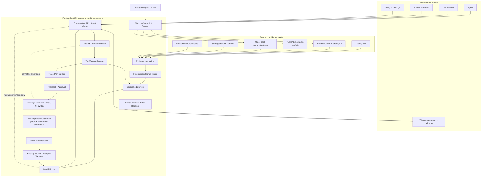
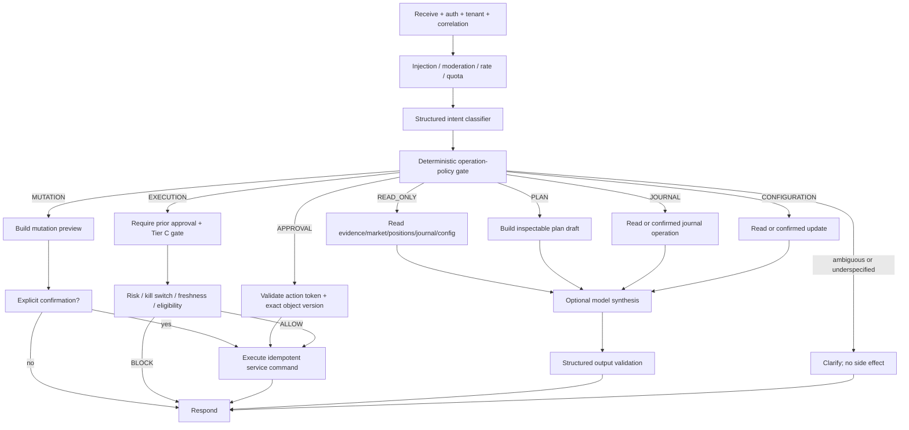
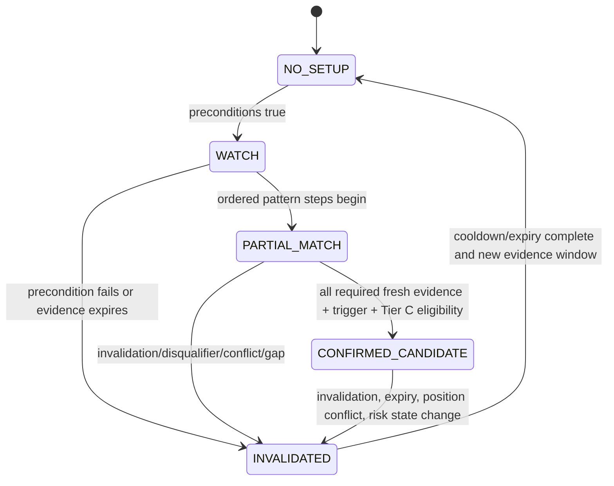
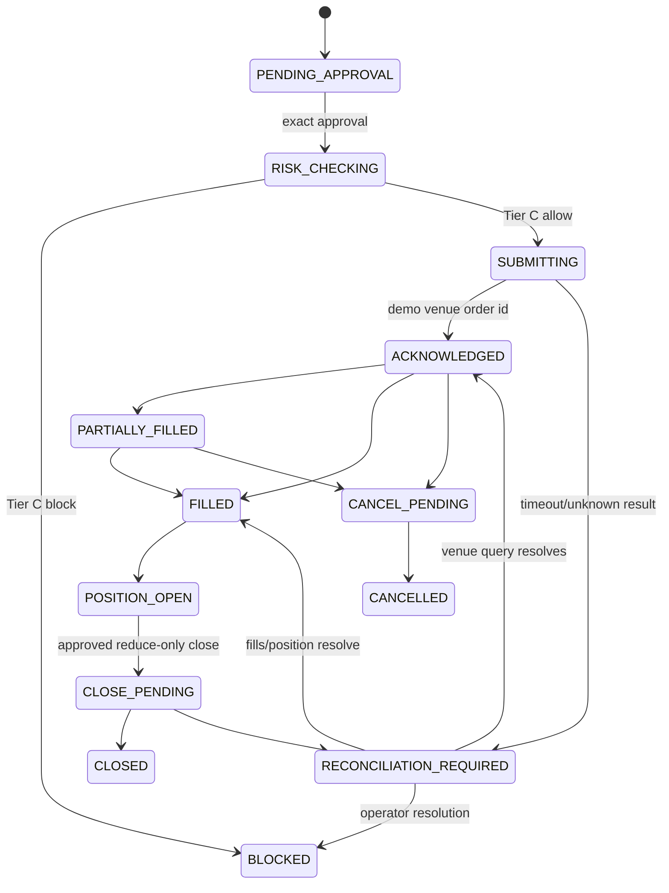

# AlphaTrade Agentic Redesign — Target Architecture

**Design basis:** `main@c0bd1d4d9c49948c44e7e23dc2a2572ea68a4a20`
**Status:** proposed architecture; no product implementation or capability enablement
**Non-negotiable boundary:** paper/internal simulation and BloFin demo only. No production
exchange host, real-money order, withdrawal, transfer, or live-trading enablement is part of
this architecture.

This document describes **TARGET** behavior unless a paragraph is explicitly labelled
**CURRENT**. Verified current state and dispositions are in
`docs/redesign/agentic_redesign_phase0_audit.md`. In particular, the checked-in staging
blueprint currently disables the worker, watcher, TradingView intake, paper-signal
orchestration, external alerts and Telegram, and uses `EXCHANGE_MODE=paper_internal`.

## Design principles

1. Keep AlphaTrade as a modular monolith plus one existing worker until measured load or
   isolation needs justify another deployable.
2. Preserve deterministic services as authorities. Models interpret, synthesize and explain;
   they do not decide risk, freshness, fusion thresholds, permissions or execution eligibility.
3. A read-only request cannot cross into planning or mutation without a new explicit user
   intent.
4. Carry immutable evidence and one correlation lineage from observation to lesson.
5. Reuse existing strategy, proposal, approval, risk, demo-exchange, journal and audit models;
   extend them rather than create parallel systems.
6. Enable one narrow vertical slice only after deterministic tests and an explicit deployment
   review.

## 1. Target component architecture



### Component ownership and reuse

| Responsibility | Owner | Reuse/new decision |
|---|---|---|
| HTTP/auth/tenant boundary | Existing FastAPI/auth dependencies | Reuse |
| Conversation orchestration | Existing LangGraph graph and `AgentRuntime` | Modify graph/state |
| Intent/operation authorization | Agent policy module adjacent to `agents/routing.py` | New component because current keyword intent has no operation-class authority |
| Tools/service facade | Existing `AgentRuntime` and `ToolRegistry` in `backend/src/app/agents/runtime.py` and `backend/src/app/tools/registry.py` | Modify; wrap existing services and remove successful no-op behavior after migration |
| Surveillance scheduling/health/lock | Existing worker | Reuse and modify |
| Watcher subscriptions | Extend watchlist domain | New schema/service behavior because existing watchlist has no timeframe/pattern/evidence expression |
| Evidence normalization | Evidence adapter/service plus repository | New because no current record can represent every source without losing lineage/freshness |
| Signal fusion | Deterministic service/repository | New because current orchestration is TradingView-specific and watcher candidates are flat |
| Pattern definitions | Existing `UserStrategy`/`UserStrategyVersion` plus structured rules | Extend; no second strategy system |
| Candidate lifecycle | Adapt `paper_signal_orchestration_service.py`, `repositories/paper_validation_candidate.py`, watcher and TradingView records | Merge via adapters, preserve old APIs during migration |
| Planning | Existing `pretrade_analysis_service.py`, `position_sizing_service.py`, `loss_acceptance_service.py` and `proposal_service.py` | Extend the existing planning stack; do not create a parallel builder |
| Approval/risk/execution | Existing approval, risk, kill switch and `ExecutionService` | Reuse as authorities; extend state and reconciliation |
| Telegram delivery | Existing `PaperAlertService`, `PaperValidationAlert`, delivery services and provider | Reuse outbound routing/delivery; actual automatic sender is missing; add inbound adapter/action gateway |
| Journaling/analytics/learning | Existing canonical journal, analytics, lesson and strategy-version services | Reuse and orchestrate |
| Model routing | Wrapper over existing `LLMProvider` | New router, reuse provider implementation |
| Reliable side effects | Transactional outbox/action receipt | New because direct cross-domain calls cannot guarantee delivery/replay recovery |

No new independently deployed microservice is proposed. “New service” above means a cohesive
module inside the current backend. It can become a deployable only after profiling and an
architecture review.

### One loop, two authority domains

“Agent-first” describes interaction and planning, not LLM control of surveillance. The
always-on half is deterministic: dedicated worker -> evidence -> pattern/fusion -> durable
candidate/outbox. The interactive half begins at Agent/Telegram: discussion -> explicit plan
or decision -> approval -> Tier C risk -> demo execution -> journal/learning. The model never
runs scan scheduling or changes fusion state.

**CURRENT:** `backend/src/app/workers/scanner.py` writes fixed-timeframe setup detections and
does not use subscriptions or fusion; `render.yaml` has `WORKER_ENABLED=false`.
**TARGET:** use the existing dedicated process entrypoint
`backend/src/app/workers/entrypoint.py` as the only staging/production watcher driver.
`backend/src/app/main.py` may retain in-process mode for local development, but it must not be
enabled alongside the dedicated worker.

## 2. Target data flow

```mermaid
sequenceDiagram
    participant W as Worker/Watcher
    participant E as Evidence Store
    participant F as Fusion
    participant A as Agent/Candidate
    participant T as Telegram
    participant U as User
    participant R as Risk Gate
    participant X as BloFin Demo
    participant J as Journal/Analytics

    W->>E: append normalized evidence (immutable)
    E->>F: evidence-ready event
    F->>F: freshness, quality, alignment, invalidation
    F->>A: confirmed candidate + transition reasons
    A->>T: durable alert outbox
    T->>U: candidate + APPROVE/REJECT/SKIP/EXPLAIN
    U->>T: authenticated idempotent action
    T->>A: action receipt
    A->>A: explicit PLAN_TRADE preview
    U->>A: explicit approval of exact plan version
    A->>R: immutable proposal + approval + current facts
    R-->>A: ALLOW/WARN/BLOCK (final)
    A->>X: demo-only order if ALLOW and approved
    X-->>A: acknowledgement/fills
    A->>X: reconcile orders/positions/PnL
    A->>J: lifecycle events and closed trade
    J->>J: excursions, statistics, lesson candidate
    J-->>U: review; no automatic rule promotion
```

Every step has:

- `correlation_id` for the lifecycle;
- immutable source/event IDs;
- tenant/user scope;
- `occurred_at`, `observed_at`, and `recorded_at`;
- idempotency key;
- actor and operation class;
- explicit current state and append-only transition reason;
- source/provenance/freshness/fallback metadata.

The outbox is needed only for side effects that cross a failure boundary (Telegram and demo
venue calls). Pure in-process deterministic calculations remain direct calls.

## 3. Target agent graph



Graph rules:

- `READ_ONLY` branches have no edge to proposal generation.
- `PLAN_TRADE` creates a versioned plan draft, not an approval or order.
- `APPROVE` applies only to a named object/version and action token.
- `EXECUTION` is not inferred from analysis, “looks good”, emoji, or button labels; it follows
  a validated approval receipt.
- Tool registration metadata is advisory; the operation-policy gate and domain service both
  enforce authorization/confirmation.
- Tier A/B model failure returns deterministic data or a clear unavailable response. It never
  relaxes Tier C.

This graph is a target simplification, not a removal list. Preserve the existing
`context_retrieval`/RAG, `strategy_workflow_tools`, `trading_analytics_retrieval`,
`memory_update`, quota/usage tracking, `narrative_enhancement`, and `output_validation` nodes
from `backend/src/app/agents/graph.py`; place them inside the appropriate branch above.
The new operation-policy gate centralizes and supersedes only the scattered operation decision,
while reusing lower-level confirmation helpers in
`backend/src/app/agents/mutation_policy.py` as defense in depth.

## 4. Target intent model

### Structured contract

```text
IntentDecision
  intent: Intent
  operation_class: READ_ONLY | PLAN | MUTATION | APPROVAL | EXECUTION | CONFIGURATION | JOURNAL
  target_type: optional resource type
  target_id: optional UUID
  target_version: optional integer/string
  requested_action: optional action
  extracted_parameters: bounded typed object
  explicit_confirmation: bool
  confidence: 0..1
  ambiguity_reasons: list[str]
  requires_clarification: bool
  classifier_source: deterministic | tier_b | deterministic_fallback
```

### Required intents and operation classes

| Intent | Default class | Permitted result without another intent |
|---|---|---|
| `MARKET_ANALYSIS` | READ_ONLY | Market/evidence summary only |
| `SETUP_ANALYSIS` | READ_ONLY | Pattern progress, evidence, invalidation; no proposal |
| `PLAN_TRADE` | PLAN | Versioned, non-executable plan draft |
| `REVIEW_TRADE` | READ_ONLY or JOURNAL | Comparison/review; journal write needs confirmation |
| `MANAGE_POSITION` | MUTATION | Preview first; exact confirmed update/close only |
| `JOURNAL` | JOURNAL | Read by default; explicit confirmed write |
| `EXPLAIN` | READ_ONLY | Explanation of existing facts/decisions |
| `CONFIGURE` | CONFIGURATION | Read current config or preview confirmed change |
| `APPROVE` | APPROVAL | Approve exact proposal/plan/action token only |
| `REJECT` | APPROVAL | Reject exact object; never execute |
| `SKIP` | APPROVAL | Record dismissal/skip; never execute |

Sub-intents can remain for strategy/backtest/lesson workflows, but every sub-intent declares one
operation class. If deterministic rules and Tier B disagree, choose the more restrictive class
and ask for clarification.

### Migration of current intent groups

| Current intent group in `backend/src/app/schemas/agent.py` | Target mapping |
|---|---|
| `MONITOR` | Rename/map to `MARKET_ANALYSIS/READ_ONLY` or watcher `CONFIGURE`; never proposal generation |
| `PLAN_TRADE`, `PRE_TRADE`, `POSITION_SIZE`, `INVALIDATION_QUERY`, `LOSS_ACCEPTANCE` | `PLAN` except purely explanatory queries, which are `READ_ONLY` |
| `EXECUTE` | `EXECUTION`, valid only with an approval receipt; it is never classifier-inferred from analysis |
| `REVIEW`, `HUMAN_VS_SYSTEM`, early-exit/stop queries | `REVIEW_TRADE/READ_ONLY` |
| strategy card/status/testability/structure intents | read by default; create/update is `MUTATION` with exact preview/confirmation |
| backtest and paper-validation query intents | `READ_ONLY`; start/run/tick actions are `MUTATION` |
| lesson query/suggest intents | `JOURNAL` read; accept/reject/create-version actions are confirmed `MUTATION` |
| scheduler, watcher, bridge and alert query intents | `READ_ONLY`; configuration/tick/delivery actions are confirmed `CONFIGURATION` or `MUTATION` |
| risk and notification settings actions | read as `CONFIGURATION`; update/test delivery requires preview and confirmation |

Examples:

- “Analyze SOL 15m” -> `MARKET_ANALYSIS/READ_ONLY`.
- “Does this match my exhaustion pattern?” -> `SETUP_ANALYSIS/READ_ONLY`.
- “Build a paper plan” -> `PLAN_TRADE/PLAN`.
- “Approve proposal 123 version 4” -> `APPROVE/APPROVAL`; approval is not execution.
- Telegram callback `approve:<nonce>` -> validated `APPROVE`, bound to object/version/user.
- “Close it” without one unambiguous position -> clarification, no mutation.

## 5. Target normalized evidence schema

The schema should be a strict Pydantic v2 model and immutable persisted event. It adapts, not
replaces, existing source records.

```text
NormalizedEvidence
  schema_version: "1.0"
  evidence_id: UUID
  correlation_id: UUID
  organization_id: UUID
  symbol: normalized symbol
  timeframe: Timeframe
  observed_at: datetime
  recorded_at: datetime
  source: BINANCE_OHLCV | BINANCE_TRADES | ORDER_BOOK | TRADINGVIEW |
          PATTERN_ENGINE | PORTFOLIO | RISK | JOURNAL | MANUAL
  source_provider: string
  source_event_id: string
  signal_type: string
  category: PRICE_STRUCTURE | VOLUME | CVD | ORDER_FLOW | EXTERNAL_SIGNAL |
            POSITION | PORTFOLIO | RISK | BEHAVIOR | STRATEGY
  direction: LONG | SHORT | NEUTRAL
  strength: 0..1
  confidence: 0..1
  trigger_level: Decimal?
  invalidation_level: Decimal?
  metrics: bounded dict[str, Decimal|int|bool|string]
  raw_evidence: bounded, redacted JSON
  freshness:
    state: FRESH | AGING | STALE | GAP | UNKNOWN
    age_seconds: non-negative number
    max_age_seconds: positive number
    sequence_complete: bool?
    reason: string?
  provider_quality:
    is_live: bool
    fallback_used: bool
    quality_score: 0..1
    limitations: list[str]
  pattern_id: UUID?
  pattern_version_id: UUID?
  strategy_id: UUID?
  strategy_version_id: UUID?
  regime: MarketRegime?
  valid_until: datetime
  content_hash: SHA-256
```

Required constraints:

- uniqueness on `(organization_id, source, source_event_id, signal_type)` or equivalent source
  identity;
- no secret-bearing raw payloads;
- decimal values serialized without binary-float drift where calculations matter;
- source-specific freshness policy, not one global age;
- append-only correction/supersession rather than mutation;
- adapter links to current `TradingViewSignal`, `MarketWatcherObservation`,
  `SetupDetectionRecord`, `PaperSignal`, risk snapshots and journal records;
- fallback/mock evidence can be displayed but cannot contribute to
  `CONFIRMED_CANDIDATE`.

Reuse:

- `MarketDataEnvelope` supplies most provider/freshness fields;
- `MarketWatcherCandidate`, `TradingViewSignalItem`, `PaperSignalResult`, analysis
  `SetupDetection`, and orchestration checks become adapters;
- do not overload `MarketWatcherObservation`: it cannot represent non-market or multiple
  evidence categories without becoming an unbounded generic table.

## 6. Signal-fusion lifecycle

`SignalFusionService` is deterministic. A versioned `FusionPolicy` references one Pattern Card
version and declares required/optional/disqualifying evidence, windows, thresholds and
freshness. It emits an immutable assessment plus a transition.



Exact transition rules:

| From -> to | Required deterministic reason |
|---|---|
| `NO_SETUP -> WATCH` | Pattern universe matches symbol/timeframe/regime and all hard preconditions pass |
| `WATCH -> PARTIAL_MATCH` | At least one required sequence step has passed in order; no disqualifier; evidence remains fresh |
| `PARTIAL_MATCH -> CONFIRMED_CANDIDATE` | Every mandatory sequence step and trigger passed; required price, volume, CVD and order-flow evidence are fresh, non-fallback, sequence-complete and directionally aligned; weighted score >= alert threshold; no current Tier C candidate eligibility block |
| `* -> INVALIDATED` | Pattern invalidation level crossed, explicit disqualifier, required source stale/gapped, directional conflict outside tolerance, candidate TTL elapsed, duplicate active candidate, position/exposure conflict, kill switch or risk policy invalidates eligibility |
| `INVALIDATED -> NO_SETUP` | Previous evidence window expires/cooldown ends and a distinct source window/content hash begins |

Each assessment records: policy/version, evidence IDs, per-rule pass/fail, weights, threshold,
state, previous state, reason codes, human-readable deterministic explanation, and expiry.
Tier A may explain conflicts but cannot change the state.

## 7. Pattern Card design

Pattern Cards extend the existing strategy system:

- identity/lifecycle remain `UserStrategy` and `UserStrategyVersion`
  (`schemas/strategy_library.py`, repository/models);
- narrative trading plan fields remain `StrategyCard`;
- executable predicates remain `StructuredRules`;
- a versioned `PatternDefinition` extension adds sequential detection and evidence fusion.

```text
PatternDefinition
  pattern_id: same stable identity as strategy or linked one-to-one
  name
  version: immutable integer
  coins: list[Symbol]
  timeframes: list[Timeframe]
  regimes: list[MarketRegime]
  preconditions: list[TypedPredicate]
  sequence: ordered list[PatternStep]
  trigger: TypedPredicate + trigger-level expression
  invalidation: list[TypedPredicate] + invalidation-level expression
  supporting_evidence: list[EvidenceRequirement]
  disqualifying_conditions: list[TypedPredicate]
  confidence_factors: list[WeightedFactor]
  examples: list[EvidenceReference]
  counterexamples: list[EvidenceReference]
  alert_threshold: 0..1
  historical_statistics: immutable snapshot reference
  paper_statistics: immutable snapshot reference
  promotion_state: DRAFT | STRUCTURED | HISTORICALLY_VALIDATED |
                   PAPER_VALIDATING | REVIEW_REQUIRED | APPROVED | RETIRED
```

Screenshots are evidence references/attachments, not executable rules. The agent can use Tier A
to draft a Pattern Card from screenshots and descriptions, but:

1. schema validation must pass;
2. every executable expression must compile to allowlisted deterministic predicates;
3. the user reviews the exact draft;
4. historical and paper-validation evidence is linked;
5. promotion requires explicit user approval and creates a new immutable strategy version.

Reuse mappings:

| Pattern Card need | Existing owner |
|---|---|
| Name, asset universe, timeframes, entries, invalidation, TP/runner/no-trade rules | `StrategyCard` |
| Machine-testable predicates | `StructuredRules`, structured rule validation/resolver |
| Versioning/promotion status | `UserStrategyVersion`, strategy promotion/quality services |
| Examples/counterexamples | Journal evidence/attachments and RAG documents |
| Historical statistics | Backtest datasets/runs/trades and setup evidence service |
| Paper statistics | Paper-validation runs, sample windows and metrics |
| Manual levels | Existing manual-level service/repository |

The only necessary new model is the pattern-specific sequence/evidence extension; creating a
separate strategy library would duplicate identity, versioning, testing and promotion.

## 8. Model-routing architecture

**CURRENT:** one global `LLM_MODEL` serves the graph. Active narrative prompts live in
`backend/prompts/trading_analysis_narrative.txt`, `risk_explanation.txt`, and
`journal_review_coach.txt`; `backend/src/app/agents/prompts/system.md` is an unused placeholder.
The `usage_tracking` node in `backend/src/app/agents/nodes.py` makes a completion solely to
collect estimated usage, so a narratively enhanced request can incur two model calls without
two reasoning tasks.

**TARGET:** add `ModelRouter` above the current `LLMProvider`. Routing uses a typed task, impact,
and data classification; callers never supply free-form model names.

| Tier | Work | Policy |
|---|---|---|
| Tier A — frontier reasoning | High-impact candidate synthesis, ambiguous multi-source interpretation, strategy creation/modification drafts, post-trade root cause, weekly review, promotion recommendation, complex planning | Explicit task allowlist; structured output; bounded context/cost/timeout; no direct mutation; fail closed to deterministic facts or human review |
| Tier B — fast/cheap | Intent classification, routine summaries, journal extraction, alert wording, simple Q&A, metadata and retrieval synthesis | Structured output; deterministic fallback where possible; low token budget |
| Tier C — deterministic code | Risk, sizing, daily loss, kill switch, cooldowns, fusion thresholds, freshness, eligibility, pattern math, permissions/idempotency | Existing/new typed services; no LLM call and no override path |

Suggested contract:

```text
ModelTaskRequest(task_type, impact, messages/context, output_schema,
                 max_latency_ms, max_cost, fallback_policy, correlation_id)
ModelTaskResult(parsed_output, tier, provider, model, tokens, latency,
                estimated/provider cost, fallback_used, validation)
```

Reuse `OpenAILLMProvider`, `MockLLMProvider`, request/result types, provider factory, usage
service, narrative guardrail and prompt files. Add:

- task-to-tier/model policy;
- separate configuration per Tier A/B;
- circuit/budget policy and task telemetry;
- schema-specific validators;
- versioned prompts for intent, synthesis, pattern drafting and review;
- provider-result accounting or deterministic token estimation instead of a metering-only
  model completion.

Tier A candidate synthesis consumes an already-determined fusion assessment and can recommend
“ask user” or “insufficient context”; it cannot promote `PARTIAL_MATCH`, alter thresholds, or
mark stale data fresh. If Tier A and Tier C disagree, Tier C wins and the disagreement is
audited.

### Dynamic trade planning

**CURRENT:** `backend/src/app/services/pretrade_analysis_service.py` already emits an entry
zone, stop, TP levels, runner logic, size, leverage, risk/reward and confidence through
`backend/src/app/schemas/pretrade.py`. `position_sizing_service.py` performs deterministic
sizing and `proposal_service.py` persists the reviewed plan. However, current pre-trade logic
uses fixed percentage offsets and can substitute a `60000` placeholder when price is missing;
agent proposal paths in `backend/src/app/agents/nodes.py` also contain placeholder defaults.
Those values must never become executable.

**TARGET:** extend this stack into an inspectable, versioned plan derivation:

| Field | Deterministic derivation |
|---|---|
| Entry zone | Pattern trigger expression intersected with fresh support/resistance/manual level and allowed slippage/tick size |
| Stop | Pattern invalidation plus direction-aware ATR/tick buffer; never moved farther merely to fit size |
| TP1 | Nearest valid structure target meeting policy minimum R, or explicit Pattern target |
| TP2 | Next valid structure target/Pattern target, preserving monotonic target order |
| Runner | Pattern exit predicate, activation after configured partial fill, remaining size fraction and trailing rule |
| Position size | `effective_risk_budget / abs(entry-stop)`, rounded down to demo instrument lot size |
| Effective risk | stop distance * rounded size + conservative fees and slippage |
| Reward/risk | per-target net expected reward divided by effective risk; no model-generated arithmetic |
| Permitted leverage | minimum needed for notional within margin, capped by user/risk/instrument policy; leverage never increases risk budget |
| Maximum expected loss | stop loss + fee/slippage allowance, checked against per-trade and daily remaining limits |
| Confidence | transparent weighted fusion factors, sample quality and penalties; Tier A interpretation is a separate labelled field |
| Reasons | evidence IDs, rule pass/fail, derivation formula, inputs, rounding and limitations |

`TradePlanVersion` can be represented by extending the proposal/draft schema rather than a new
unrelated store. It is immutable once offered for approval. Any `REDUCE RISK`, changed level,
freshness update or partial fill creates a new version and invalidates the old approval token.
A missing/fallback/stale executable price yields “analysis only / cannot plan,” never a
placeholder plan.

## 9. Continuous watcher architecture

### Subscription model

Extend watchlists with a versioned subscription:

```text
WatcherSubscription
  user/org
  symbols
  timeframes
  pattern_version_ids
  evidence_requirements
  alert_threshold override within policy bounds
  quiet hours/delivery preference reference
  enabled
  version
  created_by / confirmed_by
```

“Add SOL to the 15m watcher and alert only when bearish CVD divergence and order-flow
exhaustion agree” becomes:

1. `CONFIGURE` intent;
2. Tier B extracts a proposed typed subscription;
3. deterministic validation rejects unknown symbols/timeframes/evidence types;
4. agent displays a diff;
5. explicit confirmation persists a new subscription version and audit event.

### Runtime

1. Existing worker obtains a Redis lock; non-local Redis failure blocks scans rather than
   falling back to process-local exclusion.
2. Load active subscriptions, batch by source/symbol/timeframe.
3. Fetch closed-candle OHLCV and trade/order-book evidence with sequence tracking.
4. Normalize immutable evidence.
5. Run deterministic Pattern evaluator and fusion.
6. Upsert fusion assessment with optimistic/idempotent transition.
7. Create one candidate/outbox alert for a unique pattern version/evidence window.
8. Persist heartbeat, per-source latency/freshness/gaps, scan outcome and errors.

Manual API scans call this same pipeline with `dry_run=true`; they do not maintain a separate
detector path. Existing `MarketWatcherService`, scanner detectors, observations, scan records,
worker health/lock, bridge decisions and alert dedupe are reused. The bridge is retired only
after its paper-validation links are represented by the common lifecycle.

## 10. Telegram interaction architecture

### Outbound

**CURRENT:** `backend/src/app/services/telegram_automatic_delivery_service.py` only computes a
read-only preview/readiness; it is not an automatic sender. Manual and generic outbound
delivery are implemented but disabled in staging.

Reuse the persisted `PaperValidationAlert` model through
`backend/src/app/services/paper_alert_service.py`, notification preferences, delivery routing,
`TelegramAlertDeliveryProvider` in
`backend/src/app/providers/alert_delivery/telegram.py`, manual service/retries and delivery
audit. Add the missing automatic outbox consumer, with a durable claim before calling Telegram,
and a richer formatter:

- symbol/timeframe/pattern/version;
- fusion state and deterministic reason summary;
- freshness/provider/fallback disclosure;
- entry zone/invalidation only if a plan exists;
- candidate expiration;
- paper/demo-only label;
- inline actions allowed for the current state.

### Inbound

Add one Telegram webhook adapter in the FastAPI application and one channel-neutral
`RemoteActionGateway`. It is new because outbound delivery services must not parse or authorize
mutations. The gateway delegates domain actions to the existing proposal/approval/position
services and APIs; it is not a second mutation stack.

Security and idempotency:

- HTTPS webhook with Telegram secret-token header;
- configured bot identity plus tenant-bound allowlist of Telegram chat and user IDs;
- no credentials in messages/callback data;
- callback contains only an opaque, random action nonce;
- nonce record binds tenant, user, resource ID/version, allowed action, expiry and one-time
  use;
- unique `update_id` and `callback_query_id` receipts;
- compare-and-set action state (`RECEIVED -> CLAIMED -> APPLIED/REJECTED`);
- role/ownership, object state, expiration and current risk rechecked server-side;
- every receive/replay/reject/apply/result is audited;
- repeated delivery returns the original outcome.

### Actions

| Action | Intent/behavior |
|---|---|
| `APPROVE` | Approve exact plan/proposal version; does not itself bypass execution gate |
| `REJECT` | Reject exact candidate/proposal |
| `SKIP` | Dismiss candidate/evidence window |
| `REDUCE RISK` | Generate a lower-risk plan preview; requires approval of new version |
| `EXPLAIN` | Read-only Tier A/B explanation over frozen evidence |
| `SHOW CHART` | Read-only chart artifact/reference |
| `CLOSE` | Preview exact reduce-only demo/internal paper close; second explicit confirmation required |
| `STATUS` | Read-only candidate/order/position/reconciliation state |

Every response reports whether state changed and includes the authoritative current state.

## 11. BloFin demo execution architecture

Keep `ExecutionService`, `PaperExecutionRiskGate`, kill switch, approval records, internal
idempotency and BloFin providers. Modify demo routing from best-effort mirroring into an
explicit coordinator when `EXCHANGE_MODE=paper_exchange_demo`.

**CURRENT:** `backend/src/app/services/execution_service.py` records an internal fill first and
best-effort mirrors to BloFin demo. `backend/src/app/db/models.py` and
`backend/src/app/repositories/exchange_orders.py` already persist exchange orders/fills, while
`backend/src/app/services/blofin_sync_service.py` persists read-only account/position
snapshots. These are the reconciliation foundation, not proof of reconciled execution.



Rules:

- startup and each call retain `assert_demo_host`, paper mode, real-trading false and
  permission checks;
- venue client order ID derives from immutable execution idempotency key;
- an ambiguous timeout is never blindly resubmitted; query by venue/client ID first;
- internal state reflects venue acknowledgement/fills rather than preemptively claiming a
  fill in demo mode;
- partial fills update weighted average, fees and remaining size;
- reconciliation polls bounded order/position snapshots and raises visible stale/uncertain
  states;
- close is reduce-only and bound to current reconciled size/position mode;
- PnL, fees and funding are reconciled before final journal completion;
- cancellation and close have independent idempotency keys;
- the production host denylist and demo allowlist remain unchanged;
- `trade_live` remains a startup tombstone.

`BloFinSyncService` becomes a reconciliation input, not a separate source of execution truth.
If demo mode is disabled, existing internal paper execution remains available and clearly
labelled.

The `AUTO_PAPER` paper-validation simulator in
`backend/src/app/services/paper_validation_runtime_service.py` and
`backend/src/app/services/paper_bot_engine.py` remains a backtest/paper-validation subsystem.
It must never route to BloFin, mint a remote approval, or be relabelled demo execution. Only
the approval-bound `ExecutionService` path may reach the BloFin demo provider.

## 12. Automatic journal architecture

**CURRENT:** `JournalTrade` is the canonical trade-intelligence record used by import,
statistics/comparison, excursions and auto-journal hooks, while legacy `TradeJournal` still
owns the main journal-entry UI, per-trade human-versus-system resolution and journal-to-RAG
sync. Both auto-journal hooks are implemented but disabled by default. This is a migration
split, not two target sources of truth.

**TARGET:** create no second journal. Use `JournalTrade` as the lifecycle projection and
existing linked IDs. Lifecycle events update it idempotently:

| Event | Journal projection |
|---|---|
| Candidate confirmed | Optional planned draft with pattern/evidence/correlation links |
| User skipped/rejected | Decision event retained; no executed trade |
| Plan version approved | Thesis, trigger, entry zone, stop, targets, runner, planned risk |
| Demo order submitted/fills | Order link, actual entry, size, leverage, fees/slippage |
| Position monitoring | Append position/risk/management observations, not mutable prose |
| Close/reconciliation | Exit, reason, realized PnL, funding/fees, final status |
| Historical replay | MFE/MAE, available profit, completeness/freshness |
| Analytics | Rule checks, plan adherence, runner/stop discipline |
| Lesson detection | Reviewable `LessonCandidate`, never a strategy mutation |

Use one idempotency key such as `(correlation_id, projection_event_type, source_event_id)`.
Critical execution/close commits enqueue journal projection through the outbox; journal failure
does not roll back a confirmed venue action but is visible and retryable. This is stricter than
silently swallowing all auto-journal errors.

The user can edit reflective notes, but reconciled prices/fills/PnL retain provenance and
cannot be silently overwritten. Corrections are append-only with actor/reason.

Move the journal hub, canonical trade detail/attachments, `HumanVsSystemService`, discipline
analysis and RAG sync onto `JournalTrade` through compatibility adapters and the existing
backfill path. Keep legacy entry reads during migration; deprecate them only after linkage,
count and behavior-parity tests pass. Accepted lessons—not raw unresolved observations—remain
the strategy-learning input.

## 13. Learning and versioning architecture

```mermaid
flowchart LR
    DET["Detection"] --> CAN["Candidate"]
    CAN --> DEC["Human decision"]
    DEC --> EXE["Demo execution"]
    EXE --> OUT["Outcome"]
    OUT --> J["Canonical journal"]
    J --> ST["Statistics"]
    ST --> REV["Tier A review + deterministic facts"]
    REV --> LES["Proposed lesson"]
    LES --> HV["Historical validation"]
    HV --> PV["Paper validation"]
    PV --> UA["User approval"]
    UA --> NV["New immutable strategy version"]
```



Gates:

1. Detection/candidate preserves evidence IDs and Pattern version.
2. Journal facts are deterministic; model-generated interpretation is labelled.
3. Lesson starts `PENDING_REVIEW`.
4. Accepting a lesson does not change an active strategy.
5. A proposed rule compiles to structured rules and creates a draft version.
6. Historical validation uses immutable dataset hash, assumptions and out-of-sample evidence.
7. Paper validation uses bounded sample windows and minimum criteria.
8. Promotion recommendation is advisory.
9. User explicitly approves the exact version diff.
10. New strategy version activates only through existing promotion/enablement policy.

**CURRENT caveat:** `StructuredRulesService` patching and one accepted-lesson attach path can
modify the latest strategy version in place. Before the target learning loop is enabled, every
semantic card/rule change must instead create a new immutable draft version with actor, source
lesson, diff and approval lineage.

No model writes executable rule code, changes thresholds, or promotes itself. Rollback means
selecting a previous immutable approved version, not rewriting history.

## 14. Four-surface frontend architecture

### 1. Agent

- conversational timeline;
- structured intent and “no action taken” indicator;
- evidence/candidate cards;
- plan diff and calculation inspector;
- approval and mutation previews;
- explanations, coaching and strategy drafting;
- links to secondary expert screens.

Reuse `frontend/src/app/(app)/workspace/page.tsx`, narrative/analysis/risk/proposal/approval
cards, workflow adapters and API client. Merge the dashboard components from
`frontend/src/app/(app)/page.tsx`, proposals, approvals, pre-trade, manual-level forms,
coaching and strategy create/edit flows. Keep expert strategy/backtest/validation screens
secondary.

### 2. Live Watcher

- worker health and data-source freshness;
- conversational subscriptions;
- selected symbols/timeframes/patterns;
- evidence timelines and fusion states;
- candidates, invalidations and alert delivery status;
- TradingView as one source, not a separate top-level product.

Reuse watcher scanner/status/history, signals inbox, alert review, watchlist and market panels.
Hide low-level orchestration controls by default.

### 3. Trades & Journal

- open/reconciling/closed paper and demo positions;
- proposal/approval/execution lineage;
- close/status actions;
- automatic journal and reflective notes;
- PnL/performance/setup/discipline/learning analytics;
- lessons awaiting review.

Reuse portfolio, positions, journal, analytics, comparison, learning and lesson components.

### 4. Safety & Settings

- global and tenant kill-switch state;
- risk/daily-loss/overtrading/cooldown settings;
- provider and freshness posture;
- watcher and Telegram status/preferences;
- BloFin demo-only diagnostics/reconciliation;
- audit and usage;
- explicit permanent “real trading disabled” posture.

Reuse settings, risk, notification, exchange diagnostics, audit, usage, billing and team
components. Advanced/debug screens remain deep links.

Route hiding is navigation-only initially. Compatibility URLs stay functional until telemetry
and migration criteria support deprecation. The consolidation authority is
`frontend/src/components/layout/navigation-config.ts`. `/knowledge`,
`/paper-validation/*`, `/strategy-lab/*` and backtest detail routes remain reachable
secondary expert workflows even when absent from primary navigation.

## 15. Migration plan

### Phase 0 — completed by these documents

- inventory and architecture only;
- no product, migration, flag or deployment changes.

### Phase 1 — semantic safety foundation

1. Add intent/operation contract and deterministic operation-policy gate.
2. Split read-only analysis from planning in the graph.
3. Adapt current tools to real services; mark/remove no-op tools from agent reach.
4. Add regression tests proving analysis cannot create/persist proposals or approvals.

### Phase 2 — evidence and pattern foundation

1. Add normalized evidence and source adapters.
2. Extend strategy versions with Pattern definition.
3. Add deterministic pattern sequence evaluator and fusion lifecycle.
4. Backfill nothing initially; process new evidence only for the slice.

### Phase 3 — one surveillance pipeline

1. Extend watchlist into versioned subscriptions.
2. Route manual and worker scans through one pipeline.
3. Add CVD/trade-flow and order-flow source adapters with sequence/freshness tests.
4. Preserve old watcher/TradingView endpoints through adapters.

### Phase 4 — candidate and Telegram loop

1. Adapt fused candidate to existing alert/proposal domains.
2. Add outbox and exactly-once-effect action receipts.
3. Add authenticated inbound Telegram callbacks and read-only actions first.
4. Add approval/reject/skip only after replay/auth tests.

### Phase 5 — demo execution and reconciliation

1. Extend execution state model for demo acknowledgements/fills.
2. Integrate bounded reconciliation and uncertainty handling.
3. Add reduce-only close and PnL/fee/funding reconciliation.
4. Keep flags off through test and independent safety review.

### Phase 6 — journal/learning projection

1. Enable idempotent lifecycle journal projection for the slice.
2. Compute excursions and analytics.
3. Gate lessons through historical validation, paper validation and explicit version approval.

### Phase 7 — four-surface consolidation

1. Assemble four surfaces from current components.
2. Move routes from primary nav to secondary/hidden according to the audit matrix.
3. Add redirects only after deep links and tests are migrated.
4. Delete only in a separately approved cleanup task with usage evidence.

## 16. Testing strategy

### Deterministic contract tests

- intent table: every required intent, ambiguity and adversarial phrase;
- property: `READ_ONLY` cannot produce proposal/approval/order writes;
- characterization in `backend/tests/test_agent_graph.py` first captures the current
  analyze-to-plan defect; the Phase 1 acceptance assertion then requires “analyze SOL” to
  produce no persisted or in-memory proposal;
- operation-policy matrix by intent, role, object state, confirmation and channel;
- evidence schema validation, decimal canonicalization, dedupe and redaction;
- source-specific freshness/sequence-gap boundaries;
- fusion state transition table and reason codes;
- Pattern predicate and ordered-sequence golden fixtures;
- CVD calculation from signed trades and reset/window semantics;
- order-flow imbalance/exhaustion fixtures with gaps and reordering;
- sizing/risk calculations with exact Decimal expected values;
- kill switch/daily loss/overtrading/cooldown remain final.

### Integration tests

- worker lock/heartbeat/recovery and no local-lock fallback outside local;
- watcher -> evidence -> fusion -> one outbox alert;
- duplicate evidence/worker retry creates no duplicate candidate;
- Telegram webhook secret, user/chat binding, nonce expiry, replay and idempotent receipt;
- approval bound to exact proposal version;
- demo timeout -> reconciliation query, never blind resubmit;
- partial fill/cancel/reduce-only close and position-mode handling;
- stale/fallback/gapped data blocks confirmation/execution;
- journal projection retries and exactly one canonical trade;
- lesson cannot activate a strategy without every gate and explicit approval.
- existing paper-signal orchestration and watcher-bridge tests stay green while adapters
  replace direct workflow links.

### Provider contract/black-box tests

- Binance/trade-feed/order-book response mapping and timestamps;
- Telegram API error/retry sanitization;
- BloFin demo host allowlist, signed requests, order states, fills and permission probes;
- no test may call a production exchange host.

### End-to-end and evaluations

- Playwright four-surface flows with deterministic fixtures;
- Telegram callback protocol tests without external delivery by default;
- agent/RAG/guardrail existing evaluations remain 100%;
- new candidate-synthesis evaluation checks citations, conflicts and uncertainty, but state
  transitions are asserted from deterministic outputs;
- deployment safety test asserts all automation flags remain false until explicitly reviewed;
- permanent negative tests for `ENABLE_REAL_TRADING=true`, `EXCHANGE_MODE=trade_live`, and
  production BloFin URLs.

Release gates for the vertical slice: all deterministic tests pass, no unresolved
reconciliation state in the drill, duplicate/replay tests pass, audit lineage is complete, and
an independent architecture/security/trading-safety review approves enabling demo-only flags.

## 17. First vertical slice

### Fixed scope

- coin: `SOLUSDT`;
- timeframe: `15m`;
- one user Pattern Card: bearish exhaustion reversal;
- required evidence: price sequence + bar volume expansion/exhaustion + bearish CVD divergence
  + buyer exhaustion/order-flow reversal;
- one Telegram-bound user/chat;
- BloFin demo only;
- one position at a time; market or limit entry chosen by the approved plan; reduce-only exit;
- no other symbols, timeframes, patterns, channels or autonomous promotion.

The slice is blocked from implementation until a read-only CVD/trade-flow source and its
sequence/freshness semantics are selected and recorded as an architecture decision. The
existing `backend/src/app/providers/market_data.py` has no public-trades contract from which
aggressor-signed CVD can be derived.

Example deterministic pattern (final thresholds require user review and historical fixtures):

1. SOL makes a higher high near a versioned resistance/manual level.
2. Latest push has required volume behavior.
3. Price higher high and CVD lower high occur within the same bounded window.
4. Aggressive buy imbalance weakens and/or absorption/exhaustion predicate passes.
5. Bearish trigger closes below the trigger level.
6. Invalidation is above the exhausted swing plus configured deterministic buffer.

### Reuse map and missing work

| Step | Reuse | Missing/modify |
|---|---|---|
| SOL 15m selection | Existing symbol/timeframe and watcher support | Versioned subscription |
| User pattern | Strategy cards, versions, structured rules, attachments/manual levels | Pattern sequence/evidence extension |
| Price structure | Analysis engine and detectors | Pattern adapter and fixtures |
| Volume | OHLCV, volume ratio/VWAP | Pattern-specific volume predicate |
| CVD | None | Read-only trade source, signed-trade normalizer, rolling CVD/divergence |
| Order flow | Order-book contract | Stream/snapshot quality, imbalance/exhaustion features |
| Watcher | Worker, lock, health, watcher persistence | Unified pipeline and non-local lock fail-closed |
| Evidence | Provider envelopes and source records | Normalized evidence/store/adapters |
| Fusion | Orchestration checks offer patterns | New deterministic fusion lifecycle |
| Agent candidate | Agent runtime, RAG, narrative, paper candidates | Explicit candidate synthesis intent/tool |
| Telegram alert | Alerts/preferences/provider/manual delivery | Outbox, rich formatter, automatic sender |
| User approval | Approval records/service | Authenticated inbound callback/action nonce |
| Risk gate | Existing risk, daily accounting, kill switch, sizing | Bind fused/plan freshness and demo state |
| BloFin demo execution | Client/account/execution/factory, internal idempotency | Authoritative demo state coordinator |
| Reconciliation | Read-only BloFin snapshots/get order | Order/fill/position/PnL reconciliation |
| Exit | Internal paper close and provider reduce-only field | Approved reconciled reduce-only close |
| Journal | Canonical journal, links, auto hooks, excursions | Durable lifecycle projector enabled for slice |
| Analytics/learning | Existing stats, analyzers, lessons, versions, validation | Correlation lineage and enforced promotion workflow |

### Acceptance trace

One recorded drill must show:

`SOL 15m evidence IDs -> fusion transition reasons -> candidate ID -> Telegram delivery ID ->
authenticated callback receipt -> plan/proposal version -> approval ID -> fresh risk result ->
demo client order ID/order ID -> fills -> reconciled position -> reduce-only close -> reconciled
PnL -> one journal trade -> analytics -> pending lesson (if any)`.

Replay the evidence, alert delivery, callback, order request, reconciliation and journal events.
Each replay must converge without duplicates. Force stale data, sequence gaps, risk block,
Telegram replay, demo timeout and partial fill; each must reach the specified safe state.

All slice automation remains disabled while implementing and testing. A separate deployment
review may propose only the minimum staging/demo flags: dedicated `WORKER_ENABLED`, watcher,
external alert/Telegram and `EXCHANGE_MODE=paper_exchange_demo` with the existing safety
requirements. TradingView, scheduler, bridge and legacy paper-signal orchestration remain off
unless the slice explicitly uses them. `EXECUTION_MODE=paper` and
`ENABLE_REAL_TRADING=false` are permanent gates.

## 18. Explicit implementation sequence

The sequence below is dependency-ordered, not a schedule:

1. Freeze current safety invariants as characterization tests.
2. Introduce `IntentDecision`/operation class and split graph branches.
3. Prove analysis/setup questions cannot create proposal, approval, order or config writes.
4. Define normalized evidence and adapters for existing OHLCV, detector and TradingView data.
5. Extend strategy version schema with Pattern definition and deterministic validation; remove
   in-place semantic rule mutation before any learning write can use it.
6. Add Pattern evaluator and fusion assessment/transition persistence.
7. Choose and contract-test read-only CVD trade data; implement sequence-gap handling.
8. Implement order-flow features from the chosen read-only source; do not call order blocks
   “order flow.”
9. Extend watchlists to subscriptions and unify worker/manual surveillance.
10. Add durable outbox for candidate alert delivery.
11. Add Telegram inbound authentication, action nonce and replay receipts; ship read-only
    `EXPLAIN`, `SHOW CHART`, and `STATUS` first.
12. Add `REJECT`/`SKIP`, then exact-version `APPROVE`; keep execution flags off.
13. Make dynamic plan derivation inspectable and bind its facts to evidence IDs.
14. Extend demo execution state and reconciliation; test against mocks/contract fixtures.
15. Add demo-only order/partial-fill/cancel/reduce-only close drills.
16. Add lifecycle journal projection and analytics/lesson linkage.
17. Run the full vertical-slice acceptance trace and failure matrix.
18. Obtain independent architecture, security and trading-safety review.
19. In a separately authorized deployment task, enable only the minimum slice flags in
    staging/demo and monitor explicit health/reconciliation metrics.
20. Assemble the four primary surfaces; hide old routes only after compatibility tests.

At no step is real trading enabled. Any design change that would permit a production exchange
host or allow an LLM to override Tier C requires rejection, not incremental acceptance.
