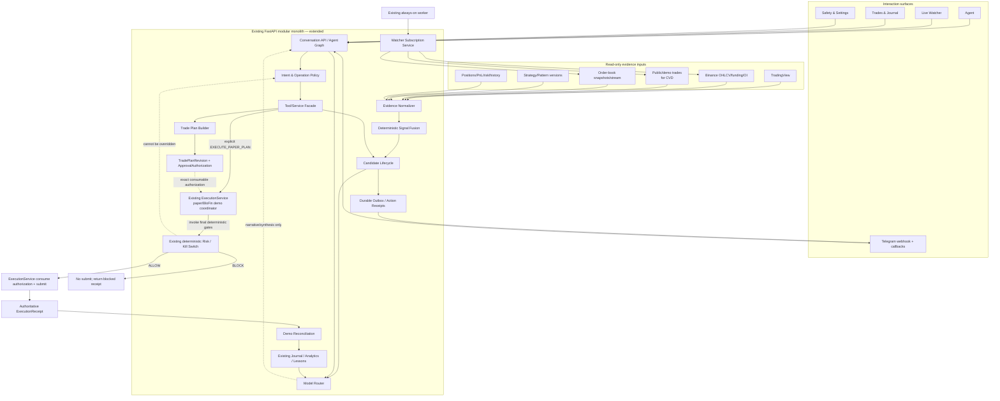
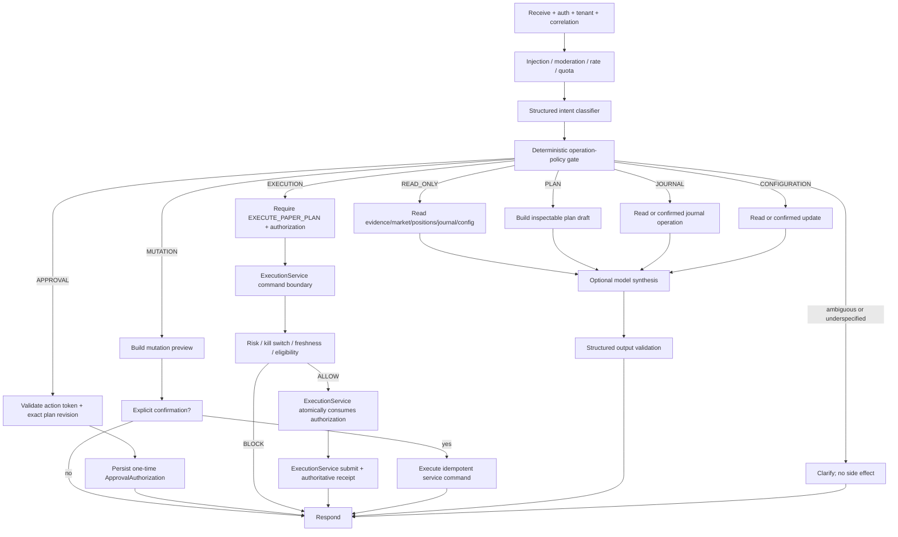
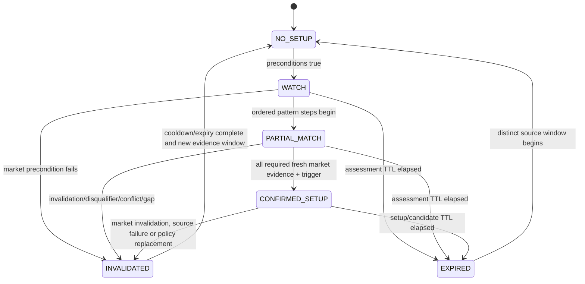
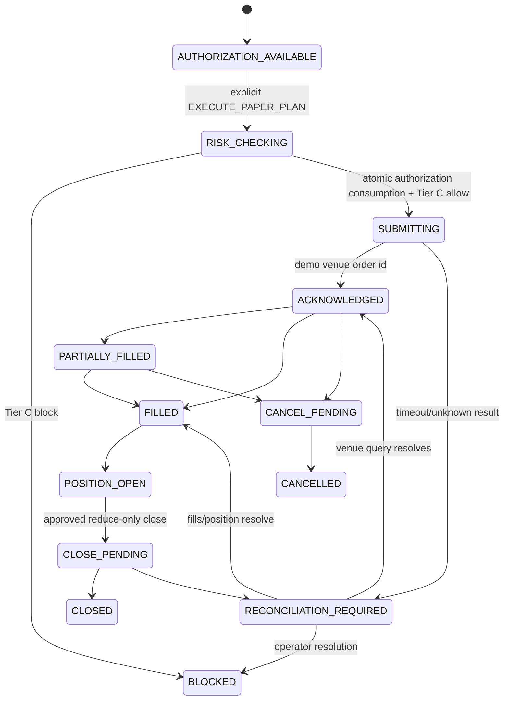

# AlphaTrade Agentic Redesign — Target Architecture

**Design basis:** `main@c0bd1d4d9c49948c44e7e23dc2a2572ea68a4a20`
**Revision basis:** independent architecture review PR #65 at `3a1a80f`
**Status:** revised proposed architecture; no product implementation or capability enablement
**Non-negotiable boundary:** paper/internal simulation and BloFin demo only. No production
exchange host, real-money order, withdrawal, transfer, or live-trading enablement is part of
this architecture.

This document describes **TARGET** behavior unless a paragraph is explicitly labelled
**CURRENT**. Verified current state and dispositions are in
`docs/redesign/agentic_redesign_phase0_audit.md`. In particular, the checked-in staging
blueprint currently disables the worker, watcher, TradingView intake, paper-signal
orchestration, external alerts and Telegram, and uses `EXCHANGE_MODE=paper_internal`.

## Design principles

1. Keep AlphaTrade as a modular monolith plus one existing worker until measured load or
   isolation needs justify another deployable.
2. Preserve deterministic services as authorities. Models interpret, synthesize and explain;
   they do not decide risk, freshness, fusion thresholds, permissions or execution eligibility.
3. A read-only request cannot cross into planning or mutation without a new explicit user
   intent.
4. Carry immutable evidence and one correlation lineage from observation to lesson.
5. Reuse existing strategy, proposal, approval, risk, demo-exchange, journal and audit models;
   extend them rather than create parallel systems.
6. Enable one narrow vertical slice only after deterministic tests and an explicit deployment
   review.

## 1. Target component architecture



### Component ownership and reuse

| Responsibility | Owner | Reuse/new decision |
|---|---|---|
| HTTP/auth/tenant boundary | Existing FastAPI/auth dependencies | Reuse |
| Conversation orchestration | Existing LangGraph graph and `AgentRuntime` | Modify graph/state |
| Intent/operation authorization | Agent policy module adjacent to `agents/routing.py` | New component because current keyword intent has no operation-class authority |
| Tools/service facade | Existing `AgentRuntime` and `ToolRegistry` in `backend/src/app/agents/runtime.py` and `backend/src/app/tools/registry.py` | Modify; wrap existing services and remove successful no-op behavior after migration |
| Surveillance scheduling/health/lock | Existing worker | Reuse and modify |
| Watcher subscriptions | Preserve `WatchlistItem`; associate a minimal immutable policy version | Existing watchlist already has exchange/symbol/timeframes/strategy IDs; add exact strategy/setup/fusion/delivery versioning without duplicating curation |
| Evidence normalization | Global typed market observations plus tenant assessments | New typed discriminated contracts because no current record carries every required venue/finality/cursor field without losing lineage |
| Signal fusion | Deterministic service/repository | New because current orchestration is TradingView-specific and watcher candidates are flat |
| Pattern definitions | Existing `UserStrategy`/`UserStrategyVersion`, `StructuredRules` and `SetupDefinition` | One identity chain; immutable authored version plus one compiled detector artifact |
| Candidate lifecycle | Adapt `paper_signal_orchestration_service.py`, `repositories/paper_validation_candidate.py`, watcher and TradingView records | Merge via adapters, preserve old APIs during migration |
| Planning | Existing `pretrade_analysis_service.py`, `position_sizing_service.py`, `loss_acceptance_service.py` and `proposal_service.py` | Extend the existing planning stack; do not create a parallel builder |
| Approval/risk/execution | Existing approval, risk, kill switch and `ExecutionService` | Reuse; approval creates an authorization only; `ExecutionService` receives the explicit execution command, runs final gates and consumes authorization after `ALLOW` |
| Telegram delivery | Existing `PaperAlertService`, `PaperValidationAlert`, delivery services and provider | Reuse outbound routing/delivery; actual automatic sender is missing; add inbound adapter/action gateway |
| Journaling/analytics/learning | Existing canonical journal, analytics, lesson and strategy-version services | Reuse and orchestrate |
| Model routing | Wrapper over existing `LLMProvider` | New router, reuse provider implementation |
| Reliable side effects | Transactional outbox/action receipt | New because direct cross-domain calls cannot guarantee delivery/replay recovery |

No new independently deployed microservice is proposed. “New service” above means a cohesive
module inside the current backend. It can become a deployable only after profiling and an
architecture review.

### One loop, two authority domains

“Agent-first” describes interaction and planning, not LLM control of surveillance. The
always-on half is deterministic: dedicated worker -> evidence -> pattern/fusion -> durable
candidate/outbox. The interactive half begins at Agent/Telegram: discussion -> explicit plan
or decision -> exact revision approval -> separate explicit execution command -> Tier C risk ->
demo execution -> journal/learning. Approval by itself stops before execution. The model never
runs scan scheduling or changes setup/fusion state.

**CURRENT:** `backend/src/app/workers/scanner.py` writes fixed-timeframe setup detections and
does not use subscriptions or fusion; `render.yaml` has `WORKER_ENABLED=false`.
**TARGET:** use the existing dedicated process entrypoint
`backend/src/app/workers/entrypoint.py` as the only staging/production watcher driver.
`backend/src/app/main.py` may retain in-process mode for local development, but it must not be
enabled alongside the dedicated worker.

## 2. Target data flow

```mermaid
sequenceDiagram
    participant W as Worker/Watcher
    participant E as Evidence Store
    participant F as Fusion
    participant A as Agent/Candidate
    participant T as Telegram
    participant U as User
    participant S as ExecutionService
    participant R as Risk Gate
    participant X as BloFin Demo
    participant J as Journal/Analytics

    W->>E: append normalized evidence (immutable)
    E->>F: evidence-ready event
    F->>F: freshness, quality, alignment, invalidation
    F->>A: confirmed candidate + transition reasons
    A->>T: durable alert outbox
    T->>U: candidate + STATUS/EXPLAIN/REJECT/SKIP
    U->>T: authenticated idempotent action
    T->>A: action receipt
    A-->>U: authoritative action result; no implicit planning
    U->>A: new explicit PLAN_TRADE request
    A->>A: explicit PLAN_TRADE preview
    U->>A: APPROVE exact immutable plan revision
    A-->>U: approval authorization recorded; no order submitted
    U->>A: explicit EXECUTE_PAPER_PLAN for that revision
    A->>S: typed command + exact authorization
    S->>R: validate authorization + recheck current facts
    R-->>S: BLOCK/WARN stops; ALLOW continues
    S->>S: atomically consume authorization only after ALLOW
    S->>X: submit demo-only order
    X-->>S: acknowledgement/fills
    S->>X: reconcile orders/positions/PnL
    S->>J: lifecycle events and closed trade
    J->>J: excursions, statistics, lesson candidate
    J-->>U: review; no automatic rule promotion
```

Every private or action step has:

- `correlation_id` for the lifecycle;
- immutable source/event IDs;
- organization, user/account principal and actor scope;
- `occurred_at`, `observed_at`, and `recorded_at`;
- idempotency key;
- actor and operation class;
- explicit current state and append-only transition reason;
- source/provenance/freshness/fallback metadata.

Global public market observations omit tenant ownership and are referenced by tenant-scoped
assessments. The outbox is needed only for side effects that cross a failure boundary
(Telegram and demo venue calls). Pure in-process deterministic calculations remain direct
calls. External delivery is at least once; internal effects are idempotent.

## 3. Target agent graph



Graph rules:

- `READ_ONLY` branches have no graph path to proposal creation, approval creation, execution,
  strategy mutation, backtest mutation, paper-validation mutation, watcher mutation or
  configuration changes.
- `PLAN_TRADE` may create an immutable `TradePlanRevision` only when every executable input is
  complete, fresh, non-fallback, sequence-complete and market-correct. Otherwise it returns
  `ANALYSIS ONLY / CANNOT CREATE EXECUTABLE PLAN` and creates no executable-shaped resource.
- `APPROVE` applies only to one exact plan revision and content hash. It records an
  `ApprovalAuthorization`; it does not submit an order.
- `EXECUTE_PAPER_PLAN` is the sole explicit execution intent. It routes the typed command to
  `ExecutionService`; that service rechecks action eligibility and atomically consumes the
  authorization only after `ALLOW`.
- `EXECUTION` is never inferred from analysis, “looks good”, emoji, approval, or a generic
  button label.
- Tool registration metadata is advisory; the operation-policy gate and domain service both
  enforce authorization/confirmation.
- Every persistence/service mutation entry point accepts the authoritative decision/command,
  checks the allowed operation class and principal again, and fails closed on mismatch.
- Successful no-op mutation/execution tools are not valid fallbacks. Until wired to the same
  authoritative service as the API, they return an explicit unavailable/error result and no
  success claim.
- Tier A/B model failure returns deterministic data or a clear unavailable response. It never
  relaxes Tier C.

This graph is a target simplification, not a removal list. Preserve the existing
`context_retrieval`/RAG, `strategy_workflow_tools`, `trading_analytics_retrieval`,
`memory_update`, quota/usage tracking, `narrative_enhancement`, and `output_validation` nodes
from `backend/src/app/agents/graph.py`; place them inside the appropriate branch above.
The new operation-policy gate centralizes and supersedes only the scattered operation decision,
while reusing lower-level confirmation helpers in
`backend/src/app/agents/mutation_policy.py` as defense in depth.

## 4. Target intent model

### Structured contract

```text
IntentDecision
  intent: Intent
  operation_class: READ_ONLY | PLAN | MUTATION | APPROVAL | EXECUTION | CONFIGURATION | JOURNAL
  organization_id: UUID
  principal: typed user/account principal
  channel: WEB | API | TELEGRAM | WORKER
  target_type: optional resource type
  target_id: optional UUID
  target_revision_id: optional UUID
  target_content_hash: optional SHA-256
  requested_action: optional action
  extracted_parameters: bounded typed object
  explicit_confirmation: bool
  confidence: 0..1
  ambiguity_reasons: list[str]
  requires_clarification: bool
  classifier_source: deterministic | tier_b | deterministic_fallback
```

`IntentDecision` is immutable for one request and is the only input to graph routing. If
deterministic parsing, a model classifier, role policy, channel policy or resource state
disagree, the effective class is the most restrictive result and
`requires_clarification=true`. Ambiguity defaults to `READ_ONLY`. Each tool declares allowed
intent/class pairs, but the graph policy and the service/persistence boundary independently
enforce them.

### Required intents and operation classes

| Intent | Default class | Permitted result without another intent |
|---|---|---|
| `MARKET_ANALYSIS` | READ_ONLY | Market/evidence summary only |
| `SETUP_ANALYSIS` | READ_ONLY | Pattern progress, evidence, invalidation; no proposal |
| `PLAN_TRADE` | PLAN | Create an immutable, inspectable plan revision only from complete eligible inputs; never approve or execute |
| `REVIEW_TRADE` | READ_ONLY or JOURNAL | Comparison/review; journal write needs confirmation |
| `MANAGE_POSITION` | MUTATION | Preview first; exact confirmed update/close only |
| `JOURNAL` | JOURNAL | Read by default; explicit confirmed write |
| `EXPLAIN` | READ_ONLY | Explanation of existing facts/decisions |
| `CONFIGURE` | CONFIGURATION | Read current config or preview confirmed change |
| `APPROVE` | APPROVAL | Create authorization for one exact immutable `TradePlanRevision` and content hash only |
| `REJECT` | APPROVAL | Reject exact object; never execute |
| `SKIP` | APPROVAL | Record dismissal/skip; never execute |
| `EXECUTE_PAPER_PLAN` | EXECUTION | Consume one valid authorization and ask `ExecutionService` to execute that exact revision |

Sub-intents can remain for strategy/backtest/lesson workflows, but every sub-intent declares one
operation class. If deterministic rules and Tier B disagree, choose the more restrictive class
and ask for clarification.

### Migration of current intent groups

| Current intent group in `backend/src/app/schemas/agent.py` | Target mapping |
|---|---|
| `MONITOR` | Rename/map to `MARKET_ANALYSIS/READ_ONLY` or watcher `CONFIGURE`; never proposal generation |
| `PLAN_TRADE`, `PRE_TRADE`, `POSITION_SIZE`, `INVALIDATION_QUERY`, `LOSS_ACCEPTANCE` | `PLAN` except purely explanatory queries, which are `READ_ONLY` |
| `EXECUTE` | Replace with explicit `EXECUTE_PAPER_PLAN/EXECUTION`; valid only with a consumable authorization and never classifier-inferred from analysis or approval |
| `REVIEW`, `HUMAN_VS_SYSTEM`, early-exit/stop queries | `REVIEW_TRADE/READ_ONLY` |
| strategy card/status/testability/structure intents | read by default; create/update is `MUTATION` with exact preview/confirmation |
| backtest and paper-validation query intents | `READ_ONLY`; start/run/tick actions are `MUTATION` |
| lesson query/suggest intents | `JOURNAL` read; accept/reject/create-version actions are confirmed `MUTATION` |
| scheduler, watcher, bridge and alert query intents | `READ_ONLY`; configuration/tick/delivery actions are confirmed `CONFIGURATION` or `MUTATION` |
| risk and notification settings actions | read as `CONFIGURATION`; update/test delivery requires preview and confirmation |

Examples:

- “Analyze BTC 15m” -> `MARKET_ANALYSIS/READ_ONLY`.
- “Does this match my exhaustion pattern?” -> `SETUP_ANALYSIS/READ_ONLY`.
- “Build a paper plan” -> `PLAN_TRADE/PLAN`.
- “Approve plan 123 revision 4” -> `APPROVE/APPROVAL`; create authorization only.
- “Execute approved paper plan 123 revision 4” ->
  `EXECUTE_PAPER_PLAN/EXECUTION`; consume authorization and call `ExecutionService`.
- Telegram callback `approve:<nonce>` -> validated `APPROVE`, bound to exact plan revision,
  content hash, organization and user.
- “Close it” without one unambiguous position -> clarification, no mutation.

## 5. Market observation and assessment architecture

Public market facts are global typed observations. They are stored once and referenced by
tenant-scoped setup assessments; they are never copied merely because two organizations use the
same public event. Private strategy, portfolio, risk, journal and account facts remain
tenant-scoped and cannot enter the global observation store.

### Global typed market observations

`MarketObservation` is an immutable envelope over a discriminated typed payload:

```text
MarketObservation
  schema_version: "1.0"
  observation_id: UUID
  observation_type: OHLCV | TRADE | CVD | ORDER_BOOK | TRADINGVIEW |
                    STRUCTURE | VOLUME
  venue: VenueId
  market_type: SPOT | PERPETUAL | FUTURE
  instrument_id: canonical instrument identity
  symbol: provider symbol
  timeframe_or_window: typed interval/window
  event_time: datetime
  receive_time: datetime
  source_clock: provider event-clock identity and precision
  interval_start: datetime?
  interval_end: datetime?
  source: source family
  provider: provider identity
  source_event_id: string
  sequence_or_cursor: typed sequence/cursor reference?
  freshness: FRESH | AGING | STALE | GAP | UNKNOWN
  finality: FINAL | FORMING | CORRECTED | UNKNOWN
  finality_policy_version: immutable policy version
  post_close_grace_seconds: non-negative integer?
  fallback_used: bool
  is_live: bool
  supersedes_observation_id: UUID?
  adapter_version: immutable version
  payload: OHLCVPayload | TradeEvent | CvdWindow | OrderBookPayload |
           TradingViewPayload | StructurePayload | VolumePayload
  content_hash: SHA-256 over canonical envelope and payload
  recorded_at: datetime
```

The uniqueness key is source-specific and venue-scoped, for example
`(venue, market_type, instrument_id, observation_type, source_event_id, adapter_version)`.
Corrections append a new observation and reference `supersedes_observation_id`; they do not
rewrite evidence already bound to an assessment. Decimal values, units, contract size and quote
currency are explicit. Generic untyped metrics are not an executable evidence contract.

Every executable use requires `is_live=true`, `fallback_used=false`, `freshness=FRESH`, known
correct venue/market/instrument identity, required finality, complete history and complete
sequence state. Degraded observations may be displayed with limitations but cannot confirm a
setup, create a candidate, create an executable plan or support execution.

### Perpetual trade-flow contracts

```text
TradeEvent
  trade_event_id: UUID
  venue: VenueId
  market_type: PERPETUAL
  instrument_id: canonical perpetual instrument
  symbol: provider symbol
  venue_trade_id: string
  sequence: integer|string?
  price: Decimal
  quantity: Decimal in explicit base/contract units
  quote_quantity: Decimal
  aggressor_side: BUY | SELL
  aggressor_convention: immutable provider semantic/version
  event_timestamp: datetime
  receive_timestamp: datetime
  source_connection_id: UUID
  adapter_version: immutable version
  content_hash: SHA-256

TradeStreamCursor
  cursor_id: UUID
  venue: VenueId
  market_type: PERPETUAL
  instrument_id: canonical perpetual instrument
  connection_identity: UUID
  last_event_id: string?
  last_sequence: integer|string?
  connected_at: datetime
  last_event_at: datetime?
  reconnect_count: non-negative integer
  reconnect_state: INITIAL | CONTINUOUS | RECONNECTING | RECOVERED
  gap_state: NONE | SUSPECTED | CONFIRMED | UNRECOVERABLE
  gap_start: string|integer?
  gap_end: string|integer?
  warm_up_status: EMPTY | BACKFILLING | COMPLETE | FAILED
  updated_at: datetime
  content_hash: SHA-256

CvdWindow
  cvd_window_id: UUID
  venue: VenueId
  market_type: PERPETUAL
  instrument_id: canonical perpetual instrument
  window_start: datetime
  window_end: datetime
  baseline: Decimal
  signed_quote_delta: Decimal
  total_quote_volume: Decimal
  event_count: non-negative integer
  data_completeness: COMPLETE | PARTIAL | UNKNOWN
  gap_status: NONE | SUSPECTED | CONFIRMED
  warm_up_complete: bool
  source_connection_id: UUID
  start_cursor_id: UUID
  end_cursor_id: UUID
  aggressor_convention: immutable provider semantic/version
  source_identity: provider/adapter version
  event_time_max: datetime
  receive_time_max: datetime
  content_hash: SHA-256
  created_at: datetime
```

Buyer aggressor contributes positive quote quantity and seller aggressor contributes negative
quote quantity only when the provider's semantics are known and versioned. Unknown aggressor
semantics, wrong market, spot/perpetual substitution, stale or fallback feed, any unresolved
gap, or incomplete warm-up yields an unusable window and fails closed. A spot feed must never
silently satisfy perpetual evidence.

### Tenant-scoped assessments and action state

```text
SetupAssessment
  assessment_id; organization_id; strategy_version_id; setup_definition_id
  observation_ids; assessment_window; state; rule_results; reason_codes
  previous_assessment_id; policy_version; content_hash
  assessed_at; valid_until; correlation_id

ActionEligibility
  eligibility_id; organization_id; user_id; account_id; candidate_id
  assessment_id; resource_revision; risk_snapshot_id; venue_state_id
  state: ELIGIBLE | BLOCKED | EXPIRED
  reason_codes; checked_at; valid_until; content_hash; correlation_id

Candidate
  candidate_id; organization_id; strategy_version_id; setup_definition_id
  assessment_id; evidence_window_hash; instrument_id; timeframe
  evidence_venue; state; created_at; valid_until; transition_version
  idempotency_key; content_hash; correlation_id
```

`SetupAssessment` answers only “is this setup present?” from market observations and the exact
immutable pattern policy. `ActionEligibility` answers “may this user/account act now?” from
risk, kill switch, daily PnL, cooldown, existing exposure, portfolio conflicts, candidate TTL,
account state, current data quality and execution venue state. Account state can suppress an
alert or block an action but can never rewrite objective setup truth.

The candidate database key is
`(organization_id, strategy_version_id, instrument_id, timeframe, evidence_window_hash)`.
`evidence_window_hash` canonically represents the semantic setup window across all contributing
sources, so equivalent watcher, TradingView or detector evidence converges on one candidate
rather than creating one candidate per source or venue. Evidence venue identities remain on
the candidate and referenced observations for lineage.
Creation uses transactional insert/upsert; transitions use optimistic versions and idempotency
keys. Alert-delivery deduplication remains a separate concern. Existing
`PaperSignalOrchestrationDecision`, watcher, TradingView and
`PaperValidationCandidate` records are compatibility adapters into this one assessment and
candidate lineage, not parallel authorities.

## 6. Signal-fusion lifecycle

The source-agnostic assessment service is deterministic. A versioned `FusionPolicy` references
one exact `UserStrategyVersion`/`SetupDefinition` pair and declares
required/optional/disqualifying market observations, windows, thresholds and freshness. It
generalizes the useful transition/reason-code shape already present in paper-signal
orchestration. It emits an immutable `SetupAssessment`; it does not evaluate account risk.



Exact transition rules:

| From -> to | Required deterministic reason |
|---|---|
| `NO_SETUP -> WATCH` | Pattern universe matches symbol/timeframe/regime and all hard preconditions pass |
| `WATCH -> PARTIAL_MATCH` | At least one required sequence step has passed in order; no disqualifier; evidence remains fresh |
| `PARTIAL_MATCH -> CONFIRMED_SETUP` | Every mandatory sequence step and trigger passed; required price, volume, CVD and trade-flow evidence are final where required, fresh, non-fallback, sequence-complete, market-correct and directionally aligned; weighted score >= setup threshold |
| `* -> INVALIDATED` | Pattern invalidation crossed, explicit market disqualifier, required source stale/gapped/fallback, wrong venue/market, directional market-evidence conflict or exact strategy/setup policy is replaced |
| `WATCH/PARTIAL_MATCH/CONFIRMED_SETUP -> EXPIRED` | The immutable assessment/setup/candidate validity interval elapses without a qualifying new observation |
| `INVALIDATED -> NO_SETUP` | Previous evidence window expires/cooldown ends and a distinct source window/content hash begins |
| `EXPIRED -> NO_SETUP` | A distinct source window/content hash begins and all current preconditions are reevaluated |

Each assessment records: policy/version, evidence IDs, per-rule pass/fail, weights, threshold,
state, previous state, reason codes, human-readable deterministic explanation, and expiry.
Tier A may explain conflicts but cannot change the state. After `CONFIRMED_SETUP`, candidate
creation is idempotent and a separate `ActionEligibility` check can produce `ELIGIBLE` or
`BLOCKED`. Kill switch, daily loss, cooldown, existing exposure, portfolio conflict, account
state, execution-venue state and cross-venue basis affect only action eligibility.

## 7. Pattern Card design

Pattern Cards extend the existing strategy system:

- `UserStrategy` is the only stable user-owned strategy/pattern identity;
- `UserStrategyVersion` is the immutable authored Pattern Card version containing narrative
  fields, `StructuredRules`, sequence and evidence requirements;
- `SetupDefinition` is the immutable compiled detector artifact for exactly one
  `UserStrategyVersion`;
- “Pattern Card” is the agent/user-facing structured representation of that same strategy
  version, not a fourth identity;
- backtest and paper statistics are immutable evaluation records referenced by ID.

```text
StrategyPatternSpec (embedded in one immutable UserStrategyVersion)
  name
  coins: list[Symbol]
  timeframes: list[Timeframe]
  regimes: list[MarketRegime]
  preconditions: list[PredicateAst]
  sequence: ordered list[PatternStep]
  trigger: PredicateAst + typed trigger-level expression
  invalidation: list[PredicateAst] + typed invalidation-level expression
  supporting_evidence: list[EvidenceRequirement]
  disqualifying_conditions: list[PredicateAst]
  confidence_factors: list[WeightedFactor]
  examples: list[EvidenceReference]
  counterexamples: list[EvidenceReference]
  alert_threshold: 0..1
  historical_statistics: immutable snapshot reference
  paper_statistics: immutable snapshot reference
  promotion_state: DRAFT | STRUCTURED | HISTORICALLY_VALIDATED |
                   PAPER_VALIDATING | REVIEW_REQUIRED | APPROVED | RETIRED
```

`SetupDefinition(strategy_version_id, compiler_version, compiled_ast, content_hash, created_at)`
has a one-to-one uniqueness constraint on `strategy_version_id`. The allowlisted AST supports
only typed, deterministic operands, units, comparisons, boolean composition, bounded windows,
cross-series alignment, and ordered sequence steps. The compiler rejects unknown fields,
ambiguous units, unsupported constructs and approximate semantic mappings.

Current `StructuredRules` are authored input, not proof of executable parity:
`StructuredRuleResolver` ignores or approximates some semantics. Existing rules migrate only
when compiler fixtures prove exact meaning; otherwise the version remains non-executable and
requires human restructuring.

Screenshots, RAG results, lessons and model outputs are evidence or draft inputs, never
executable rules. The agent can use Tier A to draft a Pattern Card from screenshots and
descriptions, but:

1. schema validation must pass;
2. every executable expression must compile to the allowlisted deterministic AST;
3. the user reviews the exact draft;
4. historical and paper-validation evidence is linked;
5. promotion requires explicit user approval and creates a new immutable strategy version.

Every semantic card, rule, sequence, threshold or evidence-requirement change creates a new
`UserStrategyVersion` with parent version, actor, source lesson/draft, exact diff, validation
lineage and content hash. Existing versions are never patched in place. Rollback selects a
previous approved version; it does not rewrite history.

Reuse mappings:

| Pattern Card need | Existing owner |
|---|---|
| Name, asset universe, timeframes, entries, invalidation, TP/runner/no-trade rules | `StrategyCard` |
| Authored machine-testable input | `StructuredRules`, structured rule validation |
| Executable detector artifact | one `SetupDefinition` compiled from one strategy version |
| Versioning/promotion status | `UserStrategyVersion`, strategy promotion/quality services |
| Examples/counterexamples | Journal evidence/attachments and RAG documents |
| Historical statistics | Backtest datasets/runs/trades and setup evidence service |
| Paper statistics | Paper-validation runs, sample windows and metrics |
| Manual levels | Existing manual-level service/repository |

The only necessary authored extension is the pattern-specific sequence/evidence specification
inside `UserStrategyVersion`; creating an independent `pattern_id` or strategy library would
duplicate identity, versioning, testing and promotion.

## 8. Model-routing architecture

**CURRENT:** one global `LLM_MODEL` serves the graph. Active narrative prompts live in
`backend/prompts/trading_analysis_narrative.txt`, `risk_explanation.txt`, and
`journal_review_coach.txt`; `backend/src/app/agents/prompts/system.md` is an unused placeholder.
The `usage_tracking` node in `backend/src/app/agents/nodes.py` makes a completion solely to
collect estimated usage, so a narratively enhanced request can incur two model calls without
two reasoning tasks.

**TARGET:** add `ModelRouter` above the current `LLMProvider` in migration Phase 2, before any
new Tier A/B consumer. Routing uses a typed task, impact, data classification, organization/user
scope and prompt-policy version; callers never supply free-form model names.

| Tier | Work | Policy |
|---|---|---|
| Tier A — frontier reasoning | Explanation of frozen multi-source conflicts, strategy/pattern draft assistance, post-trade root cause, weekly review and promotion recommendation | Explicit task allowlist; structured output; bounded context/cost/timeout; no candidate transition or direct mutation; fail closed to deterministic facts or human review |
| Tier B — fast/cheap | Intent classification, routine summaries, journal extraction, alert wording, simple Q&A, metadata and retrieval synthesis | Structured output; deterministic fallback where possible; low token budget |
| Tier C — deterministic code | Risk, sizing, daily loss, kill switch, cooldowns, fusion thresholds, freshness, eligibility, pattern math, permissions/idempotency | Existing/new typed services; no LLM call and no override path |

Suggested contract:

```text
ModelTaskRequest(
  task_type, impact, data_classification,
  organization_id, user_id, correlation_id,
  prompt_policy_version, prompt_template_version,
  allowed_providers, retention_policy,
  redacted_messages_or_context, output_schema,
  max_attempts, max_latency_ms, max_cost, fallback_policy
)
ModelCallAttempt(
  attempt_id, task_request_id, tier, provider, model,
  started_at, completed_at, input_tokens, output_tokens,
  latency_ms, provider_cost, estimated_cost, fallback_reason,
  validation_result, error_category
)
ModelTaskResult(
  task_request_id, parsed_output, tier, provider, model,
  attempts, total_tokens, total_latency_ms, total_cost,
  fallback_used, validation_result, completed_at
)
```

Reuse `OpenAILLMProvider`, `MockLLMProvider`, request/result types, provider factory, usage
service, narrative guardrail and prompt files. Add:

- task-to-tier/model policy;
- separate configuration per Tier A/B;
- circuit/budget policy and task telemetry;
- schema-specific validators;
- versioned prompts for intent, synthesis, pattern drafting and review;
- provider-result accounting for actual calls only. Usage and cost are the sum of persisted
  `ModelCallAttempt` records. If no model ran, model-call usage is zero; a separately labelled
  deterministic token estimate may support capacity analysis but is not provider usage or
  billing evidence. No completion may be made merely to meter a request.

Tier A explanation consumes an already-determined frozen setup assessment and can recommend
“ask user” or “insufficient context”; it cannot create, promote, invalidate or reprioritize a
candidate, alter thresholds, or mark stale data fresh. If Tier A/B and Tier C disagree, Tier C
wins and the disagreement is audited. Provider failure degrades to deterministic facts or
human review and never relaxes safety.

### Dynamic trade planning

**CURRENT:** `backend/src/app/services/pretrade_analysis_service.py` already emits an entry
zone, stop, TP levels, runner logic, size, leverage, risk/reward and confidence through
`backend/src/app/schemas/pretrade.py`. `position_sizing_service.py` performs deterministic
sizing and `proposal_service.py` persists the reviewed plan. However, current pre-trade logic
uses fixed percentage offsets and can substitute a `60000` placeholder when price is missing;
agent proposal paths in `backend/src/app/agents/nodes.py` also contain placeholder defaults.
Those values must never become executable.

**TARGET:** extend this stack into an inspectable, versioned plan derivation:

| Field | Deterministic derivation |
|---|---|
| Entry zone | Pattern trigger expression intersected with fresh support/resistance/manual level and allowed slippage/tick size |
| Stop | Pattern invalidation plus direction-aware ATR/tick buffer; never moved farther merely to fit size |
| TP1 | Nearest valid structure target meeting policy minimum R, or explicit Pattern target |
| TP2 | Next valid structure target/Pattern target, preserving monotonic target order |
| Runner | Pattern exit predicate, activation after configured partial fill, remaining size fraction and trailing rule |
| Position size | `effective_risk_budget / abs(entry-stop)`, rounded down to demo instrument lot size |
| Effective risk | stop distance * rounded size + conservative fees and slippage |
| Reward/risk | per-target net expected reward divided by effective risk; no model-generated arithmetic |
| Permitted leverage | minimum needed for notional within margin, capped by user/risk/instrument policy; leverage never increases risk budget |
| Maximum expected loss | stop loss + fee/slippage allowance, checked against per-trade and daily remaining limits |
| Confidence | transparent weighted fusion factors, sample quality and penalties; Tier A interpretation is a separate labelled field |
| Reasons | evidence IDs, rule pass/fail, derivation formula, inputs, rounding and limitations |

The existing proposal/draft stack is extended with this authoritative immutable resource; it is
not a separate planning authority:

```text
TradePlanRevision
  plan_id: stable UUID
  revision_id: immutable UUID
  organization_id: UUID
  user_id: UUID
  candidate_id: UUID
  strategy_version_id: UUID
  pattern_version_id: same authoritative UserStrategyVersion identity
  evidence_ids: non-empty ordered list[UUID]
  evidence_venue: VenueId
  execution_venue: VenueId
  symbol: provider symbol
  instrument_id: canonical instrument
  market_type: PERPETUAL
  timeframe: Timeframe
  side: BUY | SELL
  entry_zone: typed lower/upper Decimal with units
  stop: Decimal with units
  targets: ordered non-empty typed targets
  runner_logic: compiled deterministic exit/size rule
  position_size: Decimal with quantity units
  risk: typed budget, maximum loss, fees/slippage and R values
  leverage: Decimal
  valid_until: datetime
  input_provenance: observation windows, source/adapter versions and finality
  calculation_inputs: canonical Decimal inputs, formulas, rounding and instrument rules
  content_hash: SHA-256 over all executable content
  correlation_id: UUID
  created_at: datetime
```

`TradePlanRevision` is immutable after creation. Any `REDUCE_RISK`, changed level, refreshed
evidence, size, venue basis, instrument rule or partial-fill adjustment creates a new revision
and invalidates prior authorizations. `pattern_version_id` is a compatibility name for the same
`UserStrategyVersion`, not a separate identity.

No executable placeholder is legal. Missing, stale, fallback, incomplete, wrong-market,
wrong-venue or sequence-gapped input returns exactly
`ANALYSIS ONLY / CANNOT CREATE EXECUTABLE PLAN`; it persists no executable-shaped plan or
proposal. Display-only examples must use a separate non-executable schema that cannot be passed
to approval or execution.

### Approval authorization

```text
ApprovalAuthorization
  authorization_id: UUID
  organization_id: UUID
  user_id: UUID
  plan_id: UUID
  revision_id: UUID
  plan_content_hash: SHA-256
  resource_state: exact approval-eligible state/version
  expires_at: datetime
  consumption_state: AVAILABLE | CONSUMING | CONSUMED | EXPIRED | REVOKED
  consumed_by_execution_command_id: UUID?
  channel: WEB | API | TELEGRAM
  actor: typed authenticated principal
  correlation_id: UUID
  created_at: datetime
  consumed_at: datetime?
  content_hash: SHA-256
```

`APPROVE` creates this authorization and stops. It never invokes risk submission or execution.
Only a separate explicit `EXECUTE_PAPER_PLAN` command may consume it. Consumption is an atomic
compare-and-set in the same authoritative execution transaction that claims the command.
Replayed, expired, revoked, wrong-principal, wrong-tenant, wrong-resource-state,
wrong-revision or wrong-hash authorization fails and is audited.

### Execution command and idempotency

```text
ExecutionCommand
  execution_command_id: UUID
  idempotency_key: opaque caller key
  organization_id: UUID
  principal: user/account principal
  operation: EXECUTE_PAPER_PLAN
  plan_id: UUID
  immutable_resource_revision: revision_id
  authorization_id: UUID
  venue: VenueId
  account_id: UUID
  instrument_id: canonical instrument
  side: BUY | SELL
  order_type: MARKET | LIMIT
  quantity: Decimal with units
  price: Decimal? with units
  plan_content_hash: SHA-256
  canonical_command_hash: SHA-256
  correlation_id: UUID
  created_at: datetime
```

The canonical command hash is calculated from every identity and payload field above using a
versioned canonical serializer. A unique idempotency record binds the opaque key to
organization, principal/account and command hash. A key-only lookup can expose only that
binding decision; it cannot return an order. The service first locks the record and validates
organization, principal and hash, then resolves the receipt/order through tenant-scoped
queries. Replay behavior is exact:

- same organization + same principal/account + same idempotency key + same canonical payload
  returns the original `ExecutionReceipt`;
- the same idempotency key with a different organization, principal/account, revision, venue,
  instrument, side, order type, quantity, price or plan/content hash rejects and audits a
  conflict;
- no lookup returns an order before tenant/principal/hash validation;
- concurrent identical commands converge transactionally.

Agent, API and Telegram facades can construct this same command, but only `ExecutionService`
can consume the authorization, run final deterministic gates, submit an order or create an
`ExecutionReceipt`.

## 9. Continuous watcher architecture

### Subscription model

Preserve mutable `WatchlistItem` as the existing per-user symbol/exchange curation record. Add a
minimal stable policy identity plus immutable versions; do not duplicate symbol identity,
ownership or market validation:

```text
WatcherSubscription
  subscription_id; organization_id; user_id; watchlist_item_id; created_at

WatcherSubscriptionVersion
  subscription_id; version; watchlist_market_id; timeframe
  strategy_version_id; setup_definition_id; fusion_policy_version
  alert_threshold; delivery_policy_id; enabled
  created_by; confirmed_by; created_at; content_hash
```

“Add SOL to the 15m watcher and alert only when bearish CVD divergence and order-flow
exhaustion agree” becomes:

1. `CONFIGURE` intent;
2. Tier B extracts a proposed typed subscription;
3. deterministic validation rejects unknown symbols/timeframes/evidence types;
4. agent displays a diff;
5. explicit confirmation persists a new subscription version and audit event.

### Runtime

1. Outside local/test, acquire a distributed lock with renewable lease and monotonically
   increasing fencing token. Lock unavailability or renewal loss blocks the cycle, rejects
   stale-holder writes and records an unhealthy heartbeat; process-local fallback is forbidden.
2. Create the scan-attempt lineage record before work. Load active subscription versions and
   batch shared public fetches by exact venue/market/instrument/timeframe.
3. Fetch closed-candle OHLCV and perpetual trades with sequence tracking. A candle is `FINAL`
   only after provider finality and its versioned post-close grace interval; persist the
   applied finality policy/grace with the observation. Optional order book evidence is usable
   only after snapshot/stream sequence integrity is proven.
4. Reject fallback/non-live/stale data, forming or unknown-finality candles, insufficient
   history, wrong venue/market/instrument, trade gaps and incomplete CVD warm-up.
5. Persist immutable global observations, then evaluate each tenant's exact strategy/setup and
   fusion policy through the same organization-aware application service.
6. Upsert setup assessment and candidate with database uniqueness, optimistic transition
   version, candidate TTL and retry-safe idempotency.
7. Create at most one candidate and separate outbox delivery for a unique
   strategy-version/evidence-window key.
8. Persist attempted/succeeded/failed source and subscription counts, per-source
   latency/freshness/gaps, fencing token, outcome and errors. Partial and all-source failures
   are honestly `DEGRADED`/`FAILED`, never successful configured-symbol counts.

Manual API scans call this same evaluation pipeline with `dry_run=true`; only scheduling and
persistence policy differ, never detector semantics. Existing `MarketWatcherService`, scanner
detectors, observations, scan records, worker health/lock, bridge decisions and alert dedupe
are reused through adapters. The bridge is retired only after its paper-validation links are
represented by the common lifecycle. Watcher automation remains disabled until a separate
deployment review.

## 10. Telegram interaction architecture

### Outbound

**CURRENT:** `backend/src/app/services/telegram_automatic_delivery_service.py` only computes a
read-only preview/readiness; it is not an automatic sender. Manual and generic outbound
delivery are implemented but disabled in staging.

Reuse the persisted `PaperValidationAlert` model through
`backend/src/app/services/paper_alert_service.py`, notification preferences, delivery routing,
`TelegramAlertDeliveryProvider` in
`backend/src/app/providers/alert_delivery/telegram.py`, manual service/retries and delivery
audit. Add the missing automatic outbox consumer, with a durable claim before calling Telegram,
and a richer formatter:

- symbol/timeframe/pattern/version;
- fusion state and deterministic reason summary;
- freshness/provider/fallback disclosure;
- entry zone/invalidation only if a plan exists;
- candidate expiration;
- paper/demo-only label;
- inline actions allowed for the current state.

### Inbound

Add one Telegram webhook adapter in the FastAPI application and one channel-neutral
`RemoteActionGateway`. It is new because outbound delivery services must not parse or authorize
mutations. The gateway delegates domain actions to the existing proposal/approval/position
services and APIs; it is not a second mutation stack.

Security and idempotency:

- HTTPS webhook with Telegram secret-token header;
- enforce bounded request-body size, per-source/enrollment-aware rate limits and an explicit
  allowlist of accepted Telegram update types before parsing actions;
- authenticated enrollment challenge begins in AlphaTrade web, expires, and is completed by the
  same Telegram user in a private chat with the configured bot;
- verified enrollment binds organization, AlphaTrade user, Telegram user, Telegram private
  chat, chat type and bot identity, with `verified_at`, `revoked_at` and allowed actions;
- group/channel chats are rejected by default; user-entered chat ID alone is never enrollment;
- no credentials in messages/callback data;
- callback contains only an opaque, random nonce;
- nonce record binds organization, AlphaTrade user, Telegram user/chat/bot, resource ID,
  immutable revision/content hash, exactly one allowed action, expiry and single-use state;
- durable unique receipts exist for `update_id`, `callback_query_id` and resulting action
  execution;
- compare-and-set action state (`RECEIVED -> CLAIMED -> APPLIED/REJECTED`);
- trusted organization/user/role, resource ownership, object state, expiration and current risk
  are rechecked server-side for every action;
- every receive/replay/reject/apply/result is audited;
- repeated delivery returns the original outcome.

Delivery is at least once because Telegram cannot join the database transaction. Durable claim
leases and unique receipts make internal effects idempotent; the architecture does not claim
exactly-once external delivery.

### Action rollout order

| Action | Intent/behavior |
|---|---|
| 1. `STATUS` | Read-only candidate/order/position/reconciliation state |
| 2. `EXPLAIN` | Read-only Tier A/B explanation over frozen evidence |
| 3. `SHOW_CHART` | Read-only chart artifact/reference |
| 4. `REJECT` | Reject exact candidate/plan; never execute |
| 5. `SKIP` | Dismiss exact candidate/evidence window; never execute |
| 6. `APPROVE` | Create authorization for the exact immutable `TradePlanRevision`; never submit |
| 7. `REDUCE_RISK` | Generate a new lower-risk plan revision preview and invalidate old authorization |
| 8. `CLOSE` | Create a position-bound reduce-only preview; requires a second short-lived confirmation nonce |

`CLOSE` is unavailable until the preview is bound to the exact reconciled position/account,
side, size and state. On second confirmation the gateway performs fresh position
reconciliation and fresh risk/safety/kill-switch checks, rejects changed or uncertain state,
and delegates the close command to `ExecutionService`. It never silently interprets position
side. Every response reports whether state changed and includes the authoritative current
state. Telegram execution of a newly approved plan is not part of this rollout; a future
explicit `EXECUTE_PAPER_PLAN` remote action requires separate review.

## 11. BloFin demo execution architecture

Keep `ExecutionService`, `PaperExecutionRiskGate`, kill switch, approval records, internal
idempotency and BloFin providers. Modify demo routing from best-effort mirroring into an
explicit coordinator when `EXCHANGE_MODE=paper_exchange_demo`.

**CURRENT:** `backend/src/app/services/execution_service.py` records an internal fill first and
best-effort mirrors to BloFin demo. `backend/src/app/db/models.py` and
`backend/src/app/repositories/exchange_orders.py` already persist exchange orders/fills, while
`backend/src/app/services/blofin_sync_service.py` persists read-only account/position
snapshots. These are the reconciliation foundation, not proof of reconciled execution.



Rules:

- every credential is bound to a non-null `ExchangeAccount`, organization, user/account
  principal and demo-only host. Every command, snapshot, order and fill carries those IDs;
- startup and each execution retain the demo-host allowlist, production-host deny,
  `EXECUTION_MODE=paper`, `ENABLE_REAL_TRADING=false` and `trade_live` tombstone;
- a recent successful read+trade/no-withdraw/no-transfer permission attestation is mandatory.
  Probe failure, unknown scope, stale attestation or credential/key change fails closed;
- venue client order ID derives from the tenant/principal-bound immutable execution command and
  is unique within `(exchange_account_id, venue)`;
- mutating POST requests receive no transparent transport retry after an ambiguous send;
- an ambiguous timeout persists `SUBMITTING`, transitions to `RECONCILIATION_REQUIRED`, and
  queries order detail by exactly one of venue order ID or deterministic client order ID before
  any resubmit. Resubmit is allowed only after authoritative proof of absence;
- venue order IDs are unique per exchange account/venue; non-null fill IDs are unique per
  exchange order; transitions are append-only and state writes use optimistic versions;
- internal state reflects venue acknowledgement/fills rather than preemptively claiming a
  fill in demo mode;
- partial/late fills update weighted average, fees and remaining size idempotently;
- cancel routes through `ExecutionService`, persists `CANCEL_PENDING`, queries final order
  detail, ingests late fills and then resolves cancelled/partially-cancelled state;
- reconciliation reads order detail, fills/trade history, positions and account
  bills/funding. Decimal sign, settlement currency, contract size and precedence rules are
  versioned; discrepancies remain visible;
- first-slice position policy is **NET MODE ONLY**. Startup and pre-approval checks require
  verified `net_mode`; hedge/long-short/unknown mode is rejected and never reinterpreted;
- close is reduce-only and bound to exact current reconciled account, instrument, net position
  side and size;
- realized PnL, fees and funding must reconcile before final journal completion; unresolved
  totals remain `RECONCILIATION_REQUIRED` and cannot be fabricated;
- cancellation and close have independent idempotency keys;
- the production host denylist and demo allowlist remain unchanged;
- `trade_live` remains a startup tombstone.

`BloFinSyncService` becomes a reconciliation input, not a separate source of execution truth.
If demo mode is disabled, existing internal paper execution remains available and clearly
labelled.

`ExecutionReceipt` records the immutable command ID/hash, authorization ID, tenant/account,
execution mode, venue/instrument, authoritative order IDs, accepted/submitted timestamps,
current state, fill aggregates, reconciliation state and content hash. It never says
`FILLED` unless demo venue order/fill evidence confirms it. `ReconciliationState` records
source snapshots/cursors, compared facts, differences, last successful check, next action and
`CONSISTENT | PENDING | REQUIRED | FAILED`; uncertainty is an explicit operational state, not
an exception that can be swallowed.

The `AUTO_PAPER` paper-validation simulator in
`backend/src/app/services/paper_validation_runtime_service.py` and
`backend/src/app/services/paper_bot_engine.py` remains a backtest/paper-validation subsystem.
It must never route to BloFin, mint a remote approval, or be relabelled demo execution. Only
an explicit authorization-consuming `ExecutionService` command may reach the BloFin demo
provider.

## 12. Automatic journal architecture

**CURRENT:** `JournalTrade` is the canonical trade-intelligence record used by import,
statistics/comparison, excursions and auto-journal hooks, while legacy `TradeJournal` still
owns the main journal-entry UI, per-trade human-versus-system resolution and journal-to-RAG
sync. Both auto-journal hooks are implemented but disabled by default. This is a migration
split, not two target sources of truth.

**TARGET:** create no second journal. Use `JournalTrade` as the lifecycle projection and
existing linked IDs. Lifecycle events update it idempotently:

| Event | Journal projection |
|---|---|
| Candidate confirmed | Optional planned draft with pattern/evidence/correlation links |
| User skipped/rejected | Decision event retained; no executed trade |
| Plan version approved | Thesis, trigger, entry zone, stop, targets, runner, planned risk |
| Demo order submitted/fills | Order link, actual entry, size, leverage, fees/slippage |
| Position monitoring | Append position/risk/management observations, not mutable prose |
| Close/reconciliation | Exit, reason, realized PnL, funding/fees, final status |
| Historical replay | MFE/MAE, available profit, completeness/freshness |
| Analytics | Rule checks, plan adherence, runner/stop discipline |
| Lesson detection | Reviewable `LessonCandidate`, never a strategy mutation |

Use one idempotency key such as `(correlation_id, projection_event_type, source_event_id)`.
Critical execution/close commits enqueue journal projection through the outbox; journal failure
does not roll back a confirmed venue action but is visible and retryable. This is stricter than
silently swallowing all auto-journal errors.

The user can edit reflective notes, but reconciled prices/fills/PnL retain provenance and
cannot be silently overwritten. Corrections are append-only with actor/reason.

Move the journal hub, canonical trade detail/attachments, `HumanVsSystemService`, discipline
analysis and RAG sync onto `JournalTrade` through compatibility adapters and the existing
backfill path. Keep legacy entry reads during migration; deprecate them only after linkage,
count and behavior-parity tests pass. Accepted lessons—not raw unresolved observations—remain
the strategy-learning input.

This canonical-read migration is Phase 4, before market automation or automatic lifecycle
journaling. Legacy backfill is dry-run first, typed, idempotent and behaviorally equivalent.
It maps emotions, mistakes, behavioral tags, discipline facts and improvement rules to typed
canonical observations with category, actor and provenance; lessons/rules remain pending
advisory observations, never executable logic. Validation compares row counts, proposal/order/
position/strategy links, emotions, mistakes, screenshots/attachments, discipline outputs,
human-versus-system behavior, coaching/lesson candidates and RAG lineage—not only note text.
Automatic learning may propose a new draft strategy version but cannot mutate active strategy
logic.

## 13. Learning and versioning architecture

```mermaid
flowchart LR
    DET["Detection"] --> CAN["Candidate"]
    CAN --> DEC["Human decision"]
    DEC --> EXE["Demo execution"]
    EXE --> OUT["Outcome"]
    OUT --> J["Canonical journal"]
    J --> ST["Statistics"]
    ST --> REV["Tier A review + deterministic facts"]
    REV --> LES["Proposed lesson"]
    LES --> HV["Historical validation"]
    HV --> PV["Paper validation"]
    PV --> UA["User approval"]
    UA --> NV["New immutable strategy version"]
```



Gates:

1. Detection/candidate preserves evidence IDs and Pattern version.
2. Journal facts are deterministic; model-generated interpretation is labelled.
3. Lesson starts `PENDING_REVIEW`.
4. Accepting a lesson does not change an active strategy.
5. A proposed rule compiles to structured rules and creates a draft version.
6. Historical validation uses immutable dataset hash, assumptions and out-of-sample evidence.
7. Paper validation uses bounded sample windows and minimum criteria.
8. Promotion recommendation is advisory.
9. User explicitly approves the exact version diff.
10. New strategy version activates only through existing promotion/enablement policy.

**CURRENT caveat:** `StructuredRulesService` patching and one accepted-lesson attach path can
modify the latest strategy version in place. Before the target learning loop is enabled, every
semantic card/rule change must instead create a new immutable draft version with actor, source
lesson, diff and approval lineage.

No model writes executable rule code, changes thresholds, or promotes itself. Rollback means
selecting a previous immutable approved version, not rewriting history.

## 14. Four-surface frontend architecture

### 1. Agent

- conversational timeline;
- structured intent and “no action taken” indicator;
- evidence/candidate cards;
- plan diff and calculation inspector;
- approval and mutation previews;
- explanations, coaching and strategy drafting;
- links to secondary expert screens.

Reuse `frontend/src/app/(app)/workspace/page.tsx`, narrative/analysis/risk/proposal/approval
cards, workflow adapters and API client. Merge the dashboard components from
`frontend/src/app/(app)/page.tsx`, proposals, approvals, pre-trade, manual-level forms,
coaching and strategy create/edit flows. Keep expert strategy/backtest/validation screens
secondary.

### 2. Live Watcher

- worker health and data-source freshness;
- conversational subscriptions;
- selected symbols/timeframes/patterns;
- evidence timelines and fusion states;
- candidates, invalidations and alert delivery status;
- TradingView as one source, not a separate top-level product.

Reuse watcher scanner/status/history, signals inbox, alert review, watchlist and market panels.
Hide low-level orchestration controls by default.

### 3. Trades & Journal

- open/reconciling/closed paper and demo positions;
- proposal/approval/execution lineage;
- close/status actions;
- automatic journal and reflective notes;
- PnL/performance/setup/discipline/learning analytics;
- lessons awaiting review.

Reuse portfolio, positions, journal, analytics, comparison, learning and lesson components.

### 4. Safety & Settings

- global and tenant kill-switch state;
- risk/daily-loss/overtrading/cooldown settings;
- provider and freshness posture;
- watcher and Telegram status/preferences;
- BloFin demo-only diagnostics/reconciliation;
- audit and usage;
- explicit permanent “real trading disabled” posture.

Reuse settings, risk, notification, exchange diagnostics, audit, usage, billing and team
components. Advanced/debug screens remain deep links.

Route hiding is navigation-only initially. Compatibility URLs stay functional until telemetry
and migration criteria support deprecation. The consolidation authority is
`frontend/src/components/layout/navigation-config.ts`. `/knowledge`,
`/paper-validation/*`, `/strategy-lab/*` and backtest detail routes remain reachable
secondary expert workflows even when absent from primary navigation.

## 15. Migration plan

### Phase 0 — completed by these documents

- inventory and architecture only;
- no product, migration, flag or deployment changes.

### Phase 1 — SAFETY FOUNDATION

Nothing involving CVD, watcher automation, Telegram mutation or BloFin automation may precede
this phase:

1. Freeze existing paper-only, live-host denial, kill-switch and deterministic-risk invariants
   as characterization tests.
2. Repair execution idempotency so organization, principal/account, immutable revision and
   canonical payload are validated before replay.
3. Implement authoritative `IntentDecision`, operation classes, clarification and central
   policy across every tool action; enforce the same policy at service/persistence boundaries.
4. Remove every analysis/question-to-mutation path, with no read-only graph edge to proposals,
   approvals, execution, strategy/backtest/paper-validation/watcher or configuration writes.
5. Make successful no-op mutation/execution tools fail closed; only real authoritative services
   may return success.
6. Define and persist immutable `TradePlanRevision`; prohibit executable placeholders.
7. Define exact-revision `ApprovalAuthorization` and atomic one-time consumption by the
   separate `EXECUTE_PAPER_PLAN` operation.

### Phase 2 — model routing

Add the data-classified Tier A/B router, prompt-policy versions, provider/retention policy,
per-attempt telemetry, actual-call usage accounting, validation and deterministic/human-review
fallback before any new model-dependent feature.

### Phase 3 — strategy and setup immutability

Prohibit in-place semantic version edits; define the allowlisted predicate/sequence AST and
compiler; map `UserStrategy` -> immutable `UserStrategyVersion` -> one compiled
`SetupDefinition`.

### Phase 4 — canonical journal adapters

Move main reads, detail/attachments, human-versus-system, behavioral tags/discipline and RAG to
canonical `JournalTrade` IDs. Run dry-run-first typed, idempotent legacy backfill only after
row/link/behavior/RAG parity fixtures pass.

### Phase 5 — market source contracts

Select and contract-test the read-only perpetual OHLCV/trade source and optional depth source.
Freeze venue/market/instrument, aggressor, cursor, gap, reconnect, finality, timestamp,
freshness, warm-up and regional-reachability semantics.

### Phase 6 — observations, pattern assessment and candidates

Implement global typed `MarketObservation` adapters, perpetual `TradeEvent`/
`TradeStreamCursor`/`CvdWindow`, deterministic pattern evaluation, separate
`SetupAssessment`/`ActionEligibility`, compatibility adapters and database candidate
uniqueness.

### Phase 7 — watcher

Associate minimal immutable watcher policies with `WatchlistItem`; unify manual/worker
evaluation; add finality/fallback/gap rejection, scan lineage, candidate TTL, retry-safe
transitions, honest health and non-local fenced distributed locking. Flags remain off.

### Phase 8 — Telegram

Add transactional outbox and at-least-once outbound claims, verified private-chat enrollment,
durable receipts, then actions in the required order: `STATUS`, `EXPLAIN`, `SHOW_CHART`,
`REJECT`, `SKIP`, `APPROVE`, `REDUCE_RISK`, `CLOSE`. Flags remain off.

### Phase 9 — BloFin demo reconciliation

Bind demo accounts/permissions to tenant principals and extend `ExecutionService` with
no-blind-retry submission, client-order lookup, venue/fill uniqueness, partial-fill/cancel,
NET-mode-only reduce-only close, and order/position/fee/funding/PnL reconciliation. Flags remain
off.

### Phase 10 — automatic journal projection

Add idempotent `JournalProjectionEvent` handling for approved plan, fill, position and close
facts only after canonical consumers and reconciliation are ready.

### Phase 11 — analytics and controlled learning

Compute excursions/analytics and review-only lessons. Historical validation, paper validation
and exact immutable version approval are mandatory; no automatic strategy mutation.

### Phase 12 — frontend consolidation

Assemble focused surfaces from existing components, hide primary links only after compatibility
tests, and reserve deletion for a separately approved task with usage evidence.

## 16. Testing strategy

### Deterministic contract tests

- intent table: every required intent, ambiguity and adversarial phrase;
- graph and database property: `READ_ONLY` cannot create proposals, approvals or orders, or
  mutate strategy, backtest, paper-validation, watcher, configuration or journal state;
- characterization in `backend/tests/test_agent_graph.py` first captures the current
  analyze-to-plan defect; the Phase 1 acceptance assertion then requires “analyze BTC” to
  produce no persisted or in-memory proposal;
- operation-policy matrix by intent, role, object state, confirmation and channel;
- evidence schema validation, decimal canonicalization, dedupe and redaction;
- source-specific freshness/sequence-gap boundaries;
- fusion state transition table and reason codes;
- Pattern predicate and ordered-sequence golden fixtures;
- CVD calculation from signed trades and reset/window semantics;
- order-flow imbalance/exhaustion fixtures with gaps and reordering;
- sizing/risk calculations with exact Decimal expected values;
- kill switch/daily loss/overtrading/cooldown remain final.

### Integration tests

- worker lock/heartbeat/recovery and no local-lock fallback outside local;
- watcher -> evidence -> fusion -> one outbox alert;
- duplicate evidence/worker retry creates no duplicate candidate;
- Telegram webhook secret, user/chat binding, nonce expiry, replay and idempotent receipt;
- approval bound to exact plan revision/hash; approval alone creates no order; explicit
  execution consumes authorization once;
- tenant/principal/payload idempotency replay and cross-principal/key-conflict rejection;
- demo timeout -> reconciliation query, never blind resubmit;
- partial fill/cancel/reduce-only close and NET/hedge/unknown position-mode handling;
- stale/fallback/forming/wrong-market/gapped data blocks setup confirmation, plan and execution;
- journal projection retries and exactly one canonical trade;
- lesson cannot activate a strategy without every gate and explicit approval.
- existing paper-signal orchestration and watcher-bridge tests stay green while adapters
  replace direct workflow links.

### Provider contract/black-box tests

- Binance/trade-feed/order-book response mapping and timestamps;
- Telegram API error/retry sanitization;
- BloFin demo host allowlist, signed requests, order states, fills and permission probes;
- no test may call a production exchange host.

### End-to-end and evaluations

- Playwright four-surface flows with deterministic fixtures;
- Telegram callback protocol tests without external delivery by default;
- agent/RAG/guardrail existing evaluations remain 100%;
- new candidate-explanation evaluation checks citations, conflicts and uncertainty, but state
  transitions are asserted from deterministic outputs;
- deployment safety test asserts all automation flags remain false until explicitly reviewed;
- permanent negative tests for `ENABLE_REAL_TRADING=true`, `EXCHANGE_MODE=trade_live`, and
  production BloFin URLs.

Release gates for the vertical slice: all deterministic tests pass, no unresolved
reconciliation state in the drill, duplicate/replay tests pass, audit lineage is complete, and
an independent architecture/security/trading-safety review approves enabling demo-only flags.

## 17. First vertical slice

### Fixed scope

- coin: `BTCUSDT`;
- timeframe: `15m`;
- one Pattern Card: **Bearish Liquidity-Sweep Exhaustion at 4h Resistance**;
- required evidence: final perpetual 15m price/volume, final 4h context, one versioned active 4h
  resistance/manual level, perpetual signed trade flow, bearish CVD divergence and trigger-bar
  aggressive-flow exhaustion;
- optional order-book evidence is supporting-only and unusable unless snapshot/stream sequence
  integrity is proven;
- one Telegram-bound user/chat;
- BloFin demo only;
- one position at a time; market or limit entry chosen by the approved plan; reduce-only exit;
- no other symbols, timeframes, patterns, channels or autonomous promotion.

This is an architectural proof, not a profitability claim. Thresholds are evaluation
hypotheses for deterministic fixtures, not validated trading edges. The slice is blocked from
implementation until the Phase 5 perpetual source contract and its sequence/freshness/
aggressor/finality semantics pass in the intended runtime region. The existing
`backend/src/app/providers/market_data.py` spot OHLCV and snapshot book are insufficient.

Deterministic fixture hypothesis:

1. Load at least 100 final perpetual 15m bars and 30 final perpetual 4h bars.
2. Compute Wilder ATR(14), matching existing indicator semantics.
3. Let `S` be the most recent confirmed 15m swing high using strict left=2/right=2 fractal
   semantics.
4. Select nearest active versioned 4h resistance `R`, tie-break by stable level ID, and require
   `abs(S - R) <= 0.50 * ATR4h(14)`.
5. For final trigger candle `T`, require `T.high >= S + 0.25 * ATR15m(14)`,
   `T.close < S`, and `T.close < T.open`.
6. Require `T.volume / mean(volume of preceding 20 final 15m bars) >= 1.50`.
7. Build quote-volume CVD from ordered perpetual trades: buyer aggressor contributes
   `+price * quantity`, seller aggressor contributes `-price * quantity`; baseline is fixed at
   the open of the 32nd 15m bar before `T`.
8. Require bearish divergence: `T.high > S` and CVD at `T` close is below CVD at the `S` bar
   close.
9. Require trigger-bar exhaustion:
   `signed_quote_delta_T / total_quote_volume_T <= -0.10`.
10. Require no gap/reconnect discontinuity, fallback, wrong market, incomplete warm-up or
    forming candle; latest trade event at evaluation is no more than 10 seconds old.
11. Emit one assessment/candidate key for
    `(organization, strategy_version, perpetual instrument, 15m,
    canonical_evidence_window_hash)`.
12. Invalidation is `T.high + max(0.10 * ATR15m(14), 2 * evidence_venue_tick_size)` and setup
    expiry is two additional final 15m bars.
13. Market invalidation or source degradation changes setup truth; kill switch, risk,
    portfolio conflict and cross-venue basis change only action eligibility.

### Evidence and venue contract

The preferred evidence contract to validate is Binance USD-M Futures perpetual 15m/4h final
klines plus aggregate trades (bounded REST backfill and continuous stream) using aggregate
trade ID and versioned buyer-maker/aggressor semantics. The current spot `/api/v3/klines`
adapter must not be relabelled or silently reused. Optional USD-M depth requires REST snapshot
plus diff-stream sequence continuity and remains supporting-only.

BloFin DEMO is the separate execution venue. Its ticker, instrument rules, order detail, fills,
positions and account bills/funding are execution/reconciliation inputs, never substitutes for
the Binance setup evidence. If the selected evidence source is inaccessible in the intended
runtime region, Phase 5 must select and contract-test an equivalent perpetual source before
proceeding; no fallback/spot substitution is allowed.

### Reuse map and missing work

| Step | Reuse | Missing/modify |
|---|---|---|
| BTC 15m selection | Existing default symbol, symbol/timeframe support and BTC-heavy fixtures | Versioned subscription |
| User pattern | Strategy cards, versions, structured rules, attachments/manual levels | Pattern sequence/evidence extension |
| Price structure | Analysis engine and detectors | Pattern adapter and fixtures |
| Volume | OHLCV, volume ratio/VWAP | Pattern-specific volume predicate |
| CVD | None | Read-only trade source, signed-trade normalizer, rolling CVD/divergence |
| Order flow | Order-book contract | Stream/snapshot quality, imbalance/exhaustion features |
| Watcher | Worker, lock, health, watcher persistence | Unified pipeline and non-local lock fail-closed |
| Evidence | Provider envelopes and source records | Normalized evidence/store/adapters |
| Fusion | Orchestration checks offer patterns | New deterministic fusion lifecycle |
| Agent candidate | Agent runtime, RAG, narrative, paper candidates | Explicit candidate synthesis intent/tool |
| Telegram alert | Alerts/preferences/provider/manual delivery | Outbox, rich formatter, automatic sender |
| User approval | Approval records/service | Authenticated inbound callback/action nonce |
| Risk gate | Existing risk, daily accounting, kill switch, sizing | Bind fused/plan freshness and demo state |
| BloFin demo execution | Client/account/execution/factory, internal idempotency | Authoritative demo state coordinator |
| Reconciliation | Read-only BloFin snapshots/get order | Order/fill/position/PnL reconciliation |
| Exit | Internal paper close and provider reduce-only field | Approved reconciled reduce-only close |
| Journal | Canonical journal, links, auto hooks, excursions | Durable lifecycle projector enabled for slice |
| Analytics/learning | Existing stats, analyzers, lessons, versions, validation | Correlation lineage and enforced promotion workflow |

### Acceptance trace

One recorded drill must show:

`BTCUSDT perpetual 15m/4h observation IDs -> setup transition reasons -> candidate ID ->
Telegram delivery ID -> authenticated callback receipt -> immutable plan revision ->
ApprovalAuthorization -> explicit EXECUTE_PAPER_PLAN -> fresh ActionEligibility/risk result ->
BloFin demo client/order IDs -> fills -> reconciled net position -> reduce-only close ->
reconciled fees/funding/PnL -> one JournalTrade -> analytics -> pending lesson (if any)`.

Replay the evidence, alert delivery, callback, order request, reconciliation and journal events.
Each replay must converge without duplicates. Force stale data, sequence gaps, risk block,
Telegram replay, demo timeout and partial fill; each must reach the specified safe state.

Evidence venue and execution venue are stored separately on observations, candidate, plan,
command and receipt. Immediately before approval and execution, a fresh BloFin demo price and
contract specification determine basis and sizing compatibility. Basis outside the configured,
versioned tolerance blocks `ActionEligibility` without changing `SetupAssessment`.

All slice automation remains disabled while implementing and testing. A separate deployment
review may propose only the minimum staging/demo flags: dedicated `WORKER_ENABLED`, watcher,
external alert/Telegram and `EXCHANGE_MODE=paper_exchange_demo` with the existing safety
requirements. TradingView, scheduler, bridge and legacy paper-signal orchestration remain off
unless the slice explicitly uses them. `EXECUTION_MODE=paper` and
`ENABLE_REAL_TRADING=false` are permanent gates.

## 18. First-slice domain contracts

All contracts use canonical Decimal serialization, UTC timestamps and versioned hash
algorithms. Immutable resources append revisions or transitions; they are never overwritten.
`correlation_id` follows one lifecycle from setup assessment through journal. Global public
market records have no tenant owner; every other contract has non-null organization and, where
applicable, user/account ownership. Venue, market type and canonical instrument are explicit
whenever market or execution identity applies.

| Contract | Identity and ownership | Immutability, timestamps and hash | Idempotency and state transitions |
|---|---|---|---|
| `TradeEvent` | Global `trade_event_id`; venue + `PERPETUAL` + instrument + venue trade/event ID; no tenant | Immutable event/receive timestamps, aggressor convention, adapter version and content hash | Venue event/sequence key dedupes; corrections append; unusable on gap/unknown aggressor |
| `TradeStreamCursor` | Global cursor and connection IDs per venue/perpetual instrument | Immutable snapshots with connected/last-event/updated timestamps and content hash | Monotonic sequence; `INITIAL -> CONTINUOUS -> RECONNECTING -> RECOVERED`; gaps and warm-up states fail closed |
| `CvdWindow` | Global window ID for source connection, venue/perpetual instrument and exact bounds | Immutable window start/end, max event/receive time, baseline, completeness and content hash | Unique source/window/cursor bounds; only complete no-gap warm windows are usable |
| `MarketObservation` | Global observation ID plus source-specific venue/market/instrument event identity | Immutable event/receive/recorded timestamps, finality, adapter version and content hash; supersession appends | Source key dedupe; `FORMING` never becomes executable by mutation—`FINAL` is a new/final source observation |
| `SetupAssessment` | Organization-owned assessment for exact strategy version/setup definition and observation window | Immutable assessed/valid-until timestamps, correlation ID, observation IDs and content hash | Policy/window key dedupe; `NO_SETUP -> WATCH -> PARTIAL_MATCH -> CONFIRMED_SETUP` or market-only `INVALIDATED/EXPIRED` |
| `ActionEligibility` | Organization + user + account + candidate/resource revision | Immutable checked/valid-until times, risk/venue-state references, correlation and content hash | Unique check context/hash; `ELIGIBLE | BLOCKED | EXPIRED`; recheck appends and never changes setup truth |
| `Candidate` | Organization-owned candidate ID; exact strategy/setup, evidence venue, instrument, timeframe and evidence-window hash | Immutable created/valid-until times, correlation and content hash; transitions append | Database unique canonical candidate key; optimistic version; `ACTIVE -> PLAN_CREATED/REJECTED/SKIPPED/EXPIRED/INVALIDATED` |
| `TradePlanRevision` | Stable plan ID + immutable revision ID; organization, user, candidate and exact strategy/setup identity | Immutable created/valid-until, evidence/calculation provenance, evidence and execution venues, correlation and content hash | New executable change creates revision; `DRAFT -> APPROVAL_ELIGIBLE -> SUPERSEDED/EXPIRED`; no placeholder-shaped revision |
| `ApprovalAuthorization` | Authorization ID owned by organization/user and bound to exact plan revision/hash, channel and actor | Immutable created/expiry plus content hash; consumption timestamps append | One-time compare-and-set `AVAILABLE -> CONSUMING -> CONSUMED`; may become `EXPIRED/REVOKED`; replay/wrong version fails |
| `ExecutionCommand` | Command ID and tenant/principal-scoped idempotency key; account, operation, exact revision, venue/instrument/payload | Immutable created time, correlation ID, plan hash and canonical command hash | Identical principal+payload returns original receipt; key/principal/payload mismatch rejects; `RECEIVED -> CLAIMED -> COMPLETED/REJECTED/RECONCILIATION_REQUIRED` |
| `ExecutionReceipt` | Receipt ID owned by organization/user/account and linked one-to-one with command; venue client/order IDs | Immutable accepted/submitted/updated transition facts, correlation and content hash | Command replay returns same receipt; venue IDs unique; states follow submit/ack/partial/fill/cancel/close/reconciliation lifecycle |
| `ReconciliationState` | Organization/account/order/position scoped state ID with venue/instrument | Immutable check snapshots, observed/received/checked times, correlation and content hash | Source/check key dedupe; `PENDING -> CONSISTENT` or `REQUIRED -> CONSISTENT/FAILED`; unresolved state blocks final truth |
| `JournalProjectionEvent` | Organization-owned event ID; source aggregate/event ID and canonical JournalTrade ID/correlation | Immutable occurred/recorded times, typed payload, source content hash and event content hash | Unique `(correlation_id, event_type, source_event_id)`; `PENDING -> CLAIMED -> APPLIED`, retryable failure/dead-letter; one lifecycle maps to one `JournalTrade` |

Authorization transitions do not imply execution transitions. Setup transitions do not imply
eligibility transitions. Execution receipts do not claim venue fills before venue evidence.
Journal projection cannot finalize PnL while reconciliation is unresolved.

## 19. Explicit implementation sequence

The sequence below is dependency-ordered, not a schedule:

1. Complete Phase 1 safety foundation in full: freeze invariants; repair idempotency; enforce
   intent/operation at graph and service boundaries; eliminate read-to-mutation paths; fail
   closed stubs; add immutable plan revisions and consumable authorizations.
2. Complete Phase 2 model routing and actual-call metering before any new Tier A/B caller.
3. Complete Phase 3 strategy/setup identity, immutability, AST and compiler.
4. Complete Phase 4 canonical journal read adapters and typed behavioral backfill parity.
5. Complete Phase 5 perpetual source selection and contract tests before CVD, pattern/fusion or
   watcher implementation.
6. Complete Phase 6 observations, perpetual trade/CVD contracts, separate setup/action states
   and canonical candidate uniqueness.
7. Complete Phase 7 one watcher pipeline, fenced locking, honest health and safety rejection
   while all automation flags remain off.
8. Complete Phase 8 Telegram outbox/enrollment/action rollout in the specified order while
   delivery and inbound automation remain off.
9. Complete Phase 9 tenant-bound BloFin DEMO lifecycle, NET-mode policy and reconciliation
   under `ExecutionService` while exchange mode remains `paper_internal`.
10. Complete Phase 10 canonical journal projection, then Phase 11 analytics/review-only
    learning, then Phase 12 frontend consolidation.
11. Run the complete first-slice replay/failure matrix and obtain independent architecture,
    security and trading-safety review.
12. Only a separately authorized deployment task may propose minimum staging/demo flags and
    operational monitoring.

At no step is real trading enabled. Any design change that would permit a production exchange
host or allow an LLM to override Tier C requires rejection, not incremental acceptance.

## 20. Mandatory correction closure

The 18 mandatory corrections from PR #65 are all accepted architecturally:

1. **Phase 0 facts corrected:** the audit now preserves existing watchlist
   exchange/symbol/timeframe/strategy capability and correctly identifies the worker's
   `CORS_ORIGINS` gap without falsely claiming `QDRANT_URL` is absent.
2. **Execution idempotency corrected:** §8 binds replay to tenant, principal/account, immutable
   revision and canonical payload before returning any result.
3. **Approval semantics resolved:** §3/§4/§8 define `APPROVE` as authorization-only and
   `EXECUTE_PAPER_PLAN` as the separate one-time consuming operation.
4. **Read-only non-interference established:** §3 gives read-only analysis no graph or
   persistence path to any listed mutation family, including question-shaped actions.
5. **Executable placeholders prohibited:** §8 requires complete fresh provenance or the exact
   analysis-only result with no executable resource.
6. **No-op tools removed as authority:** §3 requires mutation/execution stubs to fail closed and
   delegates all execution success to `ExecutionService`.
7. **Setup truth separated:** §5/§6 distinguish `SetupAssessment` from account-specific
   `ActionEligibility`.
8. **Evidence ownership corrected:** §5 stores global typed public observations and references
   them from tenant-scoped assessments.
9. **Pattern identity unified:** §7 maps stable `UserStrategy` to immutable
   `UserStrategyVersion` to one compiled `SetupDefinition`, with an exact AST compiler.
10. **Model routing moved earlier:** §8 and migration Phase 2 define data-classified routing,
    per-attempt telemetry, actual-call metering and deterministic/human fallback.
11. **Existing orchestration generalized:** §5/§6 use compatibility adapters and one canonical
    assessment/candidate lineage, not another independent state machine.
12. **Watcher corrected:** §9 preserves `WatchlistItem`, adds only minimal versioned policy,
    unifies scans, rejects degraded/forming/gapped data, and requires lineage, uniqueness,
    honest health and fenced locking.
13. **Telegram secured:** §10 defines verified private-chat enrollment, exact nonce binding,
    durable receipts and at-least-once/idempotent semantics.
14. **BloFin DEMO lifecycle completed architecturally:** §11 binds tenant accounts and
    permissions, prohibits blind retry, supports client-ID lookup, partial fills/cancel and
    reconciliation, and defines venue/fill uniqueness.
15. **Position mode decided:** §11 selects NET MODE ONLY for the first slice and rejects hedge
    or unknown mode without reinterpretation.
16. **Canonical journal moved earlier:** §12 and migration Phase 4 require canonical consumers
    and typed behavioral parity before automatic projection; active strategy logic is immutable.
17. **First-slice source contract precedes fusion:** migration Phase 5 and §17 define exact
    perpetual feed/instrument/freshness/sequence semantics before implementation.
18. **Automation remains disabled:** no deployment, feature flag, worker, watcher, Telegram,
    BloFin DEMO or live-trading enablement is authorized by this architecture.
