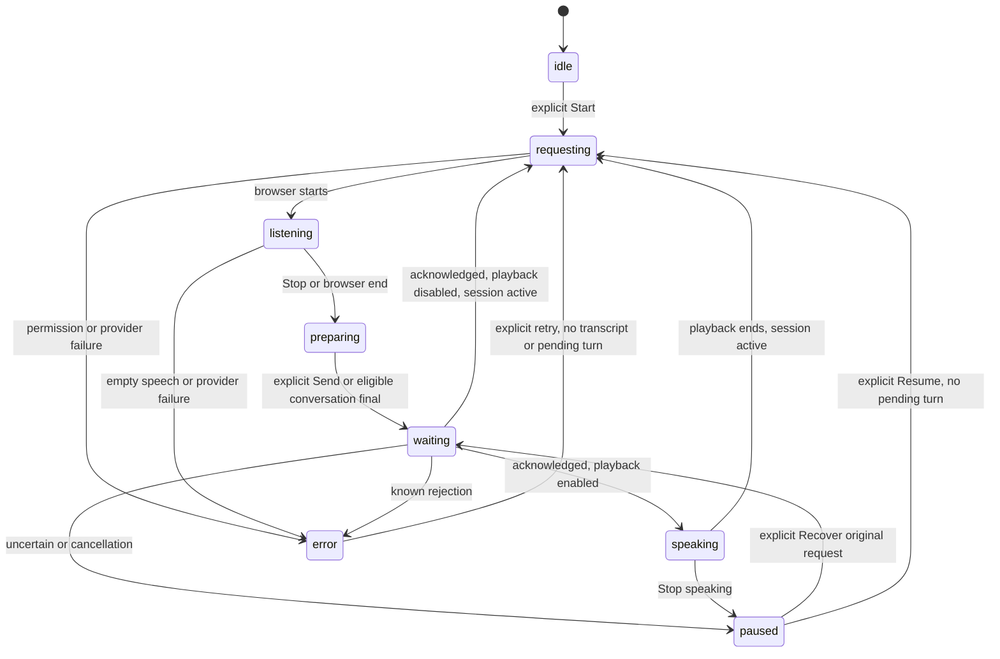

# Voice conversation foundation

Feature package for the PR237 integrator. Package milestones: **100% complete**
after publication of the draft feature PR; production mounting/activation and
physical-browser acceptance remain separate integration work.

Recorded requested baseline: `4e515ddb8de20f4b2cfb7498ed6ce9bbbd2d2f2f`.
Refreshed PR237 on 2026-10-10: `bda597c2fffbf1a49beadc64d757100808094ca2`
on `codex/reviewer-wave-integration`. The isolated feature branch
`codex/voice-conversation-foundation` starts from that exact published head and
targets the PR237 branch. No AgentWorkspace, its tests, backend, generated API,
migration, CI, model, budget, provider credential or runtime activation changes.

## Modules and lifecycle

- `frontend/src/lib/voice/conversation-types.ts`: voice envelope, discriminated
  outcome and injected Agent transport contracts.
- `frontend/src/lib/voice/conversation-controller.ts`: framework-independent,
  half-duplex state machine. It owns temporary voice state, not Agent orchestration.
- `frontend/src/components/agent/VoiceConversationControls.tsx`: compact UI beside
  the existing typed composer. Default mode is review; microphone startup requires
  a click. `AgentVoiceControls` and its consumers retain their existing interface.
- Browser provider: optional `listen(callbacks, { turnCompletion: "utterance" })`
  chooses non-continuous Web Speech recognition. Calls without options retain
  continuous manual recording. Playback first cancels microphone recognition.



Explicit states are `idle`, `requesting`, `listening`, `preparing`, `waiting`,
`speaking`, `paused`, `error`. Preparing covers browser transcription completion
and editable transcript review. Partial/cumulative transcript events only update
the preview. A completion latch prevents repeated final events from resubmitting.

**Turn completion policy:** conversation mode consumes one browser utterance:
only non-empty finalized text at recognition end may be submitted. Browser-defined
silence ends the utterance; partial transcripts never submit. Existing deadlines
remain permission 12s, recording 60s (finalize), transcription 8s, playback 120s.
There is no silence-triggered retry or continuous empty-speech loop. The controller
adds a 45s Agent deadline. At timeout, it aborts the client signal, preserves the
original envelope, pauses progression and offers explicit recovery.

If the live typed draft is non-empty at completion, automatic submission pauses
for review. Send submits the voice text while preserving the typed draft. Append
inserts a newline after the existing draft; Replace requires its own deliberate
button click. Append, Replace and Cancel end the active voice session. An edited
review transcript does not auto-submit when the typed draft later becomes empty.

Recognition is cancelled before submission and stays cancelled during playback.
Only the current session's callbacks can change state. Playback completion resumes
listening only in an enabled conversation session. Stop speaking pauses immediately;
End conversation cancels voice and aborts the client request signal. An unresolved
Agent envelope survives End and navigation in the controller's per-conversation
map. Returning to that conversation exposes recovery. Neither action proves the
server cancelled a turn.

Hidden tabs pause; becoming visible requires a fresh click. Conversation changes
and authority disable signals pause/reset the voice UI, retaining pending identity.
Changes to the organization/user `sessionKey`, logout (`authenticated=false`),
provider factory, transport identity, or unmount dispose the old controller/provider.
They reject late callbacks. The integration's user-scoped pending store restores
recovery across remounts; this package introduces no second storage system.

## Mount contract for the PR237 owner

Prepare a stable `VoiceAgentTransport` adapter around the existing Agent turn and
recovery pipeline, then mount this component beside the existing typed composer.
The following names for adapter/authority state are illustrative integration
variables, not newly exported repository APIs:

```tsx
import { VoiceConversationControls } from "@/components/agent/VoiceConversationControls";

<VoiceConversationControls
  conversationId={conversationId}
  sessionKey={user && organization ? `${organization.id}:${user.id}` : null}
  authenticated={Boolean(user && organization)}
  disabled={voiceAuthorityBlocked || unrelatedTurnIsActive}
  typedDraft={draft}
  onTypedDraftChange={setDraft}
  transport={stableVoiceTransport}
/>
```

Require an existing conversation ID; create/select the conversation through the
existing Agent path before enabling voice. Do not mount two microphone controllers
for one composer. Keep the factory/transport referentially stable, scoped to the
authenticated user. Dispose/remount on identity changes. `disabled` represents
authority blocks, kill switch or an unrelated active turn. **Do not derive it from
the voice request's own `sending` flag**: doing so would abort that same request.

The current `AgentWorkspace.sendMessage` returns `Promise<boolean>`, creates its own
key, builds context/attachment fields and stores recovery. It cannot directly serve
this richer interface. The PR237 owner must extend/extract that existing pipeline
so voice can supply its stable key and receive an explicit outcome. Do not add a
direct `api.agent.turn` call inside the voice component/controller or construct an
independent backend orchestration path.

### Transport guarantees

Both `submit` and `recover` accept `{ turnKey, transcript, conversationId,
origin: "voice", signal }`. The envelope is frozen; recovery gets a new cancellation
signal with the same key and payload. Use `turnKey` as the existing `Idempotency-Key`.

The integrator must:

1. Arbitrate typed and voice turns through the existing per-conversation admission
   gate. Only one new submitted turn may be active; this controller already blocks
   further voice submissions while its envelope is unresolved.
2. Build and validate the **complete** generated `AgentTurnRequest`, including
   current context and any attachments, before persisting/dispatching. Retain that
   exact body under the supplied key. The controller only knows a voice envelope;
   it must never rebuild attachment/context fields on recovery.
3. Persist recovery before dispatch through the existing user/organization-scoped
   pending store. Extend its local metadata to retain voice origin and the original
   envelope; restore it with `transport.pending(conversationId)` when mounting.
   This hook only restores pending **voice** envelopes. Any pending typed turn must
   block new voice admission via the same shared gate/disabled state.
4. Return outcomes according to the table below. Publish acknowledged messages and
   proposals through `acknowledged-turn.ts` / the existing history reconciliation
   flow before resolving to the voice controller. Keep the canonical full reply in
   history; the component also retains its returned reply as readable text.
5. `recover` uses the existing explicit recovery/status path with the original
   saved body/key. It must reconcile even if a prior client promise never settles.
   It may reuse backend idempotency only according to the existing recovery policy;
   it is not a blind new submission. Update/clear the canonical pending store after
   a proven terminal result. A recovered reply leaves voice paused; Resume is explicit.

| Outcome | Meaning and voice behavior |
| --- | --- |
| `acknowledged` with `reply` | Validated reply for this exact key/conversation and recovery complete; clear local envelope; read automatically if conversation mode/playback/session are enabled. |
| `rejected` | Proven terminal admission/validation rejection with no unresolved turn. Unlock and retain editable transcript. Do not classify arbitrary HTTP failures this way. |
| `uncertain` | Timeout, interrupted/ambiguous transport, malformed successful response, conflict/in-progress or pending capture. Retain original identity; pause and recover explicitly. |

For current PR237 behavior, a valid reply with `capture_status="unavailable"` and
a pending capture error still has recovery outstanding (`turn_capture`); the adapter
must treat progression as uncertain until that original request is resolved. Do
not turn the existing boolean `false` into a known rejection or `true` into an
unqualified terminal acknowledgment. History reload failure alone need not delay
a validated terminal acknowledgment, as the existing reconciliation pipeline owns it.

`submit`/`recover` thrown errors and malformed result envelopes are conservatively
uncertain. Cancelling an AbortSignal affects the client wait; it does not authorize
forgetting the server request. Transport-side persistence is required for durability
after disposal; the controller's in-memory map alone is insufficient.

### Voice origin and authority

`origin: "voice"` survives controller submission and recovery. Current generated
`AgentTurnRequest` has no origin field; existing `sendMessage` uses `source` locally
to preserve typed drafts. The integrator should keep voice origin in its local
pending metadata and, if durable server provenance is required, coordinate a
separate additive backend/generated-schema change. Do not inject unknown fields
into the current generated request or claim server provenance exists today.

Speech is independent of reasoning-model routing. No paid provider, model upgrade,
spending limit, runtime setting, order execution, or extra permission is included.
Existing tool confirmation, proposal decisions, kill switch and execution policy
remain authoritative; spoken text is ordinary Agent input.

## Verification and interface evidence

Run from `frontend/`:

```sh
npm run test -- src/lib/voice/conversation-controller.test.ts src/lib/voice/browser-voice-provider.test.ts src/components/agent/VoiceConversationControls.test.tsx src/components/agent/AgentVoiceControls.test.tsx
npm run typecheck
npx eslint src/lib/voice/conversation-types.ts src/lib/voice/conversation-controller.ts src/lib/voice/conversation-controller.test.ts src/lib/voice/types.ts src/lib/voice/browser-voice-provider.ts src/lib/voice/browser-voice-provider.test.ts src/components/agent/VoiceConversationControls.tsx src/components/agent/VoiceConversationControls.test.tsx voice-harness/main.tsx voice-harness/vite.config.ts ui-tests/voice-conversation.spec.ts playwright.voice-conversation.config.ts --max-warnings 0
npx playwright test --config playwright.voice-conversation.config.ts
```

Focused unit tests cover acknowledged playback/resume, duplicate/partial events,
silence, feedback suppression, manual review, drafts, uncertain/throw/timeout/
malformed envelopes, rejection, exact recovery identity, cancellation, navigation,
logout, hidden tabs, unmount, identity changes, permission/playback fallback,
and unchanged legacy consumers. Final local result: **98 passed in four files**
(3.76s), no skips. Repository TypeScript checking and changed-file ESLint with
`--max-warnings 0` passed. `git diff --check` passed. Protected-file comparison
against the refreshed base confirms the excluded ownership paths are unchanged.

The separate Vite harness (`frontend/voice-harness`) mounts only this component,
the typed draft and deterministic browser/Agent fixtures. No AgentWorkspace route,
backend server or paid provider is involved. It uses the real browser provider
against fake Web Speech APIs. Run it with
`npx vite --config voice-harness/vite.config.ts` and open `http://127.0.0.1:4175`.
The harness has no application route and is not activated by the product build.

Five deterministic Chromium browser checks cover successive turns, playback and
explicit interruption, draft review/append, exact uncertain recovery, typed fallback,
320×720, 390×844 and 1440×1000 widths, 44px buttons, and no horizontal clipping.
[Listening/speaking screenshots](screenshots/voice-conversation/README.md) are fixture
evidence. Full backend/frontend CI, a production build, staging/live providers,
real microphone capture and physical-device checks were not run for this package.

## Supported behavior and remaining work

Browser-managed input/output only. This is a functional foundation with explicit
turn boundaries, not premium realtime speech. No acoustic barge-in or echo
cancellation is claimed; use Stop speaking. Browsers may require a fresh gesture
for subsequent recognition or playback: a failure pauses with typed fallback and
explicit retry. Missing output starts with playback disabled and replies remain
text. Failed playback retains the reply and pauses. Browser speech may use a
browser-managed remote service; this is disclosed in Voice details. No audio is
stored or uploaded by AlphaTrade's voice modules.

Recognition accuracy, silence timing, microphone permissions, service connectivity,
audio leakage from physical speakers, Safari/WebKit, Firefox and physical iOS are
unverified. Fake API checks in Chromium establish controller/interface behavior,
not native speech compatibility. The browser controls speech language and voice.

| Package milestone | Progress |
| --- | --- |
| Refreshed isolated baseline and ownership contracts | 100% |
| Controller, compact controls and additive provider interface | 100% |
| Focused deterministic and layout evidence | 100% |
| Integration documentation and draft delivery | 100% upon draft publication |

Completed: this isolated package and reviewable integration contract.
Next: PR237 owner connects its existing admission/recovery pipeline and local
provenance store, mounts the component, then verifies native speech on intended
browsers/hardware before any activation. Current package blockers: none. Runtime
integration and browser/hardware acceptance remain outstanding. No merge or deploy.
